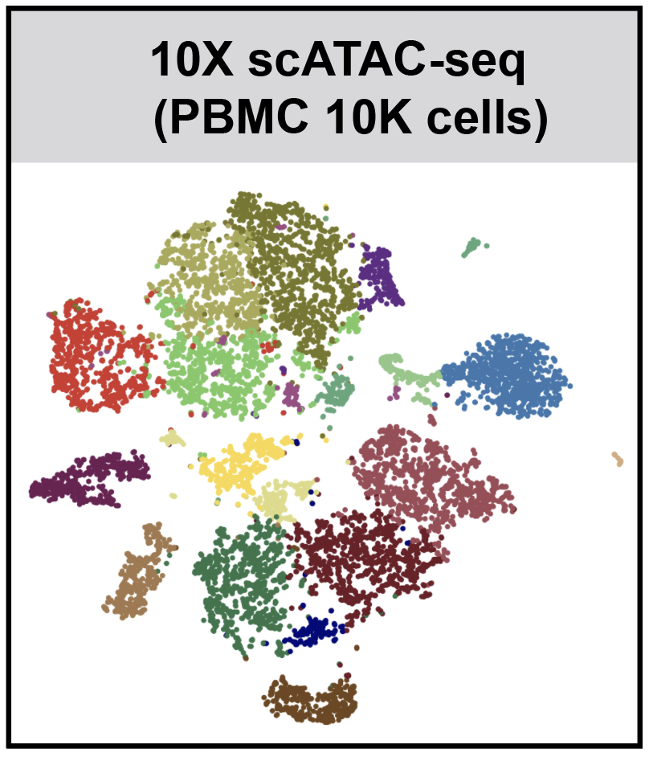

## SnapATAC (Development)
**SnapATAC** (**S**ingle **N**ucleus **A**nalysis **P**ipeline for **ATAC**-seq) is fast and accurate method for analyzing single cell ATAC-seq datasets. SnapATAC 1) clusters cells without reliance on open chromatin peaks defined by aggregate signal; 2) adjusts for sequencing depth differing between cells; 3) can scale up to millions of cells; 4) uncovers cis-regulatory elements in rare cell types within a complex tissue. 

## How fast is SnapATAC?  
For 10X PBMC 10K single cell ATAC-seq dataset, from loading the cell count matrix to finding clusters, SnapATAC finishes the analysis within **4min**. On average, SnapATAC increase 30 seconds per a thousand cells. 

## How accurate is SnapATAC?  
When applied to snATAC-seq dataset from mouse secondary motor cortex, SnapATAC is able to identify nearly 50 cell types including rare population (Sst-Chodl) which accounts for less than 0.1% of the total population.

## Requirements  
* Python (>=2.7)
* R (>= 3.4.0)

## Installation

SnapATAC has two components: [Snaptools](https://github.com/r3fang/SnapTools) and [SnapATAC](https://github.com/r3fang/SnapATAC). 

* Snaptools is a preprocessing pipeline that works with [snap](https://github.com/r3fang/SnapATAC/wiki/FAQs) file. 
* SnapATAC is a R package for the clustering, annotation, motif and downstream analysis.    

Install snaptools from PyPI. See how to install snaptools on [FAQs](https://github.com/r3fang/SnapATAC/wiki/FAQs). 

```bash
$ pip install snaptools
```

Install SnapATAC R pakcage. 

```
$ R
> library(devtools)
> install_github("r3fang/SnapATAC")
```

## Galleries & Tutorials (click on the image for details)
[](./examples/MOS_2k/MOS_2k.md)
[](./examples/Fang_2019/Fang_2019.md)
[](./examples/10X_10k/10X_10k.md)
