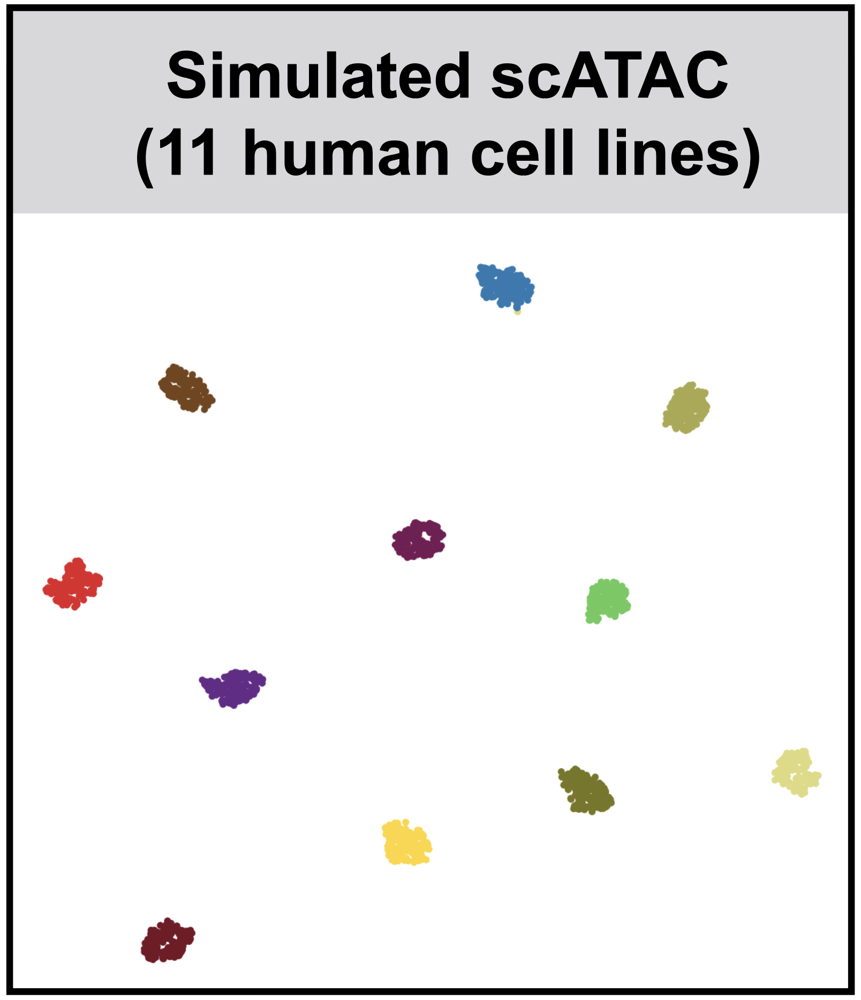

## SnapATAC
Single Nuclesus Analysis Package for ATAC-seq.

## Introduction
SnapATAC is composed of two components: [Snaptools](https://github.com/r3fang/SnapTools) and SnapATAC. Snaptools is a module for working with snap files in Python. SnapATAC is a R package for clustering and downstream analysis. 

## Requirements 
* Python (2.7)
* R (>= 3.4.0)

## Quick Install 
Install snaptools from PyPI

```bash
$ pip install snaptools --user
```

Or install snaptools from source code

```bash
$ git clone https://github.com/r3fang/snaptools.git
$ cd snaptools
$ python setup.py install --user
$ ./bin/snaptools

usage: snaptools [-h]  ...

Program: snaptools (A module for working with snap files in Python)
Version: 1.1
Contact: Rongxin Fang
E-mail:  r4fang@gmail.com

optional arguments:
  -h, --help        show this help message and exit

functions:

    index-genome    Index reference genome.
    align-paired-end
                    Align paired-end reads.
    align-single-end
                    Align single-end reads.
    snap-pre        Create a snap file from bam or bed file.
    snap-add-bmat   Add cell x bin count matrix to snap file.
    snap-add-pmat   Add cell x peak count matrix to snap file.
    snap-add-gmat   Add cell x gene count matrix to snap file.
    dump-fragment   Dump fragments of selected barcodes from a snap file.
    dump-barcode    Dump barcodes from a snap file.
    call-peak       Call peak using selected barcodes.
```

Install snapATAC from github

```
$ R
> install.packages("devtools")
> library(devtools)
> github_install("r3fang/SnapATAC");
> library(SnapATAC);
```

Please see the wiki for other installation method.

## Galleries 
[](./examples/Fang_2019/Fang_2019.html)
[](./examples/Cusanovich_2018/Cusanovich_2018.html)
[](./examples/Lake_2018/Lake_2018.html)
[](./examples/Schep_2017/Schep_2017.md)
[](./examples/Habib_2017/Habib_2017.md)
[](./examples/Simulated_2019/Simulated_2019.html)
