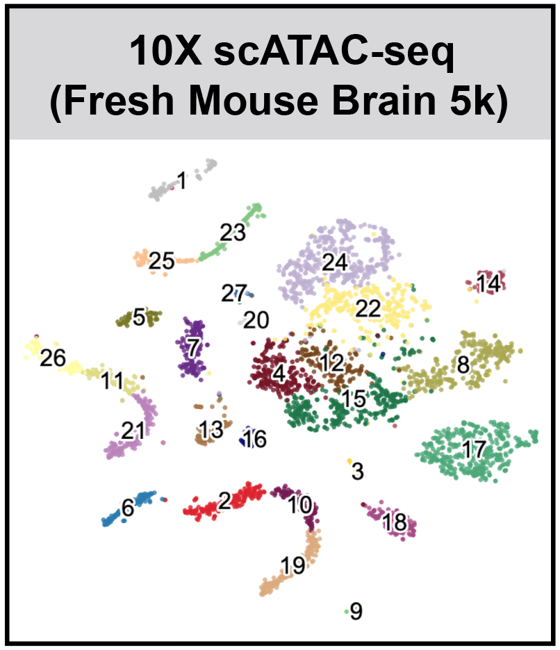
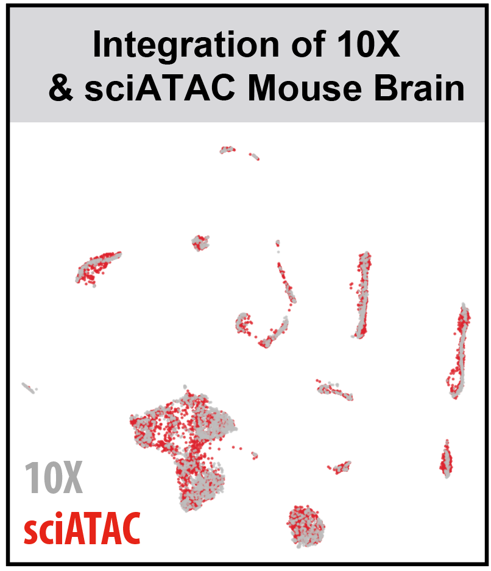

## SnapATAC (Development)
**SnapATAC** (**S**ingle **N**ucleus **A**nalysis **P**ipeline for **ATAC**-seq) is a fast and accurate method for analyzing single cell ATAC-seq datasets. SnapATAC 1) overcomes the limitation of reliance on population-level peak annotation, 2) improves the clustering accuracy by integrating "off-peak" reads, 3) controls for the major bias using a regression-based normalization method and 4) substantially outperforms current methods in scalability.

## Latest News
* [SnapATAC enables other dimentionality reduction (LSA, LSA-logTF, LDA)](https://github.com/r3fang/SnapATAC/tree/master/examples/Fang_2019/Fang_2019.md)
* [SnapATAC enables clustering using leiden algorithm](https://github.com/r3fang/SnapATAC/tree/master/examples/10X_P50)
* [SnapATAC enables batch effect correction](https://github.com/r3fang/SnapATAC/tree/master/examples/10X_sci)
* [SnapATAC enables motif analysis using chromVAR](https://github.com/r3fang/SnapATAC/tree/master/examples/10X_P50)

## FAQs
* [How to run SnapATAC on 10X dataset?](https://github.com/r3fang/SnapATAC/wiki/FAQs#10X_snap)
* [I already ran CellRanger, can I use its output for SnapATAC?](https://github.com/r3fang/SnapATAC/wiki/FAQs#cellranger_output)
* [How can I analyze combine multiple samples together?](https://github.com/r3fang/SnapATAC/wiki/FAQs#multi_snap)
* [How to group reads from any subset of cells?](https://github.com/r3fang/SnapATAC/wiki/FAQs#group_reads)
* [What is a snap file anyway?](https://github.com/r3fang/SnapATAC/wiki/FAQs#whatissnap)
* [How to create a snap file from fastq file?](https://github.com/r3fang/SnapATAC/wiki/FAQs#CEMBA_snap)

## Requirements  
* Linux/Unix
* Python (>= 2.7) (SnapTools)
* R (>= 3.4.0) (SnapATAC)

## Pre-print  
Rongxin Fang, Sebastian Preissl, Xiaomeng Hou, Jacinta Lucero, Xinxin Wang, Amir Motamedi, Andrew K. Shiau, Eran A. Mukamel, Yanxiao Zhang, M. Margarita Behrens, Joseph Ecker, Bing Ren. *Fast and Accurate Clustering of Single Cell Epigenomes Reveals Cis-Regulatory Elements in Rare Cell Types.* bioRxiv 615179; doi: https://doi.org/10.1101/615179

## Installation

SnapATAC has two components: [Snaptools](https://github.com/r3fang/SnapTools) and [SnapATAC](https://github.com/r3fang/SnapATAC). 

* SnapTools - a python module for pre-processing and working with [snap](https://github.com/r3fang/SnapATAC/wiki/FAQs) file. 
* SnapATAC  - a R package for the clustering, annotation, motif discovery and downstream analysis.    

Install snaptools from PyPI. See how to install snaptools on [FAQs](https://github.com/r3fang/SnapATAC/wiki/FAQs). 

```bash
$ pip install snaptools
```

Install SnapATAC R pakcage (development version). 

```
$ R
> library(devtools)
> install_github("r3fang/SnapATAC")
```

## Galleries & Tutorials (click on the image for details)
[](./examples/10X_P50/README.md)
[](./examples/Fang_2019/Fang_2019.md)
[](./examples/10X_sci/README.md)
