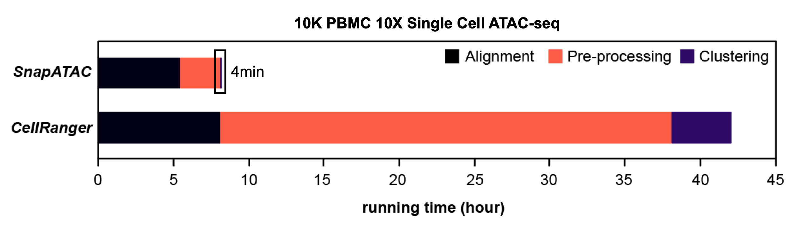
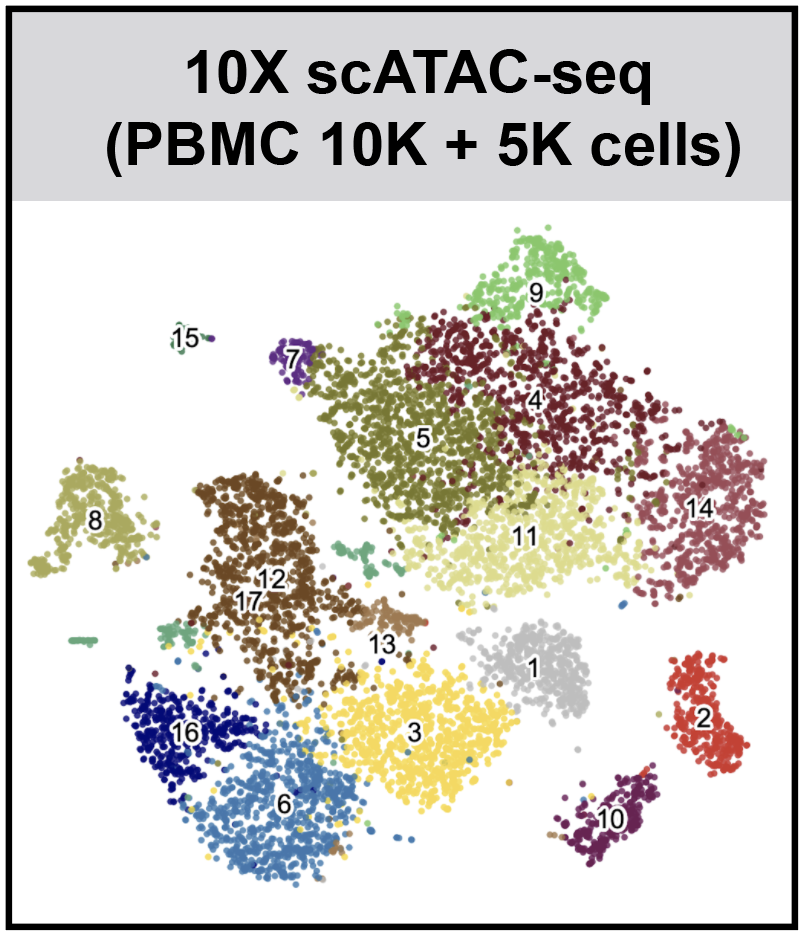

## SnapATAC (Development)
**SnapATAC** (**S**ingle **N**ucleus **A**nalysis **P**ipeline for **ATAC**-seq) is a fast and accurate method for analyzing single cell ATAC-seq datasets. SnapATAC 1) overcomes the limitation of reliance on population-level peak annotation, 2) improves the clustering accuracy by integrating "off-peak" reads, 3) controls for the major bias using a regression-based normalization method and 4) substantially outperforms current methods in scalability.

## How fast is SnapATAC?  
For 10X PBMC 10K single cell ATAC-seq dataset, from loading the cell count matrix to finding clusters, SnapATAC finishes the analysis within **4min**. On average, SnapATAC increase less than 30 seconds per thousand cells. 



## How accurate is SnapATAC?  
When applied to a dataset from mouse secondary motor cortex, SnapATAC identifies nearly 50 cell types including rare population (Sst-Chodl) which accounts for less than 0.1% of the total population.

## Requirements  
* Python ( >= 2.7)
* R (>= 3.4.0)

## Installation

SnapATAC has two components: [Snaptools](https://github.com/r3fang/SnapTools) and [SnapATAC](https://github.com/r3fang/SnapATAC). 

* SnapTools - a python module for pre-processing and working with [snap](https://github.com/r3fang/SnapATAC/wiki/FAQs) file. 
* SnapATAC  - a R package for the clustering, annotation, motif discovery and downstream analysis.    

Install snaptools from PyPI. See how to install snaptools on [FAQs](https://github.com/r3fang/SnapATAC/wiki/FAQs). 

```bash
$ pip install snaptools
```

Install SnapATAC R pakcage (development version). 

```
$ R
> library(devtools)
> install_github("r3fang/SnapATAC")
```

## Galleries & Tutorials (click on the image for details)
[](./examples/10X_P50/README.md)
[](./examples/Fang_2019/Fang_2019.md)
[](./examples/10X_15k/10X_15k.md)


## FAQs

* [What is a snap file anyway?](https://github.com/r3fang/SnapATAC/wiki/FAQs#whatissnap)
* [How to create a snap file from 10X fastq file?](https://github.com/r3fang/SnapATAC/wiki/FAQs#10X_snap)
* [Can I run SnapATAC with CellRanger output?](https://github.com/r3fang/SnapATAC/wiki/FAQs#cellranger_output)
