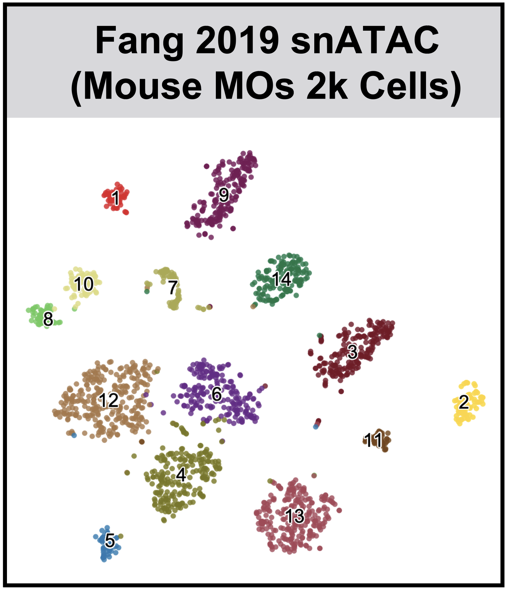
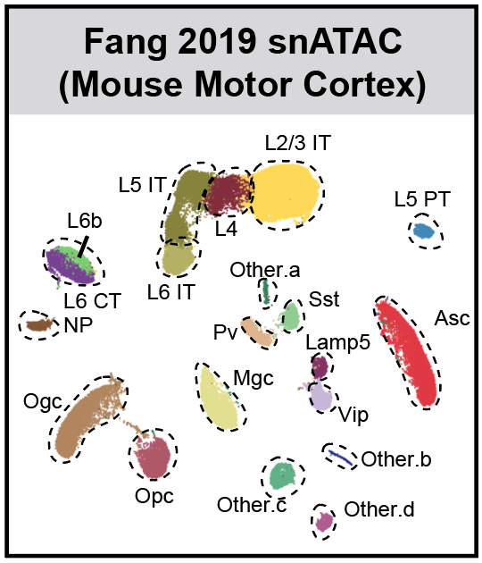
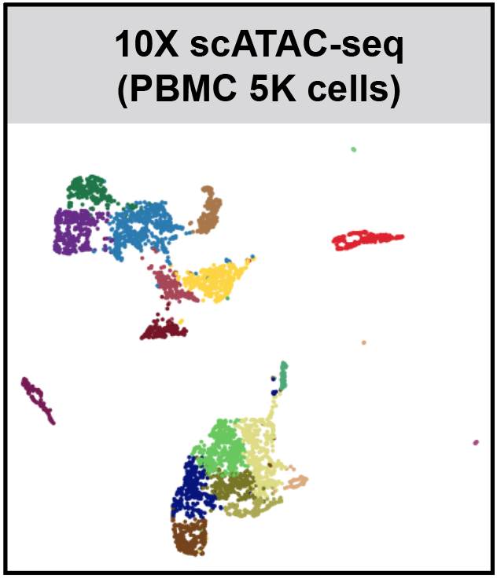
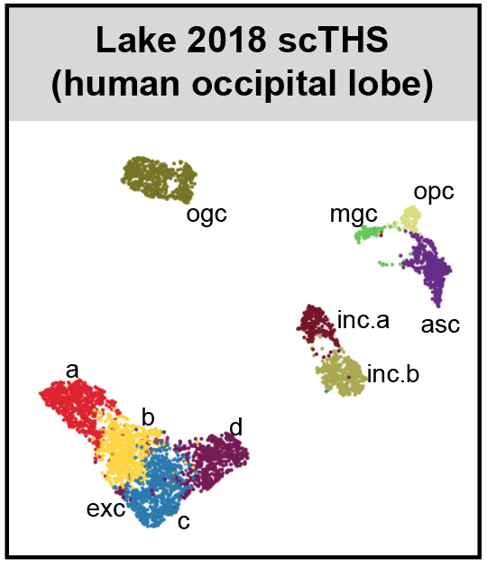
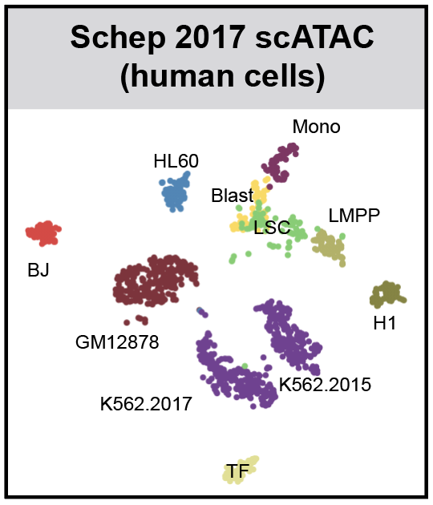
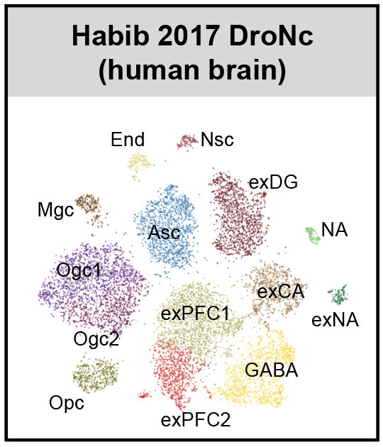

## SnapATAC (internal testing)
Single Nuclesus Analysis Package for ATAC-seq. 

## Introduction
SnapATAC is fast, accurate and unbiased method for analyzing single cell ATAC-seq datasets. Compared to previous methods, SnapATAC 1) overcomes limitation of reliance on open chromatin peaks defined by aggregate/bulk signal; 2) reveals novel cis-elements active in rare populations; 3) adjusts for differing sequencing depth between cells; 4) scales up to millions of cells.

SnapATAC has two components: [Snaptools](https://github.com/r3fang/SnapTools) and [SnapATAC](https://github.com/r3fang/SnapATAC). 

* Snaptools is a module for working with [snap](https://github.com/r3fang/SnapATAC/wiki/FAQs) file in Python. 
* SnapATAC is a R package for the downstream analysis. 

## Requirements  
* Python (2.7)
* R (>= 3.4.0)

## Install SnapTools
Install snaptools from PyPI

```bash
$ pip install snaptools==1.2.5 --user
```

See how to install snaptools on [FAQs](https://github.com/r3fang/SnapATAC/wiki/FAQs). 

## Install SnapATAC

```
$ R
> install.packages("devtools")
> library(devtools)
> install_github("r3fang/SnapATAC");
> library(SnapATAC);
```

## Get Started

```R
> library(SnapATAC);
> data(mos);
> mos

number of barcodes: 2000
number of bins: 476595
number of peaks: 316257
number of genes: 53278
==========================
meta data            (metData) :  TRUE
cellxbin matrix      (bmat)    :  TRUE
cellxpeak matrix     (pmat)    :  TRUE
cellxgene matrix     (gmat)    :  TRUE
jaccard matrix       (jmat)    :  FALSE
normalization        (nmat)    :  TRUE
PCA:                 (smat)    :  TRUE
cluster:             (cluster) :  TRUE
t-sne:               (tsne)    :  TRUE
umap:                (umap)    :  FALSE

> mos = calJaccard(mos);
> mos = runPCA(mos, pc.num=20);
> mos = runCluster(mos, k=15, resolution=0.5);
> mos = runViz(mos, dims=2, method="Rtsne");
> plotViz(mos, method="tsne");
> mos = scaleCountMatrix(mos, cov=rowSums(mos, mat="bmat"), mat="gmat");
> marker.genes = c(
	"Snap25", "Gad2", "Apoe", "C1qb", "Pvalb", 
	"Vip", "Sst", "Lamp5", "Slc17a7", "Mog", 
	"Pdgfra", "Cspg4","Cx3cr1","F3","Aqp4", "Rorb"
	);
> plotGene(
	mos, 
	gene.sel=marker.genes, 
	cex=0.5,
	pch=19,
	background=TRUE
	);
```

## Galleries & Tutorials (click on the image for details)
[](./examples/MOS_2k/MOS_2k.md)
[](./examples/Fang_2019/Fang_2019.md)
[](./examples/10X_2018/10X_2018.md)
[](./examples/Cusanovich_2018/Cusanovich_2018.md)
[](./examples/Lake_2018/Lake_2018.md)
[](./examples/Schep_2017/Schep_2017.md)
[](./examples/Habib_2017/Habib_2017.md)

