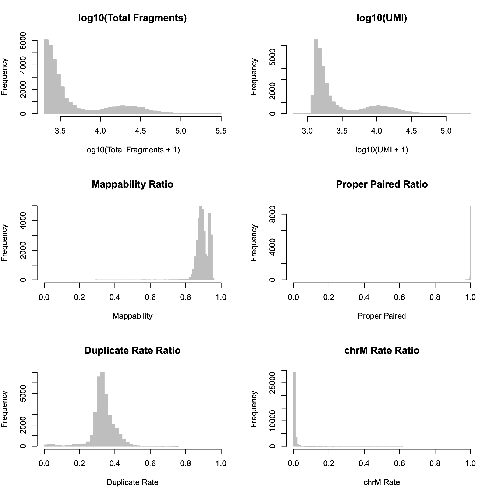
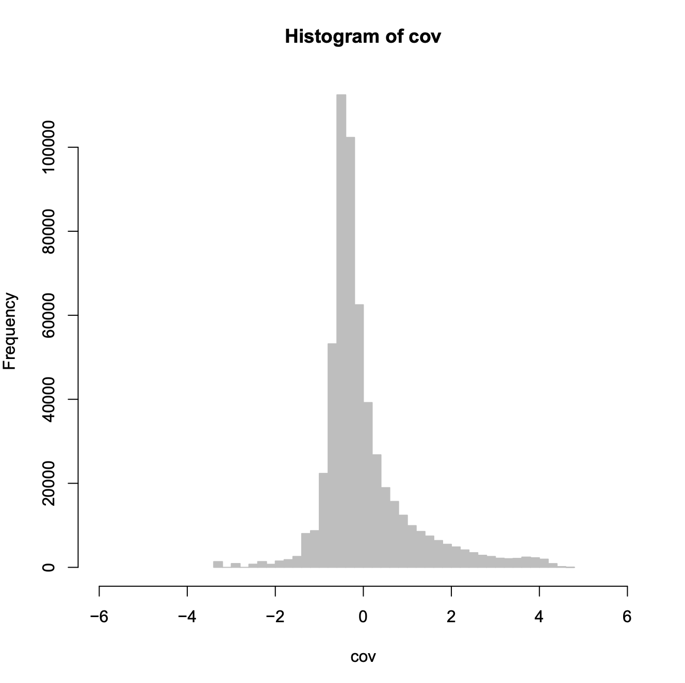
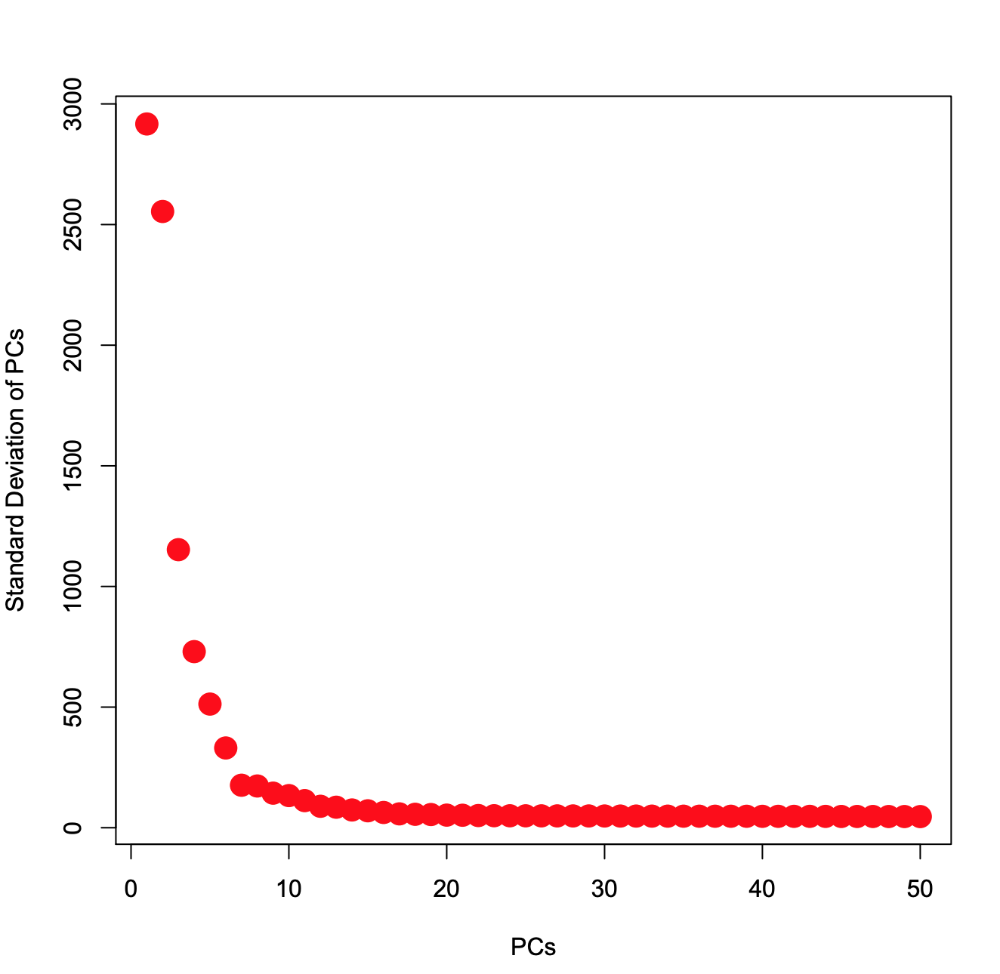
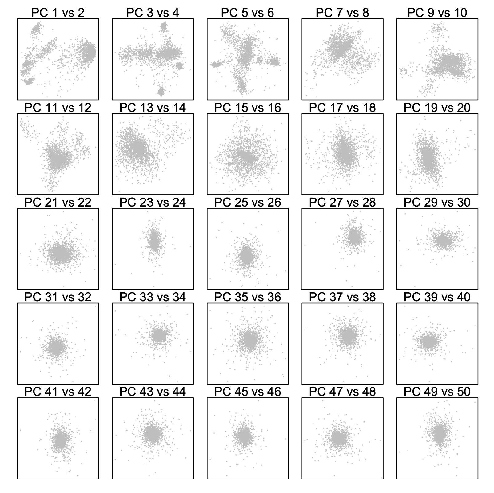
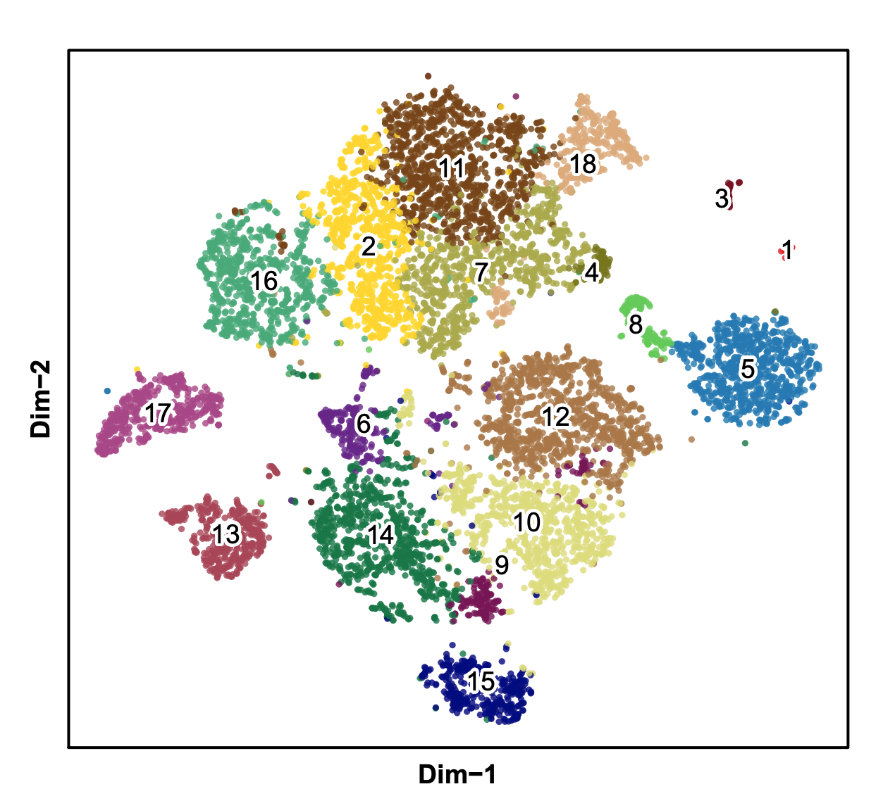
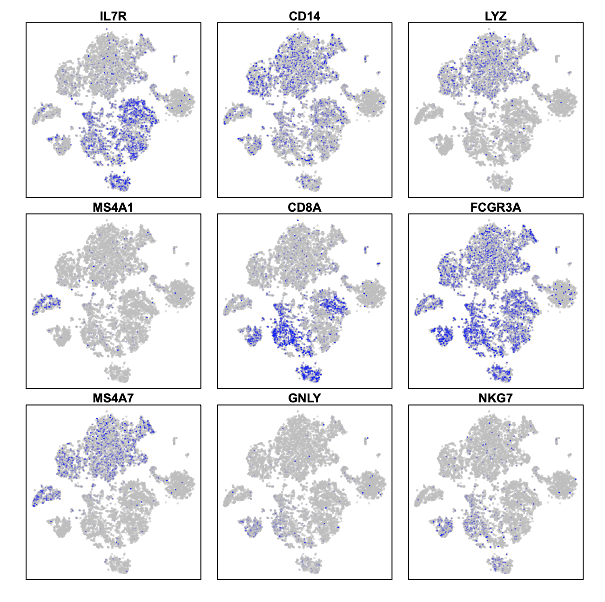
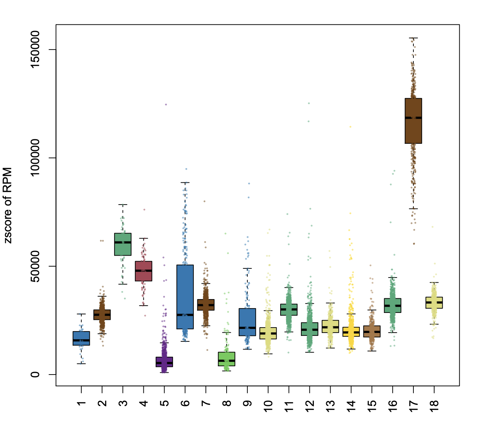

## 10X PBMC 10k  scATAC-seq  (Normal)
SnapATAC is also compatible with with 10X single cell ATAC-seq data. **Step 1 to step 6 is the pre-processing to generate snap file. You can skip step 1-6 by downloading the sanp file [here](http://renlab.sdsc.edu/r3fang/share/Fang_2019/published_scATAC/PBMC_10k_10X/atac_v1_pbmc_10k_fastqs/atac_v1_pbmc_10k.snap).**

**Step 1. Download the demo dataset (PBMC 10K)**

```
$ wget http://s3-us-west-2.amazonaws.com/10x.files/samples/cell-atac/1.0.1/atac_v1_pbmc_10k/atac_v1_pbmc_10k_fastqs.tar
$ tar -xvf atac_v1_pbmc_10k_fastqs.tar
```

**Step 2. Barcode demultiplexing**.         
In this example, we have one 10x library sequenced on two flowcells. Note that `cellranger-atac mkfastq` generated the following fastq files with one library (`Library1`) split into two lanes (`_1` and `_2`):


    
```bash
$ cd atac_v1_pbmc_10k_fastqs
$ ll 
-rw-r--r-- 1 r3fang ren-group  1466724603 Oct 10 21:31 atac_v1_pbmc_10k_S1_L001_I1_001.fastq.gz
-rw-r--r-- 1 r3fang ren-group  5898224042 Oct 10 21:31 atac_v1_pbmc_10k_S1_L001_R1_001.fastq.gz
-rw-r--r-- 1 r3fang ren-group  3490040150 Oct 10 21:31 atac_v1_pbmc_10k_S1_L001_R2_001.fastq.gz
-rw-r--r-- 1 r3fang ren-group  5877520119 Oct 10 21:31 atac_v1_pbmc_10k_S1_L001_R3_001.fastq.gz
-rw-r--r-- 1 r3fang ren-group  1482137853 Oct 10 22:40 atac_v1_pbmc_10k_S1_L002_I1_001.fastq.gz
-rw-r--r-- 1 r3fang ren-group  5951267287 Oct 10 22:40 atac_v1_pbmc_10k_S1_L002_R1_001.fastq.gz
-rw-r--r-- 1 r3fang ren-group  3542934041 Oct 10 22:40 atac_v1_pbmc_10k_S1_L002_R2_001.fastq.gz
-rw-r--r-- 1 r3fang ren-group  5926921806 Oct 10 22:40 atac_v1_pbmc_10k_S1_L002_R3_001.fastq.gz
```

Because there is only one sample, 8bp i7 (sample index) is ignored here. We next add the 16bp i5 (10x cell barcode) to the beginning of each read name using the fllowing command:

```bash
$ snaptools dex-fastq \
	--input-fastq=atac_v1_pbmc_10k_S1_L001_R1_001.fastq.gz \
	--output-fastq=atac_v1_pbmc_10k_S1_L001_R1_001.dex.fastq.gz \
	--index-fastq-list atac_v1_pbmc_10k_S1_L001_R2_001.fastq.gz 

$ snaptools dex-fastq \
	--input-fastq=atac_v1_pbmc_10k_S1_L002_R1_001.fastq.gz \
	--output-fastq=atac_v1_pbmc_10k_S1_L002_R1_001.dex.fastq.gz \
	--index-fastq-list atac_v1_pbmc_10k_S1_L002_R2_001.fastq.gz 

$ snaptools dex-fastq \
	--input-fastq=atac_v1_pbmc_10k_S1_L001_R3_001.fastq.gz \
	--output-fastq=atac_v1_pbmc_10k_S1_L001_R3_001.dex.fastq.gz \
	--index-fastq-list atac_v1_pbmc_10k_S1_L001_R2_001.fastq.gz 

$ snaptools dex-fastq \
	--input-fastq=atac_v1_pbmc_10k_S1_L002_R3_001.fastq.gz \
	--output-fastq=atac_v1_pbmc_10k_S1_L002_R3_001.dex.fastq.gz \
	--index-fastq-list atac_v1_pbmc_10k_S1_L002_R2_001.fastq.gz

# merge two lanes into a single fastq file
$ cat atac_v1_pbmc_10k_S1_L001_R1_001.dex.fastq.gz atac_v1_pbmc_10k_S1_L002_R1_001.dex.fastq.gz > atac_v1_pbmc_10k_R1.dex.fastq.gz 
$ cat atac_v1_pbmc_10k_S1_L001_R3_001.dex.fastq.gz atac_v1_pbmc_10k_S1_L002_R3_001.dex.fastq.gz > atac_v1_pbmc_10k_R3.dex.fastq.gz 
 
```

**Step 3. Index reference gnome (snaptools)**      
Index the reference genome before alignment (skip this step if you already have indexed reference genome already). Here we show how to index the genome `hg19.fa` using `BWA`. User can switch to other aligner by setting `--aligner` tag, currently snaptools supports `bwa`, `bowtie2` and `minimap2`. You also need to specify the folder that contains the aligner executable binary file. For instance, if bwa is installed under `/opt/biotools/bwa/bin/bwa`, set `--path-to-aligner=/opt/biotools/bwa/bin/` and `--aligner=bwa`.
         
```bash
$ which bwa
/opt/biotools/bwa/bin/bwa 
$ snaptools index-genome  \
	--input-fasta=hg19.fa  \
	--output-prefix=hg19  \
	--path-to-aligner=/opt/biotools/bwa/bin/  \
	--aligner=bwa  \
	--num-threads=5
```

**Step 4. Alignment (snaptools)**     
We next align de-multicomplexed reads to the indexed reference genome using `snaptools` with following command. After alignment, reads are automatically sorted by the read names (`--if-sort`). User can use multiple CPUs (`--num-threads`) to speed up this step.

```bash
$ snaptools align-paired-end  \
	--input-reference=hg19.fa  \
	--input-fastq1=atac_v1_pbmc_10k_R1.dex.fastq.gz   \
	--input-fastq2=atac_v1_pbmc_10k_R3.dex.fastq.gz   \
	--output-bam=atac_v1_pbmc_10k.bam  \
	--aligner=bwa  \
	--path-to-aligner=/opt/biotools/bwa/bin/  \
	--read-fastq-command=zcat  \
	--min-cov=0  \
	--num-threads=5  \
	--if-sort=True  \
	--tmp-folder=./  \
	--overwrite=TRUE                     
```


**Step 5. Pre-processing (snaptools)**
After alignment, we convert pair-end reads into fragments and for each fragment we check the following attributes: 1) mapping quality score MAPQ; 2) whether two ends are appropriately paired; 3) fragment length. We only keep those fragments that are 1) properly paired according to the alignment flag; 2) whose MAPQ is greater than 30 (`--min-mapq`); 3) with fragment length greater than 50 (`--min-flen`) and less than 2000bp (`--max-flen`). PCR duplicates are removed for each cell separately. After alignment and filtration, we generated a snap-format (Single-Nucleus Accessibility Profiles) file that contains meta data, cell-by-bin count matrices, cell-by-gene count matrix, cell-by-peak count matrix and indexed usable fragments. Detailed information about snap file can be found in [here](https://github.com/r3fang/SnapTools/blob/master/docs/snap_format.docx). As shown in the previous analysis [10X analysis report](http://cf.10xgenomics.com/samples/cell-atac/1.0.1/atac_v1_pbmc_10k/atac_v1_pbmc_10k_web_summary.html), the vast majority of the cell barcodes have coverage less than 1000 fragments, such high barcode diversity is likely due to the low sequencing quality (73.4%) for cell barcode. To avoid processing many "junky" barcodes, snaptools allows user to filter empty barcides by two tags `--max-num` and `min-cov`. `--max-num` will force to only keep top `--max-num` barcodes with highest coverage. In this experiment, because only 10k cells are used as initial material, therefore, it is safe to set  `--max-num=20000`. This tag is very important for processing 10X dataset that has many empty barcodes.  

```bash
$ wget http://hgdownload.cse.ucsc.edu/goldenPath/hg19/bigZips/hg19.chrom.sizes 
$ snaptools snap-pre  \
	--input-file=atac_v1_pbmc_10k.bam  \
	--output-snap=atac_v1_pbmc_10k.snap  \
	--genome-name=hg19  \
	--genome-size=hg19.chrom.sizes  \
	--min-mapq=30  \
	--min-flen=50  \
	--max-flen=2000  \
	--keep-chrm=TRUE  \
	--keep-single=FALSE  \
	--keep-secondary=False  \
	--overwrite=True  \
	--max-num=20000  \
	--min-cov=1000  \
	--verbose=True

$ cat atac_v1_pbmc_10k.snap.qc
Total number of unique barcodes:             20000
TN - Total number of fragments:              267995289
UM - Total number of uniquely mapped:        248256604
SE - Total number of single ends:            0
SA - Total number of secondary alignments:   1472
PE - Total number of paired ends:            248255132
PP - Total number of proper paired:          247829685
PL - Total number of proper frag len:        229701711
US - Total number of usable fragments:       229701711
UQ - Total number of unique fragments:       140318220
CM - Total number of chrM fragments:         421718
```

**Step 6. Cell-by-bin matrix (snaptools)**      
Using snap file, we next create the cell-by-bin matrix. Snap file allows for storing cell-by-bin matrices of different resolutions. In the below example, only one cell-by-bin matrix is created with bin size of 5,000 (`--bin-size-lis 5000 10000` generates cell-by-bin matrix of 5kb and 10kb resolution). (**Note that this does not create a new file, cell-by-bin matrix is stored in `atac_v1_pbmc_10k.snap`**)

```bash
$ snaptools snap-add-bmat	\
	--snap-file=atac_v1_pbmc_10k.snap	\
	--bin-size-lis 5000	\
	--verbose=True
```

**Step 7. Cell-by-gene matrix (snaptools)**     
We next create the cell-by-gene count matrix which is later used for cluster annotation and integrative analysis with scRNA-seq. Note that gene annotation 'gencode.v19.annotation.gene.bed' must be in "bed" format with the 4th column as the gene name. 

```bash
$ wget http://renlab.sdsc.edu/r3fang/share/Fang_2019/published_scATAC/PBMC_10k_10X/atac_v1_pbmc_10k_fastqs/gencode.v19.annotation.gene.bed
$ head gencode.v19.annotation.gene.bed

chr10	100007447	100028007	LOXL4
chr10	100011780	100016332	RP11-34A14.3
chr10	100143322	100174941	PYROXD2
chr10	100154975	100155064	MIR1287
chr10	100175955	100206684	HPS1
chr10	100191049	100191117	MIR4685
chr10	100218875	100995619	HPSE2
chr10	100772860	100773709	ARL5AP2
chr10	100807396	100808076	RPL7P36
chr10	10100685	10105465	RP5-933E2.1

$ snaptools snap-add-gmat	\
	--snap-file=atac_v1_pbmc_10k.snap	\
	--gene-file=gencode.v19.annotation.gene.bed 
```

**Step 8. Create a snap object.**         
After creating the `snap` file, the downstream analysis is done by `SnapATAC`. First, we need to create a `snap` object. 

```R
$ R
> library(SnapATAC);
> x.sp = createSnap("atac_v1_pbmc_10k.snap", metaData=TRUE);
> plotBarcode(x.sp, col="grey", border="grey");                             
```



**Step 9. Barcode selection.**  
From the distribution, we can see a bimodel distribution for UMI (unique molecule identifier) with a seperation at 3.5 (~3162.278 fragments), therefore, we chose UMI >= 3000 as cutoff for barcode selection.

```R
# filter cells based on the following cutoffs
> x.sp = filterCells(
	x.sp,
	subset.names=c("UMI"),
	low.thresholds=c(3000),
	high.thresholds=c(Inf)
	);
> x.sp 
number of barcodes: 9403
number of bins: 0
number of peaks: 0
number of genes: 0

> summarySnap(x.sp)
Total  number of barcodes: 9403
Median number of sequencing fragments: 18992
Median number of uniquely mapped fragments: 10659
Median number of mappability ratio: 0.94
Median number of properly paired ratio: 1
Median number of duplicate ratio: 0.39
Median number of chrM ratio: 0
Median number of unique molecules (UMI): 10659
```

**Step 10. Bin Size Selection (SnapATAC)**.        
Using remaining cells, we next determine the optimal bin size based on the correlation between replicates. If there are no biological replicates given, the cells are evenly split into two pseudo-replicates. We recommend chosing the smallest bin size that yields correlation > 0.95. In this case, we only create cell-by-bin matrix of 5kb resolution whose correlation is 0.98. Based on our previous analysis on other datasets, we found 5kb overall is an optimal resolution. 

```R
> x.sp = addBmatToSnap(x.sp, "atac_v1_pbmc_10k.snap", bin.size=5000);
> gc();
> calBmatCor(x.sp);
[1] 0.9800313
```

**Step 11. Matrix binarization (SnapATAC)**.         
We next binarize cell-by-bin count matrix. We find some items in the matrix can have exceedingly high coverage perhaps due to the alignment error. Therefore, we first remove top 0.1% (`outlier.filter=1e-3`) items in the count matrix and then convert the rest into binary.

```R
> x.sp = makeBinary(x.sp, mat="bmat", outlier.filter=1e-3);
```

**Step 12. Feature selection (SnapATAC)**.        
We next filtered any bins overlapping with the [ENCODE blacklist](http://mitra.stanford.edu/kundaje/akundaje/release/blacklists/) and bins belonging to chrM or random chromsomes to prevent from any potential artifacts. Meanwhile, bins of exceedingly high coverage which likely represent the genomic regions that are invariable between cells such as housekeeping gene promoters were removed. We noticed that filtering bins of low coverage perhaps due to random noise can also improve the robustness of the downstream clustering analysis. In detail, we calculated the coverage of each bin using the binary matrix and normalized the coverage by `log10(count + 1)`. We found the log-scaled coverage obey approximately a gaussian distribution which is then converted into zscore. In the following example, bins with zscore beyond ±2 were filtered. 

```R
> library(GenomicRanges);
> system("wget http://mitra.stanford.edu/kundaje/akundaje/release/blacklists/hg19-human/wgEncodeHg19ConsensusSignalArtifactRegions.bed.gz");
> black_list = read.table("wgEncodeHg19ConsensusSignalArtifactRegions.bed.gz");
> black_list.gr = GRanges(
                          black_list[,1], 
                          IRanges(black_list[,2], black_list[,3])
                         );
> idy1 = queryHits(findOverlaps(x.sp@feature, black_list.gr));
> idy2 = grep("chrM|random", x.sp@feature);
> idy = unique(c(idy1, idy2));
> x.sp = x.sp[,-idy, mat="bmat"];
> plotBinCoverage(
                  obj=x.sp, 
                  col="grey", 
                  border="grey",
                  breaks=20, 
                  xlim=c(-6, 6)
                  );
```



Now filter bins with coverage outside the range [-2,3]. Based on previous experience,[-2,2] for mouse sample, [-2,3] for human samples. 

```R
> x.sp = filterBins(
	x.sp,
	low.threshold=-2,
	high.threshold=3,
	mat="bmat"
	);
> x.sp
number of barcodes: 9403
number of bins: 544411
number of peaks: 0
number of genes: 0
```

**Step 13. Jaccard Index Matrix (SnapATAC)**.            
We next convert the genome-wide cell-by-bin matrix into a cell-by-cell similarity matrix by estimating the jaccard index between two cells in the basis of profile overlaps. Instead of calculating a full N-by-N jaccard matrix, we calculate a partial jaccard index matrix by randomly choosing `max.var` cells. By doing so, we demonstrate that it does not sacrifice the performance but significantly improves the running time. 
  
```R
> x.sp = runJaccard(
	x.sp,
	mat = "bmat",
	max.var=2000,
	ncell.chunk=10000,
	seed.use=10
	);
``` 

**Step 14. Normalization (SnapATAC)**.            
Due to the high dropout rate, we found that the jaccard index is highly affected by the differing read depth between cells. To eliminate such confounding factor, we have developed two methods for normalizing jaccard index `normOVE` and `normOVN`. 

```R
> x.sp = runNormJaccard(
	x.sp,
	ncell.chunk=2000,
	method="normOVE",
	row.center=TRUE,
	row.scale=TRUE,
	low.threshold=-5,
	high.threshold=5,
	num.cores=5,
	seed.use=10
	);
``` 

**Step 15. Linear Dimentionality Reduction (SnapATAC)**.             
Like other single-cell analysis, snATAC-seq contains extensive technical noise due to the high drop-out rate. To overcome this challenge, PCA or SVD is often applied to combine information across a correlated feature set hereby creating a mega-feature and exclude the variance potential resulting from technical noise. Here, we performed PCA against the normalized matrix. We used IRLBA algorithm, a fast and memory-efficient algorithm, to compute a partial PCA. IRLBA is implemented in  `irlba` R package.

```R
> x.sp = runDimReduct(
	x.sp,
	pc.num=50,
	input.mat="jmat",
	method="svd",
	center=TRUE,
	scale=FALSE,
	seed.use=10
	);
```

**Step 16. Determine statistically significant principal components (SnapATAC)**.          
We next Determine how many PCs to include for downstream analysis. We use an ad hoc method for determining which PCs to use is to look at a plot of the standard deviations of the principle components and draw your cutoff where there is a clear elbow in the graph. The other ad hoc way to determine PCs is to plot out every two PCs and select until PCs that have no obvious structure. 

```R
> plotDimReductElbow(
    obj=x.sp, 
    point.size=2,
    point.shape=19,
    point.color="red",
    point.alpha=1,
    pdf.file.name=NULL,
    pdf.height=7,
    pdf.width=7
    );
> plotDimReductPW(
    obj=x.sp, 
    pca.dims=1:50,
    point.size=0.3,
    point.color="grey",
    point.shape=19,
    point.alpha=0.6,
    down.sample=3000,
    pdf.file.name=NULL, 
    pdf.height=7, 
    pdf.width=7,
    );
```

 

**Step 17. KNN Graph Construction (SnapATAC).**          
Using selected significant components, we next construct a K Nearest Neighbor (KNN) Graph. Using euclidean distance, the k-nearest neighbors of each cell are identified accoriding and used to create a KNN graph. KNN graph can be further refined to SNN (Shared Nearest Neighbor) graph by adding edge weight between cells as shared overlap in their local neighborhoods using Jaccard similarity. **This function is inspired and modified from Seurat package.**

```R
> x.sp = runKNN(
    obj=x.sp,
    pca.dims=1:20,
    weight.by.sd=FALSE,
    k=15,
    nn.eps=0.0,
    snn=TRUE,
    prune.snn=1/15,
    save.knn=FALSE,
    filename=NULL
    );
```

**Step18. Clustering (SnapATAC).**                 
Using KNN graph, we next apply community finding algorithm Louvain to identify the clusters in the resulting graph which represent groups of cells sharing similar ATAC-seq profiles, potentially originating from the same cell type.

```R
> x.sp = runCluster(
	obj=x.sp,
	louvain.lib="R-igraph",
	resolution=1.0,
	path.to.snaptools=NULL,
	load.knn.from.file=FALSE,
	edge.file=NULL,
	seed.use=10
	);
```

**Step 19. Non-linear dimentionality reduction (SnapATAC).**.     
SnapATAC allows using tSNE, UMAP and FIt-sne to visualize and explore these datasets. In the following example, data is visulized by tsne implemented by R package (Rtsne).

```R
> x.sp = runViz(
	obj=x.sp, 
	dims=2,
	pca.dims=1:20, 
	weight.by.sd=FALSE,
	method="Rtsne",
	fast_tsne_path=NULL,
	Y.init=NULL,
	seed.use=10,
	num.cores=5
	);

> x.sp = runViz(
	obj=x.sp, 
	dims=2,
	pca.dims=1:20, 
	weight.by.sd=FALSE,
	method="umap",
	fast_tsne_path=NULL,
	Y.init=NULL,
	seed.use=10,
	num.cores=5
	);
```

**Step 20. Visulization (SnapATAC).**.     
SnapATAC allows using tSNE, UMAP and FIt-sne to visualize and explore these datasets. In the following example, data is visulized by tsne implemented by R package (Rtsne).

```R
> plotViz(
	obj=x.sp, 
	method="tsne", 
	point.size=0.5, 
	point.shape=19, 
	point.alpha=0.8, 
	text.add=TRUE,
	text.size=1.2,
	text.color="black",
	text.halo.add=TRUE,
	text.halo.color="white",
	text.halo.width=0.2,
	down.sample=10000,
	pdf.file.name=NULL,
	pdf.width=7, 
	pdf.height=7
	);
```

 

**Step 21. Gene-body based annotation for expected cell types (SnapATAC)**.        
To help annotate identified cell clusters, SnapATAC next loads the cell-by-gene matrix which estimates the gene body accessibility level. Marker gene list idnetified from [Seurat](https://satijalab.org/seurat/pbmc3k_tutorial.html).


```R
> x.sp = addGmatToSnap(x.sp, "atac_v1_pbmc_10k.snap");
> x.sp = scaleCountMatrix(
	x.sp, 
	cov=x.sp@metaData$UQ,
	mat="gmat",
	method="RPM"
	);
> marker.genes = c(
	"IL7R", "CD14", "LYZ", 
	"MS4A1", "CD8A", "FCGR3A", 
	"MS4A7", "GNLY", "NKG7" 
	);
> plotGene(
	obj=x.sp, 
	gene.names=marker.genes, 
	viz.method="tsne",
	point.size=0.1,
	point.color="blue",
	point.shape=19,
	background.point=TRUE,
	background.point.color="grey",
	background.point.alpha=0.5,
	background.point.size=0.3,
	background.point.shape=19,
	low.value=0,
	high.value=0.95,
	down.sample=10000,
	pdf.file.name=NULL, 
	plot.nrow=3,
	plot.ncol=3,
	pdf.height=7, 
	pdf.width=7,
	);
```



**Step 22. Identify peaks for each clusters (SnapATAC)**.        
Find peaks for cluster 16.

```R
> system("which snaptools")
/home/r3fang/anaconda2/bin/snaptools
> system("which macs2")
/home/r3fang/anaconda2/bin/macs2
> peaks_C16.df = runMACS(
    obj=x.sp[which(x.sp@cluster==16),], 
    file="atac_v1_pbmc_10k.snap", 
    output.prefix="atac_v1_pbmc_10k.C1",
    path.to.snaptools="/home/r3fang/anaconda2/bin/snaptools",
    path.to.macs="/home/r3fang/anaconda2/bin/macs2",
    gsize="hs", 
    buffer.size=500, 
    macs.options="--nomodel --shift 37 --ext 73 --qval 1e-2 -B --SPMR --call-summits",
    tmp.folder=NULL
    );
```

Now find peaks for each cluster with more than 100 cells (at least one million fragments).

```R
> peak.gr = runMACSForAll(
	obj=x.sp,
	file="atac_v1_pbmc_10k.snap",
	output.prefix="atac_v1_pbmc_10k",
    path.to.snaptools="/home/r3fang/anaconda2/bin/snaptools",
    path.to.macs="/home/r3fang/anaconda2/bin/macs2",
    num.cores=10,
    min.cells=100,
    gsize="hs", 
    buffer.size=500, 
    macs.options="--nomodel --shift 37 --ext 73 --qval 1e-2 -B --SPMR --call-summits",
    tmp.folder=NULL
	); 
```

**Step 24. Create cell-by-peak matrix to snap file (SnapATAC)**.        

```R
> runSnapAddPmat(
    file="atac_v1_pbmc_10k.snap", 
    peak=peaks.gr, 
    path.to.snaptools="/home/r3fang/anaconda2/bin/snaptools", 
    buffer.size=500
    );
> x.sp = addPmatToSnap(obj=x.sp, file="atac_v1_pbmc_10k.snap");
```

**Step 25. Identify Differentially Accessible Regions (development)**.        

```R
> idy_C17 = findDAR(
    obj=x.sp,
    mat="pmat",
    cluster.pos=17,
    cluster.neg=NULL,
    bcv=0.1,
    fdr=1e-2,
    pvalue=1e-2,
    test.method="exactTest",
    seed.use=10
    );
> y_C17 = Matrix::rowSums(x.sp@pmat[, idy_C17]) / x.sp@metaData$UQ * 1000000;
> boxPlotFeature(
    obj = x.sp,
    feature = y_C17,
    outline = FALSE,
    ylab = "zscore of RPM",
    main = "Cluster 17 DARs Enrichment",
    add.point = TRUE,
    point.size = 0.2,
    point.shape = 19,
    point.alpha = 0.5,
    pdf.file.name=NULL,
    pdf.height=7,
    pdf.width=7
    );
```



**Step 26. Identify cell-type sepcific master regulators (SnapATAC)**.        

```R
> system("which findMotifsGenome.pl");
/projects/ps-renlab/r3fang/public_html/softwares/homer/bin/findMotifsGenome.pl
> motifs = runHomer(
    x.sp[, idy_C17,"pmat"], 
    mat = "pmat",
    path.to.homer = "/projects/ps-renlab/r3fang/public_html/softwares/homer/bin/findMotifsGenome.pl",
    result.dir = "./homer/C17",
    num.cores=5,
    genome = 'hg19',
    motif.length = 10,
    scan.size = 300,
    optimize.count = 2,
    background = 'automatic',
    local.background = FALSE,
    only.known = FALSE,
    only.denovo = FALSE,
    fdr.num = 5,
    cache = 100,
    overwrite = TRUE,
    keep.minimal = FALSE
    );
> head(motifs)
                                               motif    -logPvalue
      SpiB(ETS)/OCILY3-SPIB-ChIP-Seq(GSE56857)/Homer	-2830
PU.1:IRF8(ETS:IRF)/pDC-Irf8-ChIP-Seq(GSE66899)/Homer	-2498
     PU.1(ETS)/ThioMac-PU.1-ChIP-Seq(GSE21512)/Homer	-2453
        IRF8(IRF)/BMDM-IRF8-ChIP-Seq(GSE77884)/Homer	-2368
        Elf4(ETS)/BMDM-Elf4-ChIP-Seq(GSE88699)/Homer	-1952
        ELF5(ETS)/T47D-ELF5-ChIP-Seq(GSE30407)/Homer	-1826
```

**Step 26. Subclustering of B Cell (SnapATAC)**.        

```R
> x.sub.sp = x.sp[which(x.sp@cluster == 17),];
> x.sub.sp
number of barcodes: 483
number of bins: 544411
number of peaks: 97770
number of genes: 55765
> x.sub.sp = filterBins(
    x.sub.sp,
    low.threshold=-Inf,
    high.threshold=3,
    mat="bmat"
    );
> x.sub.sp = runJaccard(
    obj = x.sub.sp,
    mat = "bmat",
    max.var=2000,
    ncell.chunk=10000,
    seed.use=10
    );
> x.sub.sp = runNormJaccard(
    obj = x.sub.sp,
    ncell.chunk=1000,
    method="normOVE",
    row.center=TRUE,
    row.scale=TRUE,
    low.threshold=-5,
    high.threshold=5,
    num.cores=5,
    seed.use=10
    );
> x.sub.sp = runDimReduct(
    x.sub.sp,
    pc.num=50,
    input.mat="jmat",
    method="svd",
    center=TRUE,
    scale=FALSE,
    seed.use=10
    );
> plotDimReductElbow(
    obj=x.sub.sp, 
    pca.dims=1:50,
    point.size=1,
    point.color="grey",
    point.shape=19,
    point.alpha=0.6,
    down.sample=1000,
    pdf.file.name=NULL, 
    pdf.height=7, 
    pdf.width=7,
    );
> plotDimReductPW(
    obj=x.sub.sp, 
    pca.dims=1:40,
    point.size=1,
    point.color="grey",
    point.shape=19,
    point.alpha=0.6,
    down.sample=1000,
    pdf.file.name=NULL, 
    pdf.height=7, 
    pdf.width=7,
    );
> x.sub.sp = runKNN(
    obj= x.sub.sp,
    pca.dims=1:10,
    weight.by.sd=TRUE,
    k=15,
    nn.eps=0.0,
    snn=TRUE,
    prune.snn=1/15,
    save.knn=FALSE,
    filename=NULL
    );
> x.sub.sp = runCluster(
    obj=x.sub.sp,
    louvain.lib="R-igraph",
    path.to.snaptools=NULL,
    load.knn.from.file=FALSE,
    edge.file=NULL,
    seed.use=10
    );
> x.sub.sp = runViz(
    obj=x.sub.sp, 
    dims=2,
    pca.dims=1:10, 
    weight.by.sd=TRUE,
    method="umap",
    fast_tsne_path=NULL,
    Y.init=NULL,
    seed.use=10,
    num.cores=5
    );
> plotViz(
    obj=x.sub.sp, 
    method="umap", 
    point.size=2, 
    point.shape=19, 
    point.alpha=1, 
    text.add=TRUE,
    text.size=1.5,
    text.color="black",
    text.halo.add=TRUE,
    text.halo.color="white",
    text.halo.width=0.2,
    down.sample=10000,
    pdf.file.name=NULL,
    pdf.width=7, 
    pdf.height=7
    );
```


**Elapsed time for key steps**   
These tests were performed on a machine running CentOS release 6.6 (Final) with an Intel(R) Xeon(R) CPU E5-2670 0 @ 2.60GHz and 63GB of RAM.

| Function              | Time (sec)       |
| ----------------------| :----------------|
| createSnap            | 0.195 sec        |
| filterCells           | 0.01 sec         |
| addBmat               | 63.778 sec       |
| makeBinary            | 6.731 sec        |
| filterBins            | 2.088 sec        |
| runJaccard            | 36.312 sec       |
| runNormJaccard        | 25.372 sec       |
| runKNN (snn)          | 13.541 sec       |
| runCluster (R-igraph) | 1.066 sec        |
| runViz (Rtsne)        | 47.054 sec       |
|**Total**              | **196.147 sec**  |
|       |   |

