## 10X PBMC 10K + 5K  scATAC-seq

**Step 1. Create a snap object.**         
After creating the `snap` file, the downstream analysis is done by `SnapATAC`. First, we need to create a `snap` object. 

```R
$ R
> library(SnapATAC);
> system("wget http://renlab.sdsc.edu/r3fang/share/Fang_2019/published_scATAC/PBMC_10k_10X/atac_v1_pbmc_10k_fastqs/atac_v1_pbmc_10k.snap");
> system("wget http://renlab.sdsc.edu/r3fang/share/Fang_2019/published_scATAC/PBMC_5k_10X/atac_v1_pbmc_5k_fastqs/atac_v1_pbmc_5k.snap");
> file.list = c("atac_v1_pbmc_5k.snap", "atac_v1_pbmc_10k.snap");
> sample.list = c("pbmc.5k", "pbmc.10k");
> x.sp = createSnap(file=file.list, sample=sample.list);
> plotBarcode(x.sp, col="grey", border="grey");                             
```

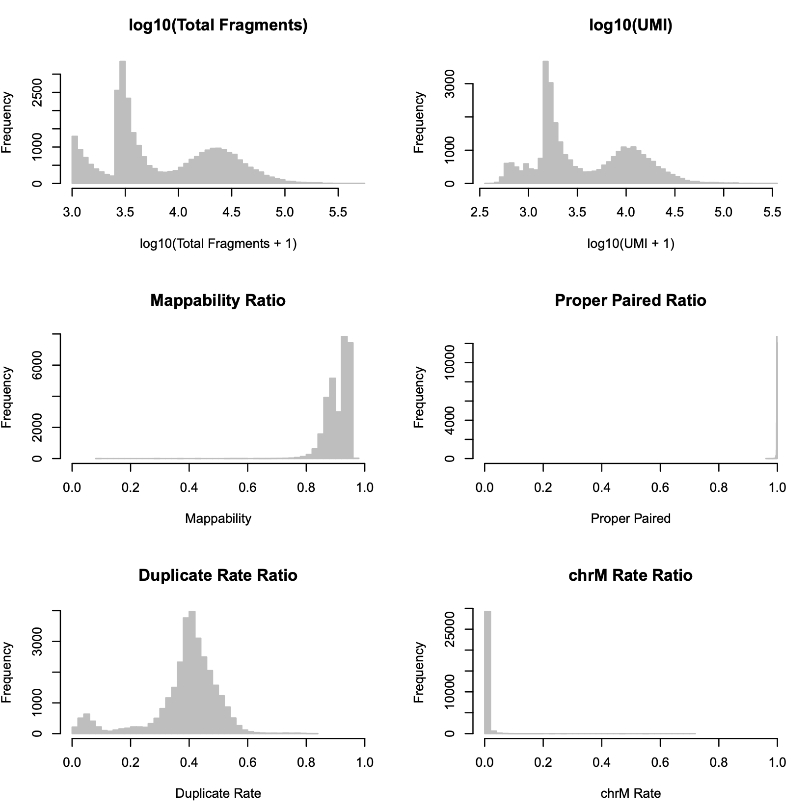

**Step 2. Barcode selection.**  
From the distribution, we can see a bimodel distribution for UMI (unique molecule identifier) with a seperation at 3.5 (~3162.278 fragments), therefore, we chose UMI >= 3000 as cutoff for barcode selection.

```R
# filter cells based on the following cutoffs
> x.sp = filterCells(
	obj=x.sp,
	subset.names=c("UMI"),
	low.thresholds=c(3000),
	high.thresholds=c(Inf)
	);
> x.sp
number of barcodes: 14016
number of bins: 0
number of genes: 0
number of peaks: 0
```

**Step 3. Bin Size Selection (SnapATAC)**.        
Using remaining cells, we next determine the optimal bin size based on the correlation between replicates. If there are no biological replicates given, the cells are evenly split into two pseudo-replicates. We recommend chosing the smallest bin size that yields correlation > 0.95. In this case, we only create cell-by-bin matrix of 5kb resolution whose correlation is 0.98. Based on our previous analysis on other datasets, we found 5kb overall is an optimal resolution. 

```R
> x.sp = addBmatToSnap(
	obj=x.sp, 
	bin.size=5000, 
	num.cores=1
	);
> calBmatCor(x.sp);
[1] 0.987718
```

**Step 4. Fragments-in-promoter ratio**.               
Insteading of using fragment-in-peak ratios, we next calculate fragments in promoter ratio and use it as a metric to further filter cells. The group of cells in the left corners that have low FIP ratios but high fragment numbers are likely noise or primers. 

```R
> library(GenomicRanges);
> system("wget http://renlab.sdsc.edu/r3fang/share/Fang_2019/published_scATAC/PBMC_10k_10X/atac_v1_pbmc_10k_fastqs/promoter.bed");
> promoter.df = read.table("promoter.bed");
> promoter.gr = GRanges(promoter.df[,1], IRanges(promoter.df[,2], promoter.df[,3]));
> ov = findOverlaps(x.sp@feature, promoter.gr);
> idy = queryHits(ov);
> promoter_ratio = SnapATAC::rowSums(x.sp[,idy, mat="bmat"], mat="bmat") / SnapATAC::rowSums(x.sp, mat="bmat");
> plot(
	x=log(SnapATAC::rowSums(x.sp, mat="bmat") + 1,10), 
	y=promoter_ratio, 
	cex=0.5, 
	col="grey", 
	xlab="log(count)", 
	ylab="FIP Ratio",
	ylim=c(0, 1)
	);
> idx = which(promoter_ratio > 0.2 & promoter_ratio < 0.8);
> x.sp = x.sp[idx,];
> x.sp;
number of barcodes: 13157
number of bins: 627478
number of genes: 0
number of peaks: 0
> summarySnap(x.sp);
Total  number of barcodes: 13157
Median number of sequencing fragments: 22432
Median number of uniquely mapped fragments: 11160
Median number of mappability ratio: 0.94
Median number of properly paired ratio: 1
Median number of duplicate ratio: 0.46
Median number of chrM ratio: 0
Median number of unique molecules (UMI): 11160
```

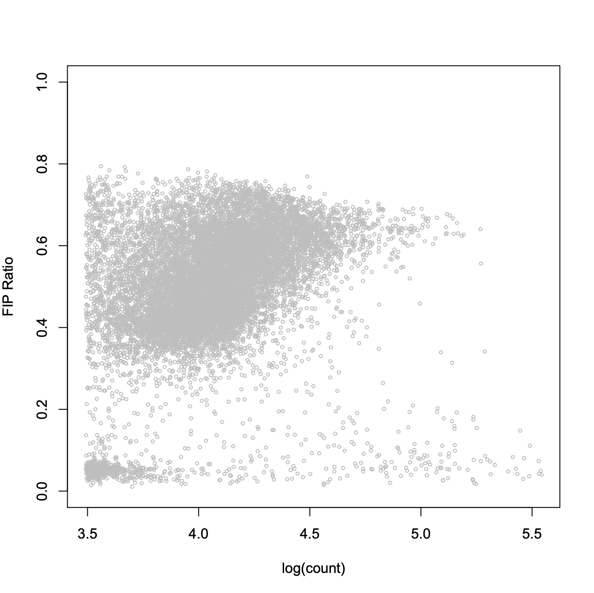

**Step 5. Matrix binarization (SnapATAC)**.         
We next binarize cell-by-bin count matrix. We find some items in the matrix can have exceedingly high coverage perhaps due to the alignment error. Therefore, we first remove top 0.1% (`outlier.filter=1e-3`) items in the count matrix and then convert the rest into binary.

```R
> x.sp = makeBinary(x.sp, mat="bmat", outlier.filter=1e-3);
```

**Step 6. Feature selection (SnapATAC)**.        
We next filtered any bins overlapping with the [ENCODE blacklist](http://mitra.stanford.edu/kundaje/akundaje/release/blacklists/) and bins belonging to chrM or random chromsomes to prevent from any potential artifacts. Meanwhile, bins of exceedingly high coverage which likely represent the genomic regions that are invariable between cells such as housekeeping gene promoters were removed. We noticed that filtering bins of low coverage perhaps due to random noise can also improve the robustness of the downstream clustering analysis. In detail, we calculated the coverage of each bin using the binary matrix and normalized the coverage by `log10(count + 1)`. We found the log-scaled coverage obey approximately a gaussian distribution which is then converted into zscore. In the following example, bins with zscore beyond ±2 were filtered. 

```R
> library(GenomicRanges);
> system("wget http://mitra.stanford.edu/kundaje/akundaje/release/blacklists/hg19-human/wgEncodeHg19ConsensusSignalArtifactRegions.bed.gz");
> black_list = read.table("wgEncodeHg19ConsensusSignalArtifactRegions.bed.gz");
> black_list.gr = GRanges(
                          black_list[,1], 
                          IRanges(black_list[,2], black_list[,3])
                         );
> idy1 = queryHits(findOverlaps(x.sp@feature, black_list.gr));
> idy2 = grep("chrM|random", x.sp@feature);
> idy = unique(c(idy1, idy2));
> x.sp = x.sp[,-idy, mat="bmat"];
> plotBinCoverage(
	obj=x.sp,
	col="grey",
	border="grey",
	breaks=20,
	xlim=c(-6, 6)
	);
```

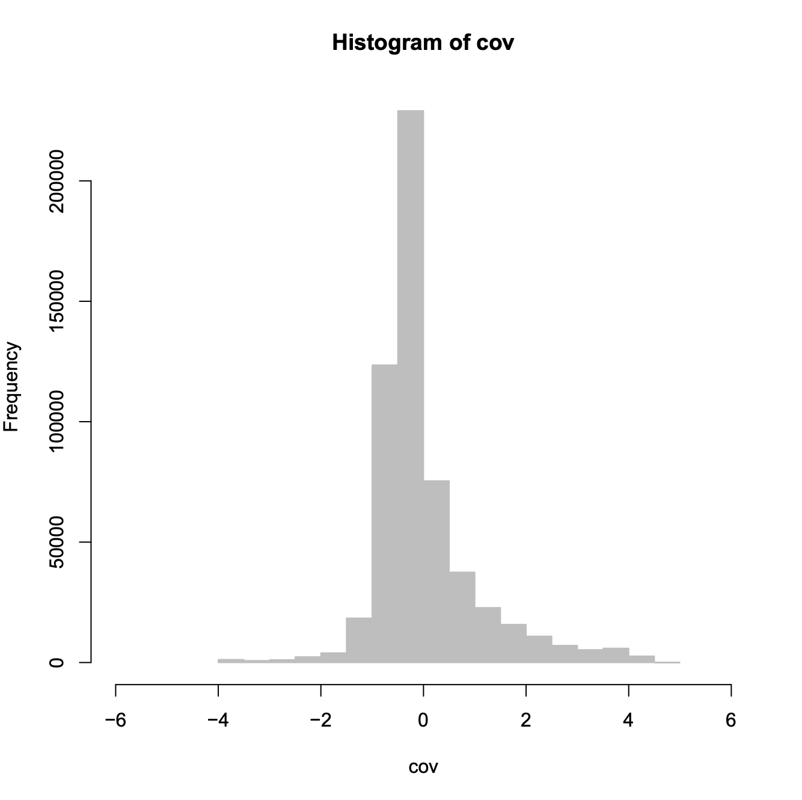

Now filter bins with coverage outside the range [-1.5-1.5].

```R
> x.sp = filterBins(
	x.sp,
	low.threshold=-2,
	high.threshold=3,
	mat="bmat"
	);
> x.sp
number of barcodes: 13157
number of bins: 546766
number of genes: 0
number of peaks: 0
```

**Step 7. Jaccard Index Matrix (SnapATAC)**.            
We next convert the genome-wide cell-by-bin matrix into a cell-by-cell similarity matrix by estimating the jaccard index between two cells in the basis of profile overlaps. Instead of calculating a full N-by-N jaccard matrix, we calculate a partial jaccard index matrix by randomly choosing `max.var` cells. By doing so, we demonstrate that it does not sacrifice the performance but significantly improves the running time. 
  
```R
> x.sp = runJaccard(
	x.sp,
	tmp.folder=tempdir(),
	mat = "bmat",
	max.var=2000,
	ncell.chunk=1000,
	seed.use=10,
	do.par=TRUE,
	num.cores=5
	);
``` 

**Step 8. Normalization (SnapATAC)**.            
Due to the high dropout rate, we found that the jaccard index is highly affected by the differing read depth between cells. To eliminate such confounding factor, we have developed two methods for normalizing jaccard index `normOVE` and `normOVN`. 

```R
> x.sp = runNormJaccard(
	obj=x.sp,
	tmp.folder=tempdir(),
	ncell.chunk=1000,
	method="normOVE",
	row.center=TRUE,
	row.scale=TRUE,
	low.threshold=-5,
	high.threshold=5,
	do.par=TRUE,
	num.cores=5,
	seed.use=10
	);
``` 

**Step 9. Linear Dimentionality Reduction (SnapATAC)**.             
Like other single-cell analysis, snATAC-seq contains extensive technical noise due to the high drop-out rate. To overcome this challenge, PCA or SVD is often applied to combine information across a correlated feature set hereby creating a mega-feature and exclude the variance potential resulting from technical noise. Here, we performed PCA against the normalized matrix. We used IRLBA algorithm, a fast and memory-efficient algorithm, to compute a partial PCA. IRLBA is implemented in  `irlba` R package.

```R
> x.sp = runDimReduct(
	x.sp,
	pc.num=50,
	input.mat="jmat",
	method="svd",
	center=TRUE,
	scale=FALSE,
	seed.use=10
	);
```

**Step 10. Determine statistically significant principal components (SnapATAC)**.          
We next Determine how many PCs to include for downstream analysis. We use an ad hoc method for determining which PCs to use is to look at a plot of the standard deviations of the principle components and draw your cutoff where there is a clear elbow in the graph. The other ad hoc way to determine PCs is to plot out every two PCs and select until PCs that have no obvious structure. 

```R
> plotDimReductElbow(
	obj=x.sp, 
	point.size=1,
	point.shape=19,
	point.color="red",
	point.alpha=1,
	pdf.file.name=NULL,
	pdf.height=7,
	pdf.width=7
	);
> plotDimReductPW(
	obj=x.sp, 
	pca.dims=1:50,
	point.size=0.3,
	point.color="grey",
	point.shape=19,
	point.alpha=0.6,
	down.sample=3000,
	pdf.file.name=NULL, 
	pdf.height=7, 
	pdf.width=7
	);
```

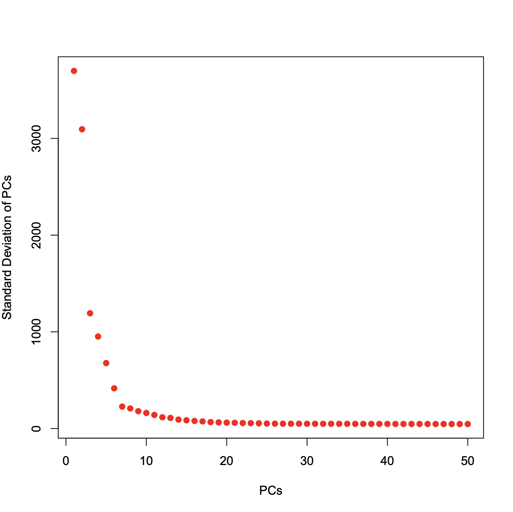 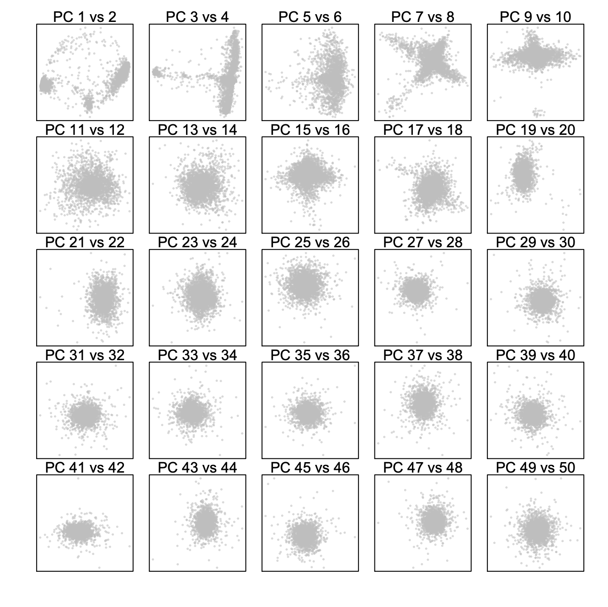

**Step 11. KNN Graph Construction (SnapATAC).**          
Using selected significant components, we next construct a K Nearest Neighbor (KNN) Graph. Using euclidean distance, the k-nearest neighbors of each cell are identified accoriding and used to create a KNN graph. KNN graph can be further refined to SNN (Shared Nearest Neighbor) graph by adding edge weight between cells as shared overlap in their local neighborhoods using Jaccard similarity. **This function is inspired and modified from Seurat package.**

```R
> x.sp = runKNN(
	obj=x.sp,
	pca.dims=1:20,
	weight.by.sd=FALSE,
	k=15,
	nn.eps=0.0,
	snn=FALSE,
	snn.prune=1/15,
	save.knn=FALSE,
	filename=NULL
	);
```

**Step 12. Clustering (SnapATAC).**                 
Using KNN graph, we next apply community finding algorithm Louvain to identify the clusters in the resulting graph which represent groups of cells sharing similar ATAC-seq profiles, potentially originating from the same cell type.

```R
> x.sp = runCluster(
	obj=x.sp,
	tmp.folder=tempdir(),
	louvain.lib="R-igraph",
	path.to.snaptools=NULL,
	seed.use=10
	);
```

**Step 13. Non-linear dimentionality reduction (SnapATAC).**.     
SnapATAC allows using tSNE, UMAP and FIt-sne to visualize and explore these datasets. In the following example, data is visulized by tsne implemented by R package (Rtsne).

```R
> x.sp = runViz(
	obj=x.sp, 
	tmp.folder=tempdir(),
	dims=2,
	pca.dims=1:20, 
	weight.by.sd=FALSE,
	method="Rtsne",
	fast_tsne_path=NULL,
	Y.init=NULL,
	seed.use=10,
	num.cores=5
	);
```

**Step 14. Visulization (SnapATAC).**.       

```R
> plotViz(
	obj=x.sp, 
	method="tsne", 
	point.size=0.5, 
	point.shape=19, 
	point.alpha=0.8, 
	point.color="cluster", 
	text.add=TRUE,
	text.size=1.2,
	text.color="black",
	text.halo.add=TRUE,
	text.halo.color="white",
	text.halo.width=0.2,
	down.sample=10000,
	pdf.file.name=NULL,
	pdf.width=7, 
	pdf.height=7,
	legend.add=FALSE
	);
> plotViz(
	obj=x.sp, 
	method="tsne", 
	point.size=0.5, 
	point.shape=19, 
	point.alpha=0.8, 
	point.color="sample", 
	text.add=FALSE,
	text.size=1.2,
	text.color="black",
	text.halo.add=TRUE,
	text.halo.color="white",
	text.halo.width=0.2,
	down.sample=10000,
	pdf.file.name=NULL,
	pdf.width=7, 
	pdf.height=7,
	legend.add=TRUE
	);
> feature.value = SnapATAC::rowSums(x.sp@bmat);
> feature.value = pmin(feature.value, quantile(feature.value, 0.99));
> feature.value = pmax(feature.value, 0);
> feature.value = (feature.value-min(feature.value))/(max(feature.value)-min(feature.value));
> PlotFeatureSingle(
	obj=x.sp, 
	feature.value=feature.value,
	method="tsne", 
	point.size=0.3, 
	point.shape=19, 
	point.color="red", 
	down.sample=10000, 
	pdf.file.name=NULL, 
	pdf.width=7, 
	pdf.height==7
	);
```

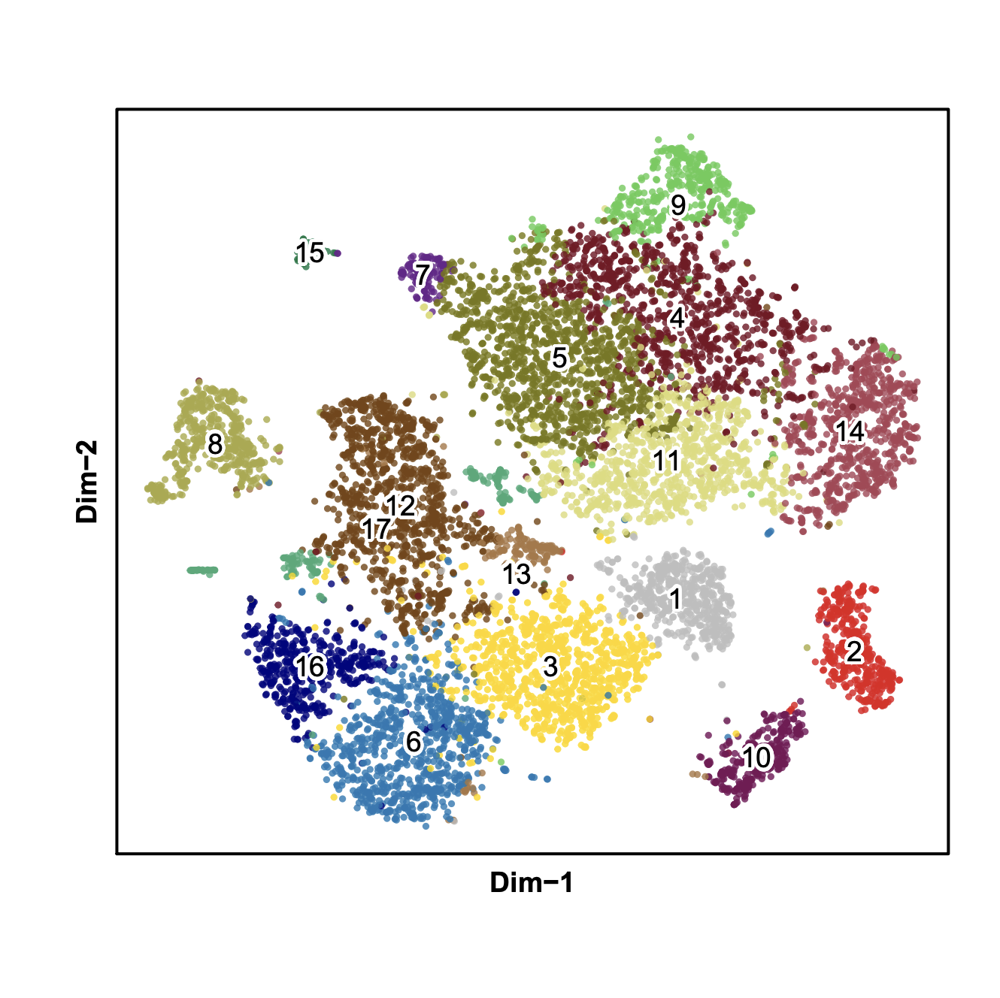  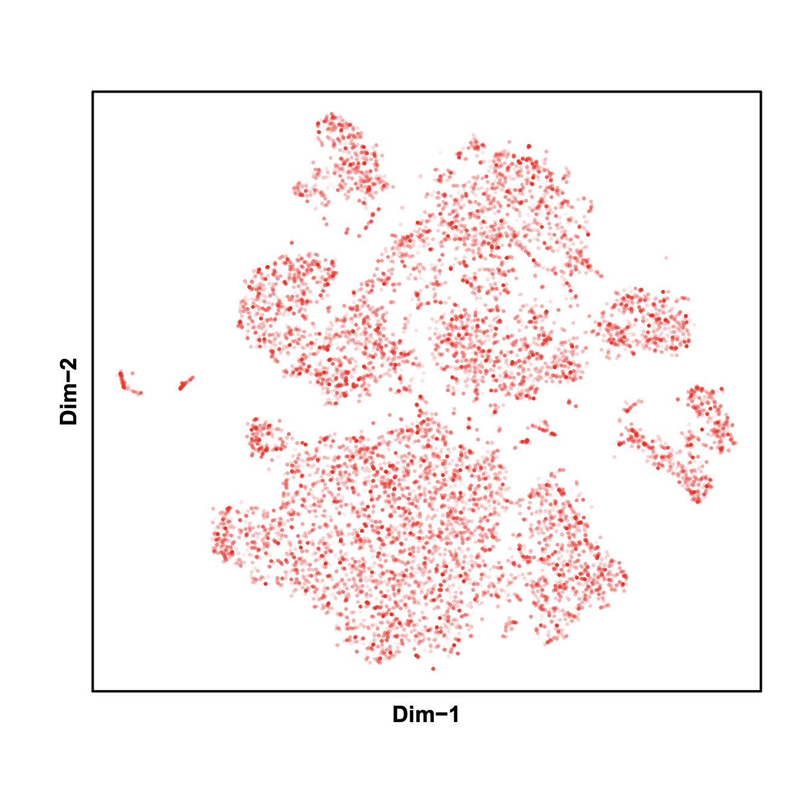 

**Step 15. Gene-body based annotation for expected cell types (SnapATAC)**.        
To help annotate identified cell clusters, SnapATAC next loads the cell-by-gene matrix which estimates the gene body accessibility level. Marker gene list idnetified from [Seurat](https://satijalab.org/seurat/pbmc3k_tutorial.html).

```R
> x.sp = addGmatToSnap(x.sp, num.cores=1);
> x.sp = scaleCountMatrix(
	x.sp, 
	cov=SnapATAC::rowSums(x.sp, mat="gmat"),
	mat="gmat",
	method="RPM"
	);
> marker.genes = c(
	"IL7R", "CD14", "LYZ", 
	"MS4A1", "CD8A", "FCGR3A", 
	"MS4A7", "GNLY", "NKG7" 
	);
> plotGene(
	obj=x.sp, 
	gene.names=marker.genes, 
	viz.method="tsne",
	point.size=0.1,
	point.color="blue",
	point.shape=19,
	background.point=TRUE,
	background.point.color="grey",
	background.point.alpha=0.5,
	background.point.size=0.3,
	background.point.shape=19,
	low.value=0,
	high.value=0.95,
	down.sample=10000,
	pdf.file.name=NULL, 
	plot.nrow=3,
	plot.ncol=3,
	pdf.height=7, 
	pdf.width=7,
	);
```

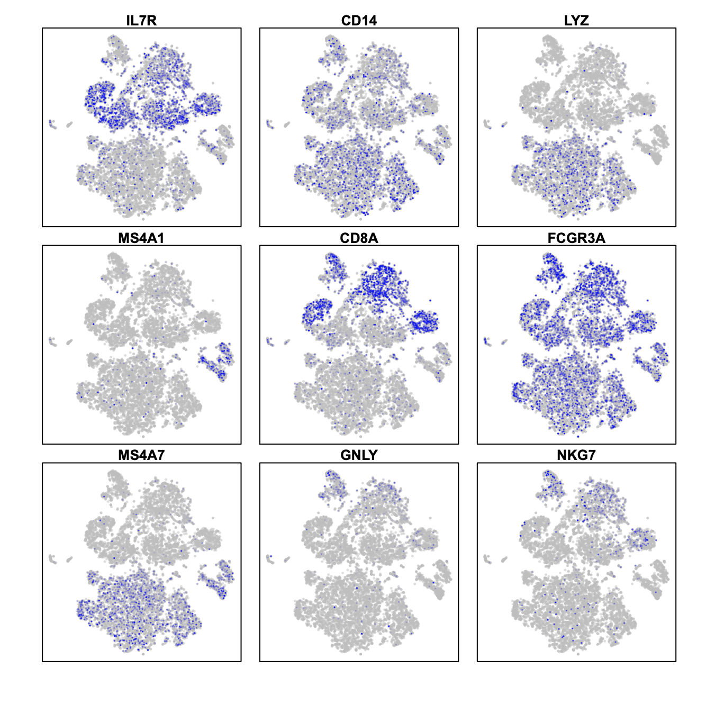

**Step 16. Identify peaks for each clusters (SnapATAC)**.        
Find peaks for cluster 16.

```R
> system("which snaptools");
/home/r3fang/anaconda2/bin/snaptools
> system("which macs2");
/home/r3fang/anaconda2/bin/macs2
> peaks_C16.df = runMACS(
    obj=x.sp[which(x.sp@cluster==16),], 
	tmp.folder=tempdir(),
    output.prefix="atac_v1_pbmc_15k.C1",
    path.to.snaptools="/home/r3fang/anaconda2/bin/snaptools",
    path.to.macs="/usr/bin/macs2",
    gsize="hs", 
    buffer.size=500, 
    macs.options="--nomodel --shift 37 --ext 73 --qvalue 1e-2 -B --SPMR --call-summits",
	num.cores=5
    );
```

Now find peaks for each cluster with more than 100 cells (at least one million fragments).

```R
> peak.gr = runMACSForAll(
	obj=x.sp,
	tmp.folder=tempdir(),
	output.prefix="atac_v1_pbmc_15k",
	path.to.snaptools="/home/r3fang/anaconda2/bin/snaptools",
	path.to.macs="/home/r3fang/anaconda2/bin/macs2",
	num.cores=16,
	min.cells=100,
	gsize="hs", 
	buffer.size=500, 
	macs.options="--nomodel --shift 37 --ext 73 --qvalue 1e-2 -B --SPMR --call-summits"
	); 
```

**Step 17. Create cell-by-peak matrix to snap file (SnapATAC)**.        

```R
> runSnapAddPmat(
	obj=x.sp,
	tmp.folder=tempdir(),
	peak=peaks.gr, 
	path.to.snaptools="/home/r3fang/anaconda2/bin/snaptools", 
	buffer.size=500
	);
> x.sp = addPmatToSnap(obj=x.sp, num.cores=2);
```

**Step 18. Identify Differentially Accessible Regions (development)**.        

```R
> DARs.C2 = findDAR(
	obj=x.sp,
	mat="pmat",
	cluster.pos=2,
	cluster.neg=7,
	bcv=0.1,
	fdr=1e-2,
	pvalue=1e-3,
	test.method="exactTest",
	seed.use=10
	);
> idy_C2 = which(DARs.C2$label == 1);
> y_C2 = SnapATAC::rowSums(x.sp[,idy_C2, mat="pmat"], mat="pmat") / SnapATAC::rowSums(x.sp, mat="pmat") * 1000000;
> boxPlotFeature(
	obj = x.sp,
	feature = y_C2,
	outline = FALSE,
	ylab = "zscore of RPM",
	main = "Cluster 2 DARs Enrichment",
	add.point = TRUE,
	point.size = 0.2,
	point.shape = 19,
	point.alpha = 0.5,
	pdf.file.name=NULL,
	pdf.height=7,
	pdf.width=7
	);
```

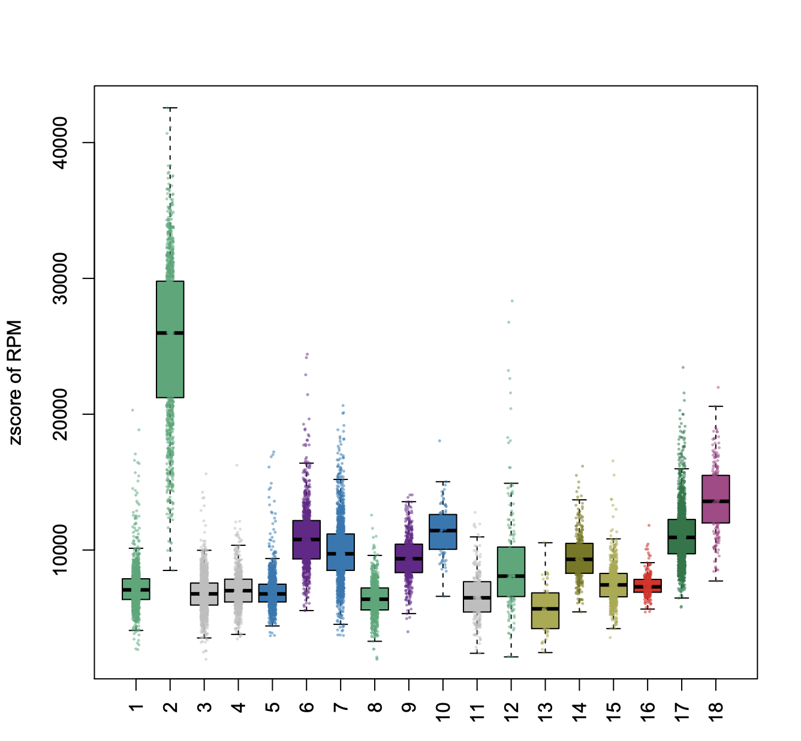

**Step 19. Identify cell-type sepcific master regulators (SnapATAC)**.        

```R
> system("which findMotifsGenome.pl");
/projects/ps-renlab/r3fang/public_html/softwares/homer/bin/findMotifsGenome.pl
> motifs = runHomer(
	x.sp[, idy_C2,"pmat"], 
	mat = "pmat",
	path.to.homer = "/projects/ps-renlab/r3fang/public_html/softwares/homer/bin/findMotifsGenome.pl",
	result.dir = "./homer/C2",
	num.cores=5,
	genome = 'hg19',
	motif.length = 10,
	scan.size = 300,
	optimize.count = 2,
	background = 'automatic',
	local.background = FALSE,
	only.known = FALSE,
	only.denovo = FALSE,
	fdr.num = 5,
	cache = 100,
	overwrite = TRUE,
	keep.minimal = FALSE
	);
> head(motifs);
                                             motif  -logPvalue
 RUNX1(Runt)/Jurkat-RUNX1-ChIP-Seq(GSE29180)/Homer	-1634
    ETS1(ETS)/Jurkat-ETS1-ChIP-Seq(GSE17954)/Homer	-1505
    RUNX(Runt)/HPC7-Runx1-ChIP-Seq(GSE22178)/Homer	-1431
    RUNX2(Runt)/PCa-RUNX2-ChIP-Seq(GSE33889)/Homer	-1412
 Etv2(ETS)/ES-ER71-ChIP-Seq(GSE59402)/Homer(0.967)	-1410
        ERG(ETS)/VCaP-ERG-ChIP-Seq(GSE14097)/Homer	-1403
```

**Step 20. Subclustering of cluster 2**.        

```R
> idx = which(x.sp@cluster == 4);
> x.sub.sp = x.sp[idx,];
> x.sub.sp = addBmatToSnap(
	obj=x.sub.sp, 
	bin.size=5000, 
	num.cores=1
	);
> plotBinCoverage(
	obj=x.sub.sp,
	col="grey",
	border="grey",
	breaks=20,
	xlim=c(-6, 6)
	);
> x.sub.sp = filterBins(
	obj=x.sub.sp,
	low.threshold=-2,
	high.threshold=2,
	mat="bmat"
	);
> x.sub.sp = makeBinary(x.sub.sp, mat="bmat", outlier.filter=1e-3);
> black_list = read.table("wgEncodeHg19ConsensusSignalArtifactRegions.bed.gz");
> black_list.gr = GRanges(
                          black_list[,1], 
                          IRanges(black_list[,2], black_list[,3])
                         );
> idy1 = queryHits(findOverlaps(x.sub.sp@feature, black_list.gr));
> idy2 = grep("chrM|random", x.sub.sp@feature);
> idy = unique(c(idy1, idy2));
> x.sub.sp = x.sub.sp[,-idy, mat="bmat"];
> x.sub.sp = runJaccard(
	x.sub.sp,
	tmp.folder=tempdir(),
	mat="bmat",
	max.var=2000,
	ncell.chunk=1000,
	seed.use=10,
	num.cores=5
	);
> x.sub.sp = runNormJaccard(
	obj=x.sub.sp,
	tmp.folder=tempdir(),
	ncell.chunk=1000,
	method="normOVE",
	row.center=TRUE,
	row.scale=TRUE,
	low.threshold=-5,
	high.threshold=5,
	num.cores=5,
	seed.use=10
	);
> x.sub.sp = runDimReduct(
	obj=x.sub.sp,
	pc.num=50,
	input.mat="jmat",
	method="svd",
	center=TRUE,
	scale=FALSE,
	seed.use=10
	);
> plotDimReductPW(
	obj=x.sub.sp, 
	pca.dims=1:50,
	point.size=0.3,
	point.color="grey",
	point.shape=19,
	point.alpha=0.6,
	down.sample=3000,
	pdf.file.name=NULL, 
	pdf.height=7, 
	pdf.width=7
	);	
> x.sub.sp = runKNN(
	obj=x.sub.sp,
	pca.dims=1:10,
	weight.by.sd=TRUE,
	k=30,
	nn.eps=0.0,
	snn=FALSE,
	snn.prune=1/15,
	save.knn=FALSE,
	filename=NULL
	);
> x.sub.sp = runCluster(
	obj=x.sub.sp,
	tmp.folder=tempdir(),
	louvain.lib="R-igraph",
	path.to.snaptools=NULL,
	seed.use=10
	); 
> x.sub.sp = runViz(
	obj=x.sub.sp, 
	tmp.folder=tempdir(),
	dims=2,
	pca.dims=1:10, 
	weight.by.sd=TRUE,
	method="umap",
	fast_tsne_path=NULL,
	Y.init=NULL,
	seed.use=10,
	num.cores=5
	);
> plotViz(
	obj=x.sub.sp, 
	method="umap", 
	point.size=1, 
	point.shape=19, 
	point.alpha=0.8, 
	point.color="cluster", 
	text.add=FALSE,
	text.size=1.2,
	text.color="black",
	text.halo.add=TRUE,
	text.halo.color="white",
	text.halo.width=0.2,
	down.sample=10000,
	pdf.file.name=NULL,
	pdf.width=7, 
	pdf.height=7,
	legend.add=TRUE
	);
> plotViz(
	obj=x.sub.sp, 
	method="umap", 
	point.size=1, 
	point.shape=19, 
	point.alpha=0.8, 
	point.color="sample", 
	text.add=FALSE,
	text.size=1.2,
	text.color="black",
	text.halo.add=TRUE,
	text.halo.color="white",
	text.halo.width=0.2,
	down.sample=10000,
	pdf.file.name=NULL,
	pdf.width=7, 
	pdf.height=7,
	legend.add=TRUE
	);
```

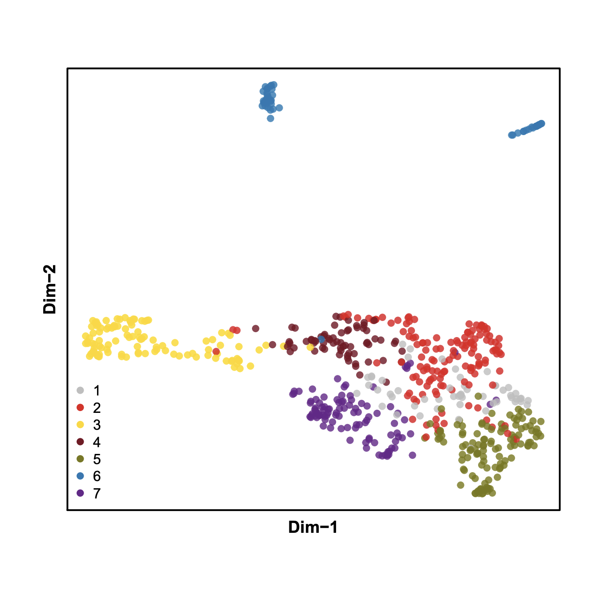 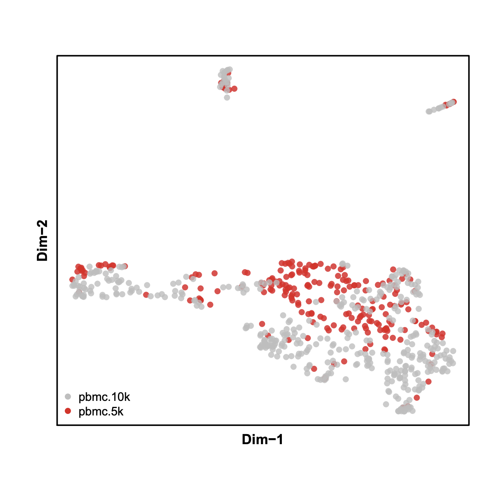

