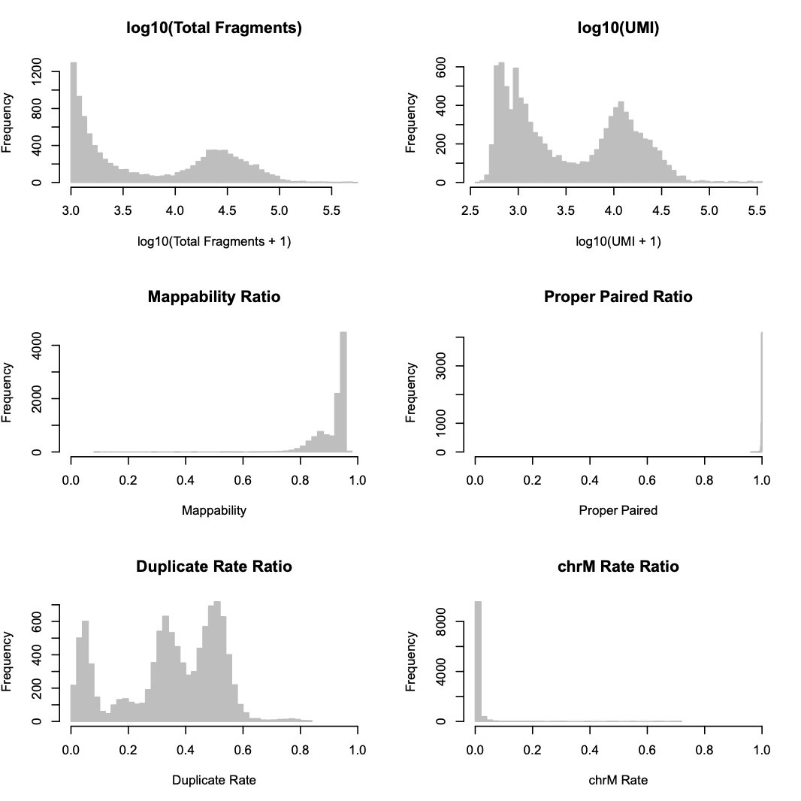
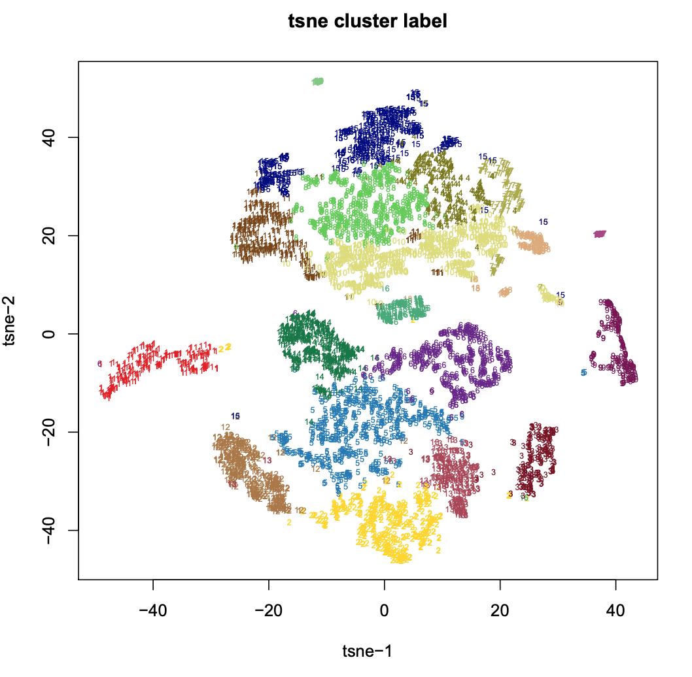
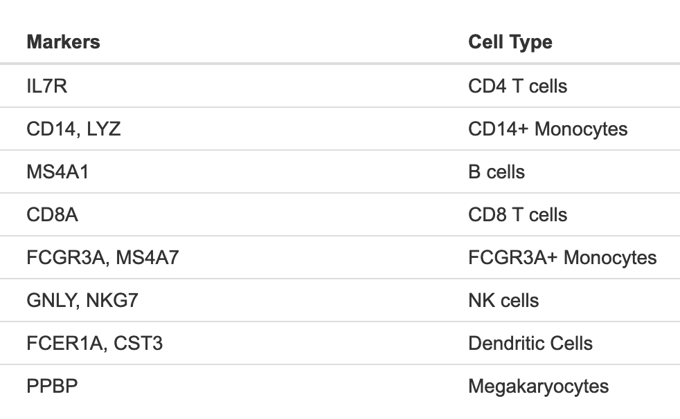
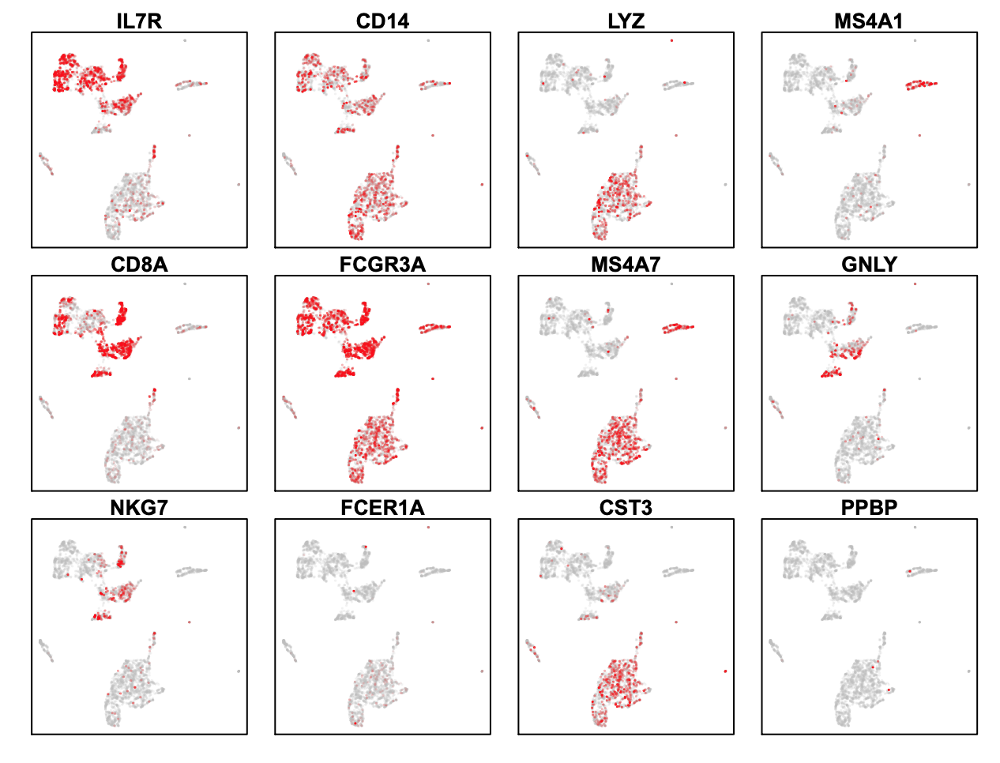

## Analysis of PBMC 5K 10X single cell ATAC-seq   
SnapATAC is also compatible with with 10X platform.

**Step 1. Download the fastq file**

```
$ wget http://s3-us-west-2.amazonaws.com/10x.files/samples/cell-atac/1.0.1/atac_v1_pbmc_5k/atac_v1_pbmc_5k_fastqs.tar
$ tar -xvf atac_v1_pbmc_5k_fastqs.tar
```

**Step 2. Barcode Demultiplexing**.         
In this example, we have one 10x library sequenced on two flowcells. Note that after running cellranger-atac mkfastq, we run a single instance of the pipeline on all the FASTQ files generated:


    
```bash
$ cd atac_v1_pbmc_5k_fastqs
$ ll 
-rwx---r-x 1 r3fang ren-group  861330601 Oct 10 19:18 atac_v1_pbmc_5k_S1_L001_I1_001.fastq.gz
-rwx---r-x 1 r3fang ren-group 3503435541 Oct 10 19:18 atac_v1_pbmc_5k_S1_L001_R1_001.fastq.gz
-rwx---r-x 1 r3fang ren-group 2082606972 Oct 10 19:18 atac_v1_pbmc_5k_S1_L001_R2_001.fastq.gz
-rwx---r-x 1 r3fang ren-group 3509237085 Oct 10 19:18 atac_v1_pbmc_5k_S1_L001_R3_001.fastq.gz
-rwx---r-x 1 r3fang ren-group  874670358 Oct 10 20:27 atac_v1_pbmc_5k_S1_L002_I1_001.fastq.gz
-rwx---r-x 1 r3fang ren-group 3557043154 Oct 10 20:27 atac_v1_pbmc_5k_S1_L002_R1_001.fastq.gz
-rwx---r-x 1 r3fang ren-group 2126873882 Oct 10 20:27 atac_v1_pbmc_5k_S1_L002_R2_001.fastq.gz
-rwx---r-x 1 r3fang ren-group 3560556684 Oct 10 20:27 atac_v1_pbmc_5k_S1_L002_R3_001.fastq.gz
```

Because there is only one 10X library sequenced, the 8bp i7 (sample index) can be ignored here. We next add the 16bp i5 (10x Barcode) to the beginning of read names using the fllowing command:

```bash
$ snaptools dex-fastq \
	--input-fastq=atac_v1_pbmc_5k_S1_L001_R1_001.fastq.gz \
	--output-fastq=atac_v1_pbmc_5k_S1_L001_R1_001.dex.fastq.gz \
	--index-fastq-list atac_v1_pbmc_5k_S1_L001_R2_001.fastq.gz 

$ snaptools dex-fastq \
	--input-fastq=atac_v1_pbmc_5k_S1_L002_R1_001.fastq.gz \
	--output-fastq=atac_v1_pbmc_5k_S1_L002_R1_001.dex.fastq.gz \
	--index-fastq-list atac_v1_pbmc_5k_S1_L002_R2_001.fastq.gz 

$ snaptools dex-fastq \
	--input-fastq=atac_v1_pbmc_5k_S1_L001_R3_001.fastq.gz \
	--output-fastq=atac_v1_pbmc_5k_S1_L001_R3_001.dex.fastq.gz \
	--index-fastq-list atac_v1_pbmc_5k_S1_L001_R2_001.fastq.gz 

$ snaptools dex-fastq \
	--input-fastq=atac_v1_pbmc_5k_S1_L002_R3_001.fastq.gz \
	--output-fastq=atac_v1_pbmc_5k_S1_L002_R3_001.dex.fastq.gz \
	--index-fastq-list atac_v1_pbmc_5k_S1_L002_R2_001.fastq.gz

$ cat atac_v1_pbmc_5k_S1_L001_R1_001.dex.fastq.gz atac_v1_pbmc_5k_S1_L002_R1_001.dex.fastq.gz > atac_v1_pbmc_5k_R1.dex.fastq.gz 
$ cat atac_v1_pbmc_5k_S1_L001_R3_001.dex.fastq.gz atac_v1_pbmc_5k_S1_L002_R3_001.dex.fastq.gz > atac_v1_pbmc_5k_R3.dex.fastq.gz 
 
```

**Step 3. Index reference gnome**.      
Index the reference genome before alignment (skip this step if you already have done this before). Here we show how to index the genome using BWA. User can switch to other aligner by --aligner tag, currently snaptools supports bwa, bowtie2 and minimap2. User also needs to specify the foder that stores the aligner executable binary file. For instance, if bwa is installed under /opt/biotools/bwa/bin/bwa on my server, then set `--path-to-aligner=/opt/biotools/bwa/bin/`.
         
```bash
$ which bwa
/opt/biotools/bwa/bin/bwa 
$ snaptools index-genome  \
	--input-fasta=hg19.fa  \
	--output-prefix=hg19  \
	--aligner=bwa  \
	--path-to-aligner=/opt/biotools/bwa/bin/  \
	--num-threads=5
```

**Step 4. Alignment (snaptools).**     
We next aligned de-multicomplexed reads to the corresponding reference genome using snaptools with following command. After alignment, reads are automatically sorted by the read names which allows for grouping reads according to the barcode (`--if-sort`). User can use mutiple CPUs to speed up this step by setting (`--num-threads`).

```bash
$ snaptools align-paired-end  \
	--input-reference=hg19.fa  \
	--input-fastq1=atac_v1_pbmc_5k_R1.dex.fastq.gz   \
	--input-fastq2=atac_v1_pbmc_5k_R3.dex.fastq.gz   \
	--output-bam= atac_v1_pbmc_5k.bam  \
	--aligner=bwa  \
	--path-to-aligner=/opt/biotools/bwa/bin/  \
	--read-fastq-command=zcat  \
	--min-cov=0  \
	--num-threads=5  \
	--if-sort=True  \
	--tmp-folder=./  \
	--overwrite=TRUE                     
```


**Step 5. Pre-processing (snaptools).**

```bash
$ wget http://hgdownload.cse.ucsc.edu/goldenPath/hg19/bigZips/hg19.chrom.sizes 
$ snaptools snap-pre  \
	--input-file=atac_v1_pbmc_5k.bam  \
	--output-snap=atac_v1_pbmc_5k.snap  \
	--genome-name=hg19  \
	--genome-size=hg19.chrom.sizes  \
	--min-mapq=30  \
	--min-flen=0  \
	--max-flen=1000  \
	--keep-chrm=TRUE  \
	--keep-single=TRUE  \
	--keep-secondary=False  \
	--overwrite=True  \
	--min-cov=100  \
	--verbose=True

$ cat atac_v1_pbmc_5k.snap.qc
Total number of unique barcodes:             10184
TN - Total number of fragments:              177449882
UM - Total number of uniquely mapped:        165752447
SE - Total number of single ends:            0
SA - Total number of secondary alignments:   1117
PE - Total number of paired ends:            165751330
PP - Total number of proper paired:          165536108
PL - Total number of proper frag len:        165536108
US - Total number of usable fragments:       165536108
UQ - Total number of unique fragments:       87291171
CM - Total number of chrM fragments:         326143
```

**Step 6. Cell-by-bin matrix (snaptools).**  

```bash
$ snaptools snap-add-bmat	\
	--snap-file=atac_v1_pbmc_5k.snap	\
	--bin-size-list 1000 5000	\
	--verbose=True
```

**Step 7. Cell-by-gene Matrix (snaptools).**  

```bash
$ snaptools snap-add-gmat	\
	--snap-file=atac_v1_pbmc_5k.snap	\
	--gene-file=gencode.v19.annotation.gene.bed 	
```

**Step 8. Create a snap object.**  

```R
$ R
> library(SnapATAC);
> x.sp = createSnap("atac_v1_pbmc_5k.snap", metaData=TRUE);
> plotBarcode(x.sp);                             
```



**Step 9. Barcode selection.**  

From the distribution, we can clearly see a bimodel distribution for UMI (unique molecule identifier) seperated at 3.5 (3162.278), therefore, we choose UMI >= 3000 as cutoff for barcode selection.

```R
# filter cells based on the following cutoffs
> x.sp = filterCells(x.sp, 
                   subset.names=c("UMI"),
                   low.thresholds=c(3000),
                   high.thresholds=c(Inf)
                  );
> x.sp 

number of barcodes: 4902
number of bins: 0
number of peaks: 0
number of genes: 0
==========================
meta data            (metData) :  TRUE
cellxbin matrix      (bmat)    :  FALSE
cellxpeak matrix     (pmat)    :  FALSE
cellxgene matrix     (gmat)    :  FALSE
jaccard matrix       (jmat)    :  FALSE
normalization        (nmat)    :  FALSE
PCA:                 (smat)    :  FALSE
cluster:             (cluster) :  FALSE
t-sne:               (tsne)    :  FALSE
umap:                (umap)    :  FALSE

> Summary(x.sp)
Total  number of barcodes: 4902
Median number of sequencing fragments: 26681.5
Median number of uniquely mapped fragments: 12332.5
Median number of mappability ratio: 0.94
Median number of properly paired ratio: 1
Median number of duplicate ratio: 0.49
Median number of chrM ratio: 0
Median number of unique molecules (UMI): 12332.5

```

**Step 10. Bin Size Selection (snapATAC)**.        
Using remaining cells, we next choose the optimal bin size based on the correlation between replicates. If there are no biological replicates given, the cells are evenly split into two pseudo-replicates. We recommend chosing the smallest bin size that have correlation greater than 0.95.

```R
# show what bin sizes exist in atac_v1_pbmc_5k.snap file
> showBinSizes("atac_v1_pbmc_5k.snap");
[1] 1000 5000
# try 1kb first
> x.sp = addBmat(x.sp, "atac_v1_pbmc_5k.snap", binSize=1000);
> x.sp = makeBinary(x.sp, mat="bmat");
> checkBinSize(x.sp);
[1] 0.838655

# try 5kb resolution
> x.sp = addBmat(x.sp, "atac_v1_pbmc_5k.snap", binSize=5000);
> x.sp = makeBinary(x.sp, "bmat");
> checkBinSize(x.sp);
[1] 0.9570692

# we chose 5kb as the final resolution
> x.sp = addBmat(x.sp, "atac_v1_pbmc_5k.snap", binSize=5000);
```

**Step 11. Matrix binarization (snapATAC)**.         
For cell-by-bin count matrix, we next convert it to a binary matrix. We found some items in the matrix can have exceedingly high coverage perhaps due to the alignment error. Therefore, we first remove top 0.1% items in the count matrix and then convert it to a binary matrix.

```R
> x.sp = makeBinary(x.sp, mat="bmat");
```

**Step 12. Feature selection (snapATAC)**.        
We next filtered any bins overlapping with the [ENCODE blacklist](http://mitra.stanford.edu/kundaje/akundaje/release/blacklists/) and bins belonging to chrM or random chromsomes to prevent from any potential artifacts Bins of exceedingly high coverage which likely represent the genomic regions that are invariable between cells such as housekeeping gene promoters were removed. We noticed that filtering bins of extremely low coverage perhaps due to random noise can also improve the robustness of the downstream clustering analysis. In detail, we calculated the coverage of each bin using the binary matrix and normalized the coverage by `log10(count + 1)`. We found the log-scaled coverage obey approximately a gaussian distribution which is then converted into zscore. In the following example, bins with zscore beyond ±2 were filtered. 

```R
> system("wget http://mitra.stanford.edu/kundaje/akundaje/release/blacklists/hg19-human/wgEncodeHg19ConsensusSignalArtifactRegions.bed.gz");
> black_list = read.table("wgEncodeHg19ConsensusSignalArtifactRegions.bed.gz");
> black_list.gr = GRanges(
                          black_list[,1], 
                          IRanges(black_list[,2], black_list[,3])
                         );
> idy1 = queryHits(findOverlaps(x.sp@feature, black_list.gr));
> idy2 = grep("chrM|random", x.sp@feature);
> idy = unique(c(idy1, idy2));
> x.sp = x.sp[,-idy, mat="bmat"];
> plotBinCoverage(
                  obj=x.sp, 
                  col="grey", 
                  border="grey",
                  breaks=20, 
                  xlim=c(-6, 6)
                  );
```


```R
> x.sp = filterBins(
	x.sp,
	low.threshold=-2,
	high.threshold=3,
	mat="bmat"
	);
> x.sp

number of barcodes: 4902
number of bins: 544919
number of peaks: 0
number of genes: 0
==========================
meta data            (metData) :  TRUE
cellxbin matrix      (bmat)    :  TRUE
cellxpeak matrix     (pmat)    :  FALSE
cellxgene matrix     (gmat)    :  FALSE
jaccard matrix       (jmat)    :  FALSE
normalization        (nmat)    :  FALSE
PCA:                 (smat)    :  FALSE
cluster:             (cluster) :  FALSE
t-sne:               (tsne)    :  FALSE
umap:                (umap)    :  FALSE

```


**Step 13. Jaccard Matrix & Normlaization (snapATAC)**.            
We next convert the genome-wide cell-by-bin matrix into a cell-by-cell similarity matrix by estimating the jaccard index between two cells in the basis of overlaps. Instead of calculating a full N-by-N jaccard matrix, we calculate a partial jaccard index matrix by randomly choosing K cells (`max.var`). By doing so, we demonstrate that it does not sacriface the performance but significantly improves the running time. Due to the high dropout rate, the jaccard index is highly biased toward high coverage cells. To remove the read depth effect, we developed a normalization method (`norm.method`).
  
```R
> x.sp = calJaccard(
	x.sp,
	mat = "bmat",
	ncell.chunk=1000,
	max.var=5000,
	seed.use=10,
	norm.method="normOVE",
	row.center=TRUE,
	row.scale=TRUE,
	low.threshold=-5,
	high.threshold=5,
	keep.jmat=FALSE,
	do.par=TRUE,
	num.cores=5
	)
``` 


**Step 14. PCA (snapATAC)**.             
Like other single-cell analysis, scATAC-seq contains extensive technical noise due to the high drop-out rate. To overcome this challenge, PCA or SVD is often applied to combine information across a correlated feature set hereby creating a mega-feature and exclude the variance potential resulting from technical noise. Here, we performed PCA against the normalized matrix. We used IRLBA algorithm, a fast and memory-efficient algorithm, to compute a partial PCA. IRLBA is implemented in  `irlba` R package.

```R
> x.sp = runPCA(
	x.sp,
	pc.num=50,
	input.mat="nmat",
	method="svd",
	weight.by.sd=TRUE,
	center=TRUE,
	scale=FALSE,
	seed.use=10
	)
```

**Step 15. Determine statistically significant principal components (snapATAC)**.          
We next Determine how many PCs to include for downstream analysis. We use an ad hoc method for determining which PCs to use is to look at a plot of the standard deviations of the principle components and draw your cutoff where there is a clear elbow in the graph. The other ad hoc way to determine PCs is to plot out every two PCs and select until PCs that have no obvious structure. 

```R
> plotPCA(x.sp, method="elbow");
> plotPCA(x.sp, method="pairwise");
```
 

**Step 16. Clustering (snapATAC)**.       
 Using the selected significant PCs, we next calculated pairwise Euclidean distance between every two cells, using this distance, we created a k-nearest neighbor graph in which every cell is represented as a node and edges are drawn between cells within `k` nearest neighbors. Edge weight between any two cells are refined by shared overlap in their local neighborhoods using Jaccard similarity. Finally, we applied community finding algorithm Louvain to identify the ‘communities’ in the resulting graph with different `resolution` which represents groups of cells sharing similar ATAC-seq profiles, potentially originating from the same cell type. This step requires `snaptools` to be installed frist and `path_to_snaptools` indicates the folder that contains the `snaptools` excutable file.

```R
> x.sp = runCluster(
	x.sp,
	pca_dims=1:16,
	k=15,
	resolution=1,
	method="louvain",
	path_to_snaptools="/home/r3fang/anaconda2/bin/snaptools"
	)
```

**Step 17. Visulization (snapATAC)**.          
snapATAC allows using tSNE, UMAP and FIt-sne to visualize and explore these datasets. In the following example, data is visulized by tsne implemented by R package (`Rtsne`).

```R
# tsne
> x.sp = runViz(
	x.sp, 
	pca_dims=1:16, 
	dims=2, 
	method="Rtsne"
	)
# umap
> x.sp = runViz(
	x.sp, 
	pca_dims=1:16, 
	dims=2, 
	method="umap"
	)

> plotViz(x.sp, method="tsne", pch=19, cex=0.5);
> plotViz(x.sp, method="umap", pch=19, cex=0.5);
```

 
 


**Step 18. Gene-body based annotation for expected cell types (snapATAC)**.        
To help annotate identified cell clusters, snapATAC next loads the cell-by-gene matrix which estimates the gene body accessibility level.




```R
> x.sp = addGmat(x.sp, "atac_v1_pbmc_5k.snap");
> x.sp = scaleCountMatrix(
	x.sp, 
	cov=rowSums(x.sp, mat="bmat"),
	mat="gmat"
	);
> marker.genes = c(
	"IL7R", "CD14", "LYZ", "MS4A1", 
	"CD8A", "FCGR3A", "MS4A7", "GNLY", 
	"NKG7", "FCER1A", "CST3", "PPBP"
	);
> plotGene(
	x.sp, 
	gene.sel=marker.genes, 
	method="tsne",
	binary=FALSE,
	cex=0.1,
	background=TRUE,
	plot.row=4,
	plot.col=4
	);
> plotGene(
	x.sp, 
	gene.sel=marker.genes, 
	method="umap",
	binary=FALSE,
	cex=0.1,
	background=TRUE,
	plot.row=4,
	plot.col=4
	);
```
T-SNE     


UMAP    



