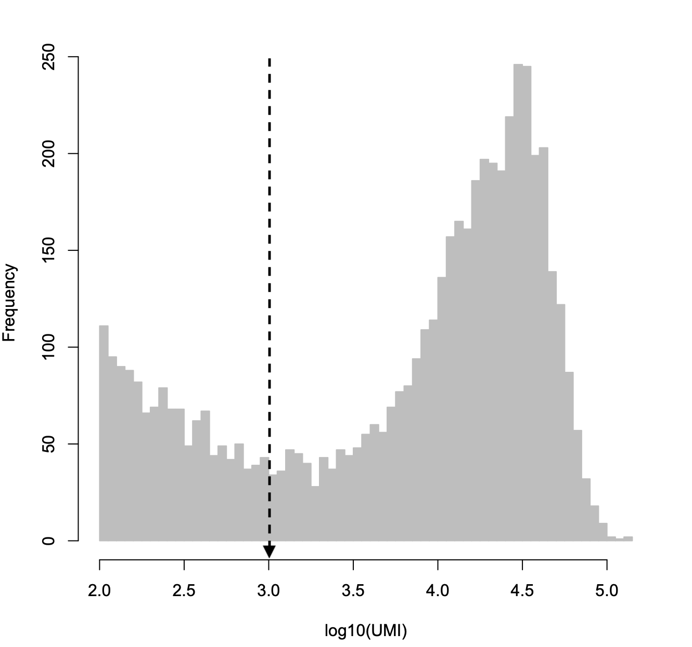
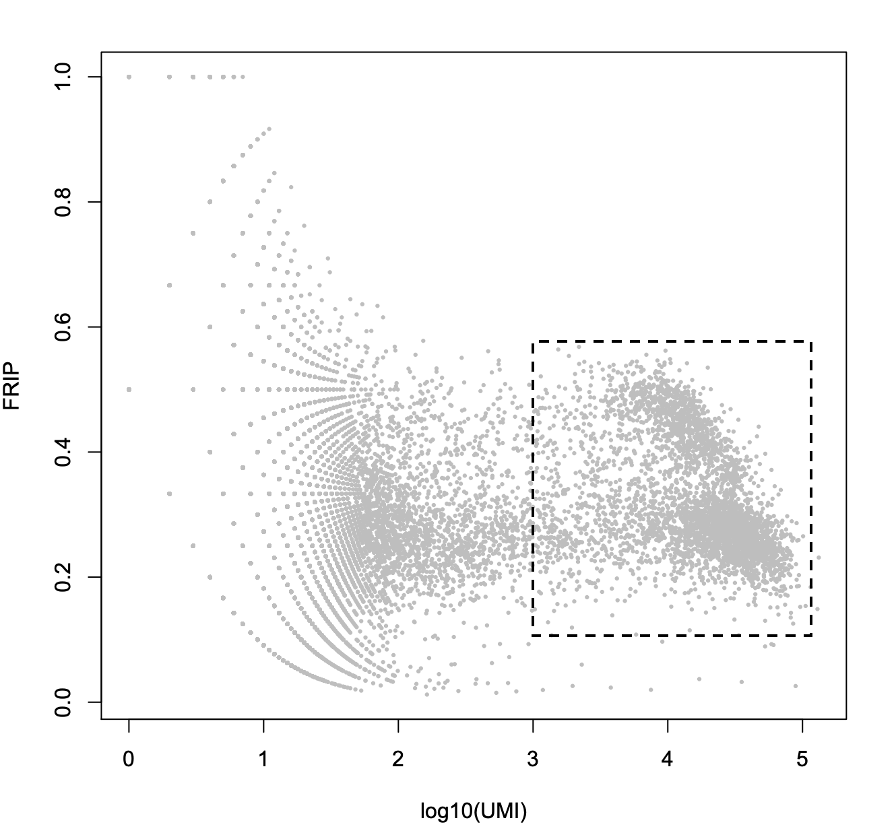
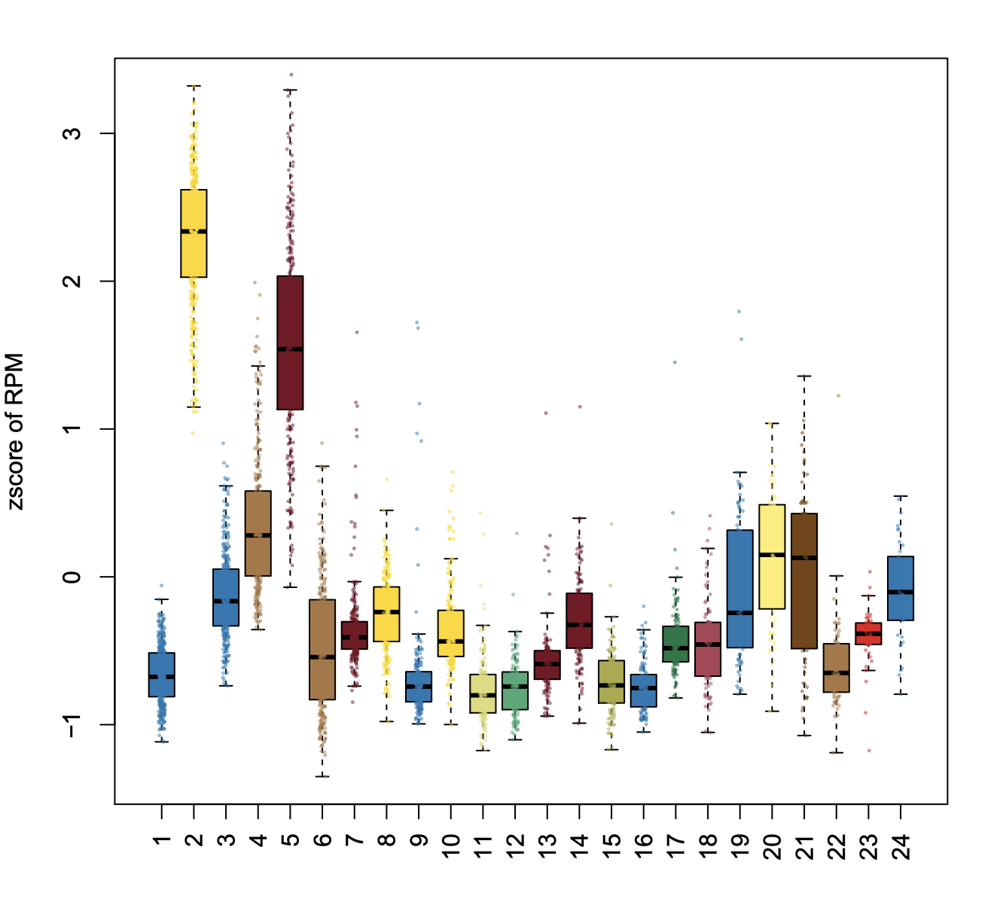
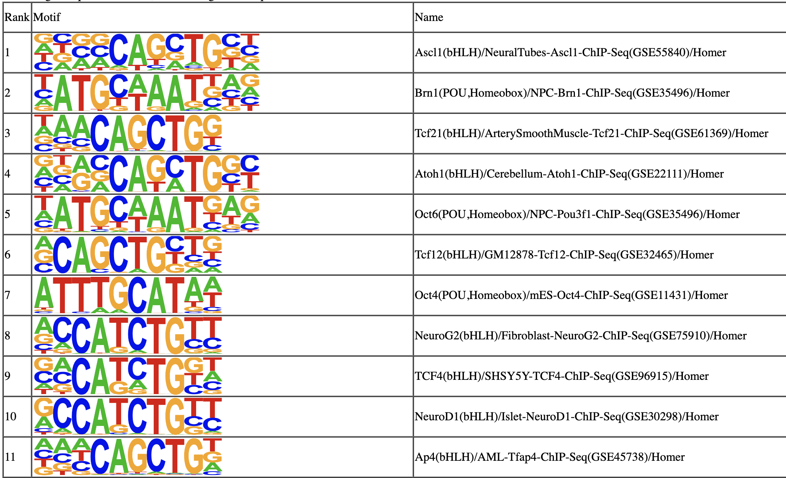

## 10X Adult Brain Fresh 5K

In this example, we will be analyzing a dataset of 5K adult mouse brain cells freely available from 10X. The raw data can be downloaded from [here](https://support.10xgenomics.com/single-cell-atac/datasets/1.1.0/atac_v1_adult_brain_fresh_5k).

**Step 0. Download the data**.      
In this exampe, we will start from fragments.tsv.gz file created by cell-ranger ATAC.

```bash
$ wget http://cf.10xgenomics.com/samples/cell-atac/1.1.0/atac_v1_adult_brain_fresh_5k/atac_v1_adult_brain_fresh_5k_fragments.tsv.gz
$ wget http://cf.10xgenomics.com/samples/cell-atac/1.1.0/atac_v1_adult_brain_fresh_5k/atac_v1_adult_brain_fresh_5k_filtered_tf_bc_matrix.tar.gz
```

**Step 1. Create snap file**.         

```bash
$ fetchChromSizes mm10 > mm10.chrom.size
$ gunzip atac_v1_adult_brain_fresh_5k_fragments.tsv.gz
$ sort -k4,4 atac_v1_adult_brain_fresh_5k_fragments.tsv | gzip - > atac_v1_adult_brain_fresh_5k_fragments.srt.bed.gz
$ snaptools snap-pre  \
	--input-file=atac_v1_adult_brain_fresh_5k_fragments.srt.bed.gz  \
	--output-snap=atac_v1_adult_brain_fresh_5k.snap  \
	--genome-name=mm10  \
	--genome-size=mm10.chrom.sizes  \
	--min-mapq=30  \
	--min-flen=50  \
	--max-flen=1000  \
	--keep-chrm=TRUE  \
	--keep-single=FALSE  \
	--keep-secondary=False  \
	--overwrite=True  \
	--max-num=20000  \
	--min-cov=0  \
	--verbose=True
$ cat atac_v1_adult_brain_fresh_5k.snap.qc
Total number of unique barcodes:             20000
TN - Total number of fragments:              94679183
UM - Total number of uniquely mapped:        94679183
SE - Total number of single ends:            0
SA - Total number of secondary alignments:   0
PE - Total number of paired ends:            94679183
PP - Total number of proper paired:          94679183
PL - Total number of proper frag len:        83349715
US - Total number of usable fragments:       83349715
UQ - Total number of unique fragments:       83349715
CM - Total number of chrM fragments:         0
```

**Step 2. Create cell-by-bin matrix (snaptools)**        
Using snap file, we next create the cell-by-bin matrix. Snap file allows for storing cell-by-bin matrices of different resolutions. In the below example, as a demonstration, we create two cell-by-bin matrices with bin size of 1,000 and 5,000. But we find 5,000 is usually a good bin size, recommand to only generate cell-by-bin matrix of 5,000 in the future. (**Note that this does not create a new file, cell-by-bin matrix is stored in `atac_v1_adult_brain_fresh_5k.snap`**) 

```bash
$ snaptools snap-add-bmat	\
	--snap-file=atac_v1_adult_brain_fresh_5k.snap \
	--bin-size-lis 1000 5000	\
	--verbose=True
```

**Step 3. Barcode selection**        
We select high-quality barcodes based on two criteria: 1) number of filtered fragments; 2) fragments in promoter ratio (FRiP); 

```R
> library(SnapATAC);
> x.sp = createSnap(
	file="atac_v1_adult_brain_fresh_5k.snap",
	sample="atac_v1_adult_brain_fresh_5k",
	num.cores=1
	);
> barcodes = read.csv("atac_v1_adult_brain_fresh_5k_singlecell.csv", head=TRUE);
> barcodes = barcodes[2:nrow(barcodes),];
> FRIP = (barcodes$promoter_region_fragments+1) / (barcodes$passed_filters + 1);
> UMI = log(barcodes$passed_filters, 10);
> plot(UMI, FRIP, cex=0.3, col="grey", pch=19, xlab="log10(UMI)", ylab="FRIP");
> hist(UMI[UMI > 2], col="grey", breaks=50, border="grey", xlab="log10(UMI)", main="");
> barcodes.sel = barcodes[which(UMI >= 3 & UMI <= 5 & FRIP >= 0.15 & FRIP <= 0.6),];
> x.sp = x.sp[which(x.sp@barcode %in% barcodes.sel$barcode),];
> x.sp
number of barcodes: 4098
number of bins: 0
number of genes: 0
number of peaks: 0
```

    

**Step 4. Add cell-by-bin matrix to existing snap object**        
Here we use cell-by-bin matrix of 5kb resolution as input for clustering. See [How to choose the bin size?](https://github.com/r3fang/SnapATAC/wiki/FAQs#bin_size)

```R
# show what bin sizes exist in atac_v1_adult_brain_fresh_5k.snap file
> showBinSizes("atac_v1_adult_brain_fresh_5k.snap");
[1] 1000 5000
> x.sp = addBmatToSnap(x.sp, bin.size=5000, num.cores=1);
```

**Step 5. Matrix binarization**       
We next convert the cell-by-bin count matrix to a binary matrix. We found some items in the matrix have abnormally high coverage perhaps due to the alignment error. Therefore, we first remove top 0.1% items in the count matrix followed by converting the rest of the values into binary.

```R
> x.sp = makeBinary(x.sp, mat="bmat");
```

**Step 6. Bin filtration (SnapATAC)**           
We next filter out any bins overlapping with the [ENCODE blacklist](http://mitra.stanford.edu/kundaje/akundaje/release/blacklists/) and bins belonging to unwanted chromsomes such as chrM, random chromsomes or sex chromsomes to prevent from any potential artifacts. 

```R
> system("wget http://mitra.stanford.edu/kundaje/akundaje/release/blacklists/mm10-mouse/mm10.blacklist.bed.gz");
> library(GenomicRanges);
> black_list = read.table("mm10.blacklist.bed.gz");
> black_list.gr = GRanges(
	black_list[,1], 
	IRanges(black_list[,2], black_list[,3])
	);
> idy1 = queryHits(findOverlaps(x.sp@feature, black_list.gr));
> idy2 = grep("chrM|random|chrX|chrY", x.sp@feature);
> idy = unique(c(idy1, idy2));
> x.sp = x.sp[,-idy, mat="bmat"];
> x.sp
number of barcodes: 4098
number of bins: 492627
number of genes: 0
number of peaks: 0
```

**Step 7. Dimensionality Reduction (SnapATAC)**             
We next run directionality reduction using `runJDA` function which contains the following steps: 1) we convert the filtered genome-wide cell-by-bin matrix into a cell-by-cell similarity matrix by estimating the jaccard index between two cells in the basis of profile overlaps; 2) due to the high dropout rate, we found that the jaccard index is highly affected by the read depth differing between cells. To eliminate such confounding factor, we developed a regression-based method `normOVE` to eliminate such confounding factor; 3) Like other single-cell analysis, snATAC-seq contains extensive technical noise due to the high drop-out rate. To overcome this challenge, we applied PCA or SVD to combine information across a correlated feature set hereby creating a mega-feature and exclude the variance potential resulting from technical noise. 

```R
> x.sp = runJDA(
	obj=x.sp,
	input.mat="bmat",
	bin.cov.zscore.lower=-2,
	bin.cov.zscore.upper=2,
	pc.num=50,
	norm.method="normOVE",
	max.var=5000,
	do.par=TRUE,
	ncell.chunk=1000,
	num.cores=10,
	seed.use=10,
	tmp.folder=tempdir()
	);
```

**Step 8. Determine statistically significant principal components (SnapATAC)**          
We next Determine how many PCs to include for downstream analysis. We use an ad hoc method for determining which PCs to use by looking at a plot of the standard deviations of the principle components and draw your cutoff where there is a clear elbow in the graph. The other ad hoc way to determine PCs is to plot out every two PCs and select the number of PCs until there is no obvious structure.

```R
> plotDimReductElbow(
    obj=x.sp, 
    point.size=1.5,
    point.shape=19,
    point.color="red",
    point.alpha=1,
    pdf.file.name=NULL,
    pdf.height=7,
    pdf.width=7,
    labs.title="PCA Elbow plot",
    labs.subtitle=NULL
    );
> plotDimReductPW(
    obj=x.sp, 
    pca.dims=1:50,
    point.size=0.3,
    point.color="grey",
    point.shape=19,
    point.alpha=0.6,
    down.sample=5000,
    pdf.file.name=NULL, 
    pdf.height=7, 
    pdf.width=7
    );
```

   

**Step 9. KNN Graph Construction (SnapATAC)**          
Using selected significant PCs, we next construct a K Nearest Neighbor (KNN) Graph. In the PC space, each cell is a node and the k-nearest neighbors of each cell are identified according to the Euclidian distance and edges are draw between neighbors in the graph. For large dataset, instead of storing the resulting graph in the memory, one can choose to save the graph in a file by setting `save.knn=TRUE` and specify the `filename`. **This function is inspired and modified from Seurat package.** 

```R
> x.sp = runKNN(
    obj=x.sp,
    pca.dims=2:30,
    weight.by.sd=TRUE,
    k=15
    );
```

**Step 10. Clustering**                  
Next, we use leiden for clustering which allows for choosing different resolution resulting different clustering results. It requires R package `leiden` to be pre-installed [instruction](https://cran.r-project.org/web/packages/leiden/vignettes/run_leiden.html).

```R
> install.packages("leiden");
> system("pip install leidenalg python-igraph") # install leiden python package
> library(leiden);
> x.sp = runCluster(
	obj=x.sp,
	tmp.folder=tempdir(),
	louvain.lib="leiden",
	seed.use=10,
	resolution=1
	);
```

**Step 11. Non-linear dimentionality reduction**         
SnapATAC visualize the datausing  tSNE, UMAP and FIt-sne. In the following example, data is visulized by tsne implemented by R package (Rtsne). To run `umap`, you need to first install umap package. To run `fast_tsne`, you need to first install [fast_tsne package](https://github.com/KlugerLab/FIt-SNE/blob/master/fast_tsne.R).

```R
> x.sp = runViz(
	obj=x.sp, 
	tmp.folder=tempdir(),
	dims=2,
	pca.dims=2:30, 
	weight.by.sd=TRUE,
	method="Rtsne",
	fast_tsne_path=NULL,
	Y.init=NULL,
	seed.use=10,
	num.cores=5
	);
```

**Step 12. Visulization**              

```R
> plotViz(
	obj=x.sp, 
	method="tsne", 
	point.size=0.5, 
	point.shape=19, 
	point.alpha=0.8, 
	point.color="cluster", 
	text.add=FALSE,
	text.size=1.5,
	text.color="black",
	text.halo.add=TRUE,
	text.halo.color="white",
	text.halo.width=0.2,
	down.sample=10000,
	pdf.file.name=NULL,
	pdf.width=7, 
	pdf.height=7,
	legend.add=TRUE
	);
```

    

**Step 13. Gene-body based annotation for expected cell types (SnapATAC)**        
To help annotate identified cell clusters, SnapATAC next creates the cell-by-gene matrix and visualize the enrichment of marker genes.

```R
> system("wget http://renlab.sdsc.edu/r3fang/share/Fang_2019/MOs_snATAC/genes/gencode.vM16.gene.bed");
> genes = read.table("gencode.vM16.gene.bed");
> genes.gr = GRanges(genes[,1], 
	IRanges(genes[,2], genes[,3]), 
	name=genes[,4]
	);
> marker.genes = c(
	"Snap25", "Gad2", "Apoe",
	"C1qb", "Pvalb", "Vip", 
	"Sst", "Lamp5", "Slc17a7", 
	"Mog", "Pdgfra", "Cspg4",
	"Cx3cr1","F3","Aqp4", 
	"Rorb"
	);
> genes.sel.gr <- genes.gr[which(genes.gr$name %in% marker.genes)];
> x.sp = createGmat(
	obj=x.sp, 
	genes= genes.sel.gr,
	ncell.chunk=20,
	do.par=TRUE,
	num.cores=10
	);
# normalize the matrix by cell coverage
> x.sp = scaleCountMatrix(
	obj=x.sp, 
	cov=SnapATAC::rowSums(x.sp, mat="bmat"),
	mat="gmat",
	method = "RPM"
	);
# plot enrichment for marker genes
> plotGene(
	obj=x.sp, 
	gene.names=marker.genes,
	viz.method="tsne",
	point.size=0.3,
	point.color="red",
	point.shape=19,
	background.point=TRUE,
	background.point.color="grey",
	background.point.alpha=0.3,
	background.point.size=0.1,
	background.point.shape=19,
	low.value=0.0,
	high.value=0.95,
	down.sample=5000,
	seed.use=10,
	plot.nrow=4,
	plot.ncol=4,
	pdf.file.name=NULL, 
	pdf.height=7, 
	pdf.width=7
	);
```


**Step 14. Heretical clustering of the clusters (SnapATAC)**        

```R
# calculate the ensemble signals for each cluster
> ensemble.ls = lapply(split(seq(length(x.sp@cluster)), x.sp@cluster), function(x){
	SnapATAC::colMeans(x.sp[x,], mat="bmat");
	})
# cluster using 1-cor as distance  
> hc = hclust(as.dist(1 - cor(t(do.call(rbind, ensemble.ls)))), method="ward.D2");
> plot(hc, hang=-1, xlab="");
```


**Step 15. Gene-body based annotation for excitatory neurons**        
We next extracted the clusters belonging to excitatory neurons based on the gene accessibility level for Slc17a7 and plot layer-specific marker genes enrichment.

```R
> idx = which(x.sp@cluster %in% c(21, 24, 20, 2, 5, 6, 3, 4, 1, 18));
> length(idx) # 2184 53% of total population
> marker.genes = c(
	"Cux2", "Rorb", "Deptor", 
	"Vat1l", "Sulf1", "Tle4", 
	"Foxp2", "Tshz2", "Grik3"
	);
> x.exc.sp = x.sp[idx,];
> genes.sel.gr <- genes.gr[which(genes.gr$name %in% marker.genes)];
> x.exc.sp = createGmat(
	obj=x.exc.sp, 
	genes=genes.sel.gr,
	ncell.chunk=20,
	do.par=TRUE,
	num.cores=10
	);
# normalize the matrix by cell coverage
> x.exc.sp = scaleCountMatrix(
	obj=x.exc.sp, 
	cov=SnapATAC::rowSums(x.exc.sp, mat="bmat"),
	mat="gmat",
	method = "RPM"
	);
> plotGene(
	obj=x.exc.sp, 
	gene.names=marker.genes,
	viz.method="tsne",
	point.size=0.4,
	point.color="red",
	point.shape=19,
	background.point=TRUE,
	background.point.color="grey",
	background.point.alpha=0.3,
	background.point.size=0.1,
	background.point.shape=19,
	low.value=0.0,
	high.value=1.0,
	down.sample=5000,
	seed.use=10,
	plot.nrow=3,
	plot.ncol=3,
	pdf.file.name=NULL, 
	pdf.height=7, 
	pdf.width=7
	);
```


**Step 16. Identify cis-elements for each cluster seperately**        
This will create `nrrowPeak` and `.bedGraph` file that contains the peak and track for the given cluster. In the below example, SnapATAC creates `atac_v1_adult_brain_fresh_5k.1_peaks.narrowPeak` and `atac_v1_adult_brain_fresh_5k_treat_pileup.bdg`. `atac_v1_adult_brain_fresh_5k_treat_pileup.bdg` can later be converted to `bigWig` file for visulization using (`bedGraphToBigWig`)(https://anaconda.org/bioconda/ucsc-bedgraphtobigwig).

```R
> system("which snaptools")
/home/r3fang/anaconda2/bin/snaptools
> system("which macs2")
/home/r3fang/anaconda2/bin/macs2
> runMACS(
	obj=x.sp[which(x.sp@cluster==1),], 
	output.prefix="atac_v1_adult_brain_fresh_5k.Sst",
	path.to.snaptools="/home/r3fang/anaconda2/bin/snaptools",
	path.to.macs="/home/r3fang/anaconda2/bin/macs2",
	gsize="mm", 
	buffer.size=500, 
	num.cores=5,
	macs.options="--nomodel --shift 37 --ext 73 --qval 1e-2 -B --SPMR --call-summits",
	tmp.folder=tempdir()
	);
```

After converting the `bedGraph` file to `bigWig` file, we next visulize the cell-type specific chromatin landscapes using IGV browser.


**Step 17. Create a cell-by-peak matrix**     
Using merged peaks as a reference, we next create a cell-by-peak matrix using the original snap file.

```R
# assuming all .narrowPeak files in the current folder are generated from idnetified clusters
> peak_files = system("ls | grep narrowPeak", intern=TRUE);
> peak.list = lapply(as.list(peak_files), function(x) read.table(x));
> peak.list = lapply(peak.list, function(x) GRanges(x[,1], IRanges(x[,2], x[,3])));
> peaks.gr = reduce(Reduce(c, peak.list));
> x.sp = createPmat(
	x.sp, 
	peaks=peaks.gr,
	ncell.chunk=20,
	do.par=TRUE,
	num.cores=10
	);
```


**Step 18. Identify Differentially Accessible Regions (DARs)**       
SnapATAC can help find differentially accessible regions (DARs) that define clusters via differential analysis. By default, it identifes positive peaks of a single cluster (specified in `cluster.pos`), compared to a group of negative control cells.

```R
> DAR_C2 = findDAR(
	obj=x.sp,
	mat="pmat",
	cluster.pos=2,
	cluster.neg=6,
	bcv=0.1,
	fdr=5e-2,
	pvalue=1e-2,
	test.method="exactTest",
	seed.use=10
	);
> idy_C2 = which(DAR_C2$label == 1);
> y_C2 = SnapATAC::rowSums(x.sp[,idy_C2,mat="pmat"], mat="pmat") / SnapATAC::rowSums(x.sp, mat="pmat") * 1000000;
# normalize to zscore
> y_C2 = (y_C2 - mean(y_C2)) / sd(y_C2);
> boxPlotFeature(
	obj = x.sp,
	feature = y_C2,
	outline = FALSE,
	ylab = "zscore of RPM",
	main = "Sst DARs Enrichment",
	add.point = TRUE,
	point.size = 0.2,
	point.shape = 19,
	point.alpha = 0.5,
	pdf.file.name=NULL,
	pdf.height=7,
	pdf.width=7
	);
```

 

**Step 19. Motif analysis identifies master regulators**       
SnapATAC can help identify master regulators that are enriched in the differentially accessible regions (DARs). This will creates a homer motif report `knownResults.html` in the folder `./homer/C2`.

```R
> system("which findMotifsGenome.pl");
/projects/ps-renlab/r3fang/public_html/softwares/homer/bin/findMotifsGenome.pl
> motifs = runHomer(
	x.sp[,idy_C2,"pmat"], 
	mat = "pmat",
	path.to.homer = "/projects/ps-renlab/r3fang/public_html/softwares/homer/bin/findMotifsGenome.pl",
	result.dir = "./homer/C2",
	num.cores=5,
	genome = 'mm10',
	motif.length = 10,
	scan.size = 300,
	optimize.count = 2,
	background = 'automatic',
	local.background = FALSE,
	only.known = FALSE,
	only.denovo = FALSE,
	fdr.num = 5,
	cache = 100,
	overwrite = TRUE,
	keep.minimal = FALSE
	);
```

 


