## 10X Adult Brain Fresh 5K

In this example, we will be analyzing a dataset of 5K adult mouse brain cells freely available from 10X. The raw data can be downloaded from [here](https://support.10xgenomics.com/single-cell-atac/datasets/1.1.0/atac_v1_adult_brain_fresh_5k).

**Step 0. Download the raw data**.      

```bash
$ wget http://s3-us-west-2.amazonaws.com/10x.files/samples/cell-atac/1.1.0/atac_v1_adult_brain_fresh_5k/atac_v1_adult_brain_fresh_5k_fastqs.tar
$ tar -xvf atac_v1_adult_brain_fresh_5k_fastqs.tar
```

**Step 2. Barcode demultiplexing**.         
In this example, we have one 10x library sequenced on three flow cells. Note that `cellranger-atac mkfastq` generates the following fastq files with one library (`atac_v1_adult_brain_fresh_5k_S1`) split into three lanes (`_L001`, `_L002` and `_L003` lanes):
    
```bash
$ cd atac_v1_adult_brain_fresh_5k_fastqs
$ ll 
-rw-r--r-- 1 r3fang ren-group   632698194 Apr 11 16:13 atac_v1_adult_brain_fresh_5k_S1_L001_I1_001.fastq.gz
-rw-r--r-- 1 r3fang ren-group  2565415631 Apr 11 16:13 atac_v1_adult_brain_fresh_5k_S1_L001_R1_001.fastq.gz
-rw-r--r-- 1 r3fang ren-group  1363037041 Apr 11 16:13 atac_v1_adult_brain_fresh_5k_S1_L001_R2_001.fastq.gz
-rw-r--r-- 1 r3fang ren-group  2567775620 Apr 11 16:13 atac_v1_adult_brain_fresh_5k_S1_L001_R3_001.fastq.gz
-rw-r--r-- 1 r3fang ren-group   637226810 Apr 11 16:13 atac_v1_adult_brain_fresh_5k_S1_L002_I1_001.fastq.gz
-rw-r--r-- 1 r3fang ren-group  2580876440 Apr 11 16:13 atac_v1_adult_brain_fresh_5k_S1_L002_R1_001.fastq.gz
-rw-r--r-- 1 r3fang ren-group  1370785981 Apr 11 16:13 atac_v1_adult_brain_fresh_5k_S1_L002_R2_001.fastq.gz
-rw-r--r-- 1 r3fang ren-group  2582281922 Apr 11 16:14 atac_v1_adult_brain_fresh_5k_S1_L002_R3_001.fastq.gz
-rw-r--r-- 1 r3fang ren-group   638697681 Apr 11 16:14 atac_v1_adult_brain_fresh_5k_S1_L003_I1_001.fastq.gz
-rw-r--r-- 1 r3fang ren-group  2583786181 Apr 11 16:14 atac_v1_adult_brain_fresh_5k_S1_L003_R1_001.fastq.gz
-rw-r--r-- 1 r3fang ren-group  1376722889 Apr 11 16:14 atac_v1_adult_brain_fresh_5k_S1_L003_R2_001.fastq.gz
-rw-r--r-- 1 r3fang ren-group  2592692367 Apr 11 16:14 atac_v1_adult_brain_fresh_5k_S1_L003_R3_001.fastq.gz
```

Because there is only one sample, 8bp i7 (sample index) is ignored here. We next add the 16bp i5 (10x cell barcode) to the beginning of each read name using the fllowing `snaptools` command:

```bash
$ snaptools dex-fastq \
	--input-fastq=atac_v1_adult_brain_fresh_5k_S1_L001_R1_001.fastq.gz \
	--output-fastq=atac_v1_adult_brain_fresh_5k_S1_L001_R1_001.dex.fastq.gz \
	--index-fastq-list atac_v1_adult_brain_fresh_5k_S1_L001_R2_001.fastq.gz 

$ snaptools dex-fastq \
	--input-fastq=atac_v1_adult_brain_fresh_5k_S1_L002_R1_001.fastq.gz \
	--output-fastq=atac_v1_adult_brain_fresh_5k_S1_L002_R1_001.dex.fastq.gz \
	--index-fastq-list atac_v1_adult_brain_fresh_5k_S1_L002_R2_001.fastq.gz 

$ snaptools dex-fastq \
	--input-fastq=atac_v1_adult_brain_fresh_5k_S1_L003_R1_001.fastq.gz \
	--output-fastq=atac_v1_adult_brain_fresh_5k_S1_L003_R1_001.dex.fastq.gz \
	--index-fastq-list atac_v1_adult_brain_fresh_5k_S1_L003_R2_001.fastq.gz 

$ snaptools dex-fastq \
	--input-fastq=atac_v1_adult_brain_fresh_5k_S1_L001_R3_001.fastq.gz \
	--output-fastq=atac_v1_adult_brain_fresh_5k_S1_L001_R3_001.dex.fastq.gz \
	--index-fastq-list atac_v1_adult_brain_fresh_5k_S1_L001_R2_001.fastq.gz 

$ snaptools dex-fastq \
	--input-fastq=atac_v1_adult_brain_fresh_5k_S1_L002_R3_001.fastq.gz \
	--output-fastq=atac_v1_adult_brain_fresh_5k_S1_L002_R3_001.dex.fastq.gz \
	--index-fastq-list atac_v1_adult_brain_fresh_5k_S1_L002_R2_001.fastq.gz 

$ snaptools dex-fastq \
	--input-fastq=atac_v1_adult_brain_fresh_5k_S1_L003_R3_001.fastq.gz \
	--output-fastq=atac_v1_adult_brain_fresh_5k_S1_L003_R3_001.dex.fastq.gz \
	--index-fastq-list atac_v1_adult_brain_fresh_5k_S1_L003_R2_001.fastq.gz

# merge three lanes into a single fastq file
$ cat atac_v1_adult_brain_fresh_5k_S1_L001_R1_001.dex.fastq.gz \
	atac_v1_adult_brain_fresh_5k_S1_L002_R1_001.dex.fastq.gz \
	atac_v1_adult_brain_fresh_5k_S1_L003_R1_001.dex.fastq.gz \
	> atac_v1_adult_brain_fresh_5k_R1.dex.fastq.gz 
$ cat atac_v1_adult_brain_fresh_5k_S1_L001_R3_001.dex.fastq.gz \
	atac_v1_adult_brain_fresh_5k_S1_L002_R3_001.dex.fastq.gz \
	atac_v1_adult_brain_fresh_5k_S1_L003_R3_001.dex.fastq.gz \
	> atac_v1_adult_brain_fresh_5k_R3.dex.fastq.gz
```

**Step 3. Index reference gnome (snaptools)**      
Index the reference genome before alignment (skip this step if you already have done this before). Here we show how to index the genome `mm10.fa` using `BWA`. User can switch to other aligner by setting `--aligner` tag, currently snaptools supports `bwa`, `bowtie2` and `minimap2`. You also need to specify the folder that contains the aligner executable binary file. For instance, if bwa is installed under `/opt/biotools/bwa/bin/bwa`, set `--path-to-aligner=/opt/biotools/bwa/bin/` and `--aligner=bwa`.
         
```bash
$ which bwa
/opt/biotools/bwa/bin/bwa 
$ snaptools index-genome  \
	--input-fasta=mm10.fa  \
	--output-prefix=mm10  \
	--path-to-aligner=/opt/biotools/bwa/bin/  \
	--aligner=bwa  \
	--num-threads=10
```

**Step 4. Alignment (snaptools)**     
We next align the de-multicomplexed reads to the reference genome using `snaptools` with following command. After alignment, reads are sorted by the read names (`--if-sort`). User can use multiple CPUs by setting (`--num-threads`) to speed up this step. This will create algnment file `atac_v1_adult_brain_fresh_5k.bam`. 

```bash
$ snaptools align-paired-end  \
	--input-reference=mm10.fa  \
	--input-fastq1=atac_v1_adult_brain_fresh_5k_R1.dex.fastq.gz   \
	--input-fastq2=atac_v1_adult_brain_fresh_5k_R3.dex.fastq.gz   \
	--output-bam=atac_v1_adult_brain_fresh_5k.bam  \
	--aligner=bwa  \
	--path-to-aligner=/opt/biotools/bwa/bin/  \
	--read-fastq-command=zcat  \
	--num-threads=10  \
	--if-sort=True  \
	--tmp-folder=./  \
	--overwrite=TRUE                     
```

**Step 5. Pre-processing (snaptools)**               
After alignment, we convert pair-end reads into fragments and for each fragment we check the following attributes: 1) mapping quality score MAPQ; 2) whether two ends are appropriately paired; 3) fragment length. We only keep those fragments that are 1) properly paired according to the alignment flag; 2) whose MAPQ is greater than 30 (`--min-mapq`); 3) with fragment length greater than 50 (`--min-flen`) and less than 1000bp (`--max-flen`). PCR duplicates are removed for each cell separately.        

After alignment and filtration, we generated a snap-format (Single-Nucleus Accessibility Profiles) file that contains meta data and indexed usable fragments. Detailed information about snap file can be found in [here](https://github.com/r3fang/SnapTools/blob/master/docs/snap_format.docx). As shown in the previous analysis [10X analysis report](http://cf.10xgenomics.com/samples/cell-atac/1.0.1/atac_v1_pbmc_10k/atac_v1_pbmc_10k_web_summary.html), the vast majority of the cell barcodes have coverage less than 1000 fragments, such high barcode diversity is likely due to the low sequencing quality (73.4%) for cell barcode. To avoid spending time and memory on processing many "junky" barcodes, snaptools allows user to filter potential useless barcodes by setting two tags `--max-num` and `min-cov`. `--max-num` will force to only keep top `--max-num` barcodes with highest coverage. In this experiment, because only 5k cells are used as initial material, therefore, it is safe to set  `--max-num=20000`. This tag is very important for processing 10X dataset that has large barcode space. This step will create two files `atac_v1_adult_brain_fresh_5k.snap` and `atac_v1_adult_brain_fresh_5k.snap.qc`.

```bash
$ wget http://hgdownload.cse.ucsc.edu/goldenPath/mm10/bigZips/mm10.chrom.sizes 
$ snaptools snap-pre  \
	--input-file=atac_v1_adult_brain_fresh_5k.bam  \
	--output-snap=atac_v1_adult_brain_fresh_5k.snap  \
	--genome-name=mm10  \
	--genome-size=mm10.chrom.sizes  \
	--min-mapq=30  \
	--min-flen=50  \
	--max-flen=1000  \
	--keep-chrm=TRUE  \
	--keep-single=FALSE  \
	--keep-secondary=False  \
	--overwrite=True  \
	--max-num=20000  \
	--min-cov=500  \
	--verbose=True

$ cat atac_v1_adult_brain_fresh_5k.snap.qc
Total number of unique barcodes:             8033
TN - Total number of fragments:              226679270
UM - Total number of uniquely mapped:        214566409
SE - Total number of single ends:            0
SA - Total number of secondary alignments:   564
PE - Total number of paired ends:            214565845
PP - Total number of proper paired:          213307534
PL - Total number of proper frag len:        201346765
US - Total number of usable fragments:       201346765
UQ - Total number of unique fragments:       93379593
CM - Total number of chrM fragments:         0
```

**Step 6. Cell-by-bin matrix (snaptools)**        
Using snap file, we next create the cell-by-bin matrix. Snap file allows for storing cell-by-bin matrices of different resolutions. In the below example, cell-by-bin matrix is created with bin size of 1,000, 5,000 and 10,000. (**Note that this does not create a new file, cell-by-bin matrix is stored in `atac_v1_adult_brain_fresh_5k.snap`**)

```bash
$ snaptools snap-add-bmat	\
	--snap-file=atac_v1_adult_brain_fresh_5k.snap \
	--bin-size-lis 1000 5000 100000	\
	--verbose=True
```

**Step 7. Barcode selection (SnapATAC)**        
Using generated snap file, we can identify the high-quality barcode based on the following metrices: 1) `fragment.num` - Total Sequencing Fragments; 2) `umap.ratio` - uniquely mapped ratio; 3) `dup.ratio ` - duplate ratio; 4) `pair.ratio` - properly paired ratio; 5) `mito.ratio` - mitochondrial ratio. 

Note that we no longer use reads in peak ratio as a metric for cell selection mainly for two reasons: First, we found the reads-in-peak ratio is highly cell type specific. For instance, according to the published single cell ATAC-seq (Schep Nature Method 2017), human fibroblast (BJ) cells have significantly higher reads-in-peak ratio (40-60%) versus (20-40%) for GM12878 cells. Similarly, we found Glia cells have very different reads in peak ratio distribution compared to neuronal cells. We suspect this may reflect the nucleus size or global chromatin accessibility. Second, accessibility peaks identified from aggregate signal are usually incomplete and are biased to the dominant populations in a complex tissue. To guide the selection of barcodes, `plotBarcode` plots the distribution of multiple QC metrics. In this example, we only use fragment.num and UMI > 1000 as creteria for cell selection. **NOTE: plotBarcode only works with snap file generated by snaptools.**

```R
> library(SnapATAC);
> x.sp = createSnap(
	file="atac_v1_adult_brain_fresh_5k.snap",
	sample="atac_v1_adult_brain_fresh_5k",
	num.cores=1
	);
> plotBarcode(
	obj=x.sp, 
	pdf.file.name=NULL, 
	pdf.width=7, 
	pdf.height=7, 
	col="grey",
	border="grey",
	breaks=50
	);
```

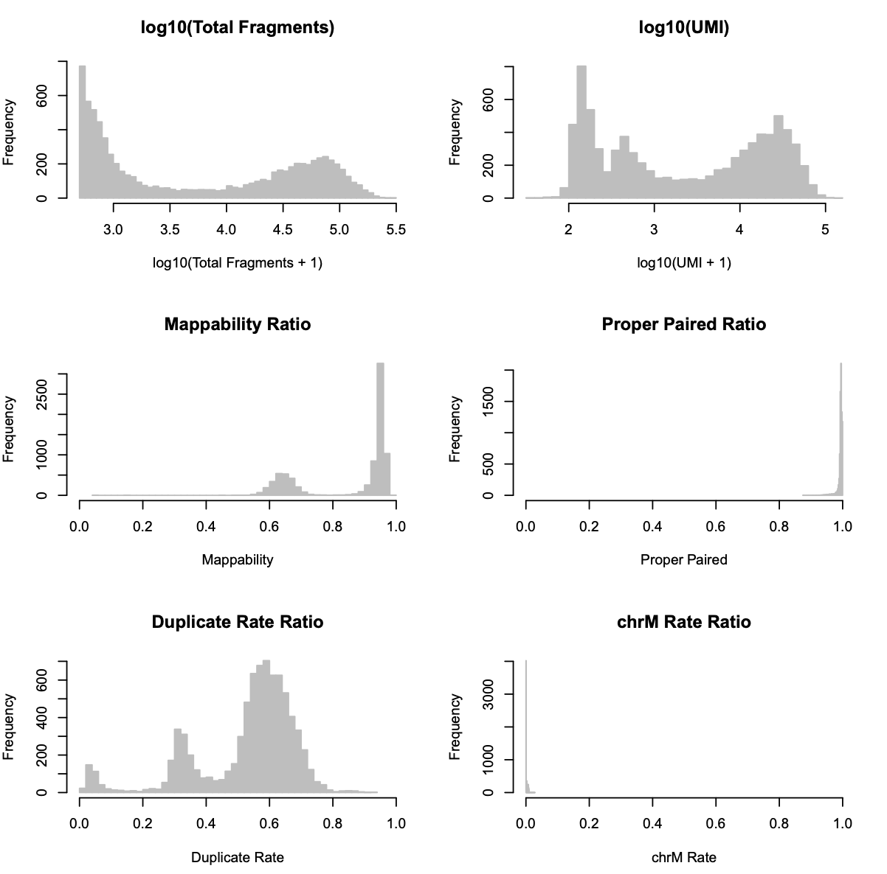

```R
# filter cells only using number of fragments and UMI with the following cutoffs
> x.sp = filterCells(
	obj=x.sp, 
	subset.names=c("fragment.num", "UMI"),
	low.thresholds=c(1000,1000),
	high.thresholds=c(Inf, Inf)
	);
```

**Step 2. Bin size selection (SnapATAC)**        
Using the remaining cells, we next deteremine the optimal bin size based on the correlation between replicates using function (`calBmatCor`). If there are no biological replicates, the cells are evenly split into two pseudo-replicates. We recommend chosing the smallest bin size that yields correlation greater than 0.95. In this example, the `atac_v1_adult_brain_fresh_5k.snap` file only contains 5kb cell-by-bin matrix and its correlation is 0.97. 

```R
# show what bin sizes exist in atac_v1_adult_brain_fresh_5k.snap file
> showBinSizes("atac_v1_adult_brain_fresh_5k.snap");
[1] 1000 5000 10000
> x.sp = addBmatToSnap(x.sp, bin.size=5000, num.cores=1);
> calBmatCor(x.sp);
[1] 0.9786751
```

**Step 3. Fragments-in-promoter ratio**.               
Insteading of using read-in-peak ratios, we next calculate the reads in promoter ratio and use it to further filter cells (recommand [0.2-0.8]). In this case, very few cells are filtered. 

```R
> library(GenomicRanges);
> system("wget http://renlab.sdsc.edu/r3fang/share/Fang_2019/MOs_snATAC/genes/promoter.bed");
> promoter.df = read.table("promoter.bed");
> promoter.gr = GRanges(promoter.df[,1], IRanges(promoter.df[,2], promoter.df[,3]));
> ov = findOverlaps(x.sp@feature, promoter.gr);
> idy = queryHits(ov);
> promoter_ratio = SnapATAC::rowSums(x.sp[,idy, mat="bmat"], mat="bmat") / SnapATAC::rowSums(x.sp, mat="bmat");
> plot(log(SnapATAC::rowSums(x.sp, mat="bmat") + 1,10), promoter_ratio, cex=0.5, col="grey", xlab="log(count)", ylab="FIP Ratio", ylim=c(0,1 ));
> idx = which(promoter_ratio > 0.2 & promoter_ratio < 0.8);
> x.sp = x.sp[idx,];
> x.sp;
number of barcodes: 4359
number of bins: 546206
number of genes: 0
number of peaks: 0
> summarySnap(x.sp);
Total  number of barcodes: 4359
Median number of sequencing fragments: 42173
Median number of uniquely mapped fragments: 17177
Median number of mappability ratio: 0.95
Median number of properly paired ratio: 0.99
Median number of duplicate ratio: 0.55
Median number of chrM ratio: 0
Median number of unique molecules (UMI): 17177
```

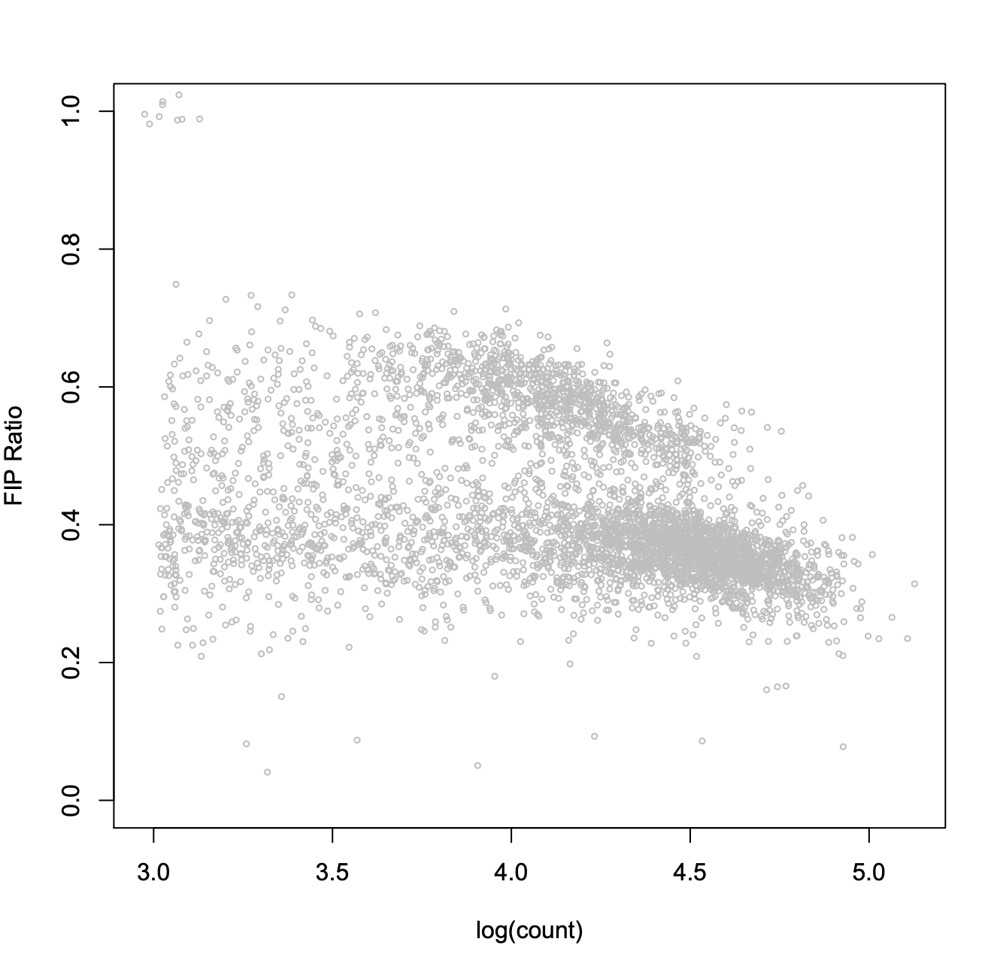

**Step 4. Matrix binarization (SnapATAC)**              
We next convert the cell-by-bin count matrix to a binary matrix. We found some items in the matrix have abnormally high coverage perhaps due to the alignment error. Therefore, we first remove top 0.1% items in the count matrix followed by converting the rest of the values into binary.

```R
> x.sp = makeBinary(x.sp, mat="bmat");
```

**Step 5. Bin filtration (SnapATAC)**           
We next filter out any bins overlapping with the [ENCODE blacklist](http://mitra.stanford.edu/kundaje/akundaje/release/blacklists/) and bins belonging to chrM or random chromsomes to prevent from any potential artifacts. 

```R
> library(GenomicRanges);
> system("wget http://mitra.stanford.edu/kundaje/akundaje/release/blacklists/mm10-mouse/mm10.blacklist.bed.gz")
> black_list = read.table("mm10.blacklist.bed.gz");
> black_list.gr = GRanges(
	black_list[,1], 
	IRanges(black_list[,2], black_list[,3])
	);
> idy1 = queryHits(findOverlaps(x.sp@feature, black_list.gr));
> idy2 = grep("chrM|random", x.sp@feature);
> idy = unique(c(idy1, idy2));
> x.sp = x.sp[,-idy, mat="bmat"];
> x.sp
number of barcodes: 4359
number of bins: 545183
number of genes: 0
number of peaks: 0

> plotBinCoverage(
	x.sp,
	pdf.file.name=NULL,
	col="grey",
	border="grey",
	breaks=10,
	xlim=c(-6,6)
	);
```


Bins of exceedingly high coverage are removed which likely represent the genomic regions that are invariable between cells such as housekeeping gene promoters. We also notice that filtering bins of very low coverage perhaps due to random noise can also improve the robustness of the downstream clustering analysis. In detail, we first calculate the coverage of each bin using the binary matrix and then convert the coverage to log-normal distribution. The log-normal is then converted into `zscore`. In the following example, bins with zscore beyond ±1.5 are filtered. 


```R
> x.sp = filterBins(
	x.sp,
	low.threshold=-1.5,
	high.threshold=1.5,
	mat="bmat"
	);
> x.sp
number of barcodes: 4359
number of bins: 434056
number of genes: 0
number of peaks: 0
```

**Step 6. Jaccard matrix (SnapATAC)**            
We next convert the filtered genome-wide cell-by-bin matrix into a cell-by-cell similarity matrix by estimating the jaccard index between two cells in the basis of profile overlaps. Instead of calculating a full N-by-N jaccard matrix, we calculate a partial jaccard index matrix by randomly choosing `max.var` cells. By doing so, in our manuscript, we demonstrate that it does not sacrifice the performance but significantly improves the scalability of the method.
  
```R
> x.sp = runJaccard(
	obj = x.sp,
	tmp.folder=tempdir(),
	mat = "bmat",
	max.var=2000,
	ncell.chunk=1000,
	do.par=FALSE,
	num.cores=1,
	seed.use=10
	);
``` 

**Step 7. Normalization (SnapATAC)**             
Due to the high dropout rate, we found that the jaccard index is highly affected by the read depth differing between cells. To eliminate such confounding factor, we developed a regression-based method `normOVE` to eliminate such confounding factor.

```R
> x.sp = runNormJaccard(
	obj = x.sp,
	tmp.folder=tempdir(),
	ncell.chunk=1000,
	method="normOVE",
	row.center=TRUE,
	row.scale=TRUE,
	low.threshold=-5,
	high.threshold=5,
	do.par=TRUE,
	num.cores=5,
	seed.use=10
	);
```

**Step 8. Linear Dimentionality Reduction (SnapATAC)**             
Like other single-cell analysis, snATAC-seq contains extensive technical noise due to the high drop-out rate. To overcome this challenge, we applied PCA or SVD to combine information across a correlated feature set hereby creating a mega-feature and exclude the variance potential resulting from technical noise. Here, we performed PCA using `IRLBA` algorithm.

```R
> x.sp = runDimReduct(
	x.sp,
	pc.num=50,
	input.mat="jmat",
	method="svd",
	center=TRUE,
	scale=FALSE,
	seed.use=10
	);
```

**Step 9. Determine statistically significant principal components (SnapATAC)**          
We next Determine how many PCs to include for downstream analysis. We use an ad hoc method for determining which PCs to use by looking at a plot of the standard deviations of the principle components and draw your cutoff where there is a clear elbow in the graph. The other ad hoc way to determine PCs is to plot out every two PCs and select the number of PCs until there is no obvious structure.

```R
> plotDimReductElbow(
    obj=x.sp, 
    point.size=1.5,
    point.shape=19,
    point.color="red",
    point.alpha=1,
    pdf.file.name=NULL,
    pdf.height=7,
    pdf.width=7,
    labs.title="PCA Elbow plot",
    labs.subtitle=NULL
    );
> plotDimReductPW(
    obj=x.sp, 
    pca.dims=1:50,
    point.size=0.3,
    point.color="grey",
    point.shape=19,
    point.alpha=0.6,
    down.sample=5000,
    pdf.file.name=NULL, 
    pdf.height=7, 
    pdf.width=7
    );
```

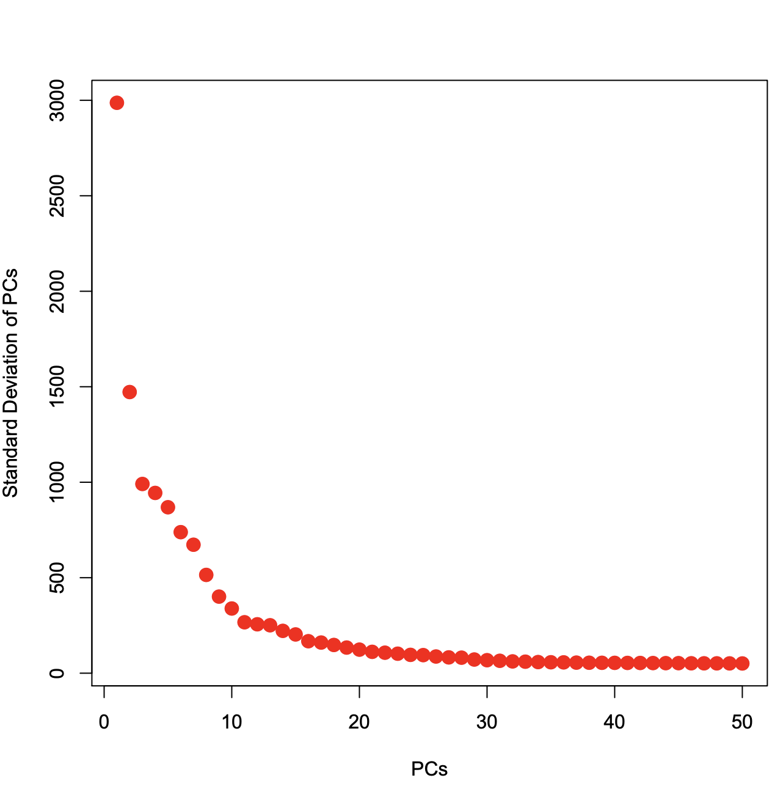  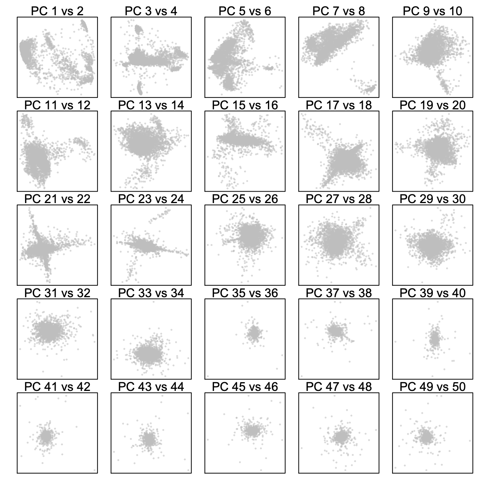 

**Step 10. KNN Graph Construction (SnapATAC)**          
Using selected significant PCs, we next construct a K Nearest Neighbor (KNN) Graph. In the PC space, each cell is a node and the k-nearest neighbors of each cell are identified according to the Euclidian distance and edges are draw between neighbors in the graph. The resulting KNN graph can be further refined to SNN (Shared Nearest Neighbor) graph when `snn=TRUE` by adding edge weight between cells as shared overlap in their local neighborhoods using Jaccard similarity. Edges with weight less than `snn.prune` will be removed in the graph. For large dataset, instead of storing the resulting graph in the memory, one can choose to save the graph in a file by setting `save.knn=TRUE` and specify the `filename`. **This function is inspired and modified from Seurat package.** 

```R
> x.sp = runKNN(
    obj=x.sp,
    pca.dims=1:40,
    weight.by.sd=FALSE,
    k=15,
    nn.eps=0.0,
    snn=TRUE,
    snn.prune=1/15,
    save.knn=FALSE,
    filename=NULL
    );
```

**Step 11. Clustering (SnapATAC)**                  
Using the resulting KNN graph, we next apply community finding algorithm Louvain to identify the clusters which represent groups of cells sharing similar ATAC-seq profiles, potentially originating from the same cell type. Two Louvain methods are included, one is using the `R-igraph` package and the other applies a `pyhon-louvain` implementation. `R-igraph` is faster but does not support different resolution. `pyhon-louvain` is slower and requires ` snaptools` but it does allows for multiple resolutions.

```R
> x.sp = runCluster(
	obj=x.sp,
	tmp.folder=tempdir(),
	louvain.lib="R-igraph",
	path.to.snaptools=NULL,
	seed.use=10
	);
```

**Step 12. Non-linear dimentionality reduction (SnapATAC)**         
SnapATAC visualize the datausing  tSNE, UMAP and FIt-sne. In the following example, data is visulized by tsne implemented by R package (Rtsne). To run `umap`, you need to first install umap package. To run `fast_tsne`, you need to first install [fast_tsne package](https://github.com/KlugerLab/FIt-SNE/blob/master/fast_tsne.R).

```R
> x.sp = runViz(
	obj=x.sp, 
	tmp.folder=tempdir(),
	dims=2,
	pca.dims=1:40, 
	weight.by.sd=FALSE,
	method="Rtsne",
	fast_tsne_path=NULL,
	Y.init=NULL,
	seed.use=10,
	num.cores=5
	);

> x.sp = runViz(
	obj=x.sp, 
	tmp.folder=tempdir(),
	dims=2,
	pca.dims=1:40, 
	weight.by.sd=FALSE,
	method="umap",
	fast_tsne_path=NULL,
	Y.init=NULL,
	seed.use=10,
	num.cores=5
	);
```

**Step 13. Visulization (SnapATAC)**              
SnapATAC provides flexible visualization. 

```R
> plotViz(
	obj=x.sp, 
	method="tsne", 
	point.size=0.5, 
	point.shape=19, 
	point.alpha=0.8, 
	point.color="cluster", 
	text.add=TRUE,
	text.size=1.5,
	text.color="black",
	text.halo.add=TRUE,
	text.halo.color="white",
	text.halo.width=0.2,
	down.sample=10000,
	pdf.file.name=NULL,
	pdf.width=7, 
	pdf.height=7
	);
> plotViz(
	obj=x.sp, 
	method="umap", 
	point.size=0.5, 
	point.shape=19, 
	point.alpha=0.8, 
	point.color="cluster", 
	text.add=FALSE,
	text.size=1.5,
	text.color="black",
	text.halo.add=TRUE,
	text.halo.color="white",
	text.halo.width=0.2,
	down.sample=10000,
	legend.add=TRUE,
	pdf.file.name=NULL,
	pdf.width=7, 
	pdf.height=7
	);
> feature.value = SnapATAC::rowSums(x.sp@bmat);
> feature.value = pmin(feature.value, quantile(feature.value, 0.99));
> feature.value = pmax(feature.value, 0);
> feature.value = (feature.value-min(feature.value))/(max(feature.value)-min(feature.value));
> PlotFeatureSingle(
	obj=x.sp, 
	feature.value=feature.value,
	method="tsne", 
	point.size=0.3, 
	point.shape=19, 
	point.color="red", 
	down.sample=10000, 
	pdf.file.name=NULL, 
	pdf.width=7, 
	pdf.height==7
	);
> PlotFeatureSingle(
	obj=x.sp, 
	feature.value=feature.value,
	method="umap", 
	point.size=0.2, 
	point.shape=19, 
	point.color="red", 
	down.sample=10000, 
	pdf.file.name=NULL, 
	pdf.width=7, 
	pdf.height==7
	);
```

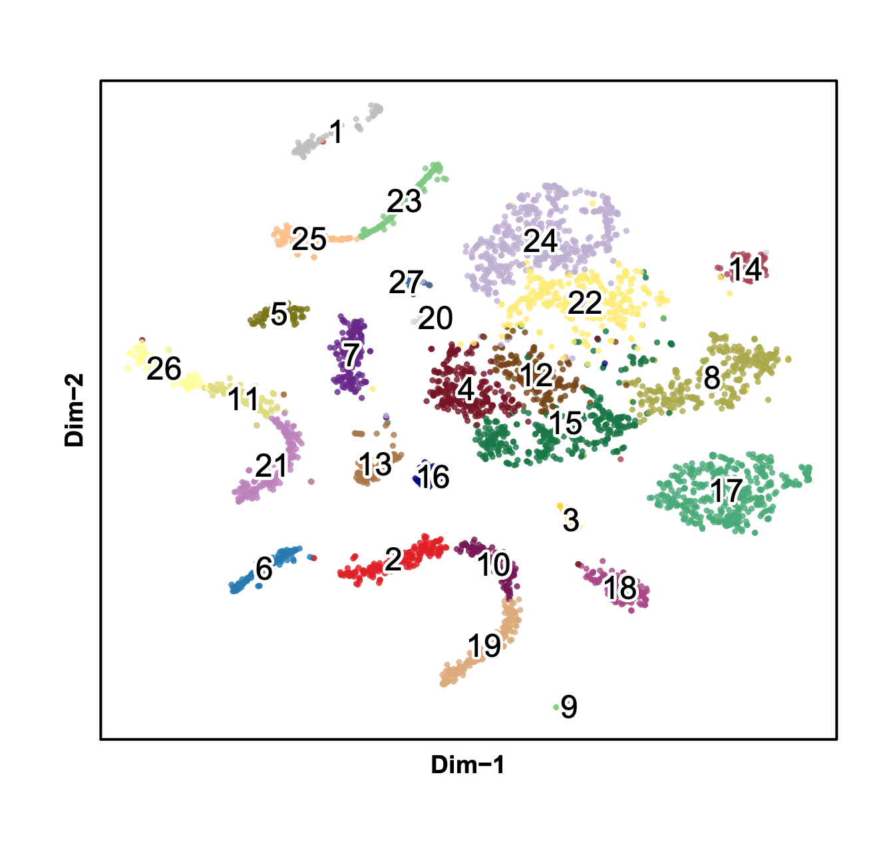  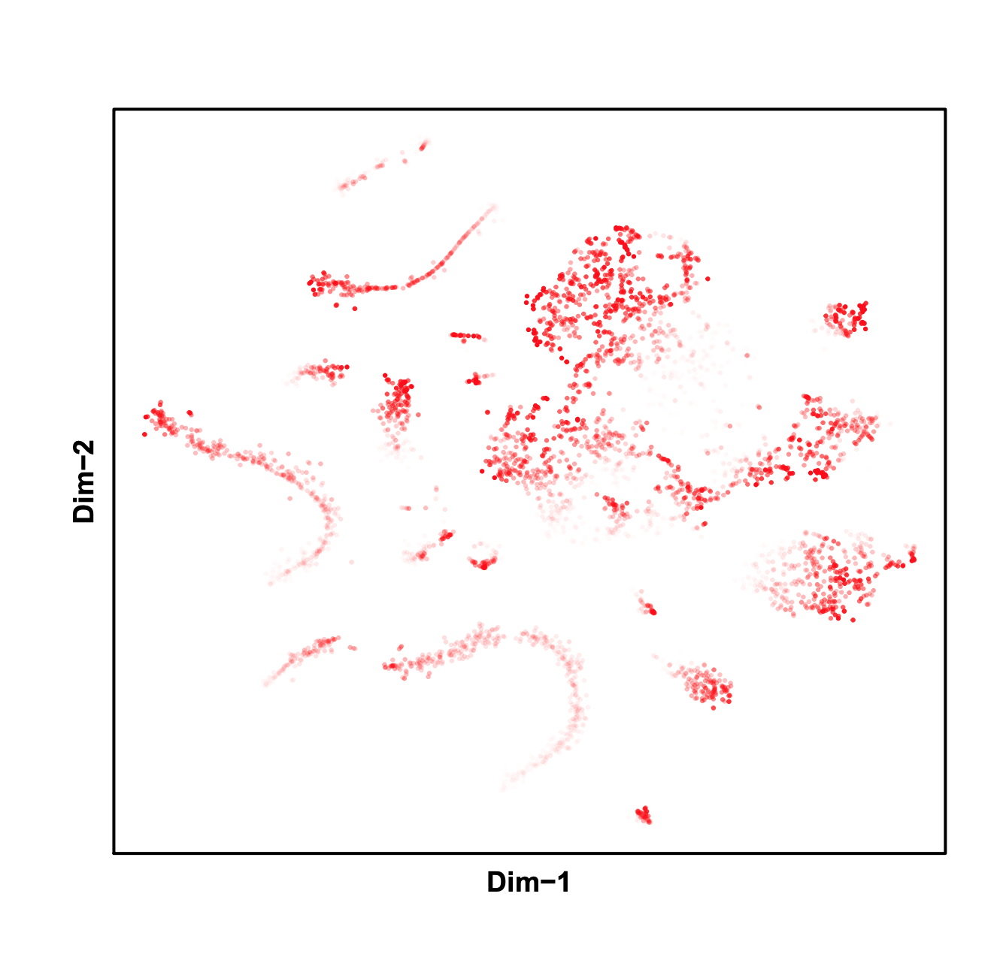 

**Step 14. Gene-body based annotation for expected cell types (SnapATAC)**        
To help annotate identified cell clusters, SnapATAC next creates the cell-by-gene matrix and visualize the enrichment of marker genes.

```R
> system("wget http://renlab.sdsc.edu/r3fang/share/Fang_2019/MOs_snATAC/genes/gencode.vM16.gene.bed");
> genes = read.table("gencode.vM16.gene.bed");
> genes.gr = GRanges(genes[,1], 
	IRanges(genes[,2], genes[,3]), 
	name=genes[,4]
	);
> marker.genes = c(
	"Snap25", "Gad2", "Apoe",
	"C1qb", "Pvalb", "Vip", 
	"Sst", "Lamp5", "Slc17a7", 
	"Mog", "Pdgfra", "Cspg4",
	"Cx3cr1","F3","Aqp4", 
	"Rorb"
	);
> genes.sel.gr <- genes.gr[which(genes.gr$name %in% marker.genes)];
> x.sp = createGmat(
	obj=x.sp, 
	genes= genes.sel.gr,
	ncell.chunk=20,
	do.par=TRUE,
	num.cores=10
	);
# normalize the matrix by cell coverage
> x.sp = scaleCountMatrix(
	obj=x.sp, 
	cov=SnapATAC::rowSums(x.sp, mat="bmat"),
	mat="gmat",
	method = "RPM"
	);
# plot enrichment for marker genes
> plotGene(
	obj=x.sp, 
	gene.names=marker.genes,
	viz.method="tsne",
	point.size=0.3,
	point.color="red",
	point.shape=19,
	background.point=TRUE,
	background.point.color="grey",
	background.point.alpha=0.3,
	background.point.size=0.1,
	background.point.shape=19,
	low.value=0.0,
	high.value=0.95,
	down.sample=5000,
	seed.use=10,
	plot.nrow=4,
	plot.ncol=4,
	pdf.file.name=NULL, 
	pdf.height=7, 
	pdf.width=7
	);
```

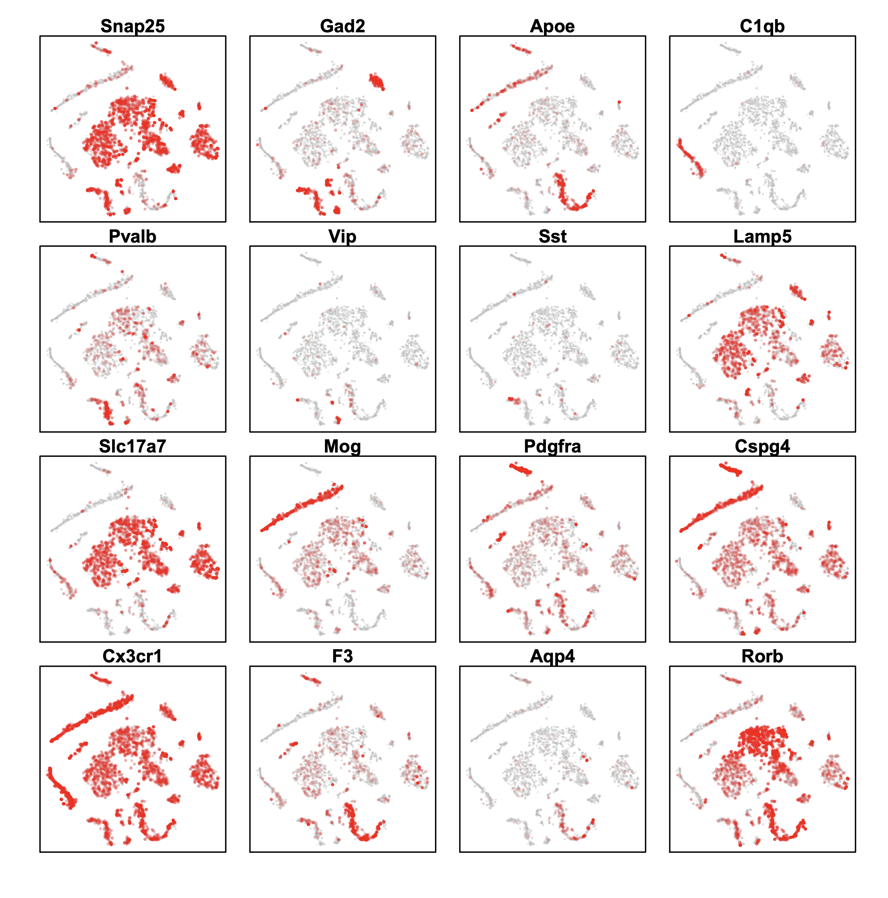

**Step 15. Heretical clustering of the clusters (SnapATAC)**        

```R
# calculate the ensemble signals for each cluster
> ensemble.ls = lapply(split(seq(length(x.sp@cluster)), x.sp@cluster), function(x){
	SnapATAC::colMeans(x.sp[x,], mat="bmat");
	})
# cluster using 1-cor as distance  
> hc = hclust(as.dist(1 - cor(t(do.call(rbind, ensemble.ls)))), method="ward.D2");
> plot(hc, hang=-1, xlab="");
```

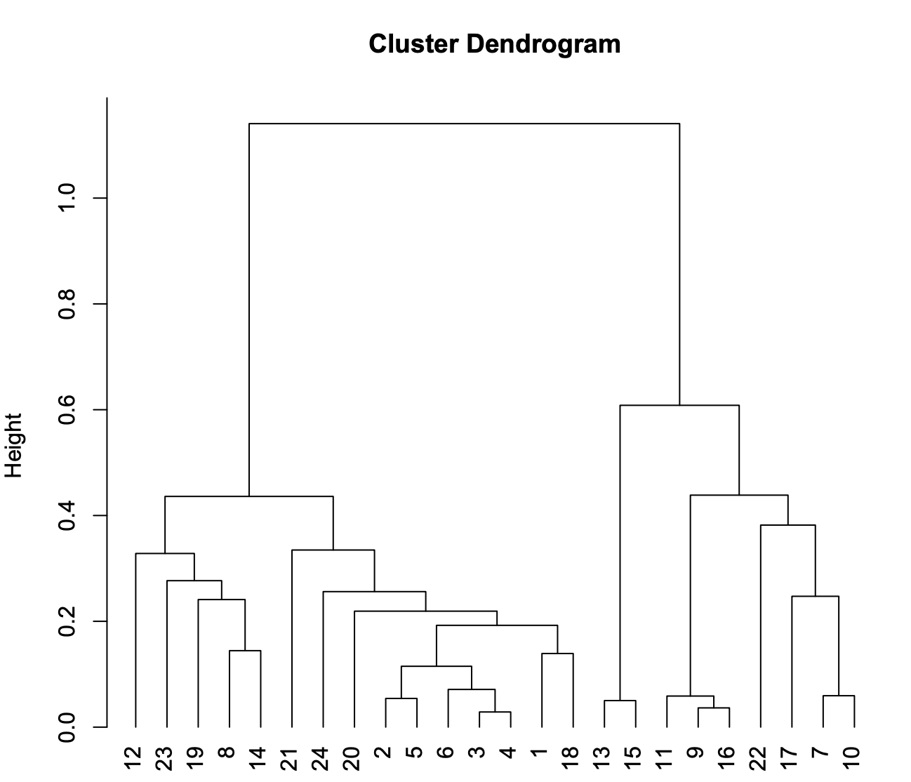

**Step 16. Gene-body based annotation for excitatory neurons**        
We next extracted the clusters belonging to excitatory neurons based on the gene accessibility level for Slc17a7 and plot layer-specific marker genes enrichment.

```R
> idx = which(x.sp@cluster %in% c(3, 9, 27, 14, 8, 17, 22, 24, 15, 4, 12));
> length(idx) # 2449 56% of total population
> marker.genes = c(
	"Cux2", "Rorb", "Deptor", 
	"Vat1l", "Sulf1", "Tle4", 
	"Foxp2", "Tshz2", "Grik3"
	);
> x.exc.sp = x.sp[idx,];
> genes.sel.gr <- genes.gr[which(genes.gr$name %in% marker.genes)];
> x.exc.sp = createGmat(
	obj=x.exc.sp, 
	genes=genes.sel.gr,
	ncell.chunk=20,
	do.par=TRUE,
	num.cores=10
	);
# normalize the matrix by cell coverage
> x.exc.sp = scaleCountMatrix(
	obj=x.exc.sp, 
	cov=SnapATAC::rowSums(x.exc.sp, mat="bmat"),
	mat="gmat",
	method = "RPM"
	);
> plotGene(
	obj=x.exc.sp, 
	gene.names=marker.genes,
	viz.method="tsne",
	point.size=0.2,
	point.color="red",
	point.shape=19,
	background.point=TRUE,
	background.point.color="grey",
	background.point.alpha=0.3,
	background.point.size=0.1,
	background.point.shape=19,
	low.value=0.0,
	high.value=1.0,
	down.sample=5000,
	seed.use=10,
	plot.nrow=3,
	plot.ncol=3,
	pdf.file.name=NULL, 
	pdf.height=7, 
	pdf.width=7
	);
```

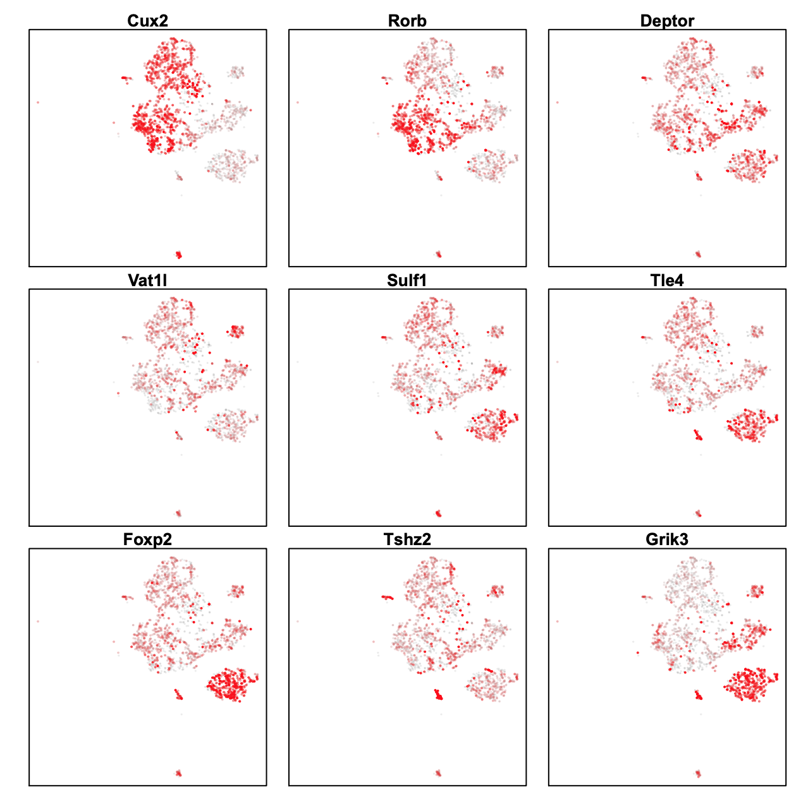

**Step 17. Change the cluster label to cell type**  

```R
> library(plyr);
> current.cluster.ids <- 1:27;
> new.cluster.ids  <- c(
	"Other", "Ogc.a", "Exc.a", "Exc.b", "Gaba.a",
	"Opc", "Gaba.b", "Exc.c", "Exc.d", "Ogc.b",
	"Asc.b", "Exc.e", "Gaba.c", "Exc.f", "Exc.g",
	"Gaba.d", "Exc.h", "Gaba.e", "Ogc.c", "Gaba.f",
	"Asc.c", "Exc.i", "Mgc.a", "Exc.j", "Mgc.b",
	"Asc.a", "Exc.k"
	);
> x.sp@cluster <- plyr::mapvalues(
	x = x.sp@cluster, 
	from = current.cluster.ids, 
	to = new.cluster.ids
	);
> plotViz(
	obj=x.sp, 
	method="tsne", 
	point.size=0.5, 
	point.shape=19, 
	point.alpha=0.8, 
	point.color="cluster",
	text.add=TRUE,
	text.size=1.2,
	text.color="black",
	text.halo.add=TRUE,
	text.halo.color="white",
	text.halo.width=0.2,
	down.sample=10000,
	pdf.file.name=NULL,
	pdf.width=7, 
	pdf.height=7
	);  
```


**Step 18. Identify cis-elements for each cluster seperately**        
This will also create `nrrowPeak` and `.bedGraph` file that contains the peak and track for the given cluster. In the below example, SnapATAC creates `atac_v1_adult_brain_fresh_5k.sst_peaks.narrowPeak` and `atac_v1_adult_brain_fresh_5k_treat_pileup.bdg`. `atac_v1_adult_brain_fresh_5k_treat_pileup.bdg` can later be converted to `bigWig` file for visulization using (`bedGraphToBigWig`)(https://anaconda.org/bioconda/ucsc-bedgraphtobigwig).

```R
> system("which snaptools")
/home/r3fang/anaconda2/bin/snaptools
> system("which macs2")
/home/r3fang/anaconda2/bin/macs2
> peaks_sst.df = runMACS(
	obj=x.sp[which(x.sp@cluster=="Gaba.a"),], 
	output.prefix="atac_v1_adult_brain_fresh_5k.Sst",
	path.to.snaptools="/home/r3fang/anaconda2/bin/snaptools",
	path.to.macs="/home/r3fang/anaconda2/bin/macs2",
	gsize="mm", 
	buffer.size=500, 
	num.cores=5,
	macs.options="--nomodel --shift 37 --ext 73 --qval 1e-2 -B --SPMR --call-summits",
	tmp.folder=tempdir()
	);
> nrow(peaks_sst.df);
[1] 20488
```

Identify peaks for clusters with cells more than 100 cells.

```R
> peaks.gr = runMACSForAll(
    obj=x.sp,
    path.to.snaptools="/home/r3fang/anaconda2/bin/snaptools",
    path.to.macs="/home/r3fang/anaconda2/bin/macs2",
	output.prefix="atac_v1_adult_brain_fresh_5k",
    num.cores=16,
    min.cells=100,
    gsize="mm", 
    buffer.size=500, 
    macs.options="--nomodel --shift 37 --ext 73 --qval 1e-2 -B --SPMR --call-summits",
	tmp.folder=tempdir()
    ); 
```

After converting the `bedGraph` file to `bigWig` file, we next visulize the cell-type specific chromatin landscapes using IGV browser.


**Step 19. Create a cell-by-peak matrix**     
Using merged peaks as a reference, we next create a cell-by-peak matrix using the original snap file.

```R
> x.sp = createPmat(
	x.sp, 
	peaks=peaks.gr,
	ncell.chunk=20,
	do.par=TRUE,
	num.cores=10
	);
```

**Step 20. Identify Differentially Accessible Regions (DARs)**       
SnapATAC can help find differentially accessible regions (DARs) that define clusters via differential analysis. By default, it identifes positive peaks of a single cluster (specified in `cluster.pos`), compared to a group of negative control cells.

```R
> DAR_sst = findDAR(
	obj=x.sp,
	mat="pmat",
	cluster.pos="Gaba.a",
	cluster.neg="Gaba.b",
	bcv=0.1,
	fdr=5e-2,
	pvalue=1e-2,
	test.method="exactTest",
	seed.use=10
	);
> DAR_mgc = findDAR(
	obj=x.sp,
	mat="pmat",
	cluster.pos=c("Mgc.a", "Mgc.b"),
	cluster.neg=NULL,
	bcv=0.1,
	fdr=5e-2,
	pvalue=1e-2,
	test.method="exactTest",
	seed.use=10
	);
> idy_sst = which(DAR_sst$label == 1);
> idy_mgc = which(DAR_mgc$label == 1);
> y_sst = SnapATAC::rowSums(x.sp[,idy_sst,mat="pmat"], mat="pmat") / SnapATAC::rowSums(x.sp, mat="pmat") * 1000000;
> y_mgc = SnapATAC::rowSums(x.sp[,idy_mgc,mat="pmat"], mat="pmat") / SnapATAC::rowSums(x.sp, mat="pmat") * 1000000;
# normalize to zscore
> y_sst = (y_sst - mean(y_sst)) / sd(y_sst);
> y_mgc = (y_mgc - mean(y_mgc)) / sd(y_mgc);
> boxPlotFeature(
	obj = x.sp,
	feature = y_sst,
	outline = FALSE,
	ylab = "zscore of RPM",
	main = "Sst DARs Enrichment",
	add.point = TRUE,
	point.size = 0.2,
	point.shape = 19,
	point.alpha = 0.5,
	pdf.file.name=NULL,
	pdf.height=7,
	pdf.width=7
	);
> boxPlotFeature(
	obj = x.sp,
	feature = y_mgc,
	outline = FALSE,
	ylab = "zscore of RPM",
	main = "Mgc DARs Enrichment",
	add.point = TRUE,
	point.size = 0.2,
	point.shape = 19,
	point.alpha = 0.5,
	pdf.file.name=NULL,
	pdf.height=7,
	pdf.width=7
	);
> idy.ls = mclapply(as.list(levels(x.sp@cluster)), function(cluster){
	DAR = findDAR(
		obj=x.sp,
		mat="pmat",
		cluster.pos=cluster,
		cluster.neg=NULL,
		bcv=0.1,
		fdr=5e-2,
		pvalue=1e-2,
		test.method="exactTest",
		seed.use=10
		);	
	idy = which(DAR$label == 1);
	}, mc.cores=10)
> idy = unique(do.call(c, idy.ls));
```

 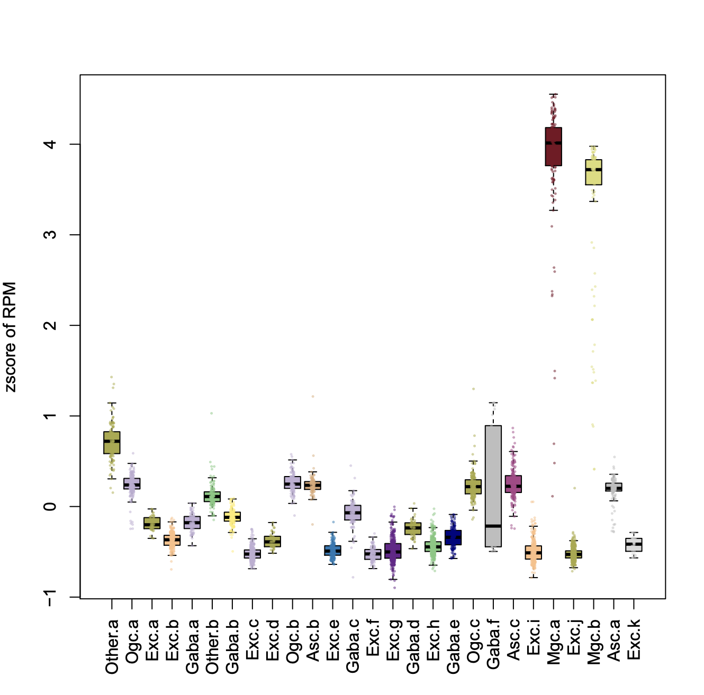 

**Step 21. Motif analysis identifies master regulators**       
SnapATAC can help identify master regulators that are enriched in the differentially accessible regions (DARs). 

```R
> system("which findMotifsGenome.pl");
/projects/ps-renlab/r3fang/public_html/softwares/homer/bin/findMotifsGenome.pl
> motifs = runHomer(
	x.sp[,idy_sst,"pmat"], 
	mat = "pmat",
	path.to.homer = "/projects/ps-renlab/r3fang/public_html/softwares/homer/bin/findMotifsGenome.pl",
	result.dir = "./homer/Sst",
	num.cores=5,
	genome = 'mm10',
	motif.length = 10,
	scan.size = 300,
	optimize.count = 2,
	background = 'automatic',
	local.background = FALSE,
	only.known = FALSE,
	only.denovo = FALSE,
	fdr.num = 5,
	cache = 100,
	overwrite = TRUE,
	keep.minimal = FALSE
	);
> head(motifs)
                                                   Motif.Name   Log.P.value
       Ascl1(bHLH)/NeuralTubes-Ascl1-ChIP-Seq(GSE55840)/Homer	-128.6	
         Brn1(POU,Homeobox)/NPC-Brn1-ChIP-Seq(GSE35496)/Homer	-121.4	
Tcf21(bHLH)/ArterySmoothMuscle-Tcf21-ChIP-Seq(GSE61369)/Homer	-116.7	
        Atoh1(bHLH)/Cerebellum-Atoh1-ChIP-Seq(GSE22111)/Homer	-112.5	
       Oct6(POU,Homeobox)/NPC-Pou3f1-ChIP-Seq(GSE35496)/Homer	-103.8	
           Tcf12(bHLH)/GM12878-Tcf12-ChIP-Seq(GSE32465)/Homer	-102.2	
 
```

**Step 22. Subclustering of Pvalb**       

```R
> idx = which(x.sp@cluster == "Gaba.b");
> x.pv.xp = x.sp[idx,];
> x.pv.xp = runJaccard(
	obj = x.pv.xp,
	tmp.folder=tempdir(),
	mat = "bmat",
	max.var=2000,
	ncell.chunk=1000,
	do.par=FALSE,
	num.cores=1,
	seed.use=10
	);
> x.pv.xp = runNormJaccard(
	obj = x.pv.xp,
	tmp.folder=tempdir(),
	ncell.chunk=1000,
	method="normOVE",
	row.center=TRUE,
	row.scale=TRUE,
	low.threshold=-5,
	high.threshold=5,
	do.par=TRUE,
	num.cores=5,
	seed.use=10
	);
> x.pv.xp = runDimReduct(
	x.pv.xp,
	pc.num=50,
	input.mat="jmat",
	method="svd",
	center=TRUE,
	scale=FALSE,
	seed.use=10
	);
> x.pv.xp = runKNN(
    obj=x.pv.xp,
    pca.dims=1:10,
    weight.by.sd=TRUE,
    k=15,
    nn.eps=0.0,
    snn=TRUE,
    snn.prune=1/15,
    save.knn=FALSE,
    filename=NULL
    );
> x.pv.xp = runCluster(
	obj=x.pv.xp,
	tmp.folder=tempdir(),
	louvain.lib="R-igraph",
	path.to.snaptools=NULL,
	seed.use=10
	);
> x.pv.xp = runViz(
	obj=x.pv.xp, 
	tmp.folder=tempdir(),
	dims=2,
	pca.dims=1:10, 
	weight.by.sd=TRUE,
	method="umap",
	fast_tsne_path=NULL,
	Y.init=NULL,
	seed.use=10,
	num.cores=5
	);
> plotViz(
	obj=x.pv.xp, 
	method="umap", 
	point.size=1, 
	point.shape=19, 
	point.alpha=0.8, 
	point.color="cluster", 
	text.add=FALSE,
	text.size=1.5,
	text.color="black",
	text.halo.add=TRUE,
	text.halo.color="white",
	text.halo.width=0.2,
	down.sample=10000,
	legend.add=TRUE,
	pdf.file.name=NULL,
	pdf.width=7, 
	pdf.height=7
	);
> feature.value = SnapATAC::rowSums(x.pv.xp@bmat);
> feature.value = pmin(feature.value, quantile(feature.value, 0.99));
> feature.value = pmax(feature.value, 0);
> feature.value = (feature.value-min(feature.value))/(max(feature.value)-min(feature.value));
> PlotFeatureSingle(
	obj=x.pv.xp, 
	feature.value=feature.value,
	method="umap", 
	point.size=1, 
	point.shape=19, 
	point.color="red", 
	down.sample=10000, 
	pdf.file.name=NULL, 
	pdf.width=7, 
	pdf.height==7
	);
```

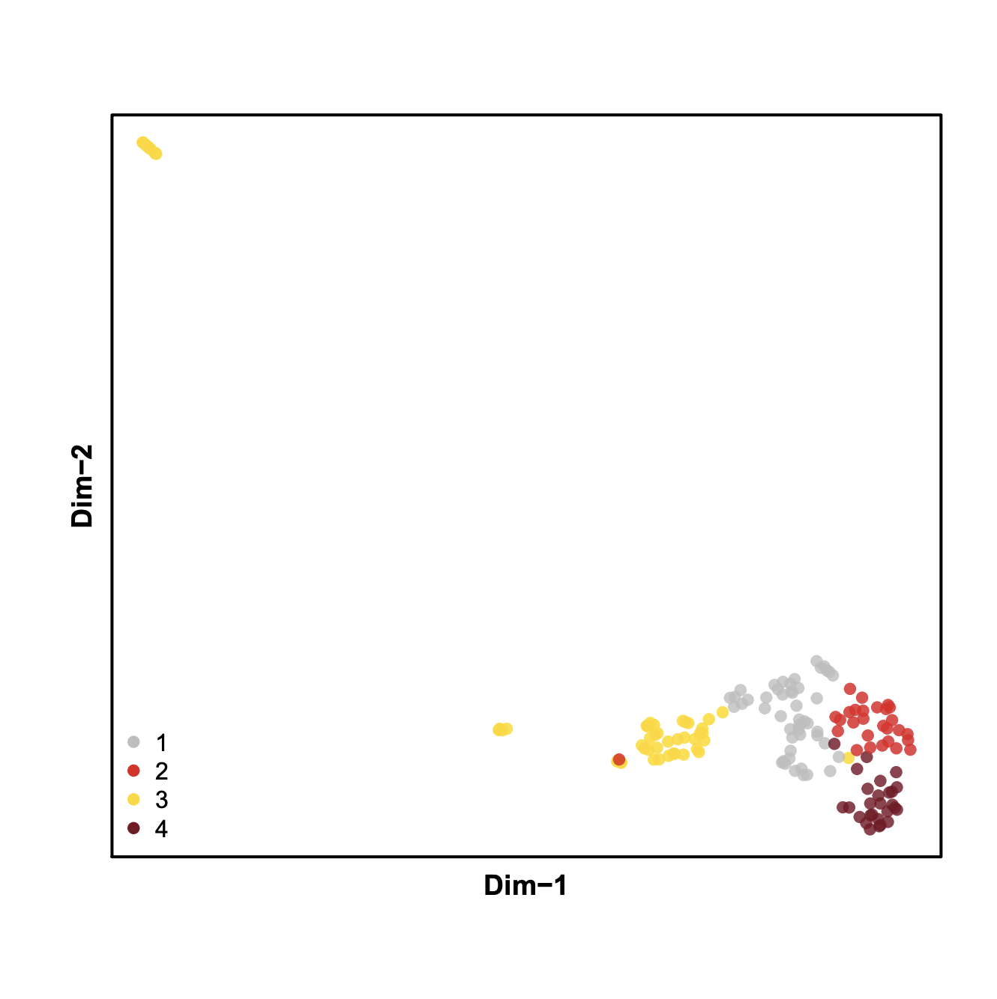  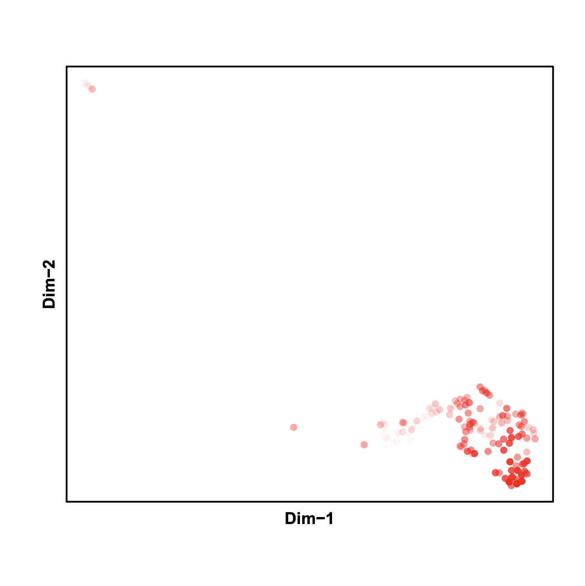 


