## Integrative Analysis of PBMC scATAC-seq and scRNA-seq

In this example, we will be analyzing two scATAC-seq datasets (5K PBMC and 1OK PBMC) and one scRNA-seq dataset from PBMC. All three datasets are freely available from 10X genomics. 

In detail, we will be performing the following analysis:

1.	Cell selection for PBMC 5k and 10k scATAC;
2. Sample 10,000 cells as landmarks;
3. Unsupervised clustering of landmarks;
4. Projecting the remaining (query) cells onto the landmarks;
5. Supervised annotation of landmarks based on PBMC scRNA dataset;
6. Downstream analysis including peak calling, differential analysis, prediction of gene-enhancer pairing. 

**Step 0. Download the data**.      
We will start from `fragments.tsv.gz` and quality control file `singlecell.csv` created by cell-ranger ATAC pipeline.

```bash
$ wget http://cf.10xgenomics.com/samples/cell-atac/1.1.0/atac_pbmc_10k_nextgem/atac_pbmc_10k_nextgem_fragments.tsv.gz
$ wget http://cf.10xgenomics.com/samples/cell-atac/1.1.0/atac_pbmc_10k_nextgem/atac_pbmc_10k_nextgem_singlecell.csv
$ wget http://cf.10xgenomics.com/samples/cell-atac/1.1.0/atac_pbmc_5k_nextgem/atac_pbmc_5k_nextgem_fragments.tsv.gz
$ wget http://cf.10xgenomics.com/samples/cell-atac/1.1.0/atac_pbmc_5k_nextgem/atac_pbmc_5k_nextgem_singlecell.csv
```

**Step 1. Create snap file**.         
Create snap file for PBMC 5k. See how to install [snaptools](https://github.com/r3fang/SnapTools). You can skip step 1-2 by downloading the snap file from [here]().

```bash
$ wget http://hgdownload.cse.ucsc.edu/goldenPath/hg19/bigZips/hg19.chrom.sizes > hg19.chrom.sizes
$ gunzip atac_pbmc_5k_nextgem_fragments.tsv.gz
$ sort -k4,4 atac_pbmc_5k_nextgem_fragments.tsv | gzip - > atac_pbmc_5k_nextgem_fragments.srt.bed.gz
$ snaptools snap-pre  \
	--input-file=atac_pbmc_5k_nextgem_fragments.srt.bed.gz  \
	--output-snap=atac_pbmc_5k_nextgem.snap  \
	--genome-name=hg19  \
	--genome-size=hg19.chrom.sizes  \
	--min-mapq=30  \
	--min-flen=50  \
	--max-flen=1000  \
	--keep-chrm=TRUE  \
	--keep-single=FALSE  \
	--keep-secondary=FALSE  \
	--overwrite=True  \
	--max-num=20000  \
	--min-cov=100  \
	--verbose=True
$ cat atac_pbmc_5k_nextgem.snap.qc
Total number of unique barcodes:             20000
TN - Total number of fragments:              84979512
UM - Total number of uniquely mapped:        84979512
SE - Total number of single ends:            0
SA - Total number of secondary alignments:   0
PE - Total number of paired ends:            84979512
PP - Total number of proper paired:          84979512
PL - Total number of proper frag len:        72373850
US - Total number of usable fragments:       72373850
UQ - Total number of unique fragments:       72373850
CM - Total number of chrM fragments:         0
```

Create snap file for PBMC 10k    

```bash
$ gunzip atac_pbmc_10k_nextgem_fragments.tsv.gz
$ sort -k4,4 atac_pbmc_10k_nextgem_fragments.tsv | gzip - > atac_pbmc_10k_nextgem_fragments.srt.bed.gz
$ snaptools snap-pre  \
	--input-file=atac_pbmc_10k_nextgem_fragments.srt.bed.gz  \
	--output-snap=atac_pbmc_10k_nextgem.snap  \
	--genome-name=hg19  \
	--genome-size=hg19.chrom.sizes  \
	--min-mapq=30  \
	--min-flen=50  \
	--max-flen=1000  \
	--keep-chrm=TRUE  \
	--keep-single=FALSE  \
	--keep-secondary=FALSE  \
	--overwrite=True  \
	--max-num=20000  \
	--min-cov=100  \
	--verbose=True
$ cat atac_pbmc_10k_nextgem.snap.qc
Total number of unique barcodes:             20000
TN - Total number of fragments:              162400545
UM - Total number of uniquely mapped:        162400545
SE - Total number of single ends:            0
SA - Total number of secondary alignments:   0
PE - Total number of paired ends:            162400545
PP - Total number of proper paired:          162400545
PL - Total number of proper frag len:        138606824
US - Total number of usable fragments:       138606824
UQ - Total number of unique fragments:       138606824
CM - Total number of chrM fragments:         0
```

**Step 2. Create cell-by-bin matrix**        
After preprocessing, we next created the cell-by-bin matrix of 1kb and 5kb resolution for each sample seperately.  

```bash
$ snaptools snap-add-bmat	\
	--snap-file=atac_pbmc_10k_nextgem.snap \
	--bin-size-lis 5000	\
	--verbose=True
$ snaptools snap-add-bmat	\
	--snap-file=atac_pbmc_5k_nextgem.snap \
	--bin-size-lis 5000	\
	--verbose=True
```

**Step 3. Barcode selection**        
Next, we select the high-quality barcodes based on two major criteria: 1) number of unique fragments; 2) fragments in promoter ratio; 

```R
> library(SnapATAC);
> library(Seurat);
> library(GenomicRanges);
> snap.files = c(
	"atac_pbmc_5k_nextgem.snap", 
	"atac_pbmc_10k_nextgem.snap"
	);
> sample.names = c(
	"PBMC 5K",
	"PBMC 10K"
	);
> barcode.files = c(
	"atac_pbmc_5k_nextgem_singlecell.csv",
	"atac_pbmc_10k_nextgem_singlecell.csv"
	);
> x.sp.ls = lapply(seq(snap.files), function(i){
		createSnap(
			file=snap.files[i],
			sample=sample.names[i]
		);
	})
> barcode.ls = lapply(seq(snap.files), function(i){
		barcodes = read.csv(
			barcode.files[i], 
			head=TRUE
		);
		# remove NO BAROCDE line
		barcodes = barcodes[2:nrow(barcodes),];
		barcodes$logUMI = log10(barcodes$passed_filters + 1);
		barcodes$promoter_ratio = (barcodes$promoter_region_fragments+1) / (barcodes$passed_filters + 1);
		barcodes
	})
> plots = lapply(seq(snap.files), function(i){
	p1 = ggplot(
		barcode.ls[[i]], 
		aes(x=logUMI, y=promoter_ratio)) + 
		geom_point(size=0.3, col="grey") +
		theme_classic()	+
		ggtitle(sample.names[[i]]) +
		ylim(0, 1) + xlim(0, 6) +
		labs(x = "log10(UMI)", y="promoter ratio")
	p1
	})
> plots
```
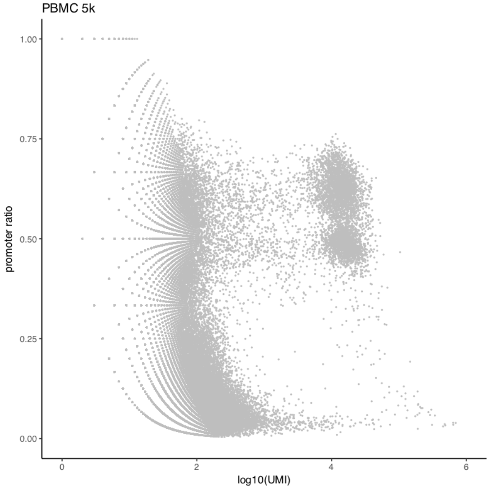  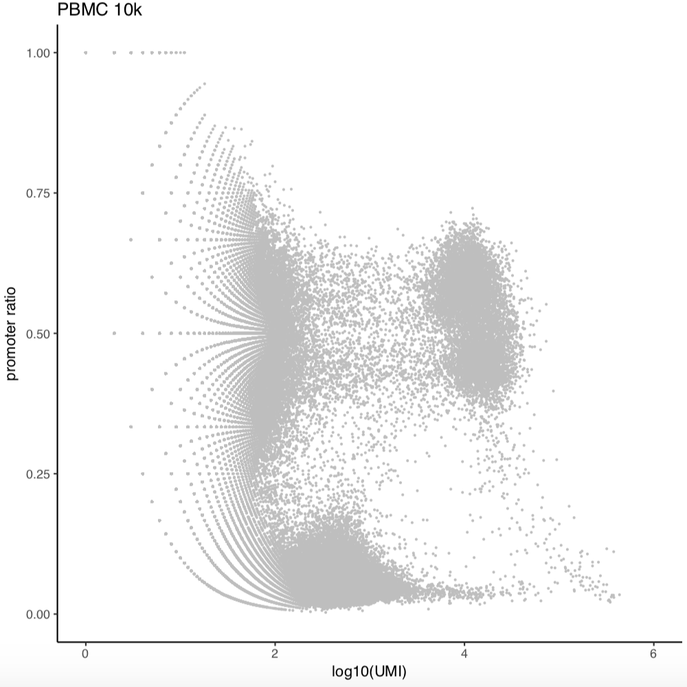  

```R
# for both datasets, we identify usable barcodes using [3.5-5] for log10(UMI) and [0.4-0.8] for promoter ratio as cutoff.
> cutoff.logUMI.low = c(3.5, 3.5);
> cutoff.logUMI.high = c(5, 5);
> cutoff.FRIP.low = c(0.4, 0.4);
> cutoff.FRIP.high = c(0.8, 0.8);
> barcode.ls = lapply(seq(snap.files), function(i){
	barcodes = barcode.ls[[i]];
	idx = which(barcodes$logUMI >= cutoff.logUMI.low[i] & barcodes$logUMI <= cutoff.logUMI.high[i] & barcodes$promoter_ratio >= cutoff.FRIP.low[i] & barcodes$promoter_ratio <= cutoff.FRIP.high[i]);
	barcodes[idx,]
	});
> x.sp.ls = lapply(seq(snap.files), function(i){
	barcodes = barcode.ls[[i]];
	x.sp = x.sp.ls[[i]];
	barcode.shared = intersect(x.sp@barcode, barcodes$barcode);
	x.sp = x.sp[match(barcode.shared, x.sp@barcode),];
	barcodes = barcodes[match(barcode.shared, barcodes$barcode),];
	x.sp@metaData = barcodes;
	x.sp
	})
# combine two snap object
> x.sp = Reduce(snapRbind, x.sp.ls);
> x.sp@metaData["sample"] = x.sp@sample;
> x.sp
number of barcodes: 13565
number of bins: 0
number of genes: 0
number of peaks: 0
> table(x.sp@metaData["sample"]);
PBMC 10K  PBMC 5K
    9039     4526
```

**Step 4. Sampling Landmarks**        
SnapATAC applies diffusion maps algorithm, a nonlinear dimensionality reduction technique that discovers low dimensional manifolds by performing random walk on the data and is highly robust to noise and perturbation.  

The computational cost of the diffusion maps algorithm scales exponentially with the increase of number of cells. To overcome this limitation, here we combine the Nyström method (a sampling technique) and diffusion maps to present Nyström Landmark diffusion map to generate the low-dimentional embedding for large-scale dataset.

A Nyström landmark diffusion maps algorithm includes three major steps: 

1. ***_sampling_***: sample a subset of K (K≪N) cells from N total cells as “landmarks”. Instead of random sampling, here we adopted a density-based sampling approach developed in SCTransform to preserve the density distribution of the N original points;
2. ***_embedding_***: compute a diffusion map embedding for K landmarks;
3. ***_extension_***: project the remaining N-K cells onto the low-dimensional embedding as learned from the landmarks to create a joint embedding space for all cells. 

In this example, we will sample 10,000 cells as landmarks and project the remaining cells to the diffusion maps coordinates.

```R
> row.covs.dens <- density(x = x.sp@metaData[,"logUMI"], bw = 'nrd', adjust = 1);
> sampling_prob <- 1 / (approx(x = row.covs.dens$x, y = row.covs.dens$y, xout = x.sp@metaData[,"logUMI"])$y + .Machine$double.eps);
> set.seed(1);
> idx.landmark.ds <- sort(sample(x = seq(nrow(x.sp)), size = 10000, prob = sampling_prob));
> x.landmark.sp = x.sp[idx.landmark.ds,];
> x.query.sp = x.sp[-idx.landmark.ds,];
```

**Step 5. Add cell-by-bin matrix to existing snap object**        
Next, we add the cell-by-bin matrix of 5kb resolution to the snap object. This function will automatically read the cell-by-bin matrix from two snap files and 

```R
> x.landmark.sp = addBmatToSnap(x.landmark.sp, bin.size=5000);
```

**Step 6. Matrix binarization**       
We will convert the cell-by-bin count matrix to a binary matrix. We found that some items in the matrix have abnormally high coverage (>200) perhaps due to the alignment errors. Therefore, we next remove top 0.1% items in the count matrix and then convert the remaining non-zero values to 1.

```R
> x.landmark.sp = makeBinary(x.landmark.sp, mat="bmat");
```

**Step 7. Bin filtration**           
First, we filter out any bins overlapping with the [ENCODE blacklist](http://mitra.stanford.edu/kundaje/akundaje/release/blacklists/) to prevent from potential artifacts. 

```R
> black_list = read.table("hg19.blacklist.bed.gz");
> black_list.gr = GRanges(
	black_list[,1], 
	IRanges(black_list[,2], black_list[,3])
	);
> idy = queryHits(findOverlaps(x.landmark.sp@feature, black_list.gr));
> if(length(idy) > 0){x.landmark.sp = x.landmark.sp[,-idy, mat="bmat"];}
> x.landmark.sp
number of barcodes: 10000
number of bins: 627478
number of genes: 0
number of peaks: 0
```

Second, we remove unwanted chromosomes.

```R
> chr.exclude = seqlevels(x.landmark.sp@feature)[grep("random|chrM", seqlevels(x.landmark.sp@feature))];
> idy = grep(paste(chr.exclude, collapse="|"), x.landmark.sp@feature);
> if(length(idy) > 0){x.landmark.sp = x.landmark.sp[,-idy, mat="bmat"]}
> x.landmark.sp
number of barcodes: 10000
number of bins: 624297
number of genes: 0
number of peaks: 0
```

Third, the coverage of bins roughly obeys a log normal distribution. We remove the top 5% bins that likely overlap invariant features such as the house keeping gene promoters.

```R
> bin.cov = log10(Matrix::colSums(x.landmark.sp@bmat)+1);
> hist(bin.cov[bin.cov > 0], xlab="log10(bin cov)", main="log10(Bin Cov)", col="lightblue", xlim=c(0, 5));
> bin.cutoff = quantile(bin.cov[bin.cov > 0], 0.95);
> idy = which(bin.cov <= bin.cutoff & bin.cov > 0);
> x.landmark.sp = x.landmark.sp[, idy, mat="bmat"];
> x.landmark.sp
number of barcodes: 10000
number of bins: 534438
number of genes: 0
number of peaks: 0
```

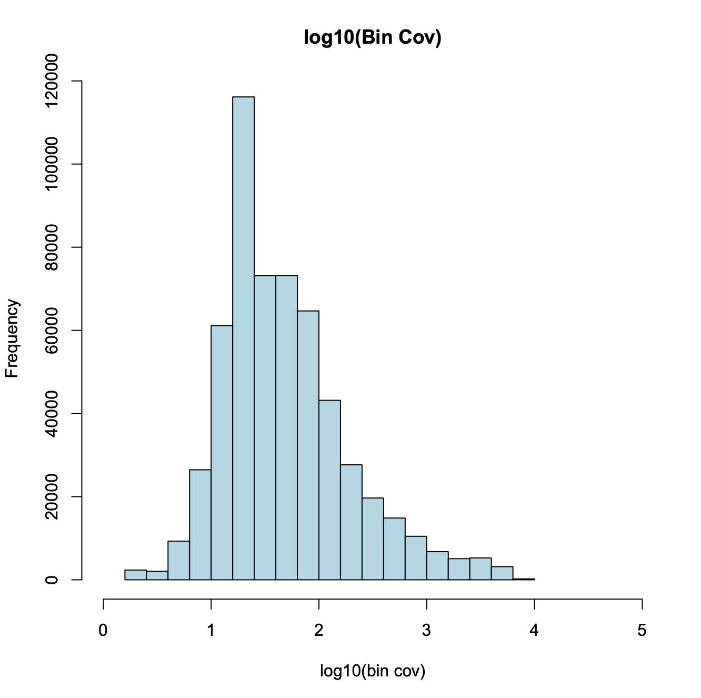 

Next, we will further remove any cells of bin coverage less than 1,000. The rational behind this is that some cells may have high number of unique fragments but end up with low bin coverage. This step is optional but highly recommanded because we found this step can prevent outliers.

```
> x.landmark.sp = x.landmark.sp[which(Matrix::rowSums(x.landmark.sp@bmat) > 1000),];
> x.landmark.sp
number of barcodes: 9868
number of bins: 534438
number of genes: 0
number of peaks: 0
```

**Step 8. Dimentionality reduction using diffusion maps algorithm**             
We compute diffusion maps embedding for landmark cells.

```R
> x.landmark.sp = runDiffusionMaps(
	obj= x.landmark.sp,
	input.mat="bmat", 
	num.eigs=50
	);
> x.landmark.sp@metaData$landmark = 1;
```

**Step 9. Predicting the query cells to landmarks**          
Next, we project the query cells to the diffusion maps embedding computed for the landmarks.

```
> x.query.sp = addBmatToSnap(x.query.sp);
> x.query.sp = makeBinary(x.query.sp);
> ov = findOverlaps(
	x.query.sp@feature,
	x.landmark.sp@feature
  );
> x.query.sp = x.query.sp[,queryHits(ov), mat="bmat"];
> x.query.sp = runDiffusionMapsExtension(
	obj1=x.landmark.sp, 
	obj2=x.query.sp,
	input.mat="bmat"
	);
> x.query.sp@metaData$landmark = 0;
```

**Step 10. Combine landmark and other cells**          

```R
> x.sp = snapRbind(x.landmark.sp, x.query.sp);
> x.sp = x.sp[order(x.sp@file),]; # IMPORTANT
```

Note: To merge snap objects, all the matrix (bmat, gmat, pmat) and metaData must be the same number of columns between snap objects.

**Step 11. Determine statistically significant eigen vectors**          
We next determine the number of eigen-vectors to include for downstream analysis. We use an ad hoc method by simply looking at a pairwise plot and select the number of eigen vectors that the scatter plot starts looking like a blob. In the below example, we choose the first 10 eigen vectors.  

```R
> plotDimReductPW(
    obj=x.sp, 
    eigs.dims=1:50,
    point.size=0.3,
    point.color="grey",
    point.shape=19,
    point.alpha=0.6,
    down.sample=5000,
    pdf.file.name=NULL, 
    pdf.height=7, 
    pdf.width=7
    );
```

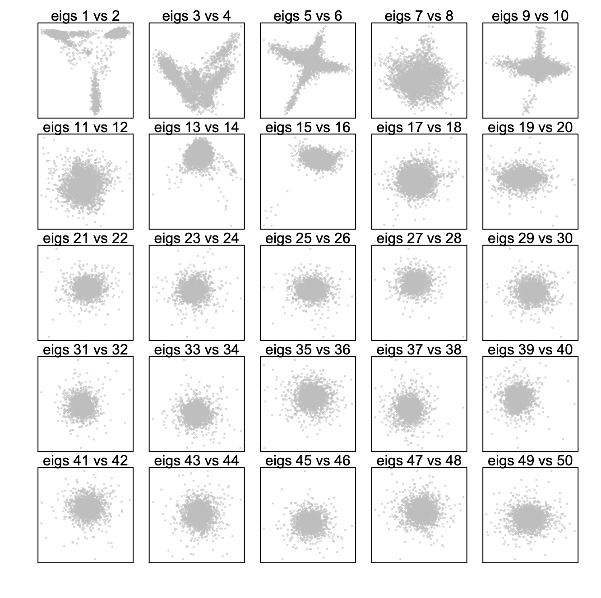 

**Step 11. Clustering**         

```R
> x.sp = runKNN(
    obj=x.sp,
    eigs.dims=1:15,
    k=15
  );
> library(leiden);
> x.sp=runCluster(
	obj=x.sp,
	tmp.folder=tempdir(),
	louvain.lib="leiden",
	seed.use=10,
	resolution=0.7
	);
```

**Step 12. Visualization**         
SnapATAC visualizes and explores the data using tSNE (FI-tsne) and UMAP. In this example, we compute the t-SNE embedding using `Rtsne` function. 

```R
> x.sp = runViz(
	obj=x.sp, 
	tmp.folder=tempdir(),
	dims=2,
	eigs.dims=1:15, 
	method="umap",
	seed.use=10
	);
> par(mfrow = c(2, 2));
> plotViz(
	obj= x.sp,
	method="umap", 
	main="10X PBMC",
	point.color=x.sp@cluster, 
	point.size=0.2, 
	point.shape=19, 
	text.add=TRUE,
	text.size=1,
	text.color="black",
	down.sample=10000,
	legend.add=FALSE
	);
> plotFeatureSingle(
	obj=x.sp,
	feature.value=x.sp@metaData[,"logUMI"],
	method="umap", 
	main="read depth",
	point.size=0.2, 
	point.shape=19, 
	down.sample=10000,
	quantiles=c(0.01, 0.99)
	);
> plotViz(
	obj= x.sp,
	method="umap", 
	main="10X PBMC",
	point.size=0.2, 
	point.shape=19, 
	point.color=x.sp@sample, 
	text.add=FALSE,
	text.size=1.5,
	text.color="black",
	down.sample=10000,
	legend.add=TRUE
	);
> plotViz(
	obj= x.sp,
	method="umap", 
	main="Landmarks",
	point.size=0.2, 
	point.shape=19, 
	point.color=x.sp@metaData[,"landmark"], 
	text.add=FALSE,
	text.size=1.5,
	text.color="black",
	down.sample=10000,
	legend.add=TRUE
	);
```

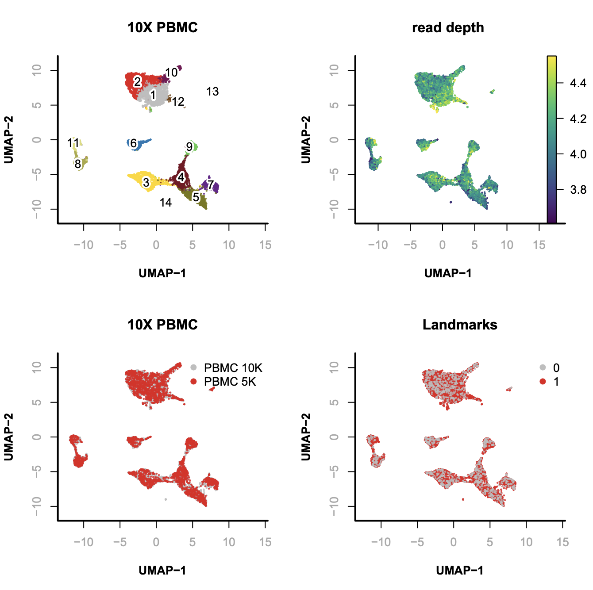 

**Step 13. scRNA-seq based annotation**        
In this example, we will annotate the single cell ATAC-seq clusters based on corresponding scRNA-seq dataset. Seurat object for 10X PBMC single cell RNA-seq (`pbmc_10k_v3.rds`) can be downloaded [here](https://www.dropbox.com/s/3f3p5nxrn5b3y4y/pbmc_10k_v3.rds?dl=1).

```
> library(Seurat);
> pbmc.rna <- readRDS("pbmc_10k_v3.rds");
> pbmc.rna$tech <- "rna";
> variable.genes = VariableFeatures(object = pbmc.rna);
> genes.df = read.table("gencode.v19.annotation.gene.bed");
> genes.gr = GRanges(genes.df[,1], IRanges(genes.df[,2], genes.df[,3]), name=genes.df[,4]);
> genes.sel.gr <- genes.gr[which(genes.gr$name %in% variable.genes)];
> x.sp = createGmatFromMat(
	obj=x.sp, 
	input.mat="bmat",
	genes=genes.sel.gr,
	do.par=TRUE,
	num.cores=10
	);
```

We next create a Seurat object to integrate with scRNA-seq.

```
> pbmc.atac <- snapToSeurat(
	obj=x.sp, 
	eigs.dims=1:15, 
	norm=TRUE,
	scale=TRUE
	);
> transfer.anchors <- FindTransferAnchors(
	reference = pbmc.rna, 
	query = pbmc.atac, 
	features = variable.genes, 
	reference.assay = "RNA", 
	query.assay = "ACTIVITY", 
	reduction = "cca"
	);
> celltype.predictions <- TransferData(
	anchorset = transfer.anchors, 
	refdata = pbmc.rna$celltype,
	weight.reduction = pbmc.atac[["SnapATAC"]],
	dims = 1:15
	);
> x.sp@metaData$predicted.id = celltype.predictions$predicted.id;
> x.sp@metaData$predict.max.score = apply(celltype.predictions[,-1], 1, max);
> x.sp@cluster = as.factor(x.sp@metaData$predicted.id);
```

**Step 14. Create psudo multiomics cells**          
Now each single cell in the snap object `x.sp` contains information of both chromatin accessibility `@bmat` and gene expression `@gmat`.

```R
> refdata <- GetAssayData(
	object = pbmc.rna, 
	assay = "RNA", 
	slot = "data"
	);
> imputation <- TransferData(
	anchorset = transfer.anchors, 
	refdata = refdata, 
	weight.reduction = pbmc.atac[["SnapATAC"]], 
	dims = 1:15
	);
> x.sp@gmat = t(imputation@data);
> rm(imputation); # free memory
> rm(refdata);    # free memory
> rm(pbmc.rna);   # free memory
```

**Step 15. Remove cells of low prediction score**             

```R
> hist(x.sp@metaData$predict.max.score, 
	xlab="prediction score", 
	col="lightblue", 
	xlim=c(0, 1),
	main="PBMC 10X"
  );
> abline(v=0.5, col="red", lwd=2, lty=2);
> table(x.sp@metaData$predict.max.score > 0.5);
FALSE  TRUE
  388 13045
> x.sp = x.sp[x.sp@metaData$predict.max.score > 0.5,];
> x.sp
number of barcodes: 13045
number of bins: 534438
number of genes: 19089
number of peaks: 0
> plotViz(
    obj=x.sp,
    method="umap", 
    main="PBMC 10X",
    point.color=x.sp@metaData[,"predicted.id"], 
    point.size=0.5, 
    point.shape=19, 
    text.add=TRUE,
    text.size=1,
    text.color="black",
    down.sample=10000,
    legend.add=FALSE
    );
```

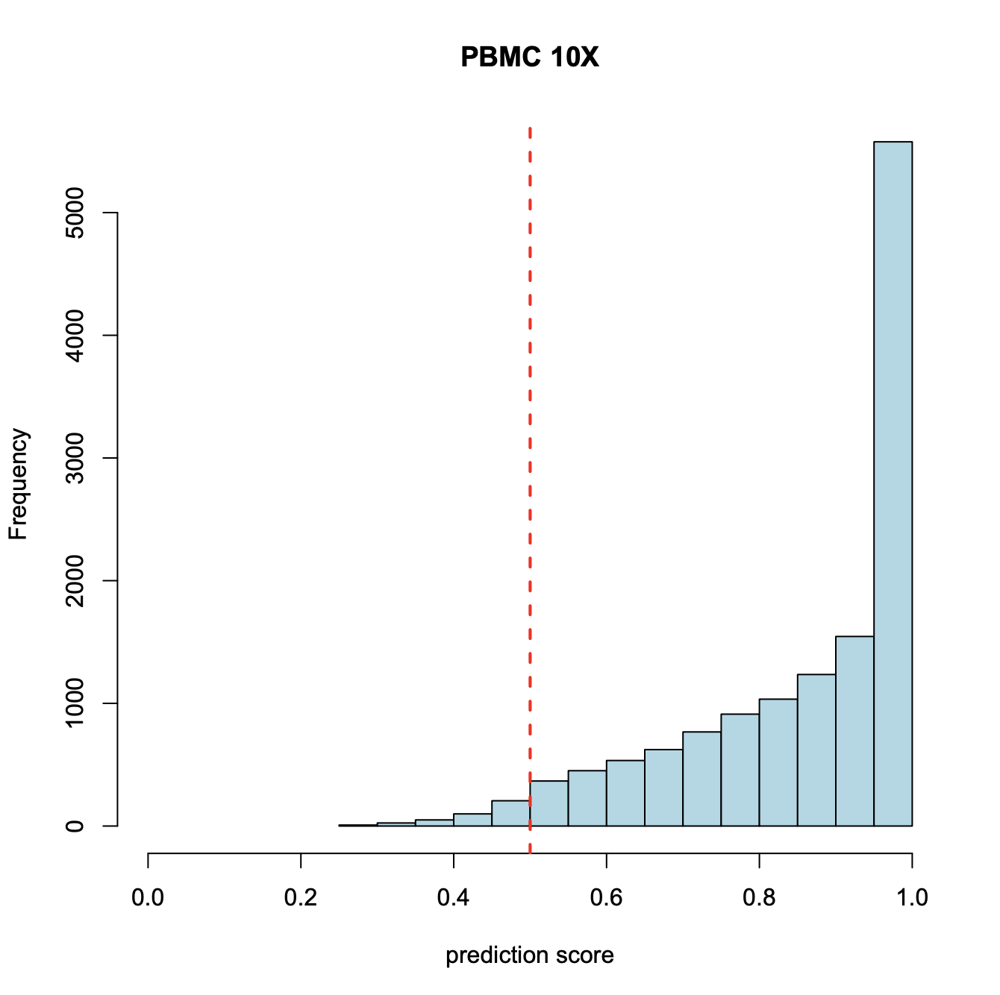 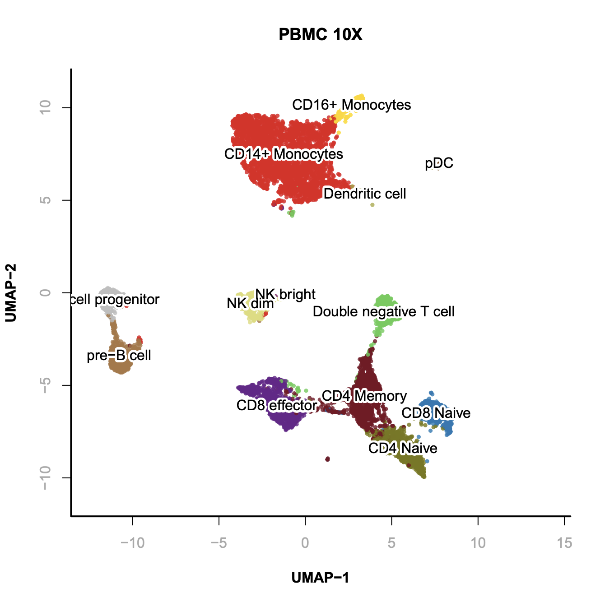

**Step 16. Project gene expression value to t-SNE embedding**          

```R
> marker.genes = c(
    "IL32", "LTB", "CD3D",
    "IL7R", "LDHB", "FCGR3A", 
    "CD68", "MS4A1", "GNLY", 
    "CD3E", "CD14", "CD14", 
    "FCGR3A", "LYZ", "PPBP", 
    "CD8A", "PPBP", "CST3", 
    "NKG7", "MS4A7", "MS4A1", 
    "CD8A"
    );
> par(mfrow = c(3, 3));
> for(i in 1:9){
	j = which(colnames(x.sp@gmat) == marker.genes[i])
	plotFeatureSingle(
		obj=x.sp,
		feature.value=x.sp@gmat[,j],
		method="umap", 
		main=marker.genes[i],
		point.size=0.1, 
		point.shape=19, 
		down.sample=10000,
		quantiles=c(0.01, 0.99)
	)};
```

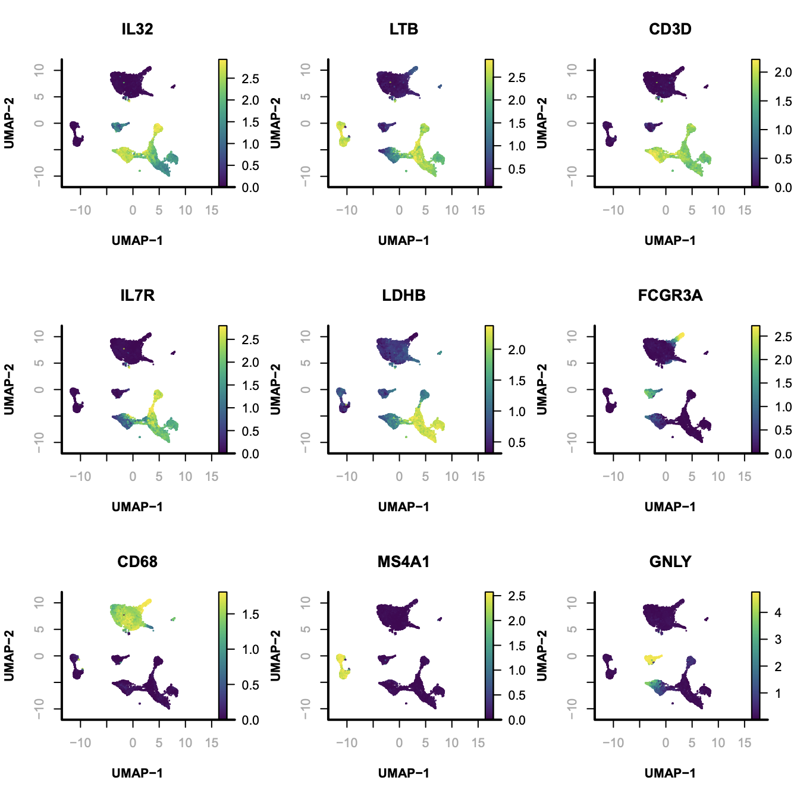 


**Step 17. Identify cis-elements for each cell type seperately**        
Next we aggregate reads from the same cluster to create an ensemble track for peak calling and visualization. This step will generate a `narrowPeak` that contains the identified peak and `.bedGraph` file for visualization. To obtain the most robust result, we don't recommend to perform this step for clusters with cell number less than 100. In the below example, SnapATAC creates `PBMC.1_peaks.narrowPeak` and `PBMC_1_treat_pileup.bdg`. `bdg` file can be compressed to `bigWig` file using [`bedGraphToBigWig`](https://anaconda.org/bioconda/ucsc-bedgraphtobigwig) for IGV or Genome Browser visulization.

```R
> system("which snaptools");
/home/r3fang/anaconda2/bin/snaptools
> system("which macs2")
/home/r3fang/anaconda2/bin/macs2
# call peaks for one cluster
> peaks = runMACS(
	obj=x.sp[which(x.sp@cluster=="CD4 Naive"),], 
	output.prefix="PBMC.CD4_Naive",
	path.to.snaptools="/home/r3fang/anaconda2/bin/snaptools",
	path.to.macs="/home/r3fang/anaconda2/bin/macs2",
	gsize="hs", # mm, hs, etc
	buffer.size=500, 
	num.cores=10,
	macs.options="--nomodel --shift 100 --ext 200 --qval 5e-2 -B --SPMR",
	tmp.folder=tempdir()
	);
```

Instead of performing peak calling for only one cluster, we next perform this step for all clusters with more than 100 cells.

``` 
# call peaks for all cluster with more than 100 cells
> clusters.sel = names(table(x.sp@cluster))[which(table(x.sp@cluster) > 100)];
> peaks.ls = mclapply(seq(clusters.sel), function(i){
	print(clusters.sel[i]);
	peaks = runMACS(
		obj=x.sp[which(x.sp@cluster==clusters.sel[i]),], 
		output.prefix=paste0("PBMC.", gsub(" ", "_", clusters.sel)[i]),
		path.to.snaptools="/home/r3fang/anaconda2/bin/snaptools",
		path.to.macs="/home/r3fang/anaconda2/bin/macs2",
		gsize="hs", # mm, hs, etc
		buffer.size=500, 
		num.cores=1,
		macs.options="--nomodel --shift 100 --ext 200 --qval 5e-2 -B --SPMR",
		tmp.folder=tempdir()
		);
	peaks
 	}, mc.cores=5);
> peaks.names = system("ls | grep narrowPeak", intern=TRUE);
> peak.gr.ls = lapply(peaks.names, function(x){
	peak.df = read.table(x)
	GRanges(peak.df[,1], IRanges(peak.df[,2], peak.df[,3]))
	})
> peak.gr = reduce(Reduce(c, peak.gr.ls));
```

This will create a `bdg` file for each cluster for visilizations using IGV or other genomic browsers. Below is a screenshot of regions flanking FOXJ2 gene from UW genome browser.

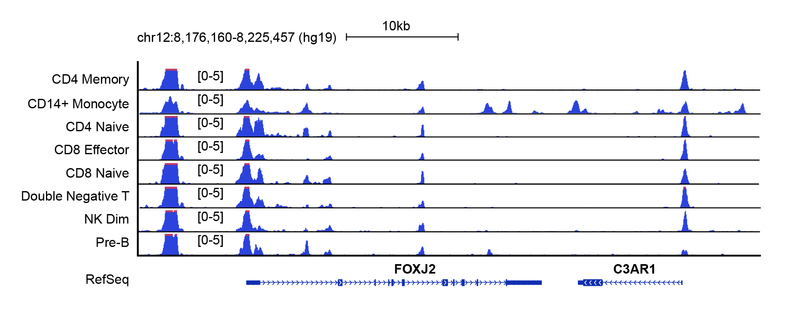 


**Step 18. Create a cell-by-peak matrix**     
Using merged peaks as a reference, we next create the cell-by-peak matrix and add it to the snap object. We will first write down combined peak list as `peaks.combined.bed`. 

```R
> peaks.df = as.data.frame(peak.gr)[,1:3];
> write.table(peaks.df,file = "peaks.combined.bed",append=FALSE,
		quote= FALSE,sep="\t", eol = "\n", na = "NA", dec = ".", 
		row.names = FALSE, col.names = FALSE, qmethod = c("escape", "double"),
		fileEncoding = "")
```

Next we create cell-by-peak matrix and add to the snap file. This step will take a while.

```bash
$ snaptools snap-add-pmat \
	--snap-file atac_pbmc_10k_nextgem.snap \
	--peak-file peaks.combined.bed &
$ snaptools snap-add-pmat \
	--snap-file atac_pbmc_5k_nextgem.snap \
	--peak-file peaks.combined.bed	
```

We add the cell-by-peak matrix to the existing snap object in R.

```R
> x.sp = addPmatToSnap(x.sp);
```

**Step 19. Identify differentially accessible regulatory modules (DARs) for each cell type**         

```R
> DARs = findDAR(
	obj=x1.sp,
	input.mat="pmat",
	cluster.pos="CD14+ Monocytes",
	cluster.neg.method="knn",
	test.method="exactTest",
	bcv=0.4, #0.4 for human, 0.1 for mouse
	seed.use=10
  );
> DARs$FDR = p.adjust(DARs$PValue, method="BH");
> idy = which(DARs$FDR < 5e-2 & DARs$logFC > 0);
> par(mfrow = c(1, 2));
> plot(DARs$logCPM, DARs$logFC, 
		pch=19, cex=0.1, col="grey", 
		ylab="logFC", xlab="logCPM",
		main="CD14+ Monocytes");
> points(DARs$logCPM[idy], DARs$logFC[idy], pch=19, cex=0.5, col="red");
> abline(h = 0, lwd=1, lty=2);
> covs = Matrix::rowSums(x.sp@pmat);
> vals = Matrix::rowSums(x.sp@pmat[,idy]) / covs;
> vals.zscore = (vals - mean(vals)) / sd(vals);
> plotFeatureSingle(
		obj=x.sp,
		feature.value=vals.zscore,
		method="umap", 
		main="CD14+ Monocytes",
		point.size=0.1, 
		point.shape=19, 
		down.sample=5000,
		quantiles=c(0.01, 0.99)
	);
```

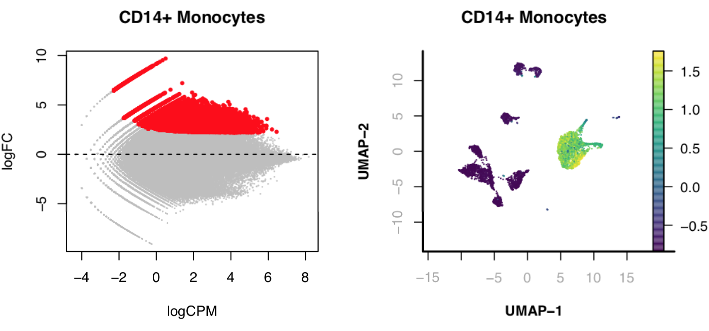 

Next, we identify DARs for each of the clusters.

```R
> idy.ls = lapply(levels(x.sp@cluster), function(cluster_i){
	DARs = findDAR(
		obj=x.sp,
		input.mat="pmat",
		cluster.pos=cluster_i,
		cluster.neg=NULL,
		cluster.neg.method="knn",
		bcv=0.4,
		test.method="exactTest",
		seed.use=10
		);
	DARs$FDR = p.adjust(DARs$PValue, method="BH");
	idy = which(DARs$FDR < 5e-2 & DARs$logFC > 0);
	if((x=length(idy)) < 2000L){
			PValues = DARs$PValue;
			PValues[DARs$logFC < 0] = 1;
			idy = order(PValues, decreasing=FALSE)[1:2000];
			rm(PValues); # free memory
	}
	idy
	})
> names(idy.ls) = levels(x.sp@cluster);
> par(mfrow = c(3, 3));
> for(cluster_i in levels(x.sp@cluster)){
	print(cluster_i)
	idy = idy.ls[[cluster_i]];
	vals = Matrix::rowSums(x.sp@pmat[,idy]) / covs;
	vals.zscore = (vals - mean(vals)) / sd(vals);
	plotFeatureSingle(
		obj=x.sp,
		feature.value=vals.zscore,
		method="umap", 
		main=cluster_i,
		point.size=0.1, 
		point.shape=19, 
		down.sample=5000,
		quantiles=c(0.01, 0.99)
		);
  }
```

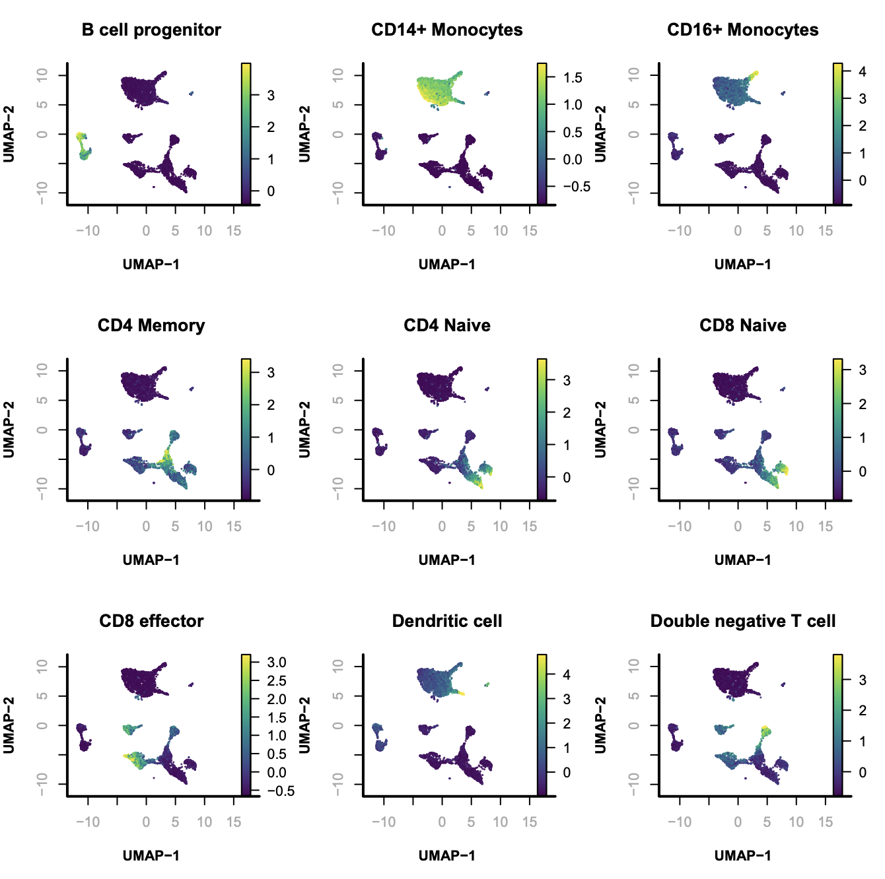 

**Step 20. Motif variability analysis using chromVAR**       
SnapATAC incorporates chromVAR (Schep et al) for motif variability analysis.

```R
> library(chromVAR);
> library(motifmatchr);
> library(SummarizedExperiment);
> library(BSgenome.Hsapiens.UCSC.hg19);
> x.sp = makeBinary(x.sp, "pmat");
> DAR.idy = sort(unique(do.call(c, idy.ls)));
> x.sp@mat = runChromVAR(
	obj=x.sp[,DAR.idy,"pmat"],
	input.mat="pmat",
	genome=BSgenome.Hsapiens.UCSC.hg19,
	min.count=10,
	species="Homo sapiens"
  );
> motif_i = "MA0071.1_RORA";
> dat = data.frame(x=x.sp@metaData$predicted.id, y=x.sp@mmat[,motif_i]);
> p <- ggplot(dat, aes(x=x, y=y, fill=x)) + 
	theme_classic() +
	geom_violin() + 
	xlab("cluster") +
	ylab("motif enrichment") + 
	ggtitle("MA0071.1_RORA") +
	theme(
		  plot.margin = margin(5,1,5,1, "cm"),
		  axis.text.x = element_text(angle = 90, hjust = 1),
		  axis.ticks.x=element_blank(),
		  legend.position = "none"
		  );
```
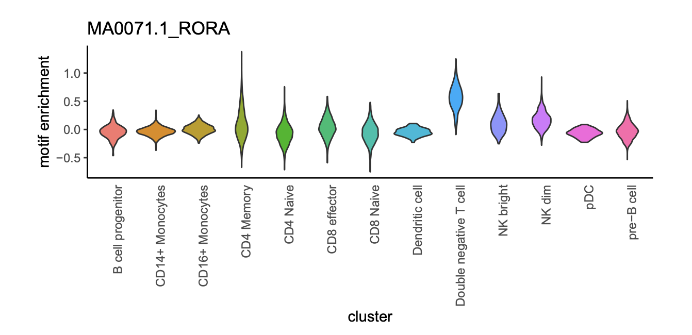 

**Step 21. De novo Motif discovery using Homer.**      
SnapATAC can help identify master regulators that are enriched in the differentially accessible regions (DARs). This will creates a homer motif report `knownResults.html` in the folder `./homer/C2`.

```R
> system("which findMotifsGenome.pl");
/projects/ps-renlab/r3fang/public_html/softwares/homer/bin/findMotifsGenome.pl
> idy = idy.ls[["Double negative T cell"]];
> motifs = runHomer(
	x.sp[,idy,"pmat"], 
	mat = "pmat",
	path.to.homer = "/projects/ps-renlab/r3fang/public_html/softwares/homer/bin/findMotifsGenome.pl",
	result.dir = "./homer/DoubleNegativeTcell",
	num.cores=5,
	genome = 'hg19',
	motif.length = 10,
	scan.size = 300,
	optimize.count = 2,
	background = 'automatic',
	local.background = FALSE,
	only.known = TRUE,
	only.denovo = FALSE,
	fdr.num = 5,
	cache = 100,
	overwrite = TRUE,
	keep.minimal = FALSE
	);
```

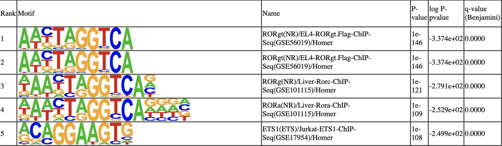 

**Step 22. Link distal regulatory elements to putative target genes**           
Finally, using the "pseudo" cells, we next develop a method to link the distal regulatory elements to the target genes based on the association between expression of a gene and chromatin accessibility at its distal elements in single cells. For a given marker gene, we first identify peaks within 1MB flanking the target gene. For each flanking peak, we perform logistic regression using gene expression as input varaible to predict the binarized chromatin state. The resulting model estimates the association between chromatin accessibility and gene expression.

```R
> TSS.loci = GRanges("chr12", IRanges(8219067, 8219068));
> pairs = predictGenePeakPair(
	x.sp, 
	input.mat="pmat",
	gene.name="C3AR1", 
	gene.loci=resize(TSS.loci, width=500000, fix="center"),
	do.par=FALSE
	);
# convert the pair to genome browser arc plot format
> pairs.df = as.data.frame(pairs);
> pairs.df = data.frame(
	chr1=pairs.df[,"seqnames"],
	start1=pairs.df[,"start"],
	end1=pairs.df[,"end"],
	chr2="chr2",
	start2=8219067,
	end2=8219068,
	Pval=pairs.df[,"logPval"]
	);
> head(pairs.df)
   chr1  start1    end1 chr2  start2    end2       Pval
1 chr12 7984734 7985229 chr2 8219067 8219068 14.6075918
2 chr12 7987561 7988085 chr2 8219067 8219068  5.6718381
3 chr12 7989776 7990567 chr2 8219067 8219068 24.2564608
4 chr12 7996454 7996667 chr2 8219067 8219068  0.6411017
5 chr12 8000059 8000667 chr2 8219067 8219068  2.0324922
6 chr12 8012404 8013040 chr2 8219067 8219068  0.0000000
```

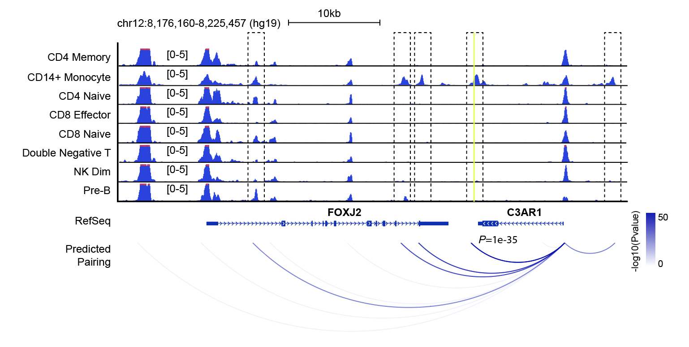 

