## 10X Adult Mouse Brain

In this example, we will be analyzing a dataset of 5K cells from the adult mouse brain available from 10X genomics. All the data used in this analysis can be downloaded from [here](http://renlab.sdsc.edu/r3fang/share/github/Mouse_Brain_10X/).

## Table of Contents

- [Step 0. Data download](#data_download)
- [Step 1. Barcode selection](#barcode_selection)
- [Step 2. Add cell-by-bin matrix](#add_bmat)
- [Step 3. Matrix binarization](#make_binary)
- [Step 4. Bin filtering](#bin_filter)
- [Step 5. Dimensionality reduction](#diffusion_maps)
- [Step 6. Determine significant components](#pc_select)
- [Step 7. Graph-based clustering](#cluster)
- [Step 8. Visualization](#viz)
- [Step 9. Gene based annotation](#gene_tsne)
- [Step 10. Hierarchical clustering](#hierarchical_clustering)
- [Step 11. Identify peak](#peak_call)
- [Step 12. Create a cell-by-peak matrix](#create_pmat)
- [Step 13. Add cell-by-peak matrix](#add_pmat)
- [Step 14. Identify differentially accessible regions](#diff_analysis)
- [Step 15. Motif analysis](#homer_chromVAR)
- [Step 16. GREAT analysis](#great_analysis)


<a name="data_download"></a>**Step 0. Data download**        
In this example, we will skip the snap generation (See [here](https://github.com/r3fang/SnapATAC/blob/master/examples/10X_PBMC_15K/README.md) for how to generate a snap file). Instead, we will download the snap file. The downloaded snap file already contains the cell-by-bin/cell-by-peak matrix.

```bash
$ wget http://renlab.sdsc.edu/r3fang/share/github/Mouse_Brain_10X/atac_v1_adult_brain_fresh_5k.snap
$ http://renlab.sdsc.edu/r3fang/share/github/Mouse_Brain_10X/atac_v1_adult_brain_fresh_5k_singlecell.csv
```

<a name="barcode_selection"></a>**Step 1. Barcode selection**     
We select high-quality barcodes based on two criteria: 1) number of unique fragments; 2) fragments in promoter ratio; 

```R
> library(SnapATAC);
> x.sp = createSnap(
    file="atac_v1_adult_brain_fresh_5k.snap",
    sample="atac_v1_adult_brain_fresh_5k",
    num.cores=1
  );
> barcodes = read.csv(
    "atac_v1_adult_brain_fresh_5k_singlecell.csv",
    head=TRUE
  );
> barcodes = barcodes[2:nrow(barcodes),];
> promoter_ratio = (barcodes$promoter_region_fragments+1) / (barcodes$passed_filters + 1);
> UMI = log(barcodes$passed_filters+1, 10);
> data = data.frame(UMI=UMI, promoter_ratio=promoter_ratio);
> barcodes$promoter_ratio = promoter_ratio;
> library(viridisLite);
> library(ggplot2);
> p1 = ggplot(
    data, 
    aes(x= UMI, y= promoter_ratio)) + 
    geom_point(size=0.1, col="grey") +
    theme_classic() +
    ggtitle("10X Fresh Adult Brain") +
    ylim(0, 1) + xlim(0, 6) +
    labs(x = "log10(UMI)", y="promoter ratio") 
> p1 
> barcodes.sel = barcodes[which(UMI >= 3 & UMI <= 5 & promoter_ratio >= 0.15 & promoter_ratio <= 0.6),];
> rownames(barcodes.sel) = barcodes.sel$barcode;
> x.sp = x.sp[which(x.sp@barcode %in% barcodes.sel$barcode),];
> x.sp@metaData = barcodes.sel[x.sp@barcode,];
> x.sp
```
```
## number of barcodes: 4100
## number of bins: 0
## number of genes: 0
## number of peaks: 0
## number of motifs: 0
```

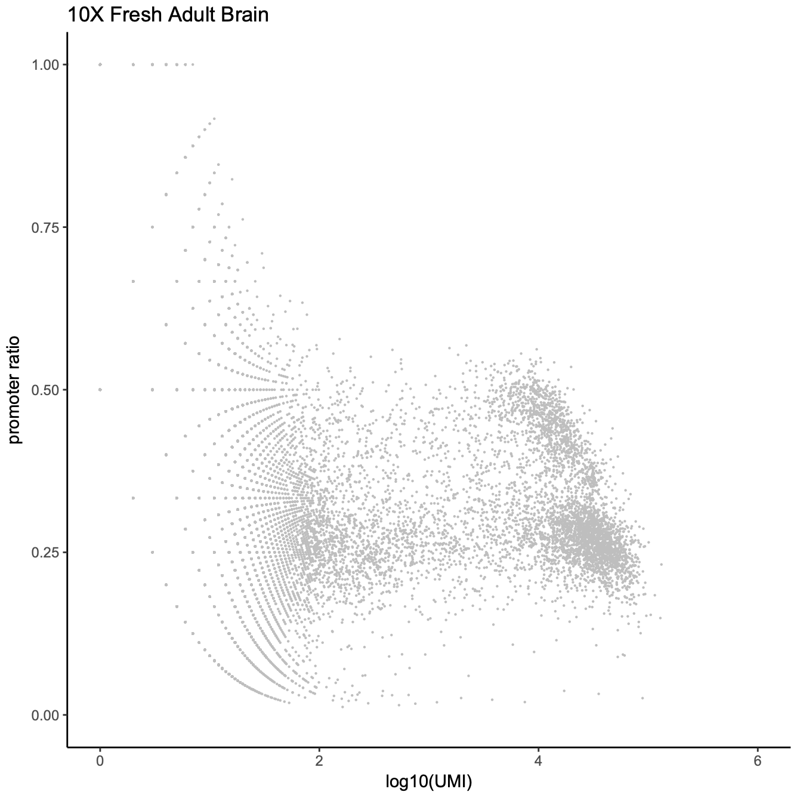  

<a name="add_bmat"></a>**Step 2. Add cell-by-bin matrix**     
Next, we add the cell-by-bin matrix of 5kb resolution to the snap object. This function will automatically read the cell-by-bin matrix and add it to `bmat` slot of snap object.

```R
# show what bin sizes exist in atac_v1_adult_brain_fresh_5k.snap file
> showBinSizes("atac_v1_adult_brain_fresh_5k.snap");
[1] 1000 5000 10000
> x.sp = addBmatToSnap(x.sp, bin.size=5000, num.cores=1);
```

<a name="make_binary"></a>**Step 3. Matrix binarization**       
We will convert the cell-by-bin count matrix to a binary matrix. Some items in the count matrix have abnormally high coverage perhaps due to the alignment errors. Therefore, we next remove 0.1% items of the highest coverage in the count matrix and then convert the remaining non-zero items to 1.

```R
> x.sp = makeBinary(x.sp, mat="bmat");
```

<a name="bin_filter"></a>**Step 4. Bin filtering**       
First, we filter out any bins overlapping with the ENCODE blacklist to prevent from potential artifacts.

```R
> system("wget http://mitra.stanford.edu/kundaje/akundaje/release/blacklists/mm10-mouse/mm10.blacklist.bed.gz");
> library(GenomicRanges);
> black_list = read.table("mm10.blacklist.bed.gz");
> black_list.gr = GRanges(
    black_list[,1], 
    IRanges(black_list[,2], black_list[,3])
  );
> idy = queryHits(findOverlaps(x.sp@feature, black_list.gr));
> if(length(idy) > 0){x.sp = x.sp[,-idy, mat="bmat"]};
> x.sp
```
```
## number of barcodes: 4100
## number of bins: 546103
## number of genes: 0
## number of peaks: 0
## number of motifs: 0
```

Second, we remove unwanted chromosomes.

```R
> chr.exclude = seqlevels(x.sp@feature)[grep("random|chrM", seqlevels(x.sp@feature))];
> idy = grep(paste(chr.exclude, collapse="|"), x.sp@feature);
> if(length(idy) > 0){x.sp = x.sp[,-idy, mat="bmat"]};
> x.sp
```
```
## number of barcodes: 4100
## number of bins: 545183
## number of genes: 0
## number of peaks: 0
## number of motifs: 0
```

Third, the bin coverage roughly obeys a log normal distribution. We remove the top 5% bins that overlap with invariant features such as promoters of the house keeping genes.

```R
> bin.cov = log10(Matrix::colSums(x.sp@bmat)+1);
> hist(
    bin.cov[bin.cov > 0], 
    xlab="log10(bin cov)", 
    main="log10(Bin Cov)", 
    col="lightblue", 
    xlim=c(0, 5)
  );
> bin.cutoff = quantile(bin.cov[bin.cov > 0], 0.95);
> idy = which(bin.cov <= bin.cutoff & bin.cov > 0);
> x.sp = x.sp[, idy, mat="bmat"];
> x.sp
```
```
## number of barcodes: 4100
## number of bins: 474624
## number of genes: 0
## number of peaks: 0
## number of motifs: 0
```

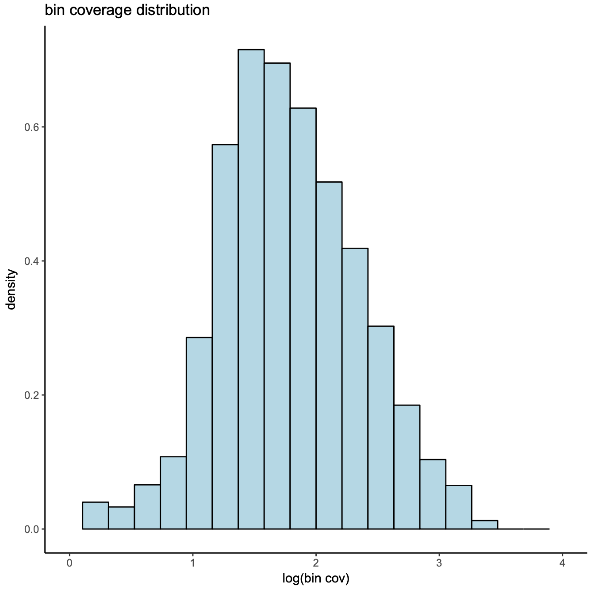  

<a name="diffusion_maps"></a>**Step 5. Dimensionality reduction**       
We compute diffusion maps for dimentionality reduction. 

```R
> x.sp = runDiffusionMaps(
    obj=x.sp,
    input.mat="bmat", 
    num.eigs=50
  );
```

<a name="pc_select"></a>**Step 6. Determine significant components**                       
We next determine the number of reduced dimensions to include for downstream analysis. We use an ad hoc method by simply looking at a pairwise plot and select the number of dimensions in which the scatter plot starts looking like a blob. In the below example, we choose the first 20 dimensions.

```R
> plotDimReductPW(
    obj=x.sp, 
    eigs.dims=1:50,
    point.size=0.3,
    point.color="grey",
    point.shape=19,
    point.alpha=0.6,
    down.sample=5000,
    pdf.file.name=NULL, 
    pdf.height=7, 
    pdf.width=7
  );
```

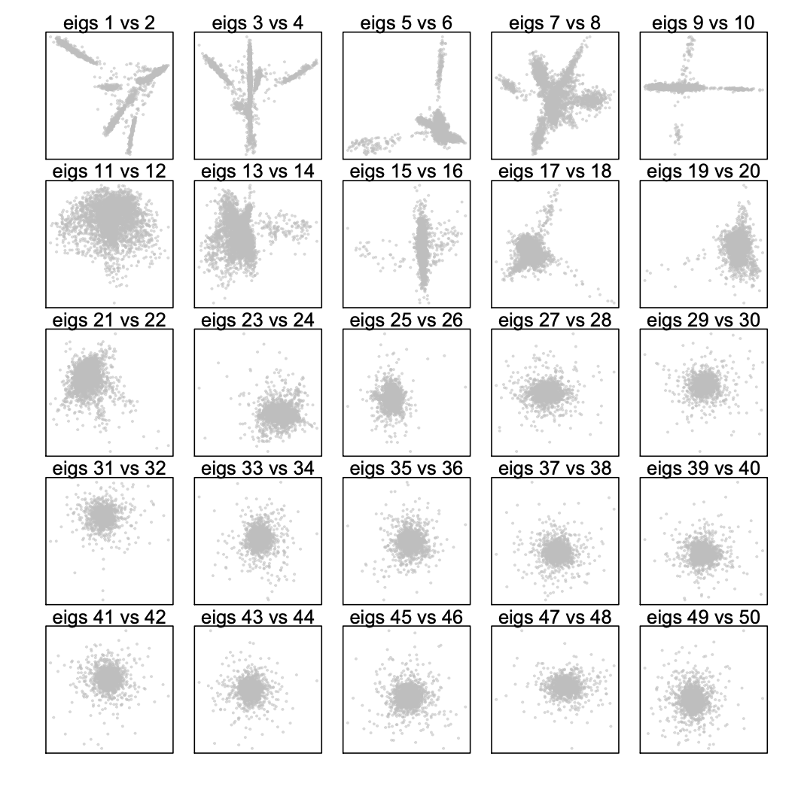  

<a name="cluster"></a>**Step 7. Graph-based clustering**        
Using the selected significant dimensions, we next construct a K Nearest Neighbor (KNN) Graph (k=15). Each cell is a node and the k-nearest neighbors of each cell are identified according to the Euclidian distance and edges are draw between neighbors in the graph.

```R
> x.sp = runKNN(
    obj=x.sp,
    eigs.dims=1:20,
    k=15
  );
> x.sp=runCluster(
    obj=x.sp,
    tmp.folder=tempdir(),
    louvain.lib="R-igraph",
    seed.use=10
  );
> x.sp@metaData$cluster = x.sp@cluster;
```

<a name="viz"></a>**Step 8. Visualization**       
SnapATAC visualizes and explores the data using tSNE (FI-tsne) or UMAP. In this example, we compute the t-SNE embedding. We next project the sequencing depth or other bias onto the t-SNE embedding.

```R
> x.sp = runViz(
    obj=x.sp, 
    tmp.folder=tempdir(),
    dims=2,
    eigs.dims=1:20, 
    method="Rtsne",
    seed.use=10
  );
> par(mfrow = c(2, 2));
> plotViz(
    obj=x.sp,
    method="tsne", 
    main="10X Brain Cluster",
    point.color=x.sp@cluster, 
    point.size=1, 
    point.shape=19, 
    point.alpha=0.8, 
    text.add=TRUE,
    text.size=1.5,
    text.color="black",
    text.halo.add=TRUE,
    text.halo.color="white",
    text.halo.width=0.2,
    down.sample=10000,
    legend.add=FALSE
  );
> plotFeatureSingle(
    obj=x.sp,
    feature.value=log(x.sp@metaData[,"passed_filters"]+1,10),
    method="tsne", 
    main="10X Brain Read Depth",
    point.size=0.2, 
    point.shape=19, 
    down.sample=10000,
    quantiles=c(0.01, 0.99)
  ); 
> plotFeatureSingle(
    obj=x.sp,
    feature.value=x.sp@metaData$peak_region_fragments / x.sp@metaData$passed_filters,
    method="tsne", 
    main="10X Brain FRiP",
    point.size=0.2, 
    point.shape=19, 
    down.sample=10000,
    quantiles=c(0.01, 0.99) # remove outliers
  );
> plotFeatureSingle(
    obj=x.sp,
    feature.value=x.sp@metaData$duplicate / x.sp@metaData$total,
    method="tsne", 
    main="10X Brain Duplicate",
    point.size=0.2, 
    point.shape=19, 
    down.sample=10000,
    quantiles=c(0.01, 0.99) # remove outliers
  );
```

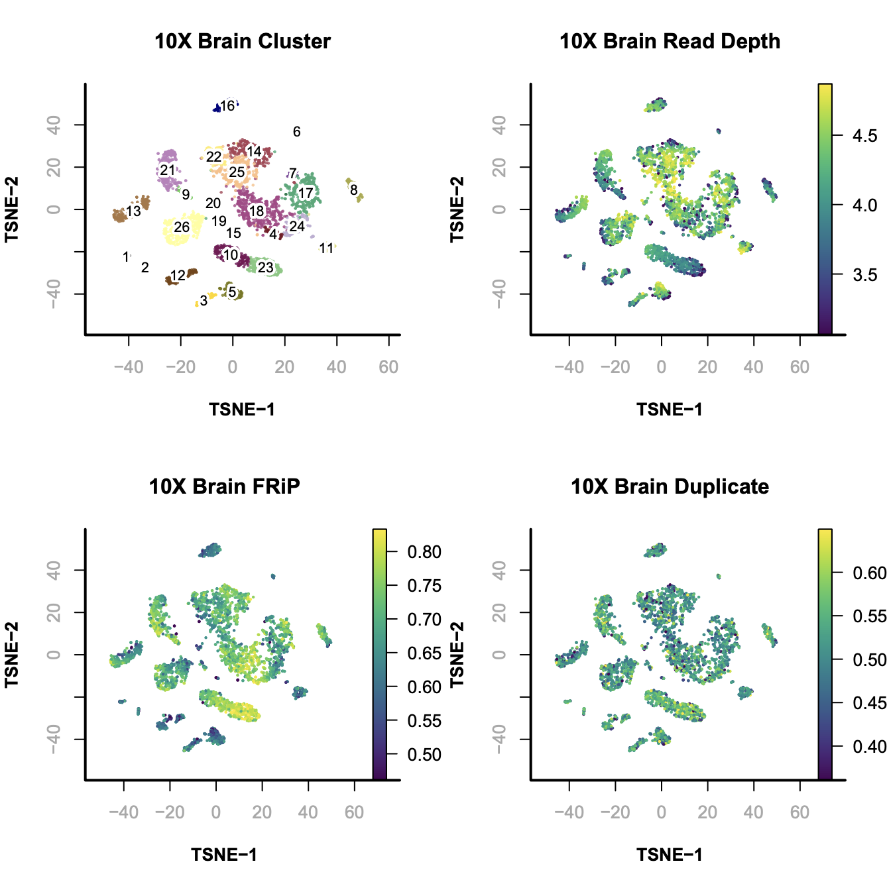  

<a name="gene_tsne"></a>**Step 9. Gene based annotation**        
To help annotate identified cell clusters, SnapATAC next creates the cell-by-gene matrix and visualize the enrichment of marker genes.

```R
> system("wget http://renlab.sdsc.edu/r3fang/share/github/Mouse_Brain_10X/gencode.vM16.gene.bed");
> genes = read.table("gencode.vM16.gene.bed");
> genes.gr = GRanges(genes[,1], 
    IRanges(genes[,2], genes[,3]), name=genes[,4]
  );
> marker.genes = c(
    "Snap25", "Gad2", "Apoe",
    "C1qb", "Pvalb", "Vip", 
    "Sst", "Lamp5", "Slc17a7"
  );
> genes.sel.gr <- genes.gr[which(genes.gr$name %in% marker.genes)];
# re-add the cell-by-bin matrix to the snap object;
> x.sp = addBmatToSnap(x.sp);
> x.sp = createGmatFromMat(
    obj=x.sp, 
    input.mat="bmat",
    genes=genes.sel.gr,
    do.par=TRUE,
    num.cores=10
  );
# normalize the cell-by-gene matrix
> x.sp = scaleCountMatrix(
    obj=x.sp, 
    cov=x.sp@metaData$passed_filters + 1,
    mat="gmat",
    method = "RPM"
  );
# smooth the cell-by-gene matrix
> x.sp = runMagic(
    obj=x.sp,
    input.mat="gmat",
    step.size=3
  );
> par(mfrow = c(3, 3));
> for(i in 1:9){
    plotFeatureSingle(
        obj=x.sp,
        feature.value=x.sp@gmat[, marker.genes[i]],
        method="tsne", 
        main=marker.genes[i],
        point.size=0.1, 
        point.shape=19, 
        down.sample=10000,
        quantiles=c(0, 1)
  )};
```

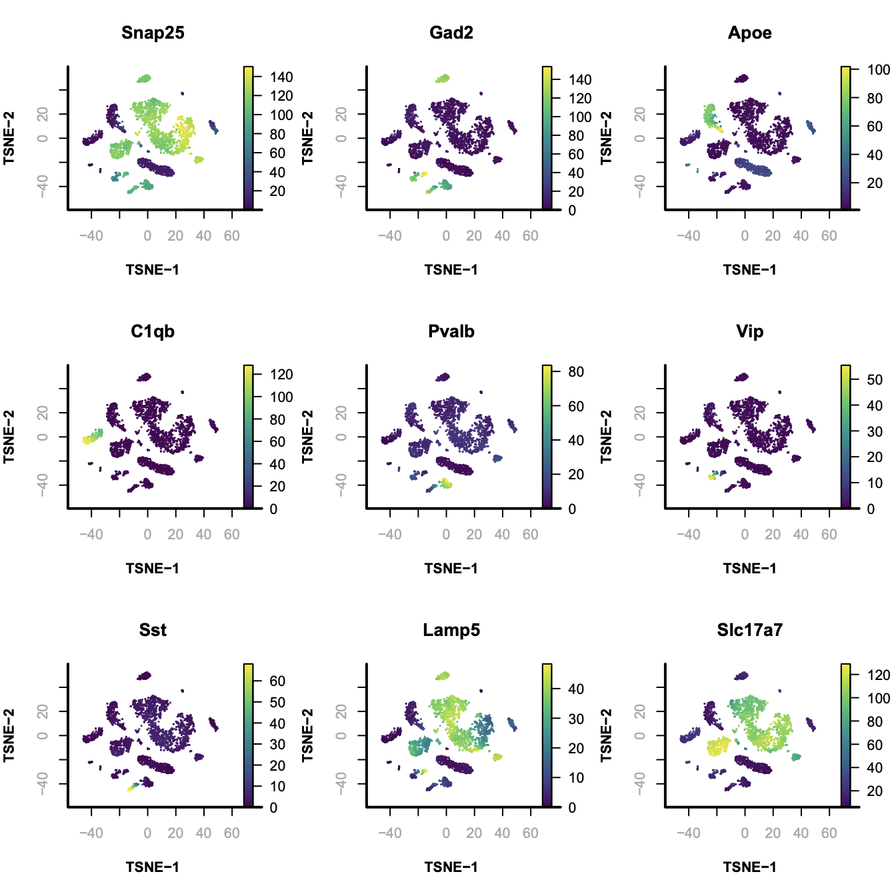

<a name="hierarchical_clustering"></a>**Step 10. Hierarchical clustering**        
Next, cells belonging to the same cluster are pooled to create the aggregate signal for hierarchical clustering.

```R
# calculate the ensemble signals for each cluster
> ensemble.ls = lapply(split(seq(length(x.sp@cluster)), x.sp@cluster), function(x){
	SnapATAC::colMeans(x.sp[x,], mat="bmat");
	})
# cluster using 1-cor as distance  
> hc = hclust(as.dist(1 - cor(t(do.call(rbind, ensemble.ls)))), method="ward.D2");
> plotViz(
    obj=x.sp,
    method="tsne", 
    main="10X Brain Cluster",
    point.color=x.sp@cluster, 
    point.size=1, 
    point.shape=19, 
    point.alpha=0.8, 
    text.add=TRUE,
    text.size=1.5,
    text.color="black",
    text.halo.add=TRUE,
    text.halo.color="white",
    text.halo.width=0.2,
    down.sample=10000,
    legend.add=FALSE
    );
> plot(hc, hang=-1, xlab="");
```

In this case, from cluster 20 to 25 are excitatory neuron; cluster 19 to 5 are inhibitory neurons and the rest of them are non-neuronal cells. 

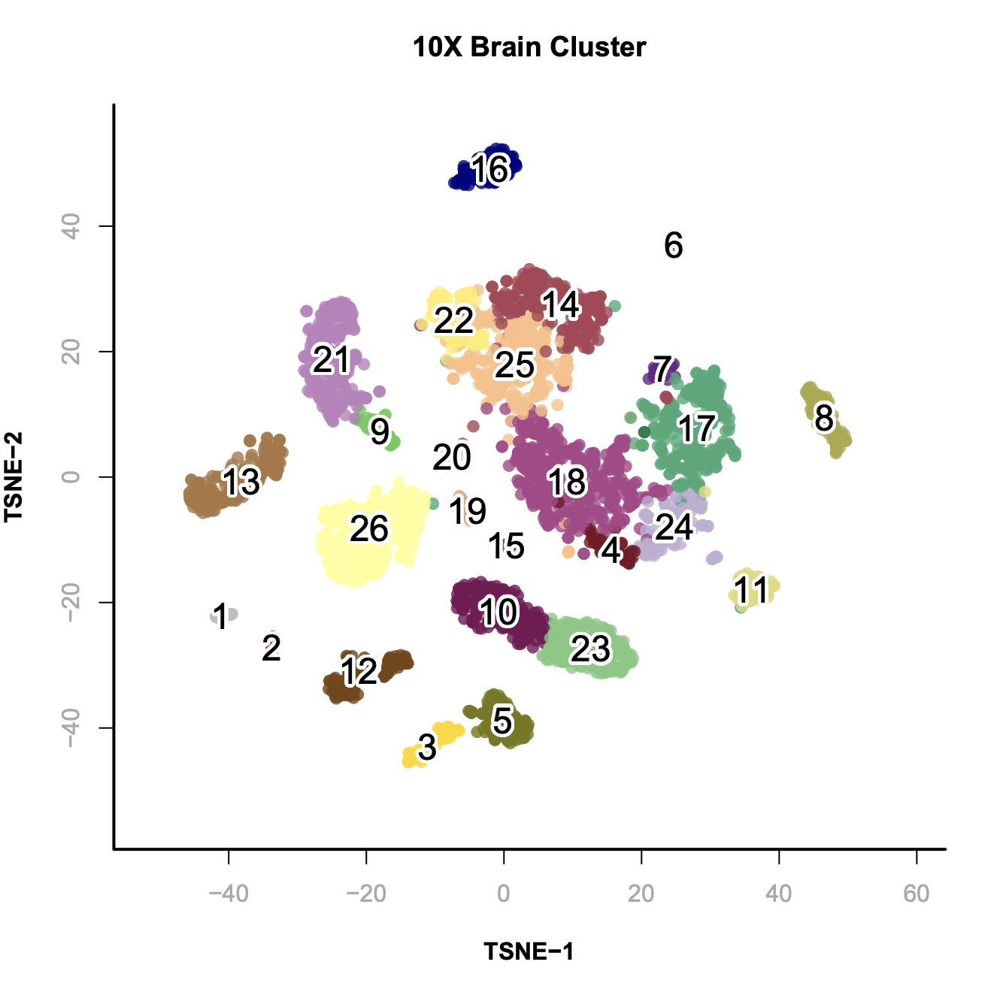 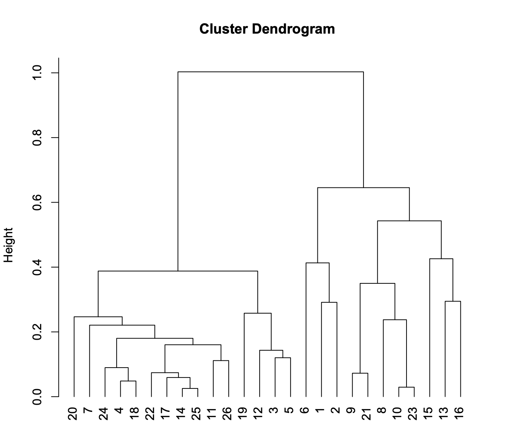

<a name="peak_call"></a>**Step 11. Identify peaks**         
Next we aggregate cells from the each cluster to create an ensemble track for peak calling and visualization. This step will generate a .narrowPeak file that contains the identified peak and .bedGraph file for visualization. To obtain the most robust result, we don't recommend to perform this step for clusters with cell number less than 100. In the below example, SnapATAC creates `atac_v1_adult_brain_fresh_5k.1_peaks.narrowPeak` and `atac_v1_adult_brain_fresh_5k.1_treat_pileup.bdg`. bdg file can be compressed to bigWig file using bedGraphToBigWig for IGV or Genome Browser visulization.

```R
> system("which snaptools")
/home/r3fang/anaconda2/bin/snaptools
> system("which macs2")
/home/r3fang/anaconda2/bin/macs2
> runMACS(
	obj=x.sp[which(x.sp@cluster==1),], 
	output.prefix="atac_v1_adult_brain_fresh_5k.1",
	path.to.snaptools="/home/r3fang/anaconda2/bin/snaptools",
	path.to.macs="/home/r3fang/anaconda2/bin/macs2",
	gsize="mm", 
	buffer.size=500, 
	num.cores=5,
	macs.options="--nomodel --shift 37 --ext 73 --qval 1e-2 -B --SPMR --call-summits",
	tmp.folder=tempdir()
	);
```

Next, we provide a short script that performs this step for all clusters.

```R
# call peaks for all cluster with more than 100 cells
> clusters.sel = names(table(x.sp@cluster))[which(table(x.sp@cluster) > 200)];
> peaks.ls = mclapply(seq(clusters.sel), function(i){
    print(clusters.sel[i]);
    runMACS(
        obj=x.sp[which(x.sp@cluster==clusters.sel[i]),], 
        output.prefix=paste0("atac_v1_adult_brain_fresh_5k.", gsub(" ", "_", clusters.sel)[i]),
        path.to.snaptools="/home/r3fang/anaconda2/bin/snaptools",
        path.to.macs="/home/r3fang/anaconda2/bin/macs2",
        gsize="hs", # mm, hs, etc
        buffer.size=500, 
        num.cores=1,
        macs.options="--nomodel --shift 100 --ext 200 --qval 5e-2 -B --SPMR",
        tmp.folder=tempdir()
   );
 }, mc.cores=5);
# assuming all .narrowPeak files in the current folder are generated from the clusters
> peaks.names = system("ls | grep narrowPeak", intern=TRUE);
> peak.gr.ls = lapply(peaks.names, function(x){
    peak.df = read.table(x)
    GRanges(peak.df[,1], IRanges(peak.df[,2], peak.df[,3]))
  })
> peak.gr = reduce(Reduce(c, peak.gr.ls));
> peak.gr
```
``` 
## GRanges object with 242847 ranges and 0 metadata columns:
##           seqnames               ranges strand
##              <Rle>            <IRanges>  <Rle>
##       [1]     chr1   [3094889, 3095629]      *
##       [2]     chr1   [3113499, 3114060]      *
##       [3]     chr1   [3118103, 3118401]      *
##       [4]     chr1   [3119689, 3120845]      *
##       [5]     chr1   [3121534, 3121786]      *
##       ...      ...                  ...    ...
##  [242843]     chrY [90797373, 90798136]      *
##  [242844]     chrY [90804709, 90805456]      *
##  [242845]     chrY [90808580, 90808819]      *
##  [242846]     chrY [90808850, 90809131]      *
##  [242847]     chrY [90810817, 90811057]      *
##  -------
```


<a name="create_pmat"></a>**Step 12. Create a cell-by-peak matrix**     
Using merged peak list as a reference, we next create a cell-by-peak matrix using the original snap file.

```R
> peaks.df = as.data.frame(peak.gr)[,1:3];
> write.table(peaks.df,file = "peaks.combined.bed",append=FALSE,
		quote= FALSE,sep="\t", eol = "\n", na = "NA", dec = ".", 
		row.names = FALSE, col.names = FALSE, qmethod = c("escape", "double"),
		fileEncoding = "")
> saveRDS(x.sp, file="atac_v1_adult_brain_fresh_5k.snap.rds");
```

Next we create cell-by-peak matrix and add to the snap file. This step will take a while.

```bash
$ snaptools snap-add-pmat \
	--snap-file atac_v1_adult_brain_fresh_5k.snap \
	--peak-file peaks.combined.bed
```

<a name="add_pmat"></a>**Step 13. Add cell-by-peak matrix**     
Next we add the cell-by-peak matrix to the existing snap object. 

```R
> x.sp = readRDS("atac_v1_adult_brain_fresh_5k.snap.rds");
> x.sp = addPmatToSnap(x.sp);
> x.sp = makeBinary(x.sp, mat="pmat");
> x.sp
```
```
## number of barcodes: 4100
## number of bins: 546206
## number of genes: 16
## number of peaks: 242847
## number of motifs: 0
```
<a name="diff_analysis"></a>**Step 14. Identify differentially accessible regions**       
SnapATAC finds differentially accessible regions (DARs) that define clusters via differential analysis. By default, it identifies positive peaks of a single cluster (specified in `cluster.pos`), compared to a group of negative control cells. If by default `cluster.neg=NULL`, findDAR will look for a group of background cells closest to the positive cells. 

```R
> DARs = findDAR(
    obj=x.sp,
    input.mat="pmat",
    cluster.pos=26,
    cluster.neg.method="knn",
    test.method="exactTest",
    bcv=0.1, #0.4 for human, 0.1 for mouse
    seed.use=10
  );
> DARs$FDR = p.adjust(DARs$PValue, method="BH");
> idy = which(DARs$FDR < 5e-2 & DARs$logFC > 0);
> par(mfrow = c(1, 2));
> plot(DARs$logCPM, DARs$logFC, 
    pch=19, cex=0.1, col="grey", 
    ylab="logFC", xlab="logCPM",
    main="Cluster 26"
  );
> points(DARs$logCPM[idy], 
    DARs$logFC[idy], 
    pch=19, 
    cex=0.5, 
    col="red"
  );
> abline(h = 0, lwd=1, lty=2);
> covs = Matrix::rowSums(x.sp@pmat);
> vals = Matrix::rowSums(x.sp@pmat[,idy]) / covs;
> vals.zscore = (vals - mean(vals)) / sd(vals);
> plotFeatureSingle(
    obj=x.sp,
    feature.value=vals.zscore,
    method="tsne", 
    main="Cluster 26",
    point.size=0.1, 
    point.shape=19, 
    down.sample=5000,
    quantiles=c(0.01, 0.99)
  );
```

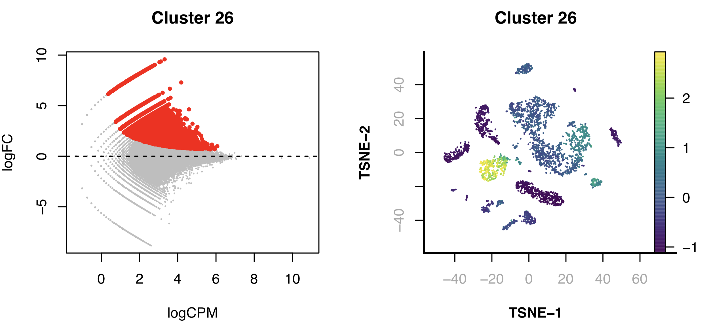 

Next, we identify DARs for each of the clusters. For clusters, especially the small ones, that lack the static power to reveal DARs, we rank the peaks based on the enrichment and use the top 2000 peaks as representative peaks for motif discovery.

```R
> idy.ls = lapply(levels(x.sp@cluster), function(cluster_i){
	DARs = findDAR(
		obj=x.sp,
		input.mat="pmat",
		cluster.pos=cluster_i,
		cluster.neg=NULL,
		cluster.neg.method="knn",
		bcv=0.1,
		test.method="exactTest",
		seed.use=10
		);
	DARs$FDR = p.adjust(DARs$PValue, method="BH");
	idy = which(DARs$FDR < 5e-2 & DARs$logFC > 0);
	if((x=length(idy)) < 2000L){
			PValues = DARs$PValue;
			PValues[DARs$logFC < 0] = 1;
			idy = order(PValues, decreasing=FALSE)[1:2000];
			rm(PValues); # free memory
	}
	idy
  })
> names(idy.ls) = levels(x.sp@cluster);
> par(mfrow = c(3, 3));
> for(cluster_i in levels(x.sp@cluster)){
	print(cluster_i)
	idy = idy.ls[[cluster_i]];
	vals = Matrix::rowSums(x.sp@pmat[,idy]) / covs;
	vals.zscore = (vals - mean(vals)) / sd(vals);
	plotFeatureSingle(
		obj=x.sp,
		feature.value=vals.zscore,
		method="tsne", 
		main=cluster_i,
		point.size=0.1, 
		point.shape=19, 
		down.sample=5000,
		quantiles=c(0.01, 0.99)
		);
  }
```

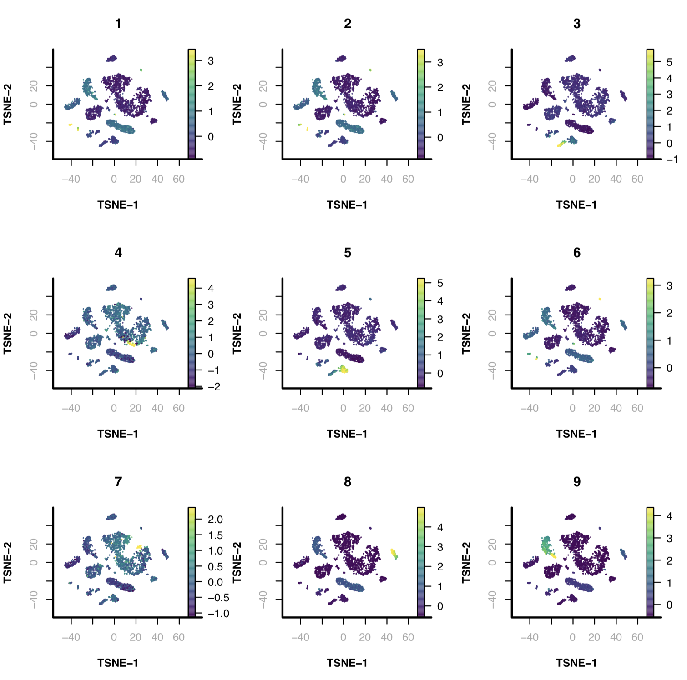 

<a name="homer_chromVAR"></a>**Step 15. Motif analysis identifies master regulators**       
SnapATAC employs Homer to identify master regulators that are enriched in the differentially accessible regions (DARs). This will creates a homer motif report `knownResults.html` in the folder `./homer/C5`. This requires Homer to be pre-installed. See [here](http://homer.ucsd.edu/homer/introduction/install.html) for the instruction about how to install Homer.

```R
> system("which findMotifsGenome.pl");
/projects/ps-renlab/r3fang/public_html/softwares/homer/bin/findMotifsGenome.pl
> motifs = runHomer(
	x.sp[,idy.ls[["5"]],"pmat"], 
	mat = "pmat",
	path.to.homer = "/projects/ps-renlab/r3fang/public_html/softwares/homer/bin/findMotifsGenome.pl",
	result.dir = "./homer/C5",
	num.cores=5,
	genome = 'mm10',
	motif.length = 10,
	scan.size = 300,
	optimize.count = 2,
	background = 'automatic',
	local.background = FALSE,
	only.known = TRUE,
	only.denovo = FALSE,
	fdr.num = 5,
	cache = 100,
	overwrite = TRUE,
	keep.minimal = FALSE
  );
```
See [here](http://renlab.sdsc.edu/r3fang/share/github/Mouse_Brain_10X/homer/C5/knownResults.html) for the full list of motifs for cluster 5.

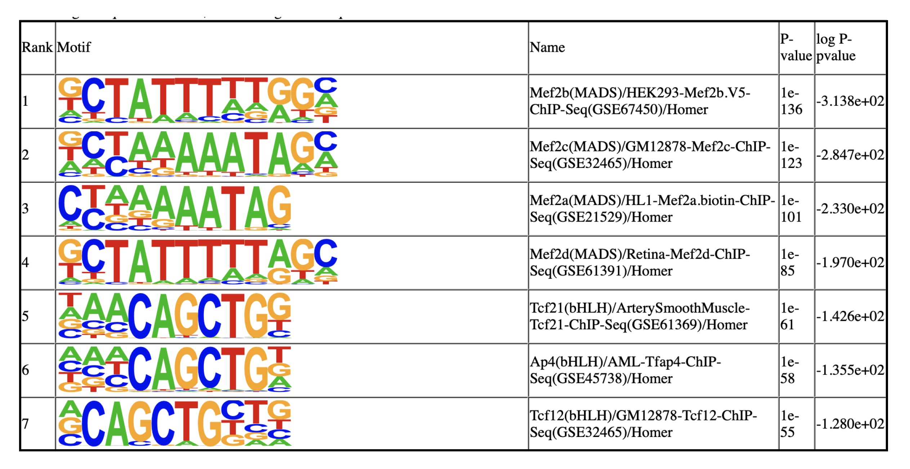 

SnapATAC also incorporates chromVAR (Schep et al) for motif variability analysis.

```R
> library(chromVAR);
> library(motifmatchr);
> library(SummarizedExperiment);
> library(BSgenome.Mmusculus.UCSC.mm10);
> x.sp = makeBinary(x.sp, "pmat");
> x.sp@mmat = runChromVAR(
    obj=x.sp,
    input.mat="pmat",
    genome=BSgenome.Mmusculus.UCSC.mm10,
    min.count=10,
    species="Homo sapiens"
  );
> motif_i = "MA0497.1_MEF2C";
> dat = data.frame(x=x.sp@metaData[,"cluster"], y=x.sp@mmat[,motif_i]);
> p1 <- ggplot(dat, aes(x=x, y=y, fill=x)) + 
	theme_classic() +
	geom_violin() + 
	xlab("cluster") +
	ylab("motif enrichment") + 
	ggtitle(motif_i) +
	theme(
		  plot.margin = margin(5,1,5,1, "cm"),
		  axis.text.x = element_text(angle = 90, hjust = 1),
		  axis.ticks.x=element_blank(),
		  legend.position = "none"
   );
> motif_i = "MA0660.1_MEF2B";
> dat = data.frame(x=x.sp@metaData[,"cluster"], y=x.sp@mmat[,motif_i]);
> p2 <- ggplot(dat, aes(x=x, y=y, fill=x)) + 
	theme_classic() +
	geom_violin() + 
	xlab("cluster") +
	ylab("motif enrichment") + 
	ggtitle(motif_i) +
	theme(
		  plot.margin = margin(5,1,5,1, "cm"),
		  axis.text.x = element_text(angle = 90, hjust = 1),
		  axis.ticks.x=element_blank(),
		  legend.position = "none"
   );
> p1
> p2
```

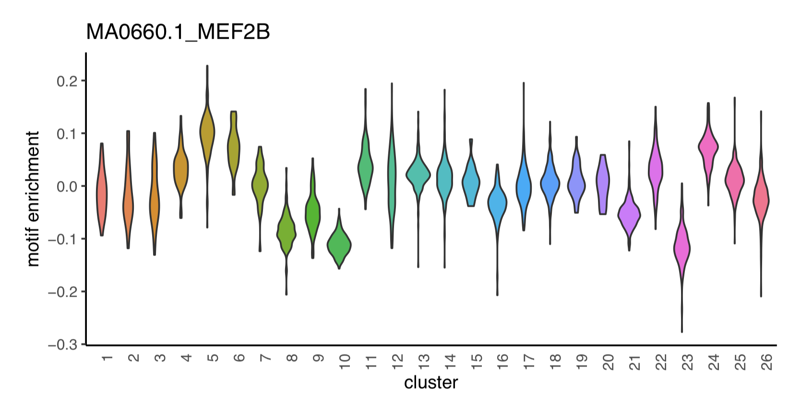 
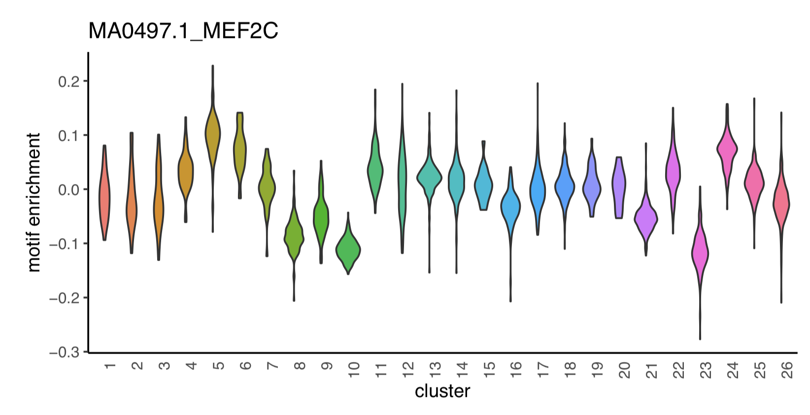 

<a name="great_analysis"></a>**Step 16. GREAT analysis**       
SnapATAC applies GREAT to identify biological pathways active in each of the cell cluster. In this example, we will first identify the differential elements in Microglia cells (cluster 13) and report the top 6 GO Ontologies enrichment inferred using GREAT analysis.

```R
## install R package rGREAT
> if (!requireNamespace("BiocManager", quietly=TRUE))
    install.packages("BiocManager")
> BiocManager::install("rGREAT")
## or install the latest version
> library(devtools)
> install_github("jokergoo/rGREAT")
```
```R
> library(rGREAT);
> DARs = findDAR(
    obj=x.sp,
    input.mat="pmat",
    cluster.pos=13,
    cluster.neg.method="knn",
    test.method="exactTest",
    bcv=0.1, #0.4 for human, 0.1 for mouse
    seed.use=10
  );
> DARs$FDR = p.adjust(DARs$PValue, method="BH");
> idy = which(DARs$FDR < 5e-2 & DARs$logFC > 0);
> job = submitGreatJob(
    gr                    = x.sp@peak[idy],
    bg                    = NULL,
    species               = "mm10",
    includeCuratedRegDoms = TRUE,
    rule                  = "basalPlusExt",
    adv_upstream          = 5.0,
    adv_downstream        = 1.0,
    adv_span              = 1000.0,
    adv_twoDistance       = 1000.0,
    adv_oneDistance       = 1000.0,
    request_interval = 300,
    max_tries = 10,
    version = "default",
    base_url = "http://great.stanford.edu/public/cgi-bin"
  );
> job
```
```
## Submit time: 2019-09-04 14:14:02
## Version: default
## Species: mm10
## Inputs: 25120 regions
## Background: wholeGenome
## Model: Basal plus extension
##   Proximal: 5 kb upstream, 1 kb downstream,
##   plus Distal: up to 1000 kb
## Include curated regulatory domains
## 
## Enrichment tables for following ontologies have been downloaded:
##   None
```

With `job`, we can now retrieve results from GREAT. The first and the primary results are the tables which contain enrichment statistics for the analysis. By default it will retrieve results from three GO Ontologies and all pathway ontologies. All tables contains statistics for all terms no matter they are significant or not. Users can then make filtering by a self-defined cutoff.

```R
> tb = getEnrichmentTables(job);
> names(tb);
```
```
## [1] "GO Molecular Function" "GO Biological Process" "GO Cellular Component"
```
```
> GBP = tb[["GO Biological Process"]];
> head(GBP[order(GBP[,"Binom_Adjp_BH"]),1:5]);
```

```
##           ID                                      name Binom_Genome_Fraction
## 1 GO:0002376                     immune system process            0.12515840
## 2 GO:0002682       regulation of immune system process            0.09012561
## 3 GO:0009987                          cellular process            0.80870120
## 4 GO:0048518 positive regulation of biological process            0.43002240
## 5 GO:0050789          regulation of biological process            0.68873070
## 6 GO:0050794            regulation of cellular process            0.66837300
##   Binom_Expected Binom_Observed_Region_Hits
## 1       3095.918                       5592
## 2       2229.347                       4148
## 3      20004.030                      22241
## 4      10637.030                      13697
## 5      17036.440                      19871
## 6      16532.870                      19356
```
