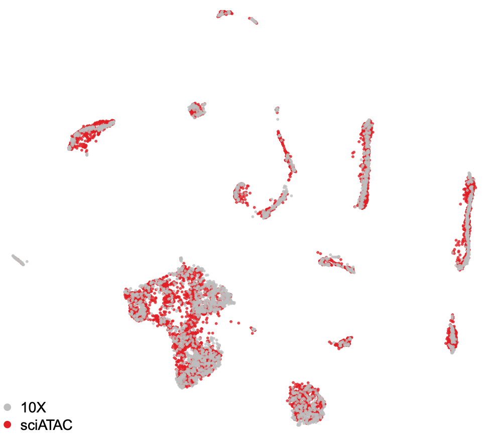

## Integrative Analysis of 10X and sci-ATAC

In this example, we will be combining two datasets of 10X and sciATAC-seq for adult mouse brain. The snap file can be downloaded from here: [10X](http://renlab.sdsc.edu/r3fang/share/Fang_2019/published_scATAC/atac_v1_adult_brain_fresh_5k_fastqs/atac_v1_adult_brain_fresh_5k.snap) and [sciATAC](http://renlab.sdsc.edu/r3fang/share/Fang_2019/published_scATAC/Fang_2019/CEMBA180305_2B.snap).



Step 1. Create snap object for each sample seperately

```R
> library(SnapATAC);
> system("wget http://renlab.sdsc.edu/r3fang/share/Fang_2019/published_scATAC/atac_v1_adult_brain_fresh_5k_fastqs/atac_v1_adult_brain_fresh_5k.snap");
> system("wget http://renlab.sdsc.edu/r3fang/share/Fang_2019/published_scATAC/Fang_2019/CEMBA180305_2B.snap");
> file.list = c("CEMBA180305_2B.snap", "atac_v1_adult_brain_fresh_5k.snap");
> sample.list = c("sciATAC", "10X");
> x1.sp = createSnap(file=file.list[1], sample=sample.list[1]);
> x2.sp = createSnap(file=file.list[2], sample=sample.list[2]);
```

Step 2. Barcode selection

```R
> plotBarcode(x1.sp, col="grey", border="grey", breaks=50);    
> plotBarcode(x2.sp, col="grey", border="grey", breaks=50);    
> x1.sp = filterCells(
	obj=x1.sp, 
	subset.names=c("fragment.num", "UMI"),
	low.thresholds=c(1000,500),
	high.thresholds=c(Inf, Inf)
	);
> x2.sp = filterCells(
	obj=x2.sp, 
	subset.names=c("fragment.num", "UMI"),
	low.thresholds=c(1000,1000),
	high.thresholds=c(Inf, Inf)
	);
```

Step 3. Add cell-by-bin matrix

```R
> x1.sp = addBmatToSnap(obj=x1.sp, bin.size=5000, num.cores=1);
> x2.sp = addBmatToSnap(obj=x2.sp, bin.size=5000, num.cores=1);
> x.sp.list = list(x1.sp, x2.sp);
```

Step 4. Combine multiple snap objects.

```R
> bin.shared = Reduce(intersect, lapply(x.sp.list, function(x.sp) x.sp@feature$name));
> x.sp.list <- lapply(x.sp.list, function(x.sp){
	idy = match(bin.shared, x.sp@feature$name);
	x.sp[,idy, mat="bmat"];
	})
> x.sp = Reduce(snapRbind, x.sp.list);
> rm(x.sp.list);
> gc();
```

Step 5. Matrix binarization

```R
> x.sp = makeBinary(x.sp, mat="bmat", outlier.filter=1e-3);
```

Step 6. Feature selection

```R
> system("wget http://mitra.stanford.edu/kundaje/akundaje/release/blacklists/mm10-mouse/mm10.blacklist.bed.gz");
> library(GenomicRanges);
> black_list = read.table("mm10.blacklist.bed.gz");
> black_list.gr = GRanges(
	black_list[,1], 
	IRanges(black_list[,2], black_list[,3])
	);
> idy1 = queryHits(findOverlaps(x.sp@feature, black_list.gr));
> idy2 = grep("chrM|random", x.sp@feature);
> idy = unique(c(idy1, idy2));
> x.sp = x.sp[,-idy, mat="bmat"];
> x.sp = filterBins(
	x.sp,
	low.threshold=-1.5,
	high.threshold=1.5,
	mat="bmat"
	);
```

Step 7. Jaccard index

```R
> x.sp = runJaccard(
	obj = x.sp,
	tmp.folder=tempdir(),
	mat = "bmat",
	max.var=2000,
	ncell.chunk=1000,
	do.par=FALSE,
	num.cores=1,
	seed.use=10
	);
```

Step 8. Normalize jaccard index

```R
> x.sp = runNormJaccard(
	obj = x.sp,
	tmp.folder=tempdir(),
	ncell.chunk=1000,
	method="normOVE",
	row.center=TRUE,
	row.scale=TRUE,
	low.threshold=-5,
	high.threshold=5,
	num.cores=10,
	seed.use=10
	);
```

Step 9. Linear Dimentionality Reduction

```R
> x.sp = runDimReduct(
	x.sp,
	pc.num=50,
	input.mat="jmat",
	method="svd",
	center=TRUE,
	scale=FALSE,
	seed.use=10
	);
```

Step 10. Visulization

```R
> x.sp = runViz(
	obj=x.sp, 
	tmp.folder=tempdir(),
	dims=2,
	pca.dims=1:40, 
	weight.by.sd=FALSE,
	method="umap",
	fast_tsne_path=NULL,
	Y.init=NULL,
	seed.use=10,
	num.cores=5
	);

> plotViz(
	obj=x.sp, 
	method="umap", 
	point.size=0.5, 
	point.shape=19, 
	point.alpha=0.8, 
	point.color="sample", 
	text.add=FALSE,
	text.size=3,
	text.color="black",
	text.halo.add=FALSE,
	text.halo.color="white",
	text.halo.width=0.2,
	down.sample=10000,
	pdf.file.name=NULL,
	pdf.width=7, 
	pdf.height=7,
	legend.add=TRUE
	);
```

Step 11. Remove batch effect

```
> x.sp = runHarmony(
	obj=x.sp, 
	pca.dims=1:40, 
	weight.by.sd=FALSE,
	meta_data=x.sp@sample
	);

```

Step 12. Find cluster

```R
> x.sp = runKNN(
    obj=x.sp,
    pca.dims=1:40,
    weight.by.sd=FALSE,
    k=15
    );

> x.sp = runCluster(
	obj=x.sp,
	tmp.folder=tempdir(),
	louvain.lib="R-igraph",
	path.to.snaptools=NULL,
	seed.use=10
	);
```

Step 13. Visualization

```R
> x.sp = runViz(
	obj=x.sp, 
	tmp.folder=tempdir(),
	dims=2,
	pca.dims=1:40, 
	weight.by.sd=FALSE,
	method="Rtsne",
	fast_tsne_path=NULL,
	Y.init=NULL,
	seed.use=10,
	num.cores=5
	);

> plotViz(
	obj=x.sp, 
	method="umap", 
	point.size=0.3, 
	point.shape=19, 
	point.alpha=0.8, 
	point.color="sample", 
	text.add=FALSE,
	text.size=3,
	text.color="black",
	text.halo.add=FALSE,
	text.halo.color="white",
	text.halo.width=0.2,
	down.sample=10000,
	pdf.file.name=NULL,
	pdf.width=7, 
	pdf.height=7,
	legend.add=TRUE
	);

> plotViz(
	obj=x.sp, 
	method="umap", 
	point.size=0.5, 
	point.shape=19, 
	point.alpha=0.8, 
	point.color="cluster", 
	text.add=TRUE,
	text.size=1.5,
	text.color="black",
	text.halo.add=TRUE,
	text.halo.color="white",
	text.halo.width=0.2,
	down.sample=10000,
	pdf.file.name=NULL,
	pdf.width=7, 
	pdf.height=7
	);
```
