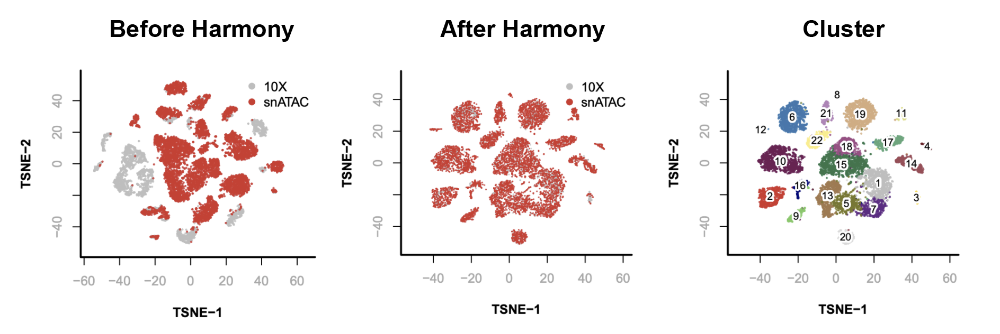
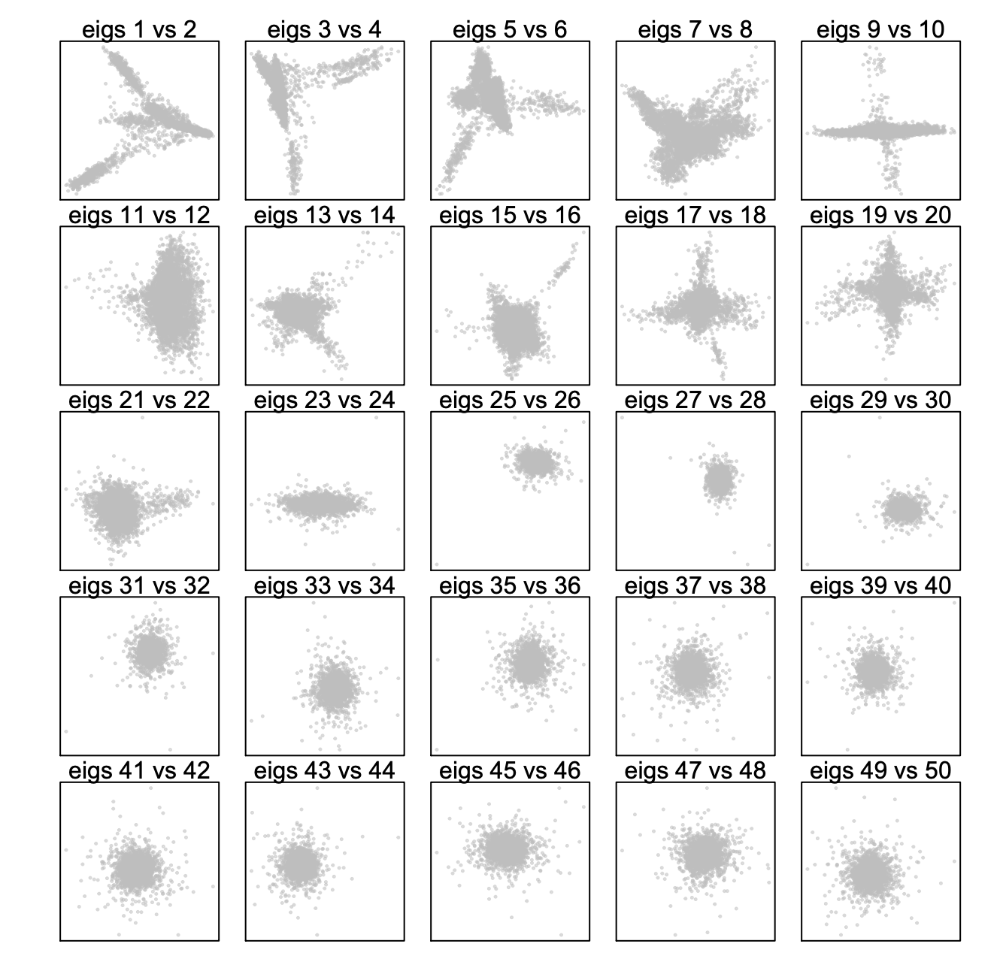
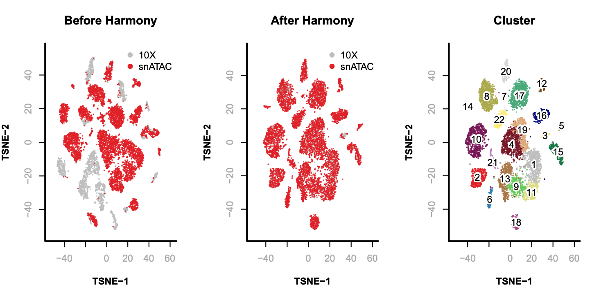

## Integrative Analysis of 10X and snATAC

In this example, we will be integrating two datasets from adult mouse brain generated using 10X and snATAC-seq. 

  

## Table of Contents

- [Step 0. Download data](#download_data)
- [Step 1. Create snap object](#create_snap)
- [Step 2. Select barcode](#select_barcode)
- [Step 3. Add cell-by-bin matrix](#add_bmat)
- [Step 4. Combine snap objects](#combine_snap)
- [Step 5. Filter bins](#filter_bin)
- [Step 6. Dimensionality reduction](#reduce_dim)
- [Step 7. Determine significant components](#select_dim)
- [Step 8. Remove batch effect](#run_harmony)
- [Step 9. Graph-based cluster](#cluster)
- [Step 10. Visualization](#viz)


<a name="download_data"></a>**Step 0. Download data**

We will download the snap file(See [here](https://drive.google.com/drive/folders/1yI2DNLxRhyAJJt8ogkDZs1uBKAUyy5gt?usp=sharing)).

[comment]: <> (```)

[comment]: <> ($ wget http://renlab.sdsc.edu/r3fang/share/github/Mouse_Brain_10X_snATAC/CEMBA180305_2B.snap)

[comment]: <> ($ wget http://renlab.sdsc.edu/r3fang/share/github/Mouse_Brain_10X_snATAC/CEMBA180305_2B.barcode.txt)

[comment]: <> ($ wget http://renlab.sdsc.edu/r3fang/share/github/Mouse_Brain_10X_snATAC/atac_v1_adult_brain_fresh_5k.snap	)

[comment]: <> ($ wget http://renlab.sdsc.edu/r3fang/share/github/Mouse_Brain_10X_snATAC/atac_v1_adult_brain_fresh_5k.barcode.txt)

[comment]: <> (```)

<a name="create_snap"></a>**Step 1. Create snap object**       
In this example, we will create a list of snap objects that contains two datasets.

```R
> library(SnapATAC);
> file.list = c("CEMBA180305_2B.snap", "atac_v1_adult_brain_fresh_5k.snap");
> sample.list = c("snATAC", "10X");
> x.sp.ls = lapply(seq(file.list), function(i){
    x.sp = createSnap(file=file.list[i], sample=sample.list[i]);
    x.sp
  })
> names(x.sp.ls) = sample.list;
> sample.list
```
```
## $snATAC
## number of barcodes: 15136
## number of bins: 0
## number of genes: 0
## number of peaks: 0
## number of motifs: 0
## 
## $`10X`
## number of barcodes: 20000
## number of bins: 0
## number of genes: 0
## number of peaks: 0
## number of motifs: 0
```

<a name="create_snap"></a>**Step 2. Select barcode**        
Next, we read the barcode list which contains the high-quality barcodes. See [here](https://github.com/r3fang/SnapATAC/blob/master/examples/10X_brain_5k/README.md) for barcode selection.

```R
> barcode.file.list = c("CEMBA180305_2B.barcode.txt", "atac_v1_adult_brain_fresh_5k.barcode.txt");
> barcode.list = lapply(barcode.file.list, function(file){
    read.table(file)[,1];
  })
> x.sp.list = lapply(seq(x.sp.ls), function(i){
    x.sp = x.sp.ls[[i]];
    x.sp  = x.sp[x.sp@barcode %in% barcode.list[[i]],];
  })
> names(x.sp.list) = sample.list;
```
```
## $snATAC
## number of barcodes: 9646
## number of bins: 0
## number of genes: 0
## number of peaks: 0
## number of motifs: 0
## 
## $`10X`
## number of barcodes: 4100
## number of bins: 0
## number of genes: 0
## number of peaks: 0
## number of motifs: 0
```

<a name="add_bmat"></a>**Step 3. Add cell-by-bin matrix**        

```R
> x.sp.list = lapply(seq(x.sp.list), function(i){
    x.sp = addBmatToSnap(x.sp.list[[i]], bin.size=5000);
    x.sp
  })
> x.sp.list
```
```
## $snATAC
## number of barcodes: 9646
## number of bins: 545118
## number of genes: 0
## number of peaks: 0
## number of motifs: 0
## 
## $`10X`
## number of barcodes: 4100
## number of bins: 546206
## number of genes: 0
## number of peaks: 0
## number of motifs: 0
```
These two snap objects have different number of bins because they were generated seperately using slightly different reference genome.  

<a name="combine_snap"></a>**Step 4. Combine snap objects**         
To combine these two snap objects, common bins are selected.

```R
> bin.shared = Reduce(intersect, lapply(x.sp.list, function(x.sp) x.sp@feature$name));
> x.sp.list <- lapply(x.sp.list, function(x.sp){
    idy = match(bin.shared, x.sp@feature$name);
    x.sp[,idy, mat="bmat"];
  })
> x.sp = Reduce(snapRbind, x.sp.list);
> rm(x.sp.list); # free memory
> gc();
> table(x.sp@sample);
```
```
##   10X snATAC
##  4100   9646
```

<a name="binary_mat"></a>**Step 5. Binarize matrix**      

```R
> x.sp = makeBinary(x.sp, mat="bmat");
```

<a name="filter_bin"></a>**Step 6. Filter bins**            
First, we filter out any bins overlapping with the ENCODE blacklist to prevent from potential artifacts.

```R
> system("wget http://mitra.stanford.edu/kundaje/akundaje/release/blacklists/mm10-mouse/mm10.blacklist.bed.gz");
> library(GenomicRanges);
> black_list = read.table("mm10.blacklist.bed.gz");
> black_list.gr = GRanges(
    black_list[,1], 
    IRanges(black_list[,2], black_list[,3])
  );
> idy = queryHits(findOverlaps(x.sp@feature, black_list.gr));
> if(length(idy) > 0){x.sp = x.sp[,-idy, mat="bmat"]};
> x.sp
```
```
## number of barcodes: 13746
## number of bins: 545015
## number of genes: 0
## number of peaks: 0
## number of motifs: 0
```

Second, we remove unwanted chromosomes.

```R
> chr.exclude = seqlevels(x.sp@feature)[grep("random|chrM", seqlevels(x.sp@feature))];
> idy = grep(paste(chr.exclude, collapse="|"), x.sp@feature);
> if(length(idy) > 0){x.sp = x.sp[,-idy, mat="bmat"]};
> x.sp
```
```
## number of barcodes: 13746
## number of bins: 545011
## number of genes: 0
## number of peaks: 0
## number of motifs: 0
```

Third, the bin coverage roughly obeys a log normal distribution. We remove the top 5% bins that overlap with invariant features such as promoters of the house keeping genes.

```R
> bin.cov = log10(Matrix::colSums(x.sp@bmat)+1);
> bin.cutoff = quantile(bin.cov[bin.cov > 0], 0.95);
> idy = which(bin.cov <= bin.cutoff & bin.cov > 0);
> x.sp = x.sp[, idy, mat="bmat"];
> x.sp
```
```
## number of barcodes: 13746
## number of bins: 479127
## number of genes: 0
## number of peaks: 0
## number of motifs: 0
```

<a name="reduce_dim"></a>**Step 7. Reduce dimensionality**            
We compute landmark diffusion maps for dimentionality reduction. We first randomly sample 10,000 cells as landmarks and project the remaining cells (query) onto the diffusion maps embedding.

```R
> row.covs = log10(Matrix::rowSums(x.sp@bmat)+1);
> row.covs.dens = density(
    x = row.covs, 
    bw = 'nrd', adjust = 1
  );
> sampling_prob = 1 / (approx(x = row.covs.dens$x, y = row.covs.dens$y, xout = row.covs)$y + .Machine$double.eps); 
> set.seed(1);
> idx.landmark.ds = sort(sample(x = seq(nrow(x.sp)), size = 10000, prob = sampling_prob));
> x.landmark.sp = x.sp[idx.landmark.ds,];
> x.query.sp = x.sp[-idx.landmark.ds,];
> x.landmark.sp = runDiffusionMaps(
    obj= x.landmark.sp,
    input.mat="bmat", 
    num.eigs=50
  );
> x.query.sp = runDiffusionMapsExtension(
    obj1=x.landmark.sp, 
    obj2=x.query.sp,
    input.mat="bmat"
  );
> x.landmark.sp@metaData$landmark = 1;
> x.query.sp@metaData$landmark = 0;
> x.sp = snapRbind(x.landmark.sp, x.query.sp);
## combine landmarks and query cells;
> x.sp = x.sp[order(x.sp@sample),]; # IMPORTANT
> rm(x.landmark.sp, x.query.sp); # free memory
```

<a name="select_dim"></a>**Step 8. Determine significant components**            

```R
> plotDimReductPW(
    obj=x.sp, 
    eigs.dims=1:50,
    point.size=0.3,
    point.color="grey",
    point.shape=19,
    point.alpha=0.6,
    down.sample=5000,
    pdf.file.name=NULL, 
    pdf.height=7, 
    pdf.width=7
  );
```

  

<a name="run_harmony"></a>**Step 9. Remove batch effect**

```
> library(harmony);
> x.after.sp = runHarmony(
    obj=x.sp, 
    eigs.dims=1:22, 
    meta_data=x.sp@sample # sample index
  );
```

<a name="cluster"></a>**Step 10. Graph-based cluster**

```R
> x.after.sp = runKNN(
    obj= x.after.sp,
    eigs.dim=1:22,
    k=15
  );
> x.after.sp = runCluster(
     obj=x.after.sp,
     tmp.folder=tempdir(),
     louvain.lib="R-igraph",
     path.to.snaptools=NULL,
     seed.use=10
  );
> x.after.sp@metaData$cluster = x.after.sp@cluster;
```

<a name="viz"></a>**Step 11. Visualization**

```R
> x.sp = runViz(
    obj=x.sp, 
    tmp.folder=tempdir(),
    dims=2,
    eigs.dims=1:22, 
    method="Rtsne",
    seed.use=10
  );
> x.after.sp = runViz(
    obj=x.after.sp, 
    tmp.folder=tempdir(),
    dims=2,
    eigs.dims=1:22, 
    method="Rtsne",
    seed.use=10
  );
> par(mfrow = c(2, 3));
> plotViz(
    obj=x.sp,
    method="tsne", 
    main="Before Harmony",
    point.color=x.sp@sample, 
    point.size=0.1, 
    text.add= FALSE,
    down.sample=10000,
    legend.add=TRUE
  );
> plotViz(
    obj=x.after.sp,
    method="tsne", 
    main="After Harmony",
    point.color=x.sp@sample, 
    point.size=0.1, 
    text.add=FALSE,
    down.sample=10000,
    legend.add=TRUE
  );
> plotViz(
    obj=x.after.sp,
    method="tsne", 
    main="Cluster",
    point.color=x.after.sp@cluster, 
    point.size=0.1, 
    text.add=TRUE,
    text.size=1,
    text.color="black",
    text.halo.add=TRUE,
    text.halo.color="white",
    text.halo.width=0.2,
    down.sample=10000,
    legend.add=FALSE
  );
```

  


