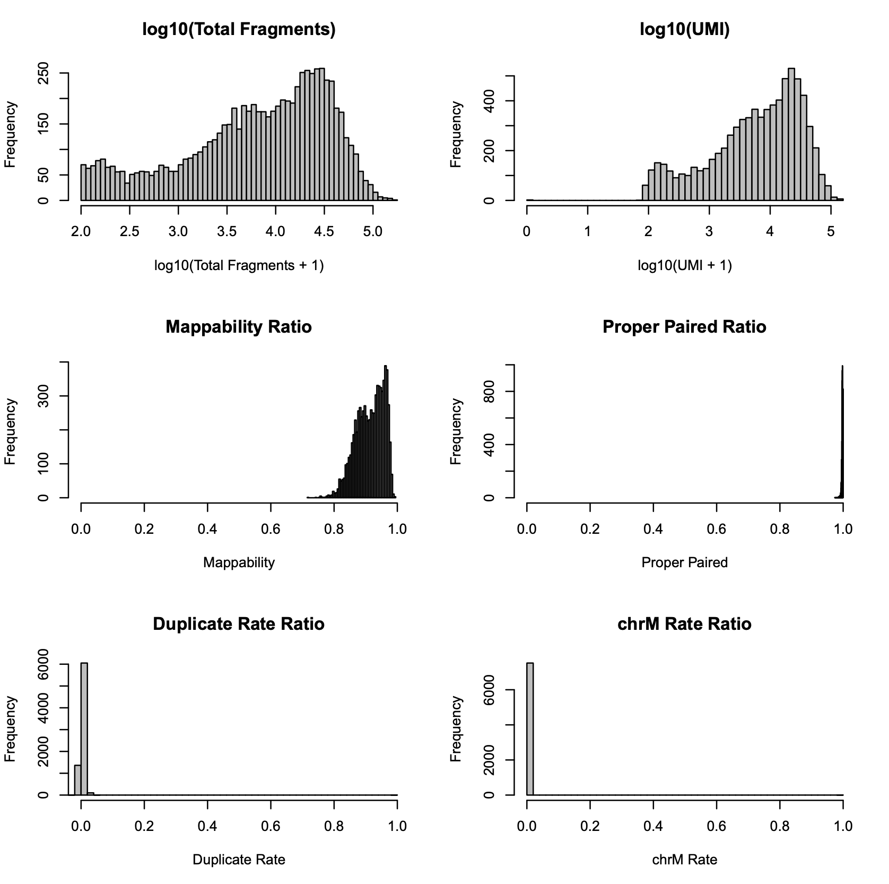
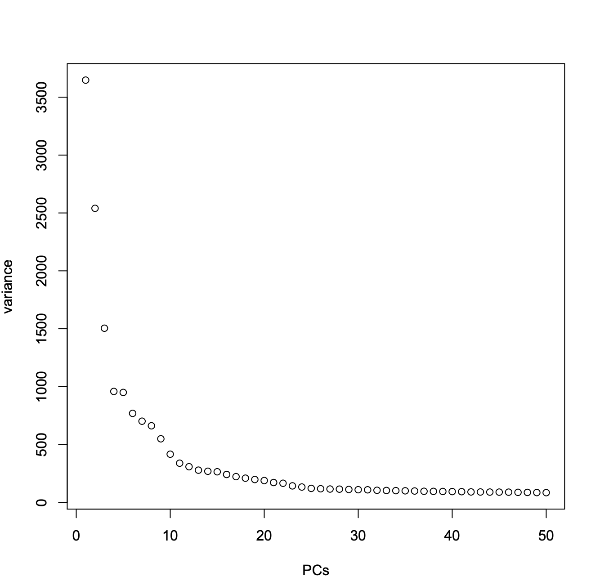
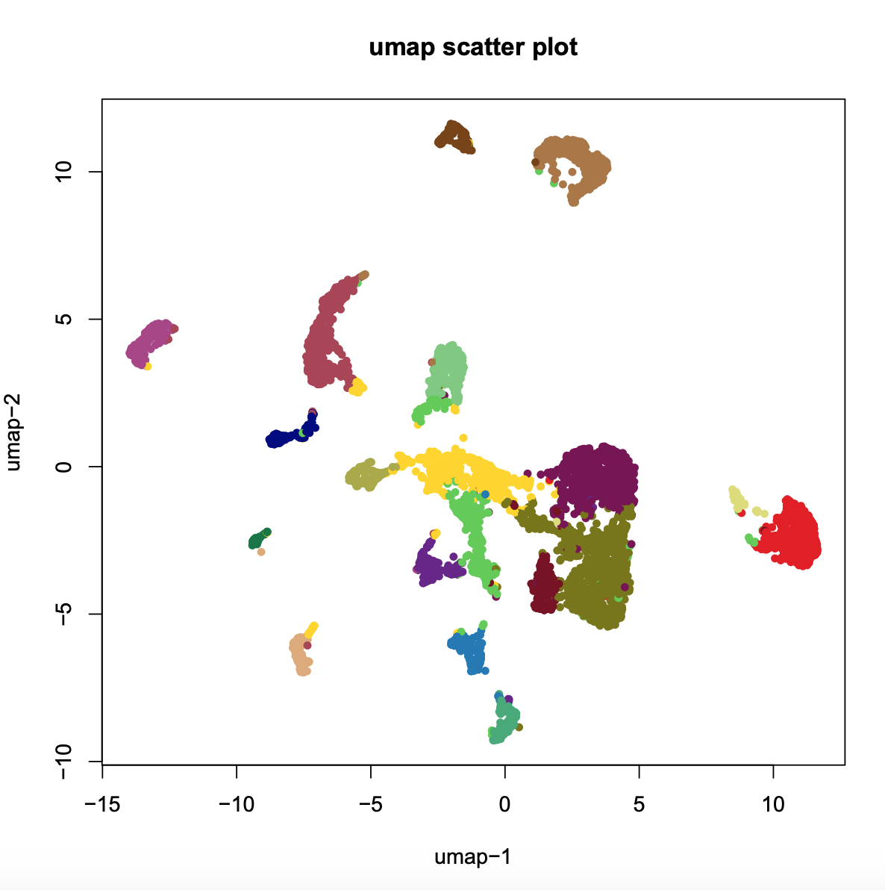
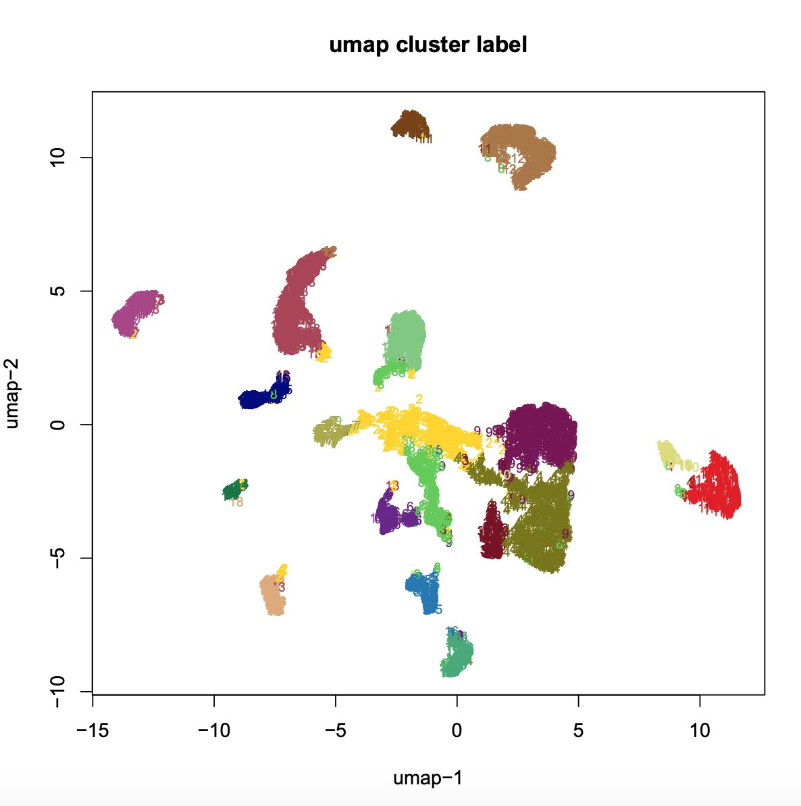
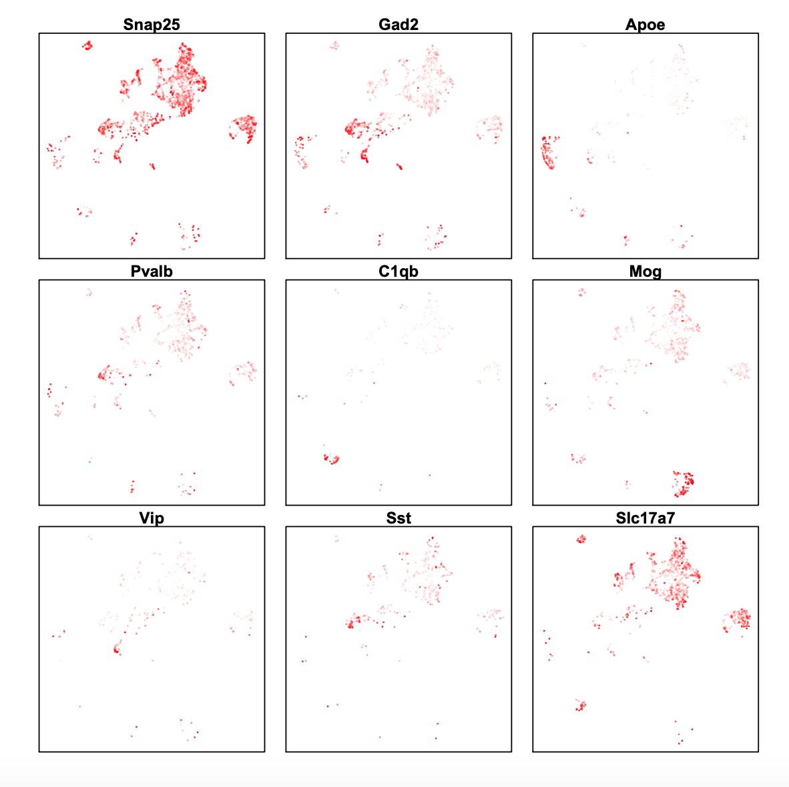
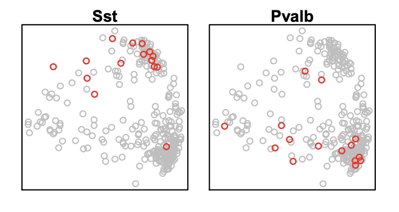
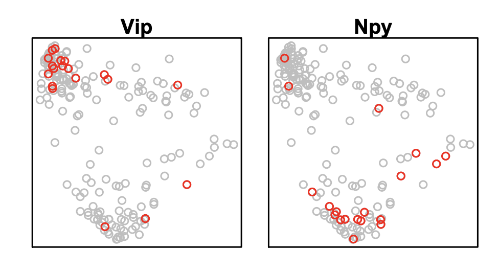

## Re-analysis of mouse pre-frontal cortex (PFC) from Cusanovich 2018 

**Step 1. Download pre-frontal cortex sciATAC-seq dataset from UW mouse atlas website**.      
Here we download the bam file that contains the alingments. Based on the header info, reads are mapped to mm9 using bowtie2 with parameters `basic-0 -p 12 -X 2000 -3 1 -x` and sorted by coordiantes. In order to generate `snap` file, we first need to re-sort the reads based on the read name.

```
> wget http://krishna.gs.washington.edu/content/members/ajh24/mouse_atlas_data_release/bams/PreFrontalCortex_62216.bam
> samtools view PreFrontalCortex_62216.bam -H
> 
@HD	VN:1.0	SO:coordinate
@SQ	SN:chr1	LN:197195432
@SQ	SN:chr2	LN:181748087
@SQ	SN:chr3	LN:159599783
@SQ	SN:chr4	LN:155630120
@SQ	SN:chr5	LN:152537259
@SQ	SN:chr6	LN:149517037
@SQ	SN:chr7	LN:152524553
@SQ	SN:chr8	LN:131738871
@SQ	SN:chr9	LN:124076172
@SQ	SN:chr10	LN:129993255
@SQ	SN:chr11	LN:121843856
@SQ	SN:chr12	LN:121257530
@SQ	SN:chr13	LN:120284312
@SQ	SN:chr14	LN:125194864
@SQ	SN:chr15	LN:103494974
@SQ	SN:chr16	LN:98319150
@SQ	SN:chr17	LN:95272651
@SQ	SN:chr18	LN:90772031
@SQ	SN:chr19	LN:61342430
@SQ	SN:chrX	LN:166650296
@SQ	SN:chrY	LN:15902555
@SQ	SN:chrM	LN:16299
@SQ	SN:chr1_random	LN:1231697
@SQ	SN:chr3_random	LN:41899
@SQ	SN:chr4_random	LN:160594
@SQ	SN:chr5_random	LN:357350
@SQ	SN:chr7_random	LN:362490
@SQ	SN:chr8_random	LN:849593
@SQ	SN:chr9_random	LN:449403
@SQ	SN:chr13_random	LN:400311
@SQ	SN:chr16_random	LN:3994
@SQ	SN:chr17_random	LN:628739
@SQ	SN:chrX_random	LN:1785075
@SQ	SN:chrY_random	LN:58682461
@SQ	SN:chrUn_random	LN:5900358
@PG	ID:bowtie2	PN:bowtie2	VN:2.2.3	CL:"/net/gs/vol3/software/modules-sw/bowtie2/2.2.3/Linux/RHEL6/x86_64/bowtie2-align-s --wrapper basic-0 -p 12 -X 2000 -3 1 -x /net/shendure/vol7/cusanovi/genomes/mm9/tophat/mm9 -1 /tmp/43657.inpipe1 -2 /tmp/43657.inpipe2"
@PG	ID:bowtie2-23511DC3	PN:bowtie2	VN:2.2.3	CL:"/net/gs/vol3/software/modules-sw/bowtie2/2.2.3/Linux/RHEL6/x86_64/bowtie2-align-s --wrapper basic-0 -p 12 -X 2000 -3 1 -x /net/shendure/vol7/cusanovi/genomes/mm9/tophat/mm9 -1 /tmp/40271.inpipe1 -2 /tmp/40271.inpipe2"

> samtools sort -n -@ 5 PreFrontalCortex_62216.bam -o PreFrontalCortex_62216.nsrt.bam
```

**Step 2. Pre-processing (snaptools)**.         
After sorted by read name, we next create a snap file with the following command. 

```bash
> wget http://hgdownload.cse.ucsc.edu/goldenPath/mm9/bigZips/mm9.chrom.sizes
> snaptools snap-pre	\
	--input-file=PreFrontalCortex_62216.nsrt.bam	\
	--output-snap=PreFrontalCortex_62216.snap	\
	--genome-name=mm9	\
	--genome-size=mm9.chrom.sizes	\
	--min-mapq=30	\
	--min-flen=0	\
	--max-flen=1000	\
	--keep-chrm=FALSE	\
	--keep-single=TRUE	\
	--keep-secondary=False	\
	--overwrite=True	\
	--min-cov=100	\
	--verbose=True
```

**Step 3. Cell-by-bin matrix (snaptools)**.         
Using generated snap file, we next create the cell-by-bin matrix with 5kb resolution. 

```bash
> snaptools snap-add-bmat	\
	--snap-file=PreFrontalCortex_62216.snap	\
	--bin-size-list 1000 5000 10000      
```

**Step 4. Cell-by-gene matrix (snaptools)**.         
Using generated snap file, we next create the cell-by-bin matrix with 5kb resolution. 

```bash
> snaptools snap-add-gmat	\
	--snap-file=PreFrontalCortex_62216.snap	\
	--gene-file=gencode.vM1.annotation.gene.bed       
```


**Step 4. Create a snap object (snapATAC).**

```R
> R
> library(snapATAC)
> x.sp = createSnap("PreFrontalCortex_62216.snap", metaData=TRUE);
> plotBarcode(x.sp);
# filter cells based on the following cutoffs
> x.sp = filterCells(x.sp,
                     subset.names=c("UMI"),
                     low.thresholds=c(1000),
                     high.thresholds=c(Inf)
                     );
> Summary(x.sp);

Total  number of barcodes: 6247
Median number of sequencing fragments: 13034
Median number of uniquely mapped fragments: 11833
Median number of mappability ratio: 0.92
Median number of properly paired ratio: 1
Median number of duplicate ratio: 0
Median number of chrM ratio: 0
Median number of unique molecules (UMI): 11833

> x.sp 

number of barcodes: 6247
number of bins: 0
number of peaks: 0
number of genes: 0
==========================
meta data            (metData) :  TRUE
cellxbin matrix      (bmat)    :  FALSE
cellxpeak matrix     (pmat)    :  FALSE
cellxgene matrix     (gmat)    :  FALSE
jaccard matrix       (jmat)    :  FALSE
normalization        (nmat)    :  FALSE
PCA:                 (smat)    :  FALSE
cluster:             (cluster) :  FALSE
t-sne:               (tsne)    :  FALSE
umap:                (umap)    :  FALSE
```



**Step 5. Add cell-by-bin matrix** 

```R
# show what bin sizes exist in Cusanovich_PreFrontalCortex.snap file
> showBinSizes("PreFrontalCortex_62216.snap");
[1]  1000  5000 10000
> x.sp = addBmat(x.sp, "PreFrontalCortex_62216.snap", binSize=5000);
> checkBinSize(x.sp);
[1] 0.989501
```

**Step 6. Make it to binary matrix.**

```R
> x.sp = makeBinary(x.sp, mat="bmat");
```

**Step 7. Feature Selection.**        
We filtered bins that are mapped to random chromsome, overlapping with blacklisted genomic regions and 0 coverage bins.

```R
# remove bins that overlap with black list
> system("wget http://mitra.stanford.edu/kundaje/akundaje/release/blacklists/mm9-mouse/mm9-blacklist.bed.gz")
> black.list.mm9 = read.table("mm9-blacklist.bed.gz");
> black.list.mm9 = GRanges(
                           black.list.mm9[,1],
                           IRanges(black.list.mm9[,2], black.list.mm9[,3])
                           )
> idy1 = queryHits(findOverlaps(x.sp@feature, black.list.mm9));
# remove bins that are mapped to undesired chromsomes
> idy2 = grep("random|chrM", x.sp@feature);
# remove bins that are not covered 
> idy = unique(c(idy1, idy2));
> x.sp = x.sp[,-idy, mat="bmat"];
> plotBinCoverage(x.sp);
> x.sp = filterBins(
                    x.sp,
                    low.threshold=-2,
                    high.threshold=2,
                    mat="bmat"
                    )
> x.sp

number of barcodes: 6247
number of bins: 473113
number of peaks: 0
number of genes: 0
==========================
meta data            (metData) :  TRUE
cellxbin matrix      (bmat)    :  TRUE
cellxpeak matrix     (pmat)    :  FALSE
cellxgene matrix     (gmat)    :  FALSE
jaccard matrix       (jmat)    :  FALSE
normalization        (nmat)    :  FALSE
PCA:                 (smat)    :  FALSE
cluster:             (cluster) :  FALSE
t-sne:               (tsne)    :  FALSE
umap:                (umap)    :  FALSE
```


**Step 8. Jaccard Index Matrix & Normalization.**

```R
> x.sp = calJaccard(
    x.sp,
	mat = "bmat",
	ncell.chunk=5000,
	max.var=5000,
	seed.use=10,
	norm.method="normOVE",
	row.center=TRUE,
	row.scale=TRUE,
	low.threshold=-5,
	high.threshold=5,
	keep.jmat=FALSE,
	do.par=TRUE,
	num.cores=3
	)
```

**Step 9. PCA analysis.**

```
> x.sp = runPCA(
	x.sp,
	pc.num=50,
	input.mat="nmat",
	method="svd",
	weight.by.sd = FALSE,
	center=TRUE,
	scale=FALSE,
	seed.use=10
	)
```

**Step 10. Determine the significant principle components.**

```
> plotPCA(x.sp, method="elbow");
> plotPCA(x.sp, method="pairwise");
```

 


**Step 11. Find clusters.**

```R
> x.sp = runCluster(
                    x.sp,
                    pca_dims=1:20,
                    k=15,
                    resolution=1.0,
                    method="jaccard_louvain",
                    path_to_snaptools="/home/r3fang/anaconda2/bin/snaptools"
                    )
```

**Step 12. Visulization**

```	
> x.sp = runViz(
                x.sp, 
	            pca_dims=1:20, 
	            dims=2, 
	            method="umap"
	            )
> plotViz(x.sp, method="umap", pch=19, cex=0.7);
```
 

**Step 13. Gene accessibility enrichment for expected marker genes**

```R
> x.sp = addGmat(x.sp, "PreFrontalCortex_62216.snap");
> x.sp = scaleCountMatrix(
                          x.sp, 
                          mat="gmat", 
                          cov=rowSums(x.sp, mat="bmat"), 
                          method="RPM"
                          );
> marker.genes <- c("Snap25", "Gad2", "Apoe", 
                    "Pvalb", "C1qb", "Mog",
                    "Vip",    "Sst", "Slc17a7"
                    );
> plotGene(
           obj=x.sp, 
           gene.sel=marker.genes, 
           method="umap", 
           plot.row=3,
           plot.col=3, 
           cex=0.2,
		   background=TRUE,
		   background_rho=0.4,
           binary=FALSE
           );
```



**Step 15. Subclustering of cluster 9 (Sst+Pv)**

```R
> idx = which(x.sp@cluster == 19);
> x.sub.sp = x.sp[idx,]
> x.sub.sp = filterBins(
                    x.sub.sp,
                    low.threshold=-2,
                    high.threshold=2,
                    mat="bmat"
                    );
> x.sub.sp = calJaccard(
	x.sub.sp,
	mat = "bmat",
	ncell.chunk=5000,
	max.var=5000,
	seed.use=10,
	norm.method="normOVE",
	row.center=TRUE,
	row.scale=TRUE,
	low.threshold=-5,
	high.threshold=5,
	keep.jmat=FALSE,
	do.par=TRUE,
	num.cores=3
	)
> x.sub.sp = runPCA(
	x.sub.sp,
	pc.num=30,
	input.mat="nmat",
	method="svd",
	weight.by.sd = FALSE,
	center=TRUE,
	scale=FALSE,
	seed.use=10
	)
> x.sub.sp@tsne = x.sub.sp@smat[,c(1,2)]
> marker.genes = c("Sst","Pvalb");
> gene.sel.gr =gene.gr[match(marker.genes, gene.gr$gene_name),];
> x.sub.sp = calCellGeneTable(
                          x.sub.sp, 
                          gene.sel.gr, 
                          mat="bmat"
                          );
> x.sub.sp = scaleCountMatrix(
                          x.sub.sp, 
                          mat="gmat", 
                          cov=rowSums(x.sub.sp, mat="bmat"), 
                          method="RPM"
                          );
> plotGene(
           x.sub.sp, 
           gene.sel= marker.genes, 
           method="tsne", 
           binary=TRUE,
           p=0.05, 
           plot.row=2,
           plot.col=2,
           cex=1);

```



**Step 16. Subclustering of cluster 6 (Vip+Npy)**

```R
> idx = which(x.sp@cluster == 7);
> x.sub.sp = x.sp[idx,]
> x.sub.sp = filterBins(
    x.sub.sp,
    low.threshold=-2,
    high.threshold=2,
    mat="bmat"
    );
> x.sub.sp = calJaccard(
	x.sub.sp,
	mat = "bmat",
	ncell.chunk=5000,
	max.var=5000,
	seed.use=10,
	norm.method="normOVE",
	row.center=TRUE,
	row.scale=TRUE,
	low.threshold=-5,
	high.threshold=5,
	keep.jmat=FALSE,
	do.par=TRUE,
	num.cores=3
	)
> x.sub.sp = runPCA(
	x.sub.sp,
	pc.num=30,
	input.mat="nmat",
	method="svd",
	weight.by.sd = FALSE,
	center=TRUE,
	scale=FALSE,
	seed.use=10
	)
> x.sub.sp@tsne = x.sub.sp@smat[,c(1,2)]
> marker.genes <- c("Vip","Npy");
> gene.sel.gr <- gene.gr[match(marker.genes, gene.gr$gene_name),];
> x.sub.sp = calCellGeneTable(
                          x.sub.sp, 
                          gene.sel.gr, 
                          mat="bmat"
                          );
> x.sub.sp = scaleCountMatrix(
                          x.sub.sp, 
                          mat="gmat", 
                          cov=rowSums(x.sub.sp, mat="bmat"), 
                          method="RPM"
                          );
> plotGene(
           obj=x.sub.sp, 
           gene.sel=marker.genes, 
           method="tsne", 
           binary=TRUE,
           p=0.1, 
           cex=1
           );

```




