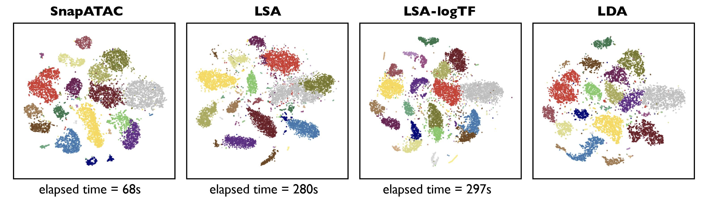
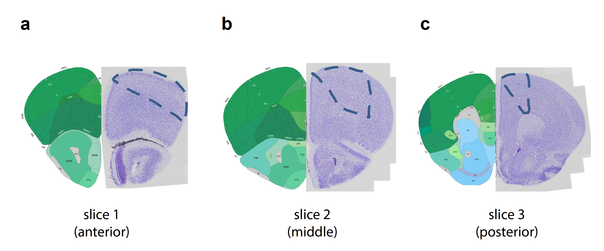
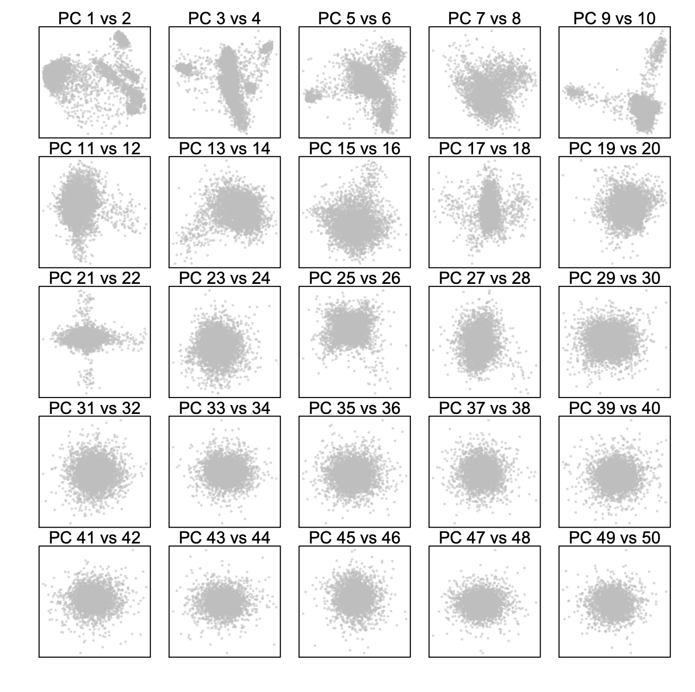
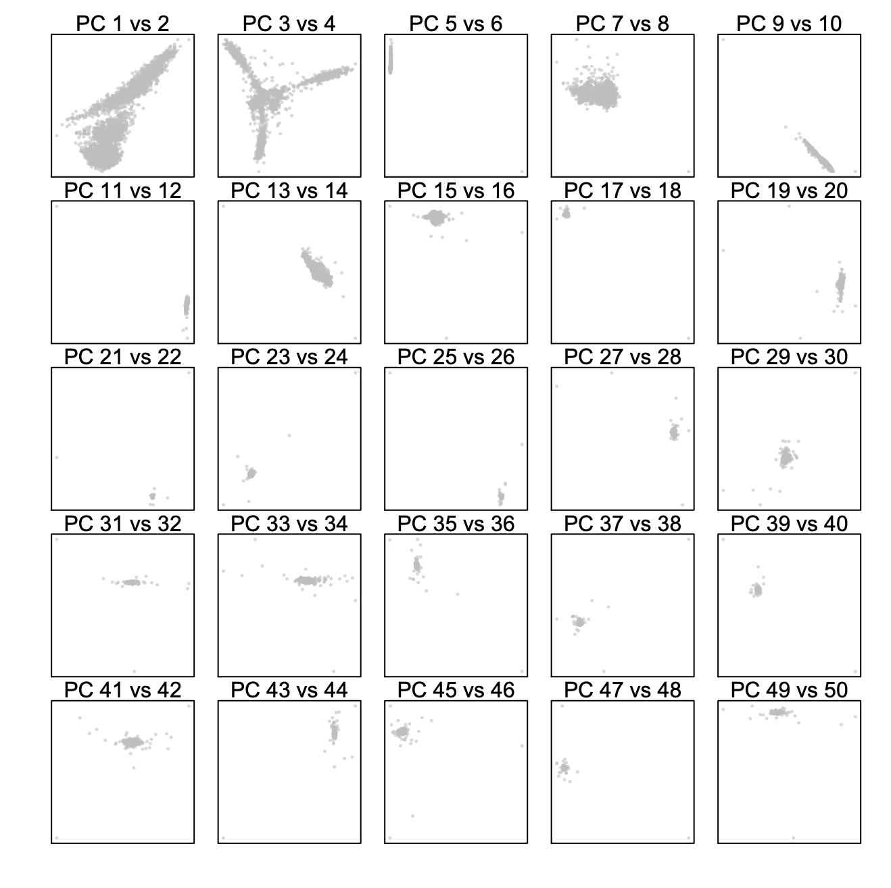
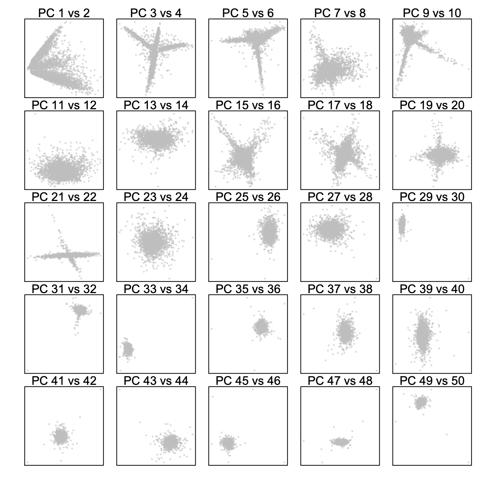
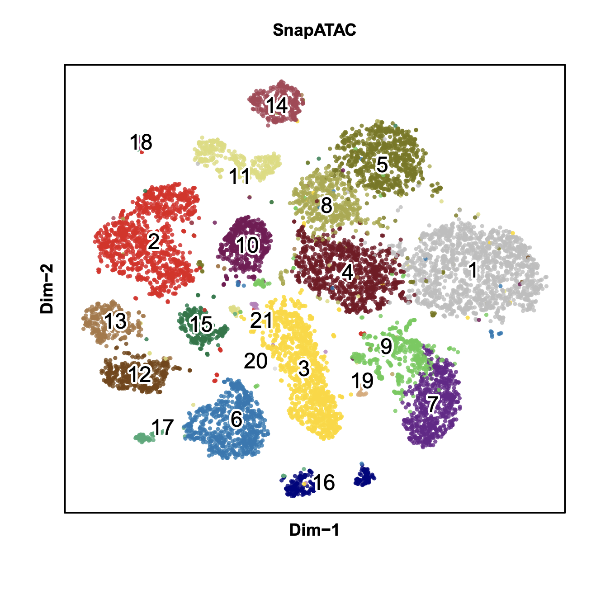
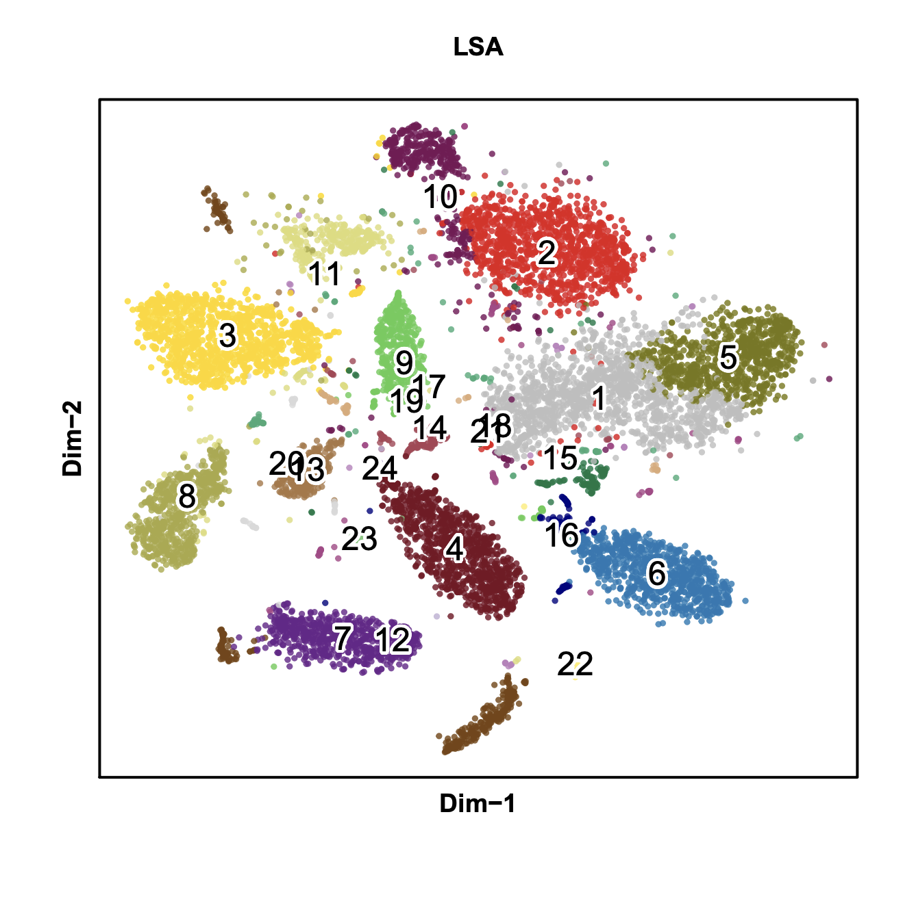
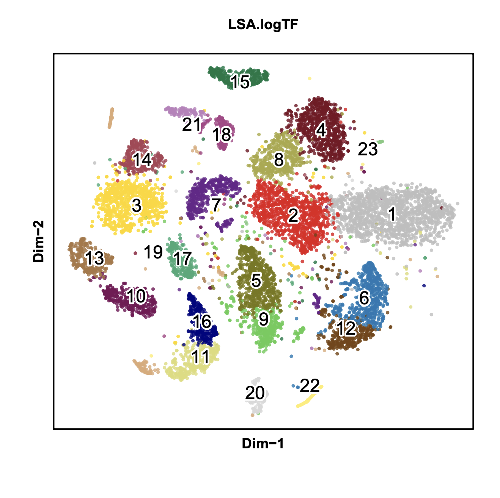
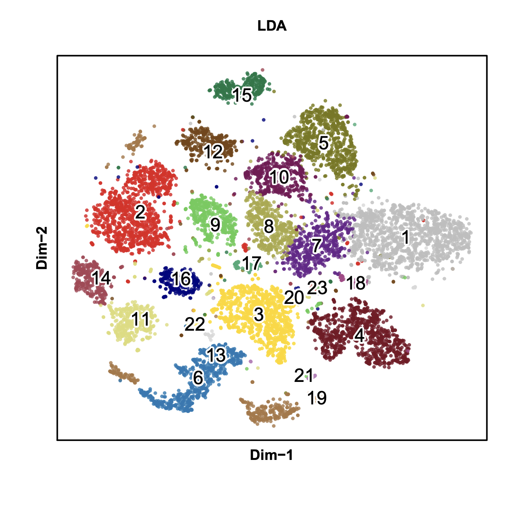
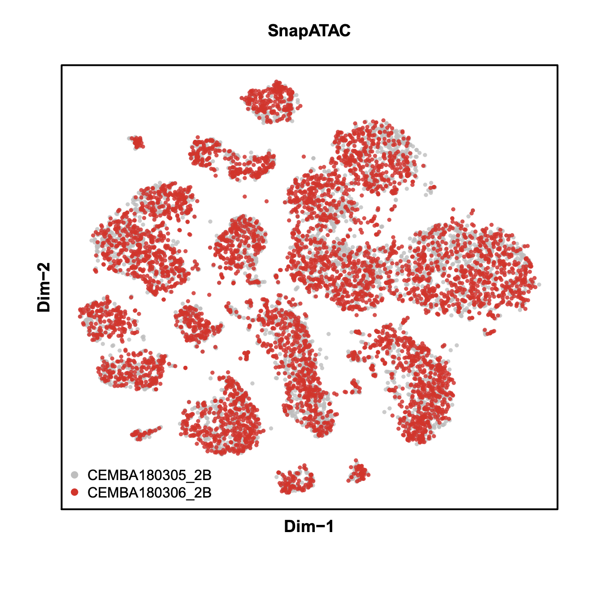

## Mouse Secondary Motor Cortex 10k Nuclei

This is an idea I procrastinated for a while. Also, recently inspired by Andrew Hill's [post](http://andrewjohnhill.com/blog/2019/05/06/dimensionality-reduction-for-scatac-data/), SnapATAC is finally supporting other excellent methods for dimentionality reduction methods (LSA, LSA.logTF, LDA). 



***_Please note that the data used here is only a subset of MOs reported in Fang 2019 BioRxiv paper._***        
In the pre-print, mouse secondary motor cortex is dissected into three slices namely anterior, middle and posterior, each having two biological replicates. In this tutorial, we will be analyzing one dataset `CEMBA180305_2B` and `CEMBA180306_2B` which represent two replicates for the middle (2nd) slice.



**Step 0. Download the snap file**.      
snap (Single Nucleus Accessibility Profile) file is a hierarchically structured hdf5 format file that is specially designed for single nucleus/cell ATAC-seq dataset. A snap file (version 4) contains the following sessions: header (HD), cell-by-bin accessibility matrix (AM), cell-by-peak matrix (PM), cell-by-gene matrix (GM), barcode (BD) and fragment (FM).

* HD session - snap file version, created date, alignment and reference genome information.
* BD session - all unique barcodes and corresponding meta data.
* AM session - cell-by-bin matrices of different resolutions for clustering.
* GM session - cell-by-gene count matrix for annotation.
* PM session - cell-by-peak count matrix for differential analysis. 
* FM session - all usable fragments per cell. Fragments are indexed for fast search. 

Detailed information about snap file can be found [here](https://github.com/r3fang/SnapTools/blob/master/docs/snap_format.docx). See how to generate CEMBA180306_2B.snap from fastq file [here](https://github.com/r3fang/SnapATAC/wiki/FAQs).

```R
$ R
> system("wget http://renlab.sdsc.edu/r3fang/share/Fang_2019/MOs_snATAC/snap/CEMBA180305_2B.snap");
> system("wget http://renlab.sdsc.edu/r3fang/share/Fang_2019/MOs_snATAC/snap/CEMBA180306_2B.snap");
```

**Step 1. Barcode selection (SnapATAC)**       
Using snap file, we next identify the high-quality barcode according to the following metrices: 1) `fragment.num` - Total Sequencing Fragments; 2) `umap.ratio` - uniquely mapped ratio; 3) `dup.ratio ` - duplate ratio; 4) `pair.ratio` - properly paired ratio; 5) `mito.ratio` - mitochondrial ratio. 

Note that we no longer use reads in peak ratio as a metric for cell selection mainly for two reasons: First, we found the read-in-peak ratio is highly cell type specific. For instance, according to a previously published single cell ATAC-seq (Schep Nature Method 2017), human fibroblast (BJ) cells have significantly higher reads-in-peak ratio (40-60%) versus 20-40% for GM12878 cells. Similarly, we found Glia cells overall have very different read-in-peak ratio distribution as compared to neuronal cells. We suspect this may reflect the nucleus size or global chromatin accessibility level. Second, accessibility peaks identified from aggregate signal are usually incomplete and are biased to the dominant populations. This is epically the case when studying a complex tissue such as mammalian brain. Therefore, we abandon the use of reads in peak ratio for cell selection. To guide the selection of barcodes, `plotBarcode` plots the distribution of multiple QC metrics. **NOTE: plotBarcode only works with snap file generated by snaptools.**

```R
> library(SnapATAC);
> x.sp = createSnap(
	file=c("CEMBA180305_2B.snap", "CEMBA180306_2B.snap"),
	sample=c("CEMBA180305_2B", "CEMBA180306_2B"),
	num.cores=1
	);
> plotBarcode(
	obj=x.sp, 
	pdf.file.name=NULL, 
	pdf.width=7, 
	pdf.height=7, 
	col="grey",
	border="grey",
	breaks=50
	);
```


```R
# filter cells only using number of fragments and UMI with the following cutoffs
> x.sp = filterCells(
	obj=x.sp, 
	subset.names=c("fragment.num", "UMI"),
	low.thresholds=c(1000,500),
	high.thresholds=c(Inf, Inf)
	);
> x.sp
number of barcodes: 21723
number of bins: 0
number of genes: 0
number of peaks: 0
```

**Step 2. Bin size selection (SnapATAC)**        

Here we use cell-by-bin matrix of 5kb resolution as input for clustering. See [How to choose the bin size?](https://github.com/r3fang/SnapATAC/wiki/FAQs#bin_size)

```R
# show what bin sizes exist in CEMBA180306_2B.snap file
> showBinSizes("CEMBA180305_2B.snap");
[1] 5000
> showBinSizes("CEMBA180306_2B.snap");
[1] 5000
> x.sp = addBmatToSnap(x.sp, bin.size=5000, num.cores=1);
```

**Step 3. Fragments-in-promoter ratio**.               
Insteading of using fragment-in-peak ratios, we next calculate fragments in promoter ratio and use it as a criteria to further filter cells (recommand [0.2-0.8]). In this case, very few cells are filtered. 

```R
> system("wget http://renlab.sdsc.edu/r3fang/share/Fang_2019/MOs_snATAC/genes/promoter.bed");
> library(GenomicRanges);
> promoter.df = read.table("promoter.bed");
> promoter.gr = GRanges(promoter.df[,1], IRanges(promoter.df[,2], promoter.df[,3]));
> ov = findOverlaps(x.sp@feature, promoter.gr);
> idy = queryHits(ov);
> promoter_ratio = SnapATAC::rowSums(x.sp[,idy, mat="bmat"], mat="bmat") / SnapATAC::rowSums(x.sp, mat="bmat");
> plot(log(SnapATAC::rowSums(x.sp, mat="bmat") + 1,10), promoter_ratio, cex=0.5, col="grey", xlab="log(count)", ylab="FIP Ratio", ylim=c(0,1 ));
> idx = which(promoter_ratio > 0.2 & promoter_ratio < 0.8);
> x.sp = x.sp[idx,];
> x.sp;
number of barcodes: 21533
number of bins: 545118
number of genes: 0
number of peaks: 0
> summarySnap(x.sp);
Total  number of barcodes: 21533
Median number of sequencing fragments: 4716
Median number of uniquely mapped fragments: 3331
Median number of mappability ratio: 0.94
Median number of properly paired ratio: 1
Median number of duplicate ratio: 0.27
Median number of chrM ratio: 0.01
Median number of unique molecules (UMI): 3331
```


**Step 4. Matrix binarization (SnapATAC)**              
We next convert the cell-by-bin count matrix to a binary matrix. We found some items in the matrix have abnormally high coverage perhaps due to the alignment error. Therefore, we first remove top 0.1% items in the count matrix followed by converting the rest of the values into binary.

```R
> x.sp = makeBinary(x.sp, mat="bmat");
```

**Step 5. Bin filtration (SnapATAC)**           
We next filter out any bins overlapping with the [ENCODE blacklist](http://mitra.stanford.edu/kundaje/akundaje/release/blacklists/) and bins belonging to chrM, random, or sex chromsomes to prevent from any potential artifacts. 

```R
> system("wget http://mitra.stanford.edu/kundaje/akundaje/release/blacklists/mm10-mouse/mm10.blacklist.bed.gz");
> library(GenomicRanges);
> black_list = read.table("mm10.blacklist.bed.gz");
> black_list.gr = GRanges(
	black_list[,1], 
	IRanges(black_list[,2], black_list[,3])
	);
> idy1 = queryHits(findOverlaps(x.sp@feature, black_list.gr));
> idy2 = grep("chrM|random|chrX|chrY", x.sp@feature);
> idy = unique(c(idy1, idy2));
> x.sp = x.sp[,-idy, mat="bmat"];
> x.sp
number of barcodes: 21533
number of bins: 492455
number of genes: 0
number of peaks: 0
```

**Step 6. Dimensionality Reduction**            
Here we provide three methods for dimentionality reduction: (Jaccard distance based method) JDA, (latent semantic analysis) LSA and (Latent Dirichlet allocation - cis-topic) LDA. 

JDA (Jaccard Distance Analysis)

```R
> system.time({
	x.jda.sp = runJDA(
		obj=x.sp,
		input.mat="bmat",
		bin.cov.zscore.lower=-2,
		bin.cov.zscore.upper=2,
		pc.num=50,
		norm.method="normOVE",
		max.var=5000,
		do.par=TRUE,
		ncell.chunk=1000,
		num.cores=10,
		seed.use=10,
		tmp.folder=tempdir()
		);
	})
```
 
LSA (Latent Semantic Analysis)

```R
> system.time({
	x.lsa.sp = runLSA(
		obj=x.sp, 
		input.mat="bmat", 
		pc.num=50, 
		logTF=FALSE,
		min.cell=10, 
		seed.use=10
		);
	})
```

LSA-logTF (modified by Andrew Hill)[http://andrewjohnhill.com/blog/2019/05/06/dimensionality-reduction-for-scatac-data/]

```R
> system.time({
	x.lsa.logTF.sp = runLSA(
		obj=x.sp, 
		input.mat="bmat", 
		pc.num=50, 
		logTF=TRUE,
		scale.factor=1e+05, 
		min.cell=10, 
		seed.use=10
		);
	})
```

LDA (Latent Dirichlet Allocation)

```R
> library(lda);
> system.time({
	x.lda.sp = runLDA(
		obj=x.sp, 
		input.mat = "bmat", 
		topic = c(20, 30, 40, 50),
		method = "Z-score", 
		num.cores = 4, 
		min.cell = 10,
		seed.use = 10, 
		iterations = 500, 
		burnin = 250, 
		alpha = 50,
		alphaByTopic = TRUE, 
		beta = 0.1
		);
	})
```


**Step 9. Determine statistically significant principal components (SnapATAC)**          
We next Determine how many PCs to include for downstream analysis. We use an ad hoc method for determining which PCs to use by looking at a plot of the standard deviations of the principle components and draw your cutoff where there is a clear elbow in the graph. The other ad hoc way to determine PCs is to plot out every two PCs and select the number of PCs until there is no obvious structure.

```R
> plotDimReductPW(
    obj=x.jda.sp, 
    pca.dims=1:50,
    point.size=0.3,
    point.color="grey",
    point.shape=19,
    point.alpha=0.6,
    down.sample=5000,
    pdf.file.name=NULL, 
    pdf.height=7, 
    pdf.width=7
    );
> plotDimReductPW(
    obj=x.lsa.sp, 
    pca.dims=1:50,
    point.size=0.3,
    point.color="grey",
    point.shape=19,
    point.alpha=0.6,
    down.sample=5000,
    pdf.file.name=NULL, 
    pdf.height=7, 
    pdf.width=7
    );
> plotDimReductPW(
    obj=x.lsa.logTF.sp, 
    pca.dims=1:50,
    point.size=0.3,
    point.color="grey",
    point.shape=19,
    point.alpha=0.6,
    down.sample=5000,
    pdf.file.name=NULL, 
    pdf.height=7, 
    pdf.width=7
    );
> plotDimReductPW(
    obj=x.lda.sp, 
    pca.dims=seq(x.lda.sp@smat@sdev),
    point.size=0.3,
    point.color="grey",
    point.shape=19,
    point.alpha=0.6,
    down.sample=5000,
    pdf.file.name=NULL, 
    pdf.height=7, 
    pdf.width=7
    );
```

     

**Step 10. KNN Graph Construction (SnapATAC)**          
Using selected significant PCs, we next construct a K Nearest Neighbor (KNN) Graph. In the PC space, each cell is a node and the k-nearest neighbors of each cell are identified according to the Euclidian distance and edges are draw between neighbors in the graph. For large dataset, instead of storing the resulting graph in the memory, one can choose to save the graph in a file by setting `save.knn=TRUE` and specify the `filename`. **This function is inspired and modified from Seurat package.** 

```R
> x.jda.sp = runKNN(
    obj=x.jda.sp,
    pca.dims=2:40,
    weight.by.sd=TRUE,
    k=15
    );
> x.lsa.sp = runKNN(
    obj=x.lsa.sp,
    pca.dims=2:40,
    weight.by.sd=TRUE,
    k=15
    );
> x.lsa.logTF.sp = runKNN(
    obj=x.lsa.logTF.sp,
    pca.dims=2:40,
    weight.by.sd=TRUE,
    k=15
    );
> x.lda.sp = runKNN(
    obj=x.lda.sp,
    pca.dims=seq(x.lda.sp@smat@sdev),
    weight.by.sd=FALSE,
    k=30
    );
```

**Step 11. Clustering (SnapATAC)**                  
Using the resulting KNN graph, we next apply community finding algorithm Louvain to identify the clusters which represent groups of cells sharing similar ATAC-seq profiles, potentially originating from the same cell type. Two Louvain methods are included, one is using the `R-igraph` package and the other applies a `pyhon-louvain` implementation. `R-igraph` is faster but does not support different resolution. `pyhon-louvain` is slower and requires ` snaptools` but it does allows for multiple resolutions.

```R
> x.jda.sp = runCluster(
	obj=x.jda.sp,
	tmp.folder=tempdir(),
	louvain.lib="leiden",
	seed.use=10,
	resolution=1
	);
> x.lsa.sp = runCluster(
	obj=x.lsa.sp,
	tmp.folder=tempdir(),
	louvain.lib="leiden",
	seed.use=10,
	resolution=1
	);
> x.lsa.logTF.sp = runCluster(
	obj=x.lsa.logTF.sp,
	tmp.folder=tempdir(),
	louvain.lib="leiden",
	seed.use=10,
	resolution=1
	);
> x.lda.sp = runCluster(
	obj=x.lda.sp,
	tmp.folder=tempdir(),
	louvain.lib="leiden",
	seed.use=10,
	resolution=1
	);
```

**Step 12. Non-linear dimentionality reduction (SnapATAC)**         
SnapATAC visualize the datausing  tSNE, UMAP and FIt-sne. In the following example, data is visulized by tsne implemented by R package (Rtsne). To run `umap`, you need to first install umap package. To run `fast_tsne`, you need to first install [fast_tsne package](https://github.com/KlugerLab/FIt-SNE/blob/master/fast_tsne.R).

```R
> library(umap);
> x.jda.sp = runViz(
	obj=x.jda.sp, 
	tmp.folder=tempdir(),
	dims=2,
	pca.dims=2:40, 
	weight.by.sd=TRUE,
	method="Rtsne",
	fast_tsne_path=NULL,
	Y.init=NULL,
	seed.use=10,
	num.cores=5
	);
> x.lsa.sp = runViz(
	obj=x.lsa.sp, 
	tmp.folder=tempdir(),
	dims=2,
	pca.dims=2:40, 
	weight.by.sd=TRUE,
	method="Rtsne",
	fast_tsne_path=NULL,
	Y.init=x.jda.sp@tsne,
	seed.use=10,
	num.cores=5
	);
> x.lsa.logTF.sp = runViz(
	obj=x.lsa.logTF.sp, 
	tmp.folder=tempdir(),
	dims=2,
	pca.dims=2:40, 
	weight.by.sd=TRUE,
	method="Rtsne",
	fast_tsne_path=NULL,
	Y.init=x.jda.sp@tsne,
	seed.use=10,
	num.cores=5
	);
> x.lda.sp = runViz(
	obj=x.lda.sp, 
	tmp.folder=tempdir(),
	dims=2,
	pca.dims=seq(x.lda.sp@smat@sdev), 
	weight.by.sd=TRUE,
	method="Rtsne",
	fast_tsne_path=NULL,
	Y.init=x.jda.sp@tsne,
	seed.use=10,
	num.cores=5
	);
```

**Step 13. Visulization**              
SnapATAC provides flexible visualization. 

```R
> plotViz(
	obj=x.jda.sp, 
	method="tsne", 
	point.size=0.5, 
	point.shape=19, 
	point.alpha=0.8, 
	point.color="cluster", 
	text.add=TRUE,
	text.size=1.5,
	text.color="black",
	text.halo.add=TRUE,
	text.halo.color="white",
	text.halo.width=0.2,
	down.sample=10000,
	pdf.file.name=NULL,
	pdf.width=7, 
	pdf.height=7,
	main="SnapATAC"
	);
> plotViz(
	obj=x.lsa.sp, 
	method="tsne", 
	point.size=0.5, 
	point.shape=19, 
	point.alpha=0.8, 
	point.color="cluster", 
	text.add=TRUE,
	text.size=1.5,
	text.color="black",
	text.halo.add=TRUE,
	text.halo.color="white",
	text.halo.width=0.2,
	down.sample=10000,
	pdf.file.name=NULL,
	pdf.width=7, 
	pdf.height=7,
	main="LSA"
	);
> plotViz(
	obj=x.lsa.logTF.sp, 
	method="tsne", 
	point.size=0.5, 
	point.shape=19, 
	point.alpha=0.8, 
	point.color="cluster", 
	text.add=TRUE,
	text.size=1.5,
	text.color="black",
	text.halo.add=TRUE,
	text.halo.color="white",
	text.halo.width=0.2,
	down.sample=10000,
	pdf.file.name=NULL,
	pdf.width=7, 
	pdf.height=7,
	main="LSA.logTF"
	);
> plotViz(
	obj=x.lda.sp, 
	method="tsne", 
	point.size=0.5, 
	point.shape=19, 
	point.alpha=0.8, 
	point.color="cluster", 
	text.add=TRUE,
	text.size=1.5,
	text.color="black",
	text.halo.add=TRUE,
	text.halo.color="white",
	text.halo.width=0.2,
	down.sample=10000,
	pdf.file.name=NULL,
	pdf.width=7, 
	pdf.height=7,
	main="LDA"
	);
```

      

**Step 13. Visulization**              
Plot two biological replicates

```R
> plotViz(
	obj=x.jda.sp, 
	method="tsne", 
	point.size=0.5, 
	point.shape=19, 
	point.alpha=0.8, 
	point.color="sample", 
	text.add=FALSE,
	text.size=1.5,
	text.color="black",
	text.halo.add=TRUE,
	text.halo.color="white",
	text.halo.width=0.2,
	down.sample=10000,
	pdf.file.name=NULL,
	pdf.width=7, 
	pdf.height=7,
	legend.add=TRUE,
	main="SnapATAC"
	);
```

 


