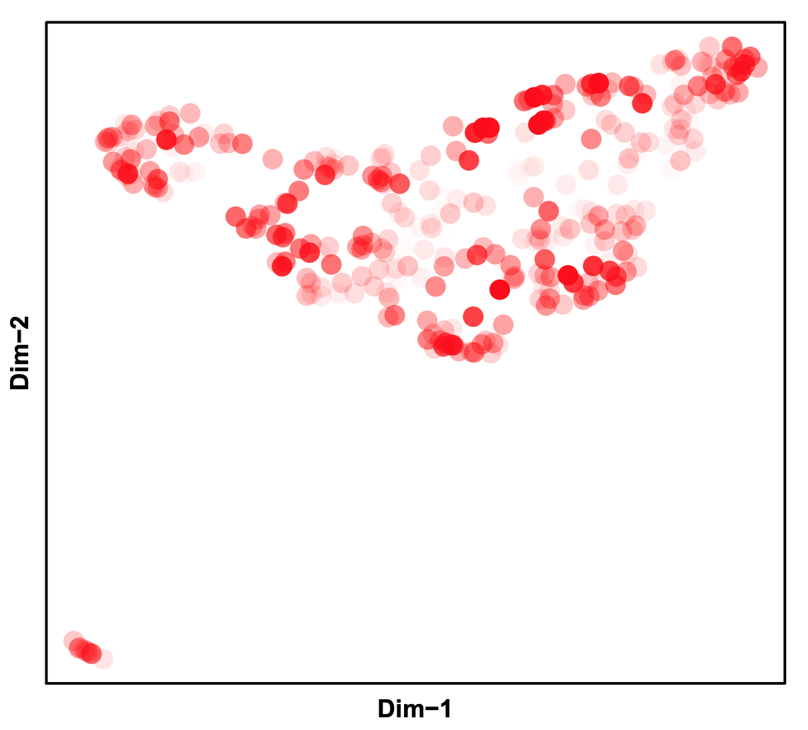

## Mouse Secondary Motor Cortex 10k (Easy)
***_Please note that the data used here is only a subset of MOs reported in Fang 2019 paper._***        
In the original manuscript, mouse secondary motor cortex is dissected into three slices namely anterior, middle and posterior, each having two biological replicates. In this tutorial, we will analyze one dataset `CEMBA180306_2B` which is the first replicate for the middle (2nd) slice.


**Step 0. Download the snap file**.      
snap (Single Nucleus Accessibility Profile) file is a hierarchically structured hdf5 format file that is specially designed for single nucleus/cell ATAC-seq dataset. A snap file (version 4) contains the following sessions: header (HD), cell-by-bin accessibility matrix (AM), cell-by-peak matrix (PM), cell-by-gene matrix (GM), barcode (BD) and fragment (FM).

* HD session - snap file version, created date, alignment and reference genome information.
* BD session - all unique barcodes and corresponding meta data.
* AM session - cell-by-bin matrices of different resolutions for clustering.
* GM session - cell-by-gene count matrix for annotation.
* PM session - cell-by-peak count matrix for differential analysis. 
* FM session - all usable fragments per cell. Fragments are indexed for fast search. 

Detailed information about snap file can be found [here](https://github.com/r3fang/SnapTools/blob/master/docs/snap_format.docx). See how to generate CEMBA180306_2B.snap from fastq file [here](https://github.com/r3fang/SnapATAC/wiki/FAQs).

```R
$ R
> system("wget http://renlab.sdsc.edu/r3fang/share/Fang_2019/MOs_snATAC/snap/CEMBA180306_2B.snap")
```

**Step 1. Barcode selection (SnapATAC)**       
Using snap file, we next identify the high-quality barcode based on the following metrices: 1) `fragment.num` - Total Sequencing Fragments; 2) `umap.ratio` - uniquely mapped ratio; 3) `dup.ratio ` - duplate ratio; 4) `pair.ratio` - properly paired ratio; 5) `mito.ratio` - mitochondrial ratio. 

Note that we no longer use reads in peak ratio as a metric for cell selection mainly for two reasons: First, we found the reads-in-peak ratio is highly cell type specific. For instance, according to a published single cell ATAC-seq (Schep Nature Method 2017), human fibroblast (BJ) cells have significantly higher reads-in-peak ratio (40-60%) versus 20-40% for GM12878 cells. Similarly, we found Glia cells overall have very different reads in peak ratio distribution compared to neuronal cells. We suspect this may reflect the nucleus size or global chromatin accessibility. Second, accessibility peaks identified from aggregate signal are usually incomplete and are biased to the dominant populations. This is epically the case when studying a complex tissue such as mammalian brain. For instance, we found it is up to 50% of the peaks present in the rare populations are not identified from the bulk analysis. Therefore, we abandon the use of reads in peak ratio for cell selection. To guide the selection of barcodes, ` plotBarcode` plots the distribution of multiple QC metrics. **NOTE: plotBarcode only works with snap file generated by snaptools.**

```R
> library(SnapATAC);
> x.sp = createSnap(
	file="CEMBA180306_2B.snap",
	sample="CEMBA180306_2B",
	num.cores=1
	);
> plotBarcode(
	obj=x.sp, 
	pdf.file.name=NULL, 
	pdf.width=7, 
	pdf.height=7, 
	col="grey",
	border="grey",
	breaks=50
	);
```


```R
# filter cells only using number of fragments and UMI with the following cutoffs
> x.sp = filterCells(
	obj=x.sp, 
	subset.names=c("fragment.num", "UMI"),
	low.thresholds=c(1000,500),
	high.thresholds=c(Inf, Inf)
	);
```

**Step 2. Bin size selection (SnapATAC)**        

Here we use cell-by-bin matrix of 5kb resolution as input for clustering. See [How to choose the bin size?](https://github.com/r3fang/SnapATAC/wiki/FAQs#bin_size)

```R
# show what bin sizes exist in CEMBA180306_2B.snap file
> showBinSizes("CEMBA180306_2B.snap");
[1] 5000
> x.sp = addBmatToSnap(x.sp, bin.size=5000, num.cores=1);
> calBmatCor(x.sp);
[1] 0.9714672
```

**Step 3. Fragments-in-promoter ratio**.               
Insteading of using fragment-in-peak ratios, we next calculate fragments in promoter ratio and use it further filter cells (recommand [0.2-0.8]). In this case, very few cells are filtered. 

```R
> library(GenomicRanges);
> system("wget http://renlab.sdsc.edu/r3fang/share/Fang_2019/MOs_snATAC/genes/promoter.bed");
> promoter.df = read.table("promoter.bed");
> promoter.gr = GRanges(promoter.df[,1], IRanges(promoter.df[,2], promoter.df[,3]));
> ov = findOverlaps(x.sp@feature, promoter.gr);
> idy = queryHits(ov);
> promoter_ratio = SnapATAC::rowSums(x.sp[,idy, mat="bmat"], mat="bmat") / SnapATAC::rowSums(x.sp, mat="bmat");
> plot(log(SnapATAC::rowSums(x.sp, mat="bmat") + 1,10), promoter_ratio, cex=0.5, col="grey", xlab="log(count)", ylab="FIP Ratio", ylim=c(0,1 ));
> idx = which(promoter_ratio > 0.2 & promoter_ratio < 0.8);
> x.sp = x.sp[idx,];
> x.sp;
number of barcodes: 11286
number of bins: 545118
number of genes: 0
number of peaks: 0
> summarySnap(x.sp);
Total  number of barcodes: 11286
Median number of sequencing fragments: 5335
Median number of uniquely mapped fragments: 3773.5
Median number of mappability ratio: 0.94
Median number of properly paired ratio: 1
Median number of duplicate ratio: 0.27
Median number of chrM ratio: 0.01
Median number of unique molecules (UMI): 3773.5
```


**Step 4. Matrix binarization (SnapATAC)**              
We next convert the cell-by-bin count matrix to a binary matrix. We found some items in the matrix have abnormally high coverage perhaps due to the alignment error. Therefore, we first remove top 0.1% items in the count matrix followed by converting the rest of the values into binary.

```R
> x.sp = makeBinary(x.sp, mat="bmat");
```

**Step 5. Bin filtration (SnapATAC)**           
We next filter out any bins overlapping with the [ENCODE blacklist](http://mitra.stanford.edu/kundaje/akundaje/release/blacklists/) and bins belonging to chrM or random chromsomes to prevent from any potential artifacts. 

```R
> library(GenomicRanges);
> system("wget http://mitra.stanford.edu/kundaje/akundaje/release/blacklists/mm10-mouse/mm10.blacklist.bed.gz")
> black_list = read.table("mm10.blacklist.bed.gz");
> black_list.gr = GRanges(
	black_list[,1], 
	IRanges(black_list[,2], black_list[,3])
	);
> idy1 = queryHits(findOverlaps(x.sp@feature, black_list.gr));
> idy2 = grep("chrM|random", x.sp@feature);
> idy = unique(c(idy1, idy2));
> x.sp = x.sp[,-idy, mat="bmat"];
> x.sp
number of barcodes: 11286
number of bins: 545011
number of genes: 0
number of peaks: 0
> plotBinCoverage(
	x.sp,
	pdf.file.name=NULL,
	col="grey",
	border="grey",
	breaks=10,
	xlim=c(-6,6)
	);
```


Bins of exceedingly high coverage are removed which likely represent the genomic regions that are invariable between cells such as housekeeping gene promoters. We also notice that filtering bins of very low coverage perhaps due to random noise can also improve the robustness of the downstream clustering analysis. In detail, we first calculate the coverage of each bin using the binary matrix and then convert the coverage to log-normal distribution. The log-normal is then converted into `zscore`. In the following example, bins with zscore beyond ±1.5 are filtered. 


```R
> x.sp = filterBins(
	x.sp,
	low.threshold=-1.5,
	high.threshold=1.5,
	mat="bmat"
	);
> x.sp
number of barcodes: 11286
number of bins: 434268
number of genes: 0
number of peaks: 0
```

**Step 6. Jaccard matrix (SnapATAC)**            
We next convert the filtered genome-wide cell-by-bin matrix into a cell-by-cell similarity matrix by estimating the jaccard index between two cells in the basis of profile overlaps. Instead of calculating a full N-by-N jaccard matrix, we calculate a partial jaccard index matrix by randomly choosing `max.var` cells. By doing so, in our manuscript, we demonstrate that it does not sacrifice the performance but significantly improves the scalability of the method.
  
```R
> x.sp = runJaccard(
	obj = x.sp,
	tmp.folder=tempdir(),
	mat = "bmat",
	max.var=2000,
	ncell.chunk=1000,
	do.par=FALSE,
	num.cores=1,
	seed.use=10
	);
``` 

**Step 7. Normalization (SnapATAC)**             
Due to the high dropout rate, we found that the jaccard index is highly affected by the read depth differing between cells. To eliminate such confounding factor, we developed a regression-based method `normOVE` to eliminate such confounding factor.

```R
> x.sp = runNormJaccard(
	obj = x.sp,
	tmp.folder=tempdir(),
	ncell.chunk=1000,
	method="normOVE",
	row.center=TRUE,
	row.scale=TRUE,
	low.threshold=-5,
	high.threshold=5,
	num.cores=10,
	seed.use=10
	);
```

**Step 8. Linear Dimentionality Reduction (SnapATAC)**             
Like other single-cell analysis, snATAC-seq contains extensive technical noise due to the high drop-out rate. To overcome this challenge, we applied PCA or SVD to combine information across a correlated feature set hereby creating a mega-feature and exclude the variance potential resulting from technical noise. Here, we performed PCA using `IRLBA` algorithm.

```R
> x.sp = runDimReduct(
	x.sp,
	pc.num=50,
	input.mat="jmat",
	method="svd",
	center=TRUE,
	scale=FALSE,
	seed.use=10
	);
```

**Step 9. Determine statistically significant principal components (SnapATAC)**          
We next Determine how many PCs to include for downstream analysis. We use an ad hoc method for determining which PCs to use by looking at a plot of the standard deviations of the principle components and draw your cutoff where there is a clear elbow in the graph. The other ad hoc way to determine PCs is to plot out every two PCs and select the number of PCs until there is no obvious structure.

```R
> plotDimReductElbow(
    obj=x.sp, 
    point.size=1.5,
    point.shape=19,
    point.color="red",
    point.alpha=1,
    pdf.file.name=NULL,
    pdf.height=7,
    pdf.width=7,
    labs.title="PCA Elbow plot",
    labs.subtitle=NULL
    );
> plotDimReductPW(
    obj=x.sp, 
    pca.dims=1:50,
    point.size=0.3,
    point.color="grey",
    point.shape=19,
    point.alpha=0.6,
    down.sample=5000,
    pdf.file.name=NULL, 
    pdf.height=7, 
    pdf.width=7
    );
```

   

**Step 10. KNN Graph Construction (SnapATAC)**          
Using selected significant PCs, we next construct a K Nearest Neighbor (KNN) Graph. In the PC space, each cell is a node and the k-nearest neighbors of each cell are identified according to the Euclidian distance and edges are draw between neighbors in the graph. For large dataset, instead of storing the resulting graph in the memory, one can choose to save the graph in a file by setting `save.knn=TRUE` and specify the `filename`. **This function is inspired and modified from Seurat package.** 

```R
> x.sp = runKNN(
    obj=x.sp,
    pca.dims=1:30,
    weight.by.sd=FALSE,
    k=15
    );
```

**Step 11. Clustering (SnapATAC)**                  
Using the resulting KNN graph, we next apply community finding algorithm Louvain to identify the clusters which represent groups of cells sharing similar ATAC-seq profiles, potentially originating from the same cell type. Two Louvain methods are included, one is using the `R-igraph` package and the other applies a `pyhon-louvain` implementation. `R-igraph` is faster but does not support different resolution. `pyhon-louvain` is slower and requires ` snaptools` but it does allows for multiple resolutions.

```R
> x.sp = runCluster(
	obj=x.sp,
	tmp.folder=tempdir(),
	louvain.lib="R-igraph",
	seed.use=10
	);
```

Alternative, we can also use leiden for clustering which allows for choosing different resolution resulting different clustering results. It requires R package `leiden` to be pre-installed but highly recommended.

```R
> library(leiden);
> x.sp = runCluster(
	obj=x.sp,
	tmp.folder=tempdir(),
	louvain.lib="leiden",
	seed.use=10,
	resolution=1
	);
```

**Step 12. Non-linear dimentionality reduction (SnapATAC)**         
SnapATAC visualize the datausing  tSNE, UMAP and FIt-sne. In the following example, data is visulized by tsne implemented by R package (Rtsne). To run `umap`, you need to first install umap package. To run `fast_tsne`, you need to first install [fast_tsne package](https://github.com/KlugerLab/FIt-SNE/blob/master/fast_tsne.R).

```R
> x.sp = runViz(
	obj=x.sp, 
	tmp.folder=tempdir(),
	dims=2,
	pca.dims=1:30, 
	weight.by.sd=FALSE,
	method="Rtsne",
	fast_tsne_path=NULL,
	Y.init=NULL,
	seed.use=10,
	num.cores=5
	);
```

**Step 13. Visulization (SnapATAC)**              
SnapATAC provides flexible visualization. 

```R
> plotViz(
	obj=x.sp, 
	method="tsne", 
	point.size=0.5, 
	point.shape=19, 
	point.alpha=0.8, 
	point.color="cluster", 
	text.add=TRUE,
	text.size=1.5,
	text.color="black",
	text.halo.add=TRUE,
	text.halo.color="white",
	text.halo.width=0.2,
	down.sample=10000,
	pdf.file.name=NULL,
	pdf.width=7, 
	pdf.height=7
	);
> feature.value = SnapATAC::rowSums(x.sp@bmat);
> feature.value = pmin(feature.value, quantile(feature.value, 0.99));
> feature.value = pmax(feature.value, 0);
> feature.value = (feature.value-min(feature.value))/(max(feature.value)-min(feature.value));
> PlotFeatureSingle(
	obj=x.sp, 
	feature.value=feature.value,
	method="tsne", 
	point.size=0.3, 
	point.shape=19, 
	point.color="red", 
	down.sample=10000, 
	pdf.file.name=NULL, 
	pdf.width=7, 
	pdf.height==7
	);
```

   

**Step 14. Gene-body based annotation for expected cell types (SnapATAC)**        
To help annotate identified cell clusters, SnapATAC next loads the cell-by-gene matrix in the downloaded `snap` file and visualize the enrichment of marker genes.

```R
# add the cell by-gene matrix into existing snap object
> system("wget http://renlab.sdsc.edu/r3fang/share/Fang_2019/MOs_snATAC/genes/gencode.vM16.gene.bed");
> genes = read.table("gencode.vM16.gene.bed");
> genes.gr = GRanges(genes[,1], 
	IRanges(genes[,2], genes[,3]), 
	name=genes[,4]
	);
> marker.genes = c(
	"Snap25", "Gad2", "Apoe",
	"C1qb", "Pvalb", "Vip", 
	"Sst", "Lamp5", "Slc17a7", 
	"Mog", "Pdgfra", "Cspg4",
	"Cx3cr1","F3","Aqp4", 
	"Rorb"
	);
> genes.sel.gr <- genes.gr[which(genes.gr$name %in% marker.genes)];
> x.sp = createGmat(
	obj=x.sp, 
	genes= genes.sel.gr,
	ncell.chunk=20,
	do.par=TRUE,
	num.cores=10
	);
# normalize the matrix by cell coverage
> x.sp = scaleCountMatrix(
	obj=x.sp, 
	cov=SnapATAC::rowSums(x.sp, mat="bmat"),
	mat="gmat",
	method="RPM"
	);
# plot enrichment for marker genes
> plotGene(
	obj=x.sp, 
	gene.names=marker.genes,
	viz.method="tsne",
	point.size=0.3,
	point.color="red",
	point.shape=19,
	background.point=TRUE,
	background.point.color="grey",
	background.point.alpha=0.3,
	background.point.size=0.1,
	background.point.shape=19,
	low.value=0.0,
	high.value=0.95,
	down.sample=5000,
	seed.use=10,
	plot.nrow=4,
	plot.ncol=4,
	pdf.file.name=NULL, 
	pdf.height=7, 
	pdf.width=7
	);
```


**Step 15. Heretical clustering of the clusters (SnapATAC)**        

```R
# calculate the ensemble signals for each cluster
> ensemble.ls = lapply(split(seq(length(x.sp@cluster)), x.sp@cluster), function(x){
	SnapATAC::colMeans(x.sp[x,], mat="bmat");
	})
# cluster using 1-cor as distance  
> hc = hclust(as.dist(1 - cor(t(do.call(rbind, ensemble.ls)))), method="ward.D2");
> plot(hc, hang=-1, xlab="");
```


**Step 16. Gene-body based annotation for excitatory neurons**        
We next extracted the clusters belonging to excitatory neurons based on the gene accessibility level for Slc17a7 and plot layer-specific marker genes enrichment.

```R
> idx = which(x.sp@cluster %in% c(3, 14, 22, 19, 21, 20, 2, 11));
> length(idx) # 5987 53% of total population
> marker.genes = c(
	"Cux2", "Rorb", "Deptor", 
	"Vat1l", "Sulf1", "Tle4", 
	"Foxp2", "Tshz2", "Grik3"
	);
> plotGene(
	obj=x.sp[idx,], 
	gene.names=marker.genes,
	viz.method="tsne",
	point.size=0.2,
	point.color="red",
	point.shape=19,
	background.point=TRUE,
	background.point.color="grey",
	background.point.alpha=0.3,
	background.point.size=0.1,
	background.point.shape=19,
	low.value=0.0,
	high.value=1.0,
	down.sample=5000,
	seed.use=10,
	plot.nrow=3,
	plot.ncol=3,
	pdf.file.name=NULL, 
	pdf.height=7, 
	pdf.width=7
	);
```


**Step 17. Change the cluster label to cell type**  

```R
> library(plyr);
> current.cluster.ids <- 1:22;
> new.cluster.ids <- c(
	"Asc",     "L6.CT",    "L5.PT", 
	"Pvalb",   "Other.a",  "Ogc",
	"Sst",     "Opc",      "Vip",
	"Other.b", "L6b",      "Other.c",
	"Mgc",     "L6.IT",    "Asc",
	"Other.d", "Lamp5",    "Ogc",
	"L23.IT",  "NP",       "L4",
	"L5.IT"
	);
> x.sp@cluster <- plyr::mapvalues(
	x = x.sp@cluster, 
	from = current.cluster.ids, 
	to = new.cluster.ids
	);
> plotViz(
	obj=x.sp, 
	method="tsne", 
	point.size=0.5, 
	point.shape=19, 
	point.alpha=0.8, 
	point.color="cluster",
	text.add=TRUE,
	text.size=1.2,
	text.color="black",
	text.halo.add=TRUE,
	text.halo.color="white",
	text.halo.width=0.2,
	down.sample=10000,
	pdf.file.name=NULL,
	pdf.width=7, 
	pdf.height=7
	);  
```


**Step 18. Identify cis-elements for each cluster seperately**      

```R
> system("which snaptools")
/home/r3fang/anaconda2/bin/snaptools
> system("which macs2")
/home/r3fang/anaconda2/bin/macs2
> peaks_sst.df = runMACS(
	obj=x.sp[which(x.sp@cluster=="Sst"),], 
	output.prefix="CEMBA180306_2B.Sst",
	path.to.snaptools="/home/r3fang/anaconda2/bin/snaptools",
	path.to.macs="/home/r3fang/anaconda2/bin/macs2",
	gsize="mm", 
	buffer.size=500, 
	num.cores=5,
	macs.options="--nomodel --shift 37 --ext 73 --qval 1e-2 -B --SPMR --call-summits",
	tmp.folder=tempdir()
	);
> nrow(peaks_sst.df)
[1] 24542
```

Identify peaks for clusters with cells more than 300 cells.

```R
> peaks.gr = runMACSForAll(
    obj=x.sp,
    path.to.snaptools="/home/r3fang/anaconda2/bin/snaptools",
    path.to.macs="/home/r3fang/anaconda2/bin/macs2",
	output.prefix="CEMBA180306_2B",
    num.cores=16,
    min.cells=300,
    gsize="mm", 
    buffer.size=500, 
    macs.options="--nomodel --shift 37 --ext 73 --qval 1e-2 -B --SPMR --call-summits",
	tmp.folder=tempdir()
    ); 

> peaks.gr
GRanges object with 198374 ranges and 0 metadata columns:
           seqnames               ranges strand
              <Rle>            <IRanges>  <Rle>
       [1]     chr1   [3094946, 3095530]      *
       [2]     chr1   [3113755, 3113828]      *
       [3]     chr1   [3119616, 3120678]      *
       [4]     chr1   [3121469, 3121669]      *
       [5]     chr1   [3167265, 3167370]      *
       ...      ...                  ...    ...
  [198370]     chrY [90800714, 90800787]      *
  [198371]     chrY [90803444, 90803664]      *
  [198372]     chrY [90807594, 90807850]      *
  [198373]     chrY [90808796, 90808945]      *
  [198374]     chrY [90809494, 90809630]      *
  -------
  seqinfo: 22 sequences from an unspecified genome; no seqlengths
```

**Step 19. Create a cell-by-peak matrix**     
Using merged peaks as a reference, we next create a cell-by-peak matrix using the original snap file.

```R
> x.sp = createPmat(
	obj=x.sp, 
	peak=peaks.gr, 
	ncell.chunk=20,
	do.par=TRUE,
	num.cores=16
	);
```

**Step 20. Identify Differentially Accessible Regions (DARs)**       
SnapATAC can help find differentially accessible regions (DARs) that define clusters via differential analysis. By default, it identifes positive peaks of a single cluster (specified in `cluster.pos`), compared to a group of negative control cells.

```R
> DAR_sst = findDAR(
	obj=x.sp,
	mat="pmat",
	cluster.pos="Sst",
	cluster.neg=NULL,
	bcv=0.1,
	fdr=5e-2,
	pvalue=1e-2,
	test.method="exactTest",
	seed.use=10
	);
> DAR_mgc = findDAR(
	obj=x.sp,
	mat="pmat",
	cluster.pos="Mgc",
	cluster.neg=NULL,
	bcv=0.1,
	fdr=1e-2,
	pvalue=1e-2,
	test.method="exactTest",
	seed.use=10
	);
> idy_sst = which(DAR_sst$label == 1);
> idy_mgc = which(DAR_mgc$label == 1);
> y_sst = SnapATAC::rowSums(x.sp[,idy_sst,mat="pmat"], mat="pmat") / SnapATAC::rowSums(x.sp, mat="pmat") * 1000000;
> y_mgc = SnapATAC::rowSums(x.sp[,idy_mgc,mat="pmat"], mat="pmat") / SnapATAC::rowSums(x.sp, mat="pmat") * 1000000;
# normalize to zscore
> y_sst = (y_sst - mean(y_sst)) / sd(y_sst);
> y_mgc = (y_mgc - mean(y_mgc)) / sd(y_mgc);
> boxPlotFeature(
	obj = x.sp,
	feature = y_sst,
	outline = FALSE,
	ylab = "zscore of RPM",
	main = "Sst DARs Enrichment",
	add.point = TRUE,
	point.size = 0.2,
	point.shape = 19,
	point.alpha = 0.5,
	pdf.file.name=NULL,
	pdf.height=7,
	pdf.width=7
	);
> boxPlotFeature(
	obj = x.sp,
	feature = y_mgc,
	outline = FALSE,
	ylab = "zscore of RPM",
	main = "Sst DARs Enrichment",
	add.point = TRUE,
	point.size = 0.2,
	point.shape = 19,
	point.alpha = 0.5,
	pdf.file.name=NULL,
	pdf.height=7,
	pdf.width=7
	);
```
 

**Step 21. Motif analysis identifies master regulators**       
SnapATAC can help reveal master regulators that are enriched in the differentially accessible regions (DARs). 

```R
> system("which findMotifsGenome.pl");
/projects/ps-renlab/r3fang/public_html/softwares/homer/bin/findMotifsGenome.pl
> motifs = runHomer(
	x.sp[,idy_sst,"pmat"], 
	mat = "pmat",
	path.to.homer = "/projects/ps-renlab/r3fang/public_html/softwares/homer/bin/findMotifsGenome.pl",
	result.dir = "./homer/Sst",
	num.cores=5,
	genome = 'mm10',
	motif.length = 10,
	scan.size = 300,
	optimize.count = 2,
	background = 'automatic',
	local.background = FALSE,
	only.known = FALSE,
	only.denovo = FALSE,
	fdr.num = 5,
	cache = 100,
	overwrite = TRUE,
	keep.minimal = FALSE
	);
> head(motifs)
                                                     Motif.Name   Log.P.value
1 Tcf21(bHLH)/ArterySmoothMuscle-Tcf21-ChIP-Seq(GSE61369)/Homer 	   -940.4
2            Tcf12(bHLH)/GM12878-Tcf12-ChIP-Seq(GSE32465)/Homer 	   -801.1
3        Ascl1(bHLH)/NeuralTubes-Ascl1-ChIP-Seq(GSE55840)/Homer 	   -785.8
4                  Ap4(bHLH)/AML-Tfap4-ChIP-Seq(GSE45738)/Homer 	   -753.7
5              Ptf1a(bHLH)/Panc1-Ptf1a-ChIP-Seq(GSE47459)/Homer 	   -718.6
6               E2A(bHLH)/proBcell-E2A-ChIP-Seq(GSE21978)/Homer 	   -697.5

```

Find motifs enriched in Mgc DARs.

```R
> motifs = runHomer(
	x.sp[,idy_mgc,"pmat"], 
	mat = "pmat",
	path.to.homer = "/projects/ps-renlab/r3fang/public_html/softwares/homer/bin/findMotifsGenome.pl",
	result.dir = "./homer/Mgc",
	num.cores=5,
	genome = 'mm10',
	motif.length = 10,
	scan.size = 300,
	optimize.count = 2,
	background = 'automatic',
	local.background = FALSE,
	only.known = FALSE,
	only.denovo = FALSE,
	fdr.num = 5,
	cache = 100,
	overwrite = TRUE,
	keep.minimal = FALSE
	);
> head(motifs)
                                         Motif.Name   Log.P.value
1   PU.1(ETS)/ThioMac-PU.1-ChIP-Seq(GSE21512)/Homer         -3880       
2      Elf4(ETS)/BMDM-Elf4-ChIP-Seq(GSE88699)/Homer         -3589      
3    SpiB(ETS)/OCILY3-SPIB-ChIP-Seq(GSE56857)/Homer         -3218      
4      ELF5(ETS)/T47D-ELF5-ChIP-Seq(GSE30407)/Homer         -3208       
5    ETS1(ETS)/Jurkat-ETS1-ChIP-Seq(GSE17954)/Homer         -2824      
6 Etv2(ETS)/ES-ER71-ChIP-Seq(GSE59402)/Homer(0.967)         -2628       
```

**Step 22. Subclustering of Sst reveals rare population**       
GABAergic neurons are composed of highly diverse neurons. Previous single cell RNA-seq analysis has revealed extensive amount of GABAergic subtypes. Here we perform sub-cluster of Sst to further identify its subtype. In this example, SnapATAC identifies very rare population Sst Chodl (15 cells) which counts for less than 0.1% of total population. 

```R
> x.sst.sp = x.sp[which(x.sp@cluster == "Sst"),];
> x.sst.sp
number of barcodes: 345
number of bins: 434268
number of genes: 53278
number of genes: 53278

> x.sst.sp = runJaccard(
    obj = x.sst.sp,
    mat = "bmat",
	tmp.folder=tempdir(),
    max.var=2000,
    ncell.chunk=10000,
    seed.use=10
    );
> x.sst.sp = runNormJaccard(
    obj = x.sst.sp,
	tmp.folder=tempdir(),
    ncell.chunk=1000,
    method="normOVE",
    row.center=TRUE,
    row.scale=TRUE,
    low.threshold=-5,
    high.threshold=5,
    num.cores=5,
    seed.use=10
    );
> x.sst.sp = runDimReduct(
    x.sst.sp,
    pc.num=50,
    input.mat="jmat",
    method="svd",
    center=TRUE,
    scale=FALSE,
    seed.use=10
    );
> plotDimReductPW(
    obj=x.sst.sp, 
    pca.dims=1:40,
    point.size=1,
    point.color="grey",
    point.shape=19,
    point.alpha=0.6,
    down.sample=1000,
    pdf.file.name=NULL, 
    pdf.height=7, 
    pdf.width=7
    );
> x.sst.sp = runKNN(
    obj= x.sst.sp,
    pca.dims=1:10,
    weight.by.sd=FALSE,
    k=30
    );
> x.sst.sp = runCluster(
    obj=x.sst.sp,
	tmp.folder=tempdir(),
    louvain.lib="R-igraph",
    path.to.snaptools=NULL,
    seed.use=10
    );
> x.sst.sp = runViz(
    obj=x.sst.sp, 
	tmp.folder=tempdir(),
    dims=2,
    pca.dims=1:10, 
    weight.by.sd=FALSE,
    method="umap",
    fast_tsne_path=NULL,
    Y.init=NULL,
    seed.use=10,
    num.cores=5
    );
> plotViz(
    obj=x.sst.sp, 
    method="umap", 
    point.size=2, 
    point.shape=19, 
    point.alpha=1, 
    point.color="cluster", 
    text.add=TRUE,
    text.size=1.5,
    text.color="black",
    text.halo.add=TRUE,
    text.halo.color="white",
    text.halo.width=0.2,
    down.sample=10000,
    pdf.file.name=NULL,
    pdf.width=7, 
    pdf.height=7
    );
> feature.value = SnapATAC::rowSums(x.sst.sp@bmat);
> feature.value = pmin(feature.value, quantile(feature.value, 0.99));
> feature.value = pmax(feature.value, 0);
> feature.value = (feature.value-min(feature.value))/(max(feature.value)-min(feature.value));
> PlotFeatureSingle(
	obj=x.sst.sp, 
	feature.value=feature.value,
	method="umap", 
	point.size=2, 
	point.shape=19, 
	point.color="red", 
	down.sample=10000, 
	pdf.file.name=NULL, 
	pdf.width=7, 
	pdf.height==7
	);
> plotGene(
    obj=x.sst.sp, 
    gene.names=c("Chodl"),
    viz.method="umap",
    point.size=1,
    point.color="red",
    point.shape=19,
    background.point=TRUE,
    background.point.color="grey",
    background.point.alpha=0.5,
    background.point.size=1,
    background.point.shape=19,
    low.value=0.0,
    high.value=1.0,
    down.sample=5000,
    seed.use=10,
    plot.nrow=1,
    plot.ncol=1,
    pdf.file.name=NULL, 
    pdf.height=7, 
    pdf.width=7
    );
```
  

**Elapsed time for key steps**   
These tests were performed on a machine running CentOS release 6.6 (Final) with an Intel(R) Xeon(R) CPU E5-2670 0 @ 2.60GHz and 63GB of RAM.

| Function              | Time (sec)       |
| ----------------------| :----------------|
| createSnap            | 0.149 sec        |
| filterCells           | 0.059 sec        |
| addBmatToSnap         | 41.571 sec       |
| makeBinary            | 3.621 sec        |
| filterBins            | 1.162 sec        |
| runJaccard            | 30.822 sec       |
| runNormJaccard        | 23.905 sec       |
| runDimReduct          | 18.639 sec       |
| runKNN                | 26.262 sec       |
| runCluster (R-igraph) | 2.266 sec        |
| runViz (Rtsne)        | 41.009 sec       |
| addGmatToSnap         | 16.121 sec       |
| addPmatToSnap         | 22.689 sec       |
| findDAR (Sst)         | 18.811 sec       |
|**Total**              | **247.086 sec (<5min)**   |
|       |   |

