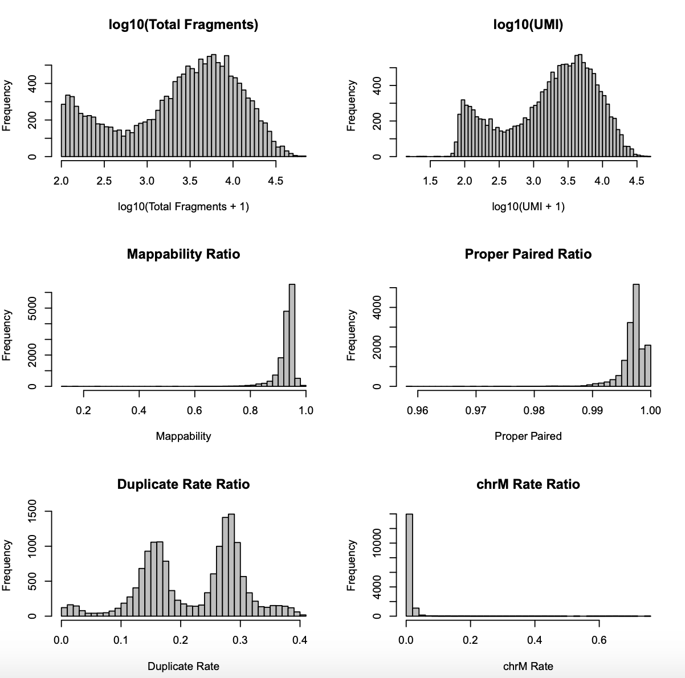
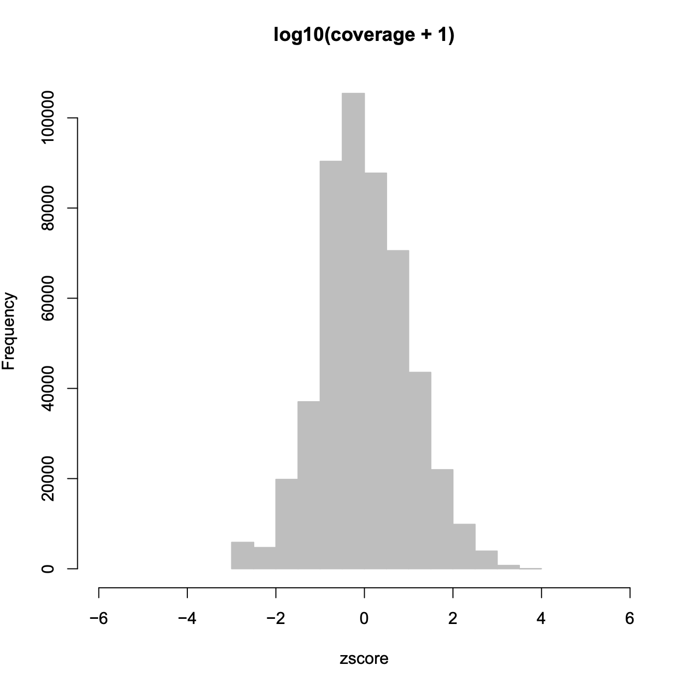
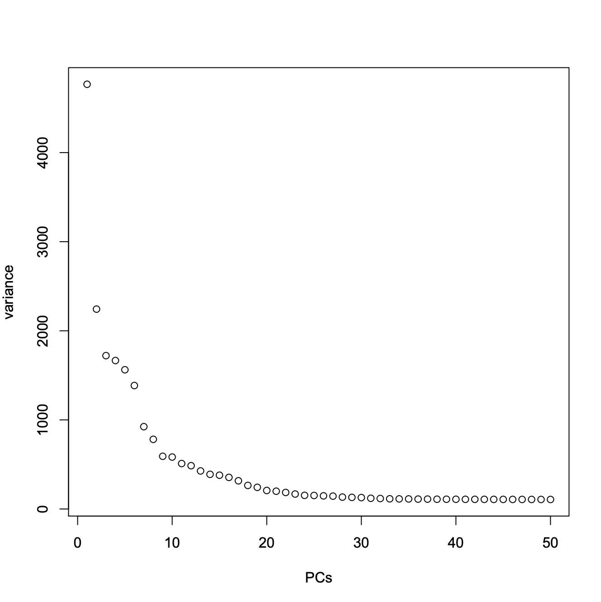
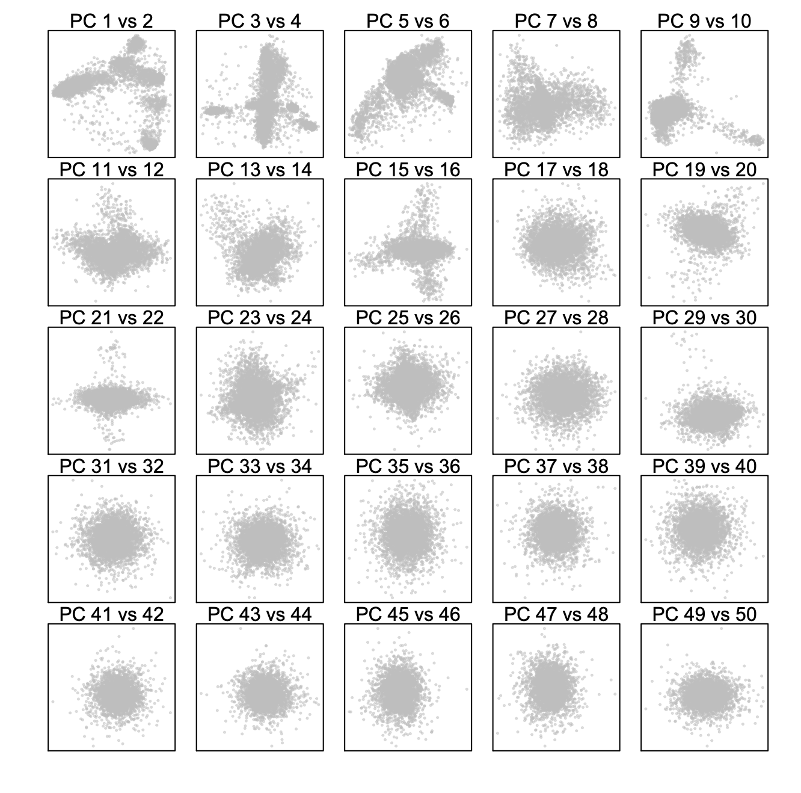
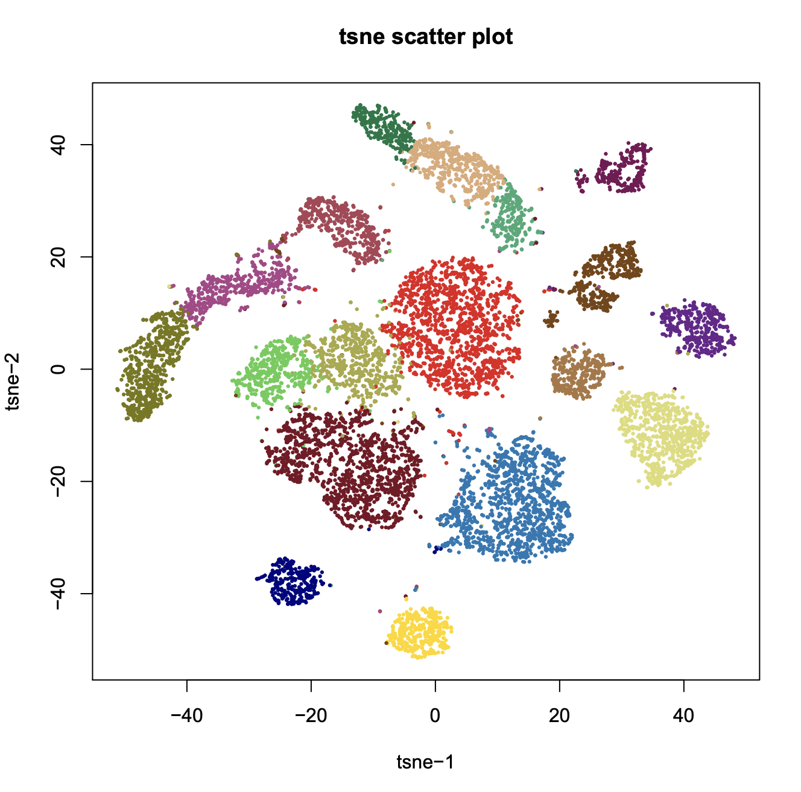
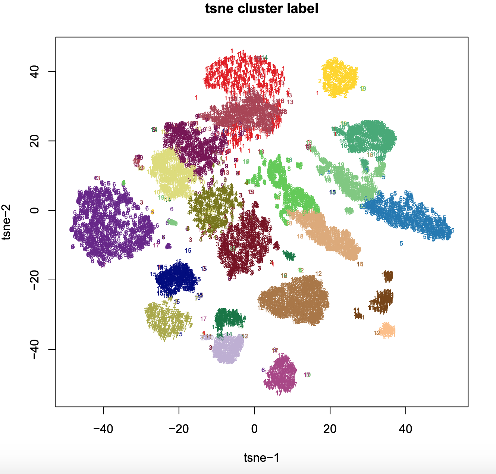
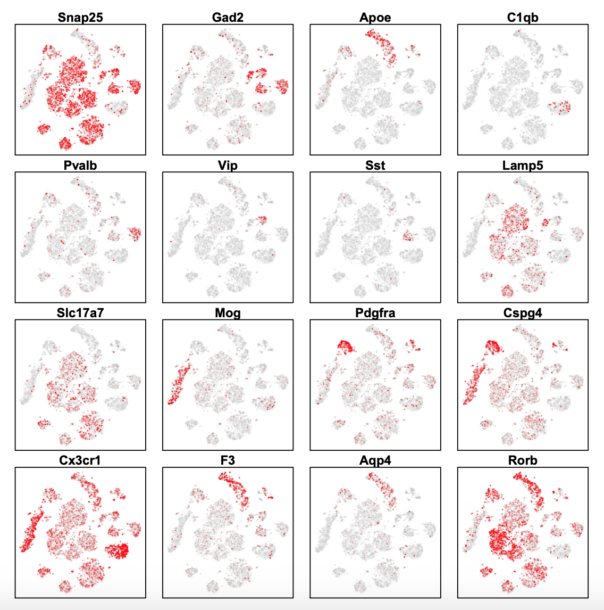
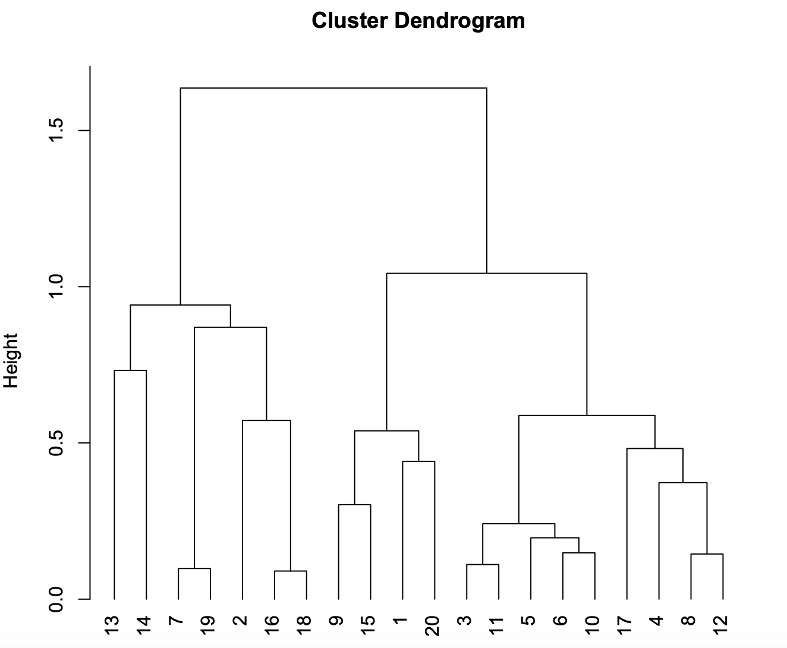
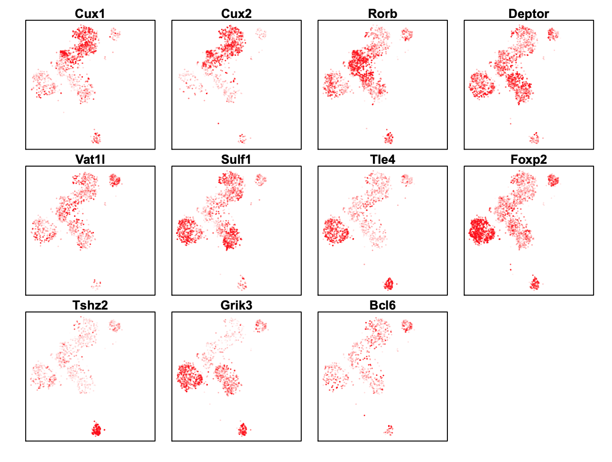
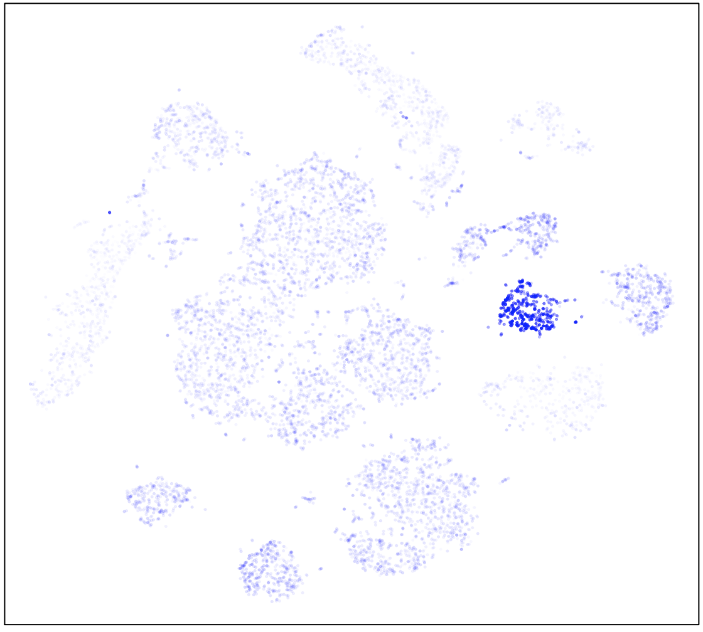

## Analysis of Mouse Secondary Motor Cortex (MOs)

**Step 1. Barcode Demultiplexing**. 
We first de-multicomplex FASTQ file by adding the barcode to the beginning of each read in the following format: "@" + "barcode" + ":" + "read_name". Below is one example of demultiplexed fastq file. Because barcode design can be very different between experiments and platforms, we decide not to include this part in the current analysis pipline. However, this can be easily implemented by awk or python script (see Wiki). Here we are downloading a subset of MOs dataset for demonstration. 
    
```bash
$ wget http://renlab.sdsc.edu/r3fang/share/Fang_2019/MOs_snATAC/fastq/CEMBA180306_2B.demultiplexed.R1.fastq.gz
$ wget http://renlab.sdsc.edu/r3fang/share/Fang_2019/MOs_snATAC/fastq/CEMBA180306_2B.demultiplexed.R2.fastq.gz
$ wget http://renlab.sdsc.edu/r3fang/share/Fang_2019/MOs_snATAC/peaks/all_peak.bed
$ wget http://renlab.sdsc.edu/r3fang/share/Fang_2019/MOs_snATAC/mm10.blacklist.bed.gz
$ wget http://renlab.sdsc.edu/r3fang/share/Fang_2019/MOs_snATAC/genes/gencode.vM16.gene.bed
$ zcat CEMBA180226_1A.demultiplexed.R1.fastq.gz | head 
@AGACGGAGTGCAGCTATGTCAGCTACTGCATA:7001113:948:HLFKYBCX2:1:1108:1237:1880 1:N:0:0
CACTCTGTGGTTGCTGGGACCTGAACCTGGATCCTCTGCAAGAGCAGCCA
+
DBDDDIHHIIEEFHGHIHFHIIFHGHFEEHHHIIHIHIIIIIIIIHIIII
```

**Step 2. Index Reference Genome (snaptools)**. 
Index the reference genome before alingment if you do not have a indexed genome. (skip this step if you already have indexed genome). Here we show how to index the genome using BWA. User can choose different `--aligner `. 

```bash
$ snaptools index-genome                \
	--input-fasta=mm10.fa                \
	--output-prefix=mm10                 \
    --aligner=bwa                       \
	--path-to-aligner=path_to_bwa/bin/   \
	--num-threads=3
```

**Step 3. Alignment (snaptools)**. 
We next aligned de-multicomplexed reads to the corresponding reference genome using snaptools with following command. After alignment, reads are sorted by the read names which allows for grouping reads according to the barcode (`--if-sort`). User can mutiple CPUs to speed up this step (`--num-threads`).

```bash
$ snaptools align-paired-end            \
	--input-reference=mm10.fa            \
	--input-fastq1=CEMBA180306_2B.demultiplexed.R1.fastq.gz      \
	--input-fastq2=CEMBA180306_2B.demultiplexed.R2.fastq.gz      \
	--output-bam= CEMBA180226_1A.bam     \
	--aligner=bwa                        \
	--path-to-aligner=path_to_bwa/bin/   \
	--read-fastq-command=zcat            \
	--min-cov=0                          \
	--num-threads=5                      \
	--if-sort=True                       \
	--tmp-folder=./                      \
	--overwrite=TRUE                     
```

**Step 4. Pre-processing (snaptools)**. 
After alignment, we converted pair-end reads into fragments and for each fragment, we check the following attributes: 1) mapping quality score MAPQ; 2) whether two ends are appropriately paired according to the alignment flag information; 3) fragment length. We only keep the properly paired fragments whose MAPQ (`--min-mapq`) is greater than 30 with fragment length less than 1000bp (`--max-flen`). Because the reads have been sorted based on the names, fragments belonging to the same cell (or barcode) are naturally grouped together which allows for removing PCR duplicates. After alignment and filtration, we generated a snap-format (Single-Nucleus Accessibility Profiles) file that contains meta data, cell-by-bin count matrices of a variety of resolutions, cell-by-peak count matrix. Detailed information about snap file can be found in here. 

```bash
$ wget http://hgdownload.cse.ucsc.edu/goldenPath/mm10/bigZips/mm10.chrom.sizes
$ snaptools snap-pre                     \
	--input-file=CEMBA180306_2B.bam      \
	--output-snap=CEMBA180306_2B.snap    \
	--genome-name=mm10 	                 \
	--genome-size=mm10.chrom.sizes       \
	--min-mapq=30      	                 \
	--min-flen=0       	                 \
	--max-flen=1000    	                 \
	--keep-chrm=TRUE                     \
	--keep-single=TRUE                   \
	--keep-secondary=False               \
	--overwrite=True                     \
	--min-cov=100                        \
	--verbose=True
```

**Step 5. Cell-by-Bin Matrix Generation (snaptools)**. 
Using generated snap file, we next create the cell-by-bin matrix. Snap file allows for storing cell-by-bin matrices of different resolutions. In the below example, three cell-by-bin matrices are created with bin size of 1,000, 5,000 and 10,000. 


```bash
$ snaptools snap-add-bmat             \
	--snap-file=CEMBA180306_2B.snap    \
	--bin-size-list 1000 5000 10000    \
	--verbose=True
```

**Step 6. Cell-by-gene Matrix Generation (snaptools)**. 
We next create the cell-by-gene matrix which is later used for cluster annotation.


```bash
$ snaptools snap-add-gmat             \
	--snap-file=CEMBA180306_2B.snap    \
	--gtf-file=gencode.vM16.gene.bed  \
	--verbose=True
```

**Step 7. Cell-by-Peak Count Matrix Generaton (snaptools)**. 
Using the merged peak list (download from Fang 2019), snaptools generates cell-by-peak matrix. 

```bash
$ wget http://renlab.sdsc.edu/r3fang/share/Fang_2019/MOs_snATAC/peaks/all_peak.bed
$ snaptools snap-add-pmat            \
   --snap-file=CEMBA180306_2B.snap   \
   --peak-file=all_peak.bed
```

**Step 7. Barcode Selection (snapATAC)**. 
Using snap file, we next identify the high-quality barcode based on the following metrices: 1) `fragment.num` - Total Sequencing Fragments; 2) `umap.ratio` - uniquely mapped ratio; 3) `dup.ratio ` - duplate ratio; 4) `pair.ratio` - properly paired ratio; 5) `mito.ratio` - mitochondrial ratio. 

```R
$ R
> library(SnapATAC);
> x.sp = createSnap("CEMBA180306_2B.snap", metaData=TRUE);
> plotBarcode(x.sp);                             
# filter cells based on the following cutoffs
> x.sp = filterCells(x.sp, 
                   subset.names=c("fragment.num",
                                  "mito.ratio",
                                  "dup.ratio",
                                  "umap.ratio",
                                  "pair.ratio"),
                   low.thresholds=c(1000, 0, 0, 0.8, 0.9),
                   high.thresholds=c(Inf, 0.1, 0.5, 1, 1)
                  );
> x.sp 

number of barcodes: 11251
number of bins: 0
number of peaks: 0
number of genes: 0
==========================
meta data            (metData) :  TRUE
cellxbin matrix      (bmat)    :  FALSE
cellxpeak matrix     (pmat)    :  FALSE
cellxgene matrix     (gmat)    :  FALSE
jaccard matrix       (jmat)    :  FALSE
normalization        (nmat)    :  FALSE
PCA:                 (smat)    :  FALSE
cluster:             (cluster) :  FALSE
t-sne:               (tsne)    :  FALSE
umap:                (umap)    :  FALSE
```



**Step 8. Bin Size Selection (snapATAC)**. 
Using remaining cells, we next choose the optimal bin size based on the correlation between replicates. If there is no biological replicates given, the cells are evenly splitted into two psuedo-replicates. We recommand to chose the smallest bin size that have correlation greater than 0.95.

```R
# show what bin sizes exist in CEMBA180306_2B.snap file
> showBinSizes("CEMBA180306_2B.snap");
# try 1kb resolution
> x.sp = addBmat(x.sp, "CEMBA180306_2B.snap", binSize=1000);
> makeBinary(x.sp, "bmat");
> checkBinSize(x.sp);
# try 5kb resolution
> x.sp = addBmat(x.sp, "CEMBA180306_2B.snap", binSize=5000);
> makeBinary(x.sp, "bmat");
> checkBinSize(x.sp);
# try 10kb resolution
> x.sp = addBmat(x.sp, "CEMBA180306_2B.snap", binSize=10000);
> makeBinary(x.sp, "bmat");
> checkBinSize(x.sp);
# based on the correlation, we choose 5kb resolution. 
# in most cases, we recommand for 5kb resolution
> x.sp = addBmat(x.sp, "CEMBA180306_2B.snap", binSize=5000);
```

**Step 9. Matrix Binarization (snapATAC)**. 
For cell-by-bin count matrix, we next convert it to a binary matrix. We found some items in the matrix can have exceedingly high coverage perhaps due to the alignment error. Therefore, we first remove top 0.1% items in the count matrix and then convert it to a binary matrix.

```R
> x.sp = makeBinary(x.sp, mat="bmat");
```

**Step 10. Feature Selection (snapATAC)**. 
We calculate the `log10(count+1)` for every bin as its coverage. The distribution is approximately obey to a gussian distribution. We then converted to coverage into zscore and filter the bin of exceedingly high coverage (`high.threshold`) which represent the genomic regions that are less variable between cells. We also found that filtering bins of extreme low coverage (`low.threshold`) which may be a result of random noise can improve the robustness of downstream clustering. 

```R
> black_list = read.table("mm10.blacklist.bed.gz");
> black_list.gr = GRanges(
                          black_list[,1], 
                          IRanges(black_list[,2], black_list[,3])
                         );
> idy1 = queryHits(findOverlaps(x.sp@feature, black_list.gr));
> idy2 = grep("chrM|random", x.sp@feature);
> idy = unique(c(idy1, idy2));
> x.sp = x.sp[,-idy, mat="bmat"];
> plotBinCoverage(x.sp);
> x.sp = filterBins(
	x.sp,
	low.threshold=-2,
	high.threshold=2,
	mat="bmat"
	);
> x.sp

number of barcodes: 11251
number of bins: 476589
number of peaks: 0
number of genes: 0
==========================
meta data            (metData) :  TRUE
cellxbin matrix      (bmat)    :  TRUE
cellxpeak matrix     (pmat)    :  FALSE
cellxgene matrix     (gmat)    :  FALSE
jaccard matrix       (jmat)    :  FALSE
normalization        (nmat)    :  FALSE
PCA:                 (smat)    :  FALSE
cluster:             (cluster) :  FALSE
t-sne:               (tsne)    :  FALSE
umap:                (umap)    :  FALSE

```



**Step 11. Jaccard Matrix & Normlaization (snapATAC)**. We next convert the genome-wide cell-by-bin matrix into a cell-by-cell similarity matrix by estimating the jaccard index between two cells in the basis of overlaps. Instead of calculating a full N-by-N jaccard matrix, we calculate a partial jaccard index matrix by randomly choosing K cells (`max.var`). By doing so, we demonstrate that it does not sacriface the performance but significantly improves the running time. Due to the high dropout rate, the jaccard index is highly biased toward high coverage cells. To remove the read depth effect, we developed a normalization method (`norm.method`).
  
```R
> x.sp = calJaccard(
	x.sp,
	mat = "bmat",
	ncell.chunk=1000,
	max.var=5000,
	seed.use=10,
	norm.method="normOVE",
	row.center=TRUE,
	row.scale=TRUE,
	low.threshold=-5,
	high.threshold=5,
	keep.jmat=FALSE,
	do.par=TRUE,
	num.cores=5
	)

``` 

**Step 12. PCA (snapATAC)**. Like other single-cell analysis, scATAC-seq contains extensive technical noise due to the high drop-out rate. To overcome this challenge, PCA or SVD is often applied to combine information across a correlated feature set hereby creating a mega-feature and exclude the variance potential resulting from technical noise. Here, we performed PCA against the normalized matrix. We used IRLBA algorithm, a fast and memory-efficient algorithm, to compute a partial PCA. IRLBA is implemented in  “irlba” R package.

```R
> x.sp = runPCA(
	x.sp,
	pc.num=50,
	input.mat="nmat",
	method="svd",
	weight.by.sd=FALSE,
	center=TRUE,
	scale=FALSE,
	seed.use=10
	)
```

**Step 13. Determine statistically significant principal components (snapATAC)**. We next Determine how many PCs to include for downstream analysis. We use an ad hoc method for determining which PCs to use is to look at a plot of the standard deviations of the principle components and draw your cutoff where there is a clear elbow in the graph. The other ad hoc way to determine PCs is to plot out every two PCs and select until PCs that have no obvious structure. 

```R
> plotPCA(x.sp, method="elbow");
> plotPCA(x.sp, method="pairwise");
```
 

**Step 14. Clustering (snapATAC)**. Using the selected PC vector, snapATAC next used a graph-based algorithm Louvain for finding cluster. 

```R
> x.sp = runCluster(
	x.sp,
	pca_dims=1:25,
	k=15,
	resolution=0.7,
	method="louvain",
	)
```

**Step 15. Visulization (snapATAC)**. snapATAC uses tSNE and UMAP to visualize and explore these datasets. 

```R
# tsne
> x.sp = runViz(
	x.sp, 
	pca_dims=1:25, 
	dims=2, 
	method="Rtsne"
	)

# visulization
> plotViz(x.sp, method="tsne", pch=19, cex=0.5);
```

 

**Step 16. Gene-body based Annotation (snapATAC)**. To annotate identified cell clusters, snapATAC next loads the cell-by-gene matrix which estimates the gene body accessibility level.

```R
> x.sp = addGmat(x.sp, "CEMBA180306_2B.snap");
> x.sp = scaleCountMatrix(
	x.sp, 
	cov=rowSums(x.sp, mat="bmat"),
	mat="gmat"
	);
> marker.genes = c(
	"Snap25", "Gad2", "Apoe", "C1qb", "Pvalb", 
	"Vip", "Sst", "Lamp5", "Slc17a7", "Mog", 
	"Pdgfra", "Cspg4","Cx3cr1","F3","Aqp4", "Rorb"
	);
> plotGene(
	x.sp, 
	gene.sel=marker.genes, 
	method="tsne",
	binary=FALSE,
	cex=0.1
	);
```




**Step 17. Clustering of the clusters. 

```R
> ensemble.ls = lapply(split(seq(length(x.sp@cluster)), x.sp@cluster), function(x){
	colMeans(x.sp@bmat[x,])
	})
	
> hc = hclust(as.dist(1 - cor(t(do.call(rbind, ensemble.ls)))), method="ward.D2")
> plot(hc, hang=-1, xlab="");
```

 

```R
> idx = which(x.sp@cluster %in% c(9, 10, 1, 13, 3, 4, 2, 6, 17));
> marker.genes = c(
	"Cux1", "Cux2", "Rorb", "Deptor", "Vat1l", "Sulf1", 
	"Tle4", "Foxp2", "Tshz2", "Grik3", "Bcl6"
	);
> plotGene(
	x.sp[idx,], 
	gene.sel=marker.genes, 
	method="tsne",
	binary=FALSE,
	cex=0.1,
	plot.row=4,
	plot.col=4,
	xlim=c(min(x.sp@tsne[,1]), max(x.sp@tsne[,1])),
	ylim=c(min(x.sp@tsne[,2]), max(x.sp@tsne[,2]))
	);

```




**Step 19. Identify differential accessible regions (DARs)**.  

```R
> x.sp = addPmat(x.sp, "CEMBA180306_2B.snap");
> x.sp = makeBinary(x.sp, mat="pmat");
> barcodes = x.sp@barcode[which(x.sp@cluster == 7)];
> idy = findDAR.default(
	object=x.sp, 
	mat="pmat",
	barcodes.sel=barcodes,
	bcv=0.4, 
	rand.seed=10, 
	pca_dims=1:25,
	fdr=1e-1,
	method="exactTest",
	k=30
	)
> y = rowSums(x.sp@pmat[,idy]) / rowSums(x.sp@pmat);
> y = y/max(y);
> plot(x.sp@tsne, 
	col=alpha("red", y), 
	yaxt='n', 
	xaxt="n",
	xlab="", 
	ylab="",
	cex=0.2
	);
```



**Step 19. Infer master regulators (DARs)**.  

Motif analysis using [homer](http://homer.ucsd.edu/homer/introduction/install.html) and [marga](https://www.biorxiv.org/content/biorxiv/early/2018/01/17/249268.full.pdf).

```R
> motifs = runHomer(
	x.sp[,idy,"pmat"], 
	mat = "pmat",
	path_to_homer = "path_to_homer/bin/homer"
	result_dir = "./homer/Pvalb_DAR",
	genome = 'mm10',
	motif_length = 10,
	scan_size = 300,
	optimize_count = 2,
	background = 'automatic',
	local_background = FALSE,
	only_known = FALSE,
	only_denovo = FALSE,
	fdr_num = 5,
	cores = 10,
	cache = 100,
	overwrite = TRUE,
	keep_minimal = FALSE
	)
> head(motifs[,1:3])

                                             Motif.Name    Consensus P.value
1  Mef2b(MADS)/HEK293-Mef2b.V5-ChIP-Seq(GSE67450)/Homer GCTATTTTTGGM   1e-86
2    Mef2c(MADS)/GM12878-Mef2c-ChIP-Seq(GSE32465)/Homer DCYAAAAATAGM   1e-70
3 Mef2a(MADS)/HL1-Mef2a.biotin-ChIP-Seq(GSE21529)/Homer   CYAAAAATAG   1e-68
4     Mef2d(MADS)/Retina-Mef2d-ChIP-Seq(GSE61391)/Homer GCTATTTTTAGC   1e-58
5        Fra1(bZIP)/BT549-Fra1-ChIP-Seq(GSE46166)/Homer NNATGASTCATH   1e-45
6     Fra2(bZIP)/Striatum-Fra2-ChIP-Seq(GSE43429)/Homer GGATGACTCATC   1e-44

```


Alternatively, motif analysis can be done using chromVAR
```R
> library(chromVAR)
> runChromVAR(
	x.sp[,idy,"pmat"], 
	mat="pmat",
	genome=BSgenome.Mmusculus.UCSC.mm10
	)
```


