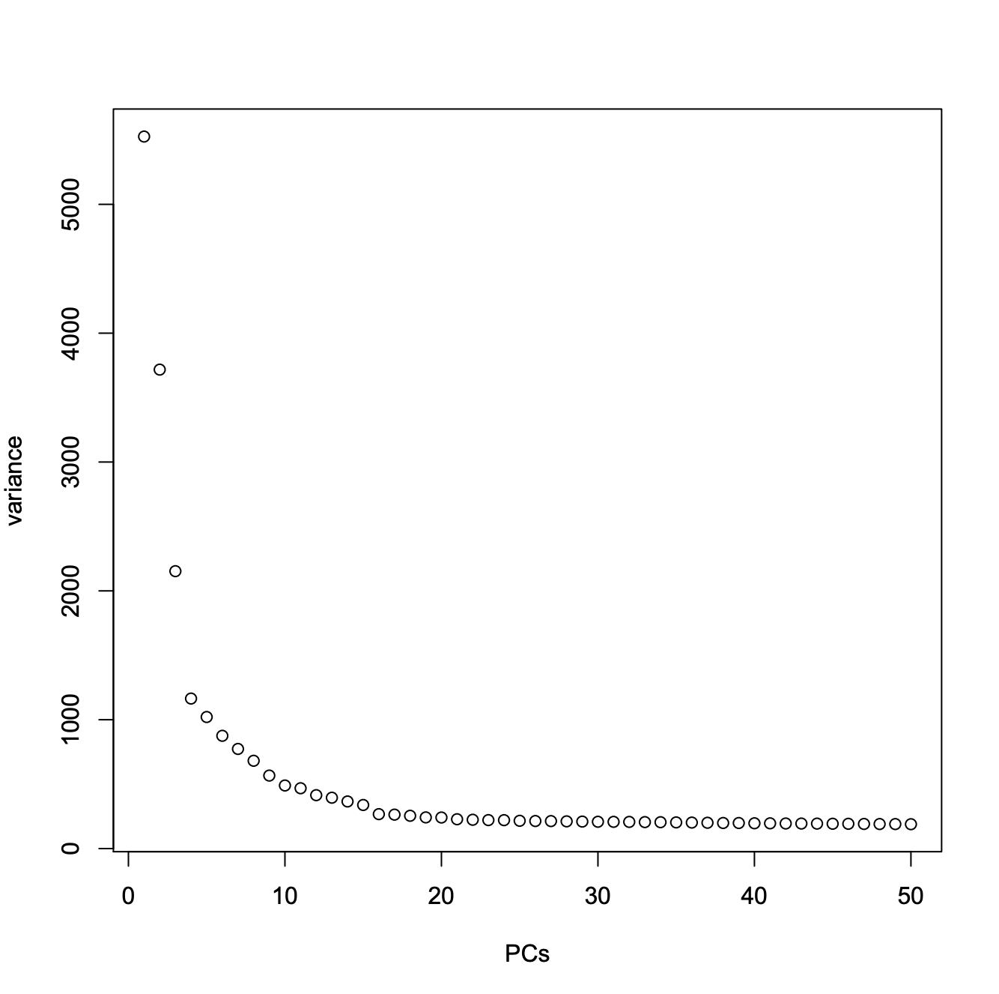
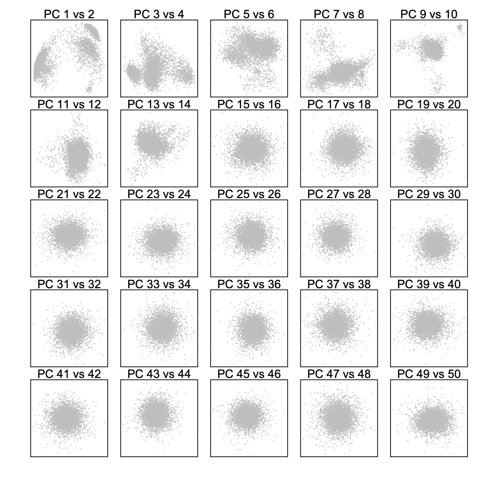
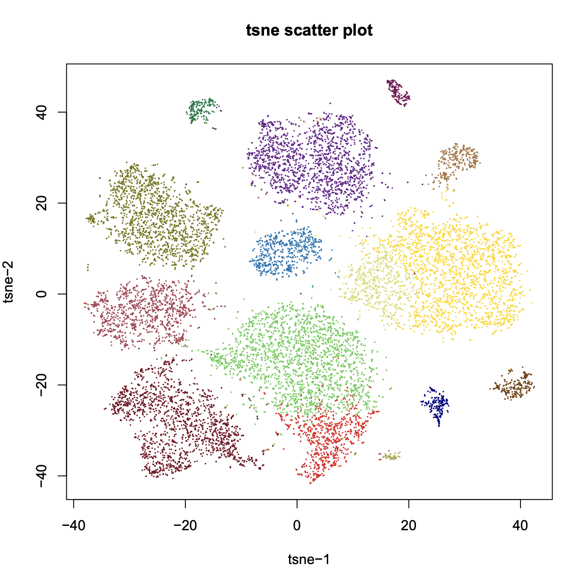
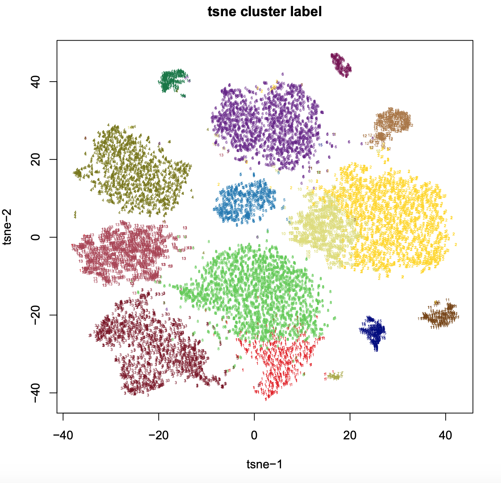
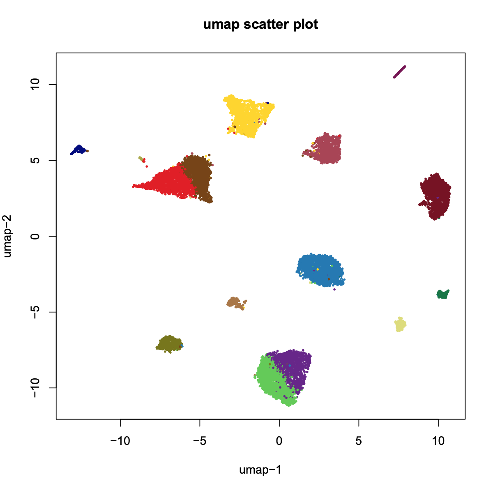
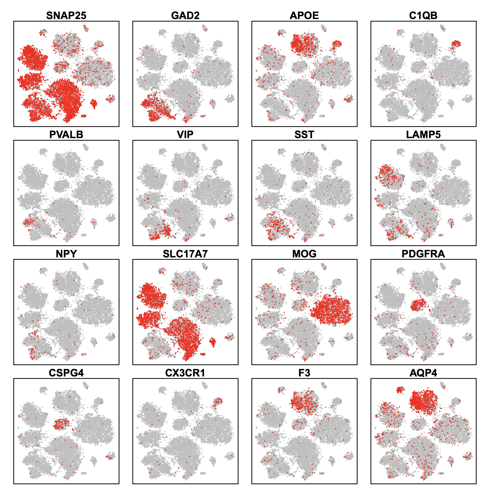
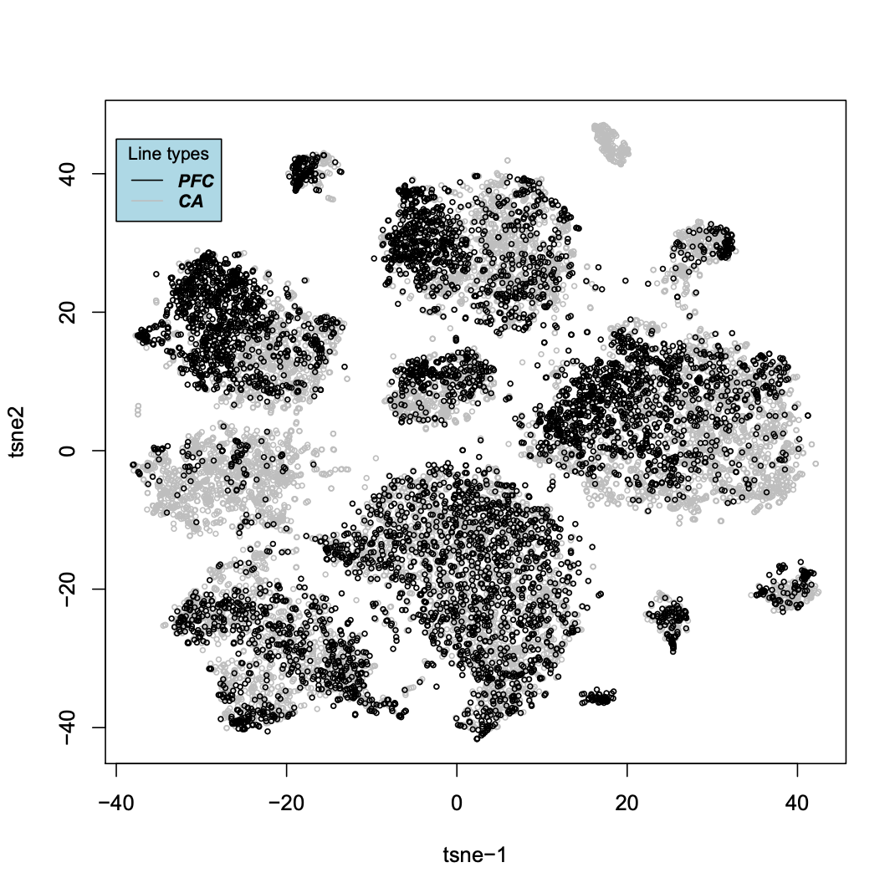
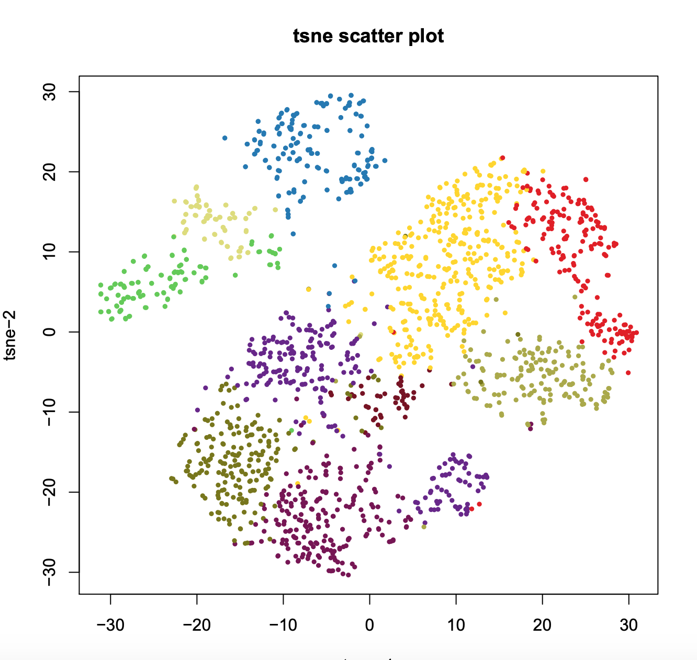
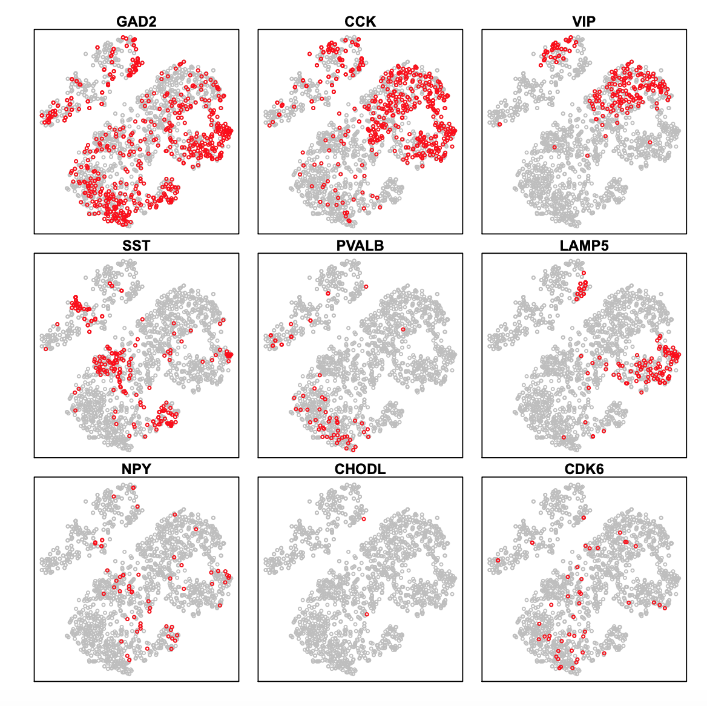

## Re-analysis of published single nucleus RNA-seq (Habib 2017)

**Step 1. Download snRNA-seq from adult post-mortem human brain tissue.**. 

```
$ wget https://storage.googleapis.com/gtex_additional_datasets/single_cell_data/GTEx_droncseq_hip_pcf.tar
$ tar xopf GTEx_droncseq_hip_pcf.tar
```

**Step 2. Create a snap object.**

```R
$ R
> library(SnapATAC);
> dat = read.table(
                   "GTEx_droncseq_hip_pcf/GTEx_droncseq_hip_pcf.umi_counts.txt.gz", 
				   head=TRUE, 
				   row.name=1
				   );
> cmat = Matrix(t(as.matrix(dat)),sparse=TRUE);
> x.sp = createSnapFromGmat(
                            cmat, 
                            barcodes=rownames(cmat), 
                            geneNames=colnames(cmat)
                            )
> x.sp

number of barcodes: 14963
number of bins: 0
number of peaks: 0
number of genes: 32111
==========================
meta data            (metData) :  FALSE
cellxbin matrix      (bmat)    :  FALSE
cellxpeak matrix     (pmat)    :  FALSE
cellxgene matrix     (gmat)    :  TRUE
jaccard matrix       (jmat)    :  FALSE
normalization        (nmat)    :  FALSE
PCA:                 (smat)    :  FALSE
cluster:             (cluster) :  FALSE
t-sne:               (tsne)    :  FALSE
umap:                (umap)    :  FALSE
```

**Step 2. Matrix binarization.** Convert the cell-by-gene count matrix into a binary matrix

```R
> x.sp = makeBinary(x.sp, mat="gmat");
```

**Step 3. Jaccard Matrix & Normlaization**

```
> x.sp = calJaccard(
        x.sp,
        ncell.chunk=1000,
        mat="gmat",
        max.var=5000,
        seed.use=10,
        norm.method="normOVE",
        row.center=TRUE,
        row.scale=TRUE,
        low.threshold=-5,
        high.threshold=5,
        keep.jmat=FALSE,
        do.par = TRUE,
        num.cores = 5
        );
```

**Step 4. PCA Analysis**

```R
> x.sp = runPCA(
        x.sp,
        pc.num=50,
        input.mat = "nmat",
        method="svd",
        weight.by.sd = FALSE,
        center=TRUE,
        scale=FALSE,
        seed.use=10
        )
```

**Step 5. Determine significant principal components**

```R
> plotPCA(x.sp, method="elbow");
> plotPCA(x.sp, method="pairwise");
```

 

**Step 6. Cluster**

```R
> x.sp = runCluster(
	x.sp,
	pca_dims=1:20,
	k=15,
	resolution=1.0,
	method="louvain",
	path_to_snaptools="/home/r3fang/anaconda2/bin/snaptools"
	);
```

**Step 7. Visualization**

```
> x.sp = runViz(
	x.sp, 
	pca_dims=1:20, 
	dims=2, 
	method="Rtsne"
	);
> x.sp = runViz(
	x.sp, 
	pca_dims=1:20, 
	dims=2, 
	method="umap"
	);
> plotViz(x.sp, method="tsne", pch=19, cex=0.3);
> plotViz(x.sp, method="umap", pch=19, cex=0.3);
```

 
 

**Step 8. Marker gene enrichment plot**

```
> marker.genes = c(
                   "SNAP25", "GAD2", "APOE", "C1QB", "PVALB", 
				   "VIP", "SST", "LAMP5", "NPY", "SLC17A7", 
				   "MOG", "PDGFRA", "CSPG4","CX3CR1","F3","AQP4"
                   );
> plotGene(
           x.sp, 
		   gene.sel= marker.genes, 
		   method="tsne",
		   background=FALSE,
		   binary=TRUE, 
		   p=1, 
		   cex=0.1
		   );
```



**Step 9. Comparision between PFC and HP**

```
> plot(x.sp@tsne, col="grey", cex=0.5, xlab="tsne-1", ylab="tsne2");
> points(x.sp@tsne[grep("PFC", x.sp@barcode),], col="black", cex=0.5);
> legend(-40, 45, legend=c("PFC", "CA"),
       col=c("black", "grey"), lty=1, cex=0.8,
       title="Line types", text.font=4, bg='lightblue')
> barplot(table(x.sp@cluster[grep("PFC", x.sp@barcode)])/table(x.sp@cluster), main="PFC ratio (expected=0.39)") 
```

 

**Step 10. Sub-division of GABAergic neurons**

```R
> x.gaba.sp = x.sp[which(x.sp@cluster==3),]
> x.gaba.sp = calJaccard(
        x.gaba.sp,
        mat="gmat",
        ncell.chunk=1000,
        max.var=5000,
        seed.use=10,
        norm.method="normOVE",
        row.center=TRUE,
        row.scale=TRUE,
        low.threshold=-5,
        high.threshold=5,
        keep.jmat=FALSE,
        do.par = TRUE,
        num.cores = 5
        )

> x.gaba.sp = runPCA(
        x.gaba.sp,
        pc.num=50,
        input.mat = "nmat",
        method="svd",
        weight.by.sd = TRUE,
        center=TRUE,
        scale=FALSE,
        seed.use=10
        )

> x.gaba.sp = runCluster(
	x.gaba.sp,
	pca_dims=1:10,
	k=30,
	resolution=1,
	method="louvain",
	path_to_louvain="/home/r3fang/anaconda2/bin/snaptools"
	)

> x.gaba.sp = runViz(
	x.gaba.sp, 
	pca_dims=1:10, 
	dims=2, 
	method="Rtsne",
	)

> plotViz(x.gaba.sp, method="tsne", pch=19, cex=0.5);

```
 


```
> marker.genes = c("GAD2", "CCK", "VIP", "SST", "PVALB", "LAMP5","NPY", "CHODL", "CDK6", "MYH8", "TH", "SNCG");
> plotGene(x.gaba.sp, gene.sel=marker.genes, method="tsne", p=1, cex=0.6, plot.row=3, plot.col=3);
```

