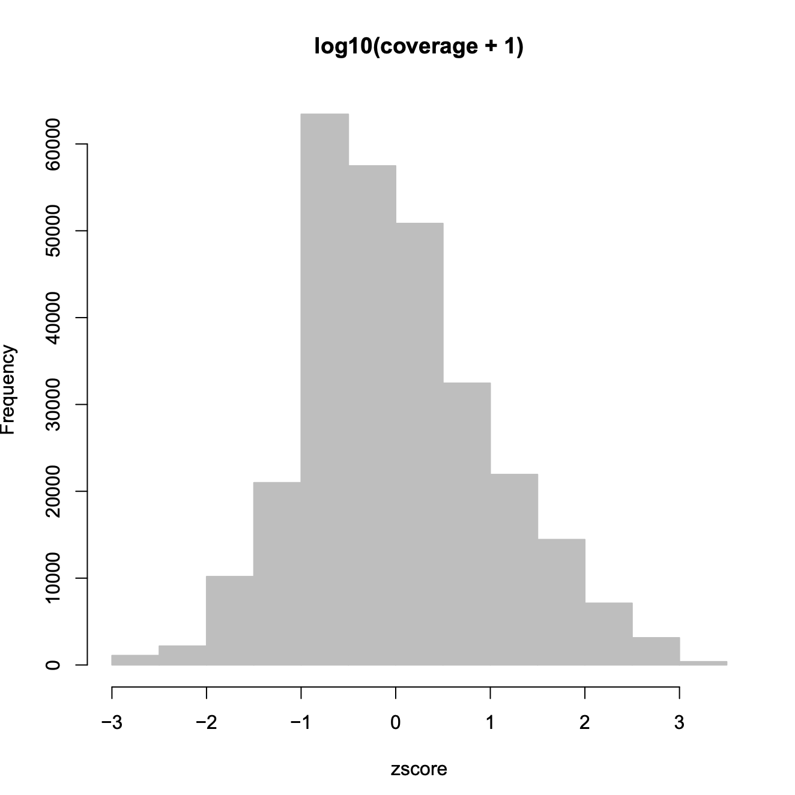
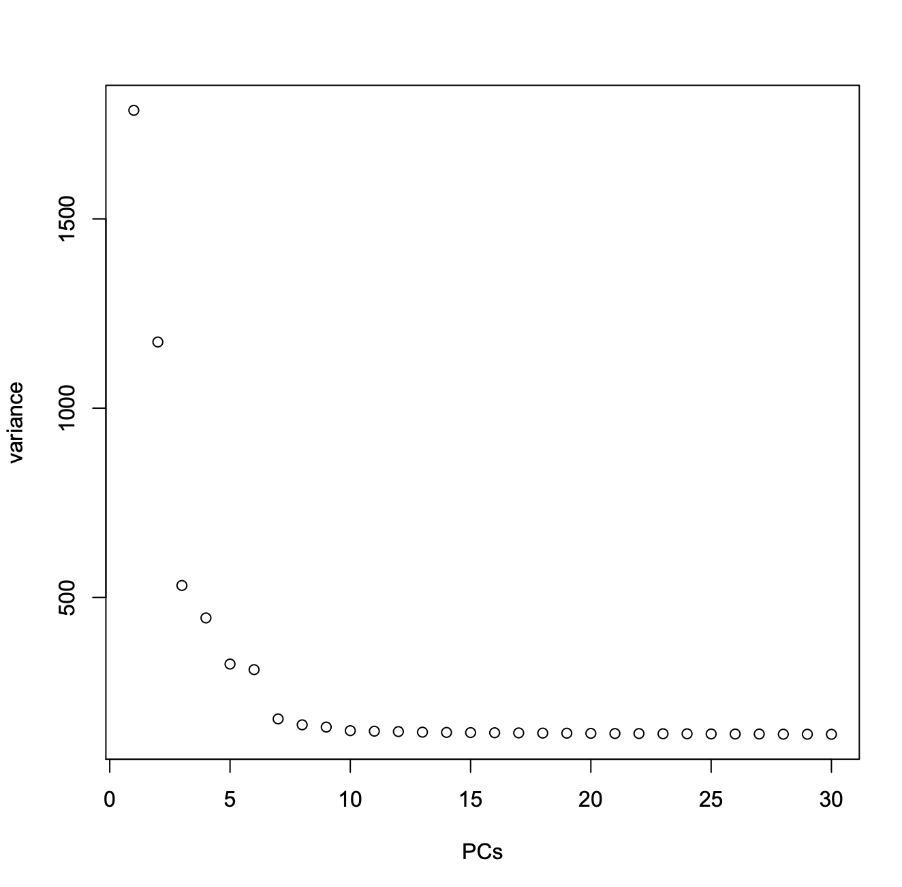
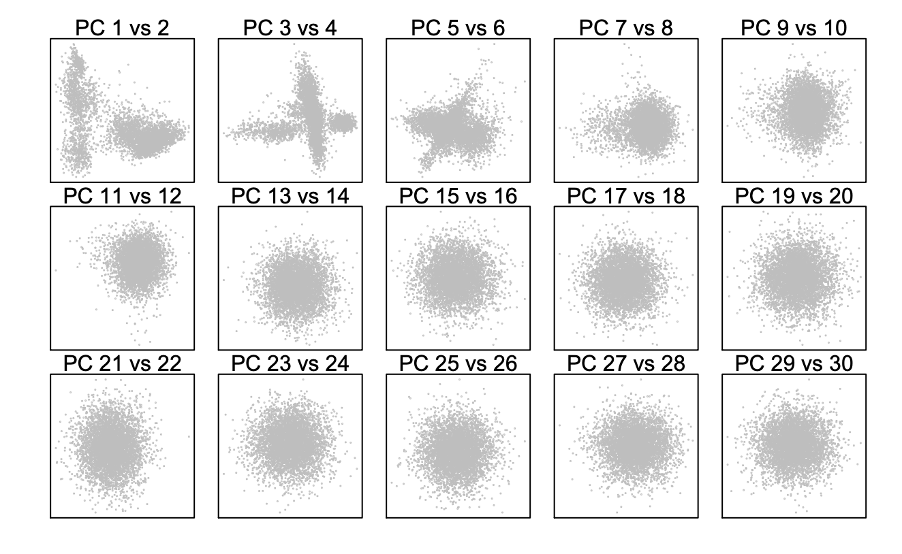
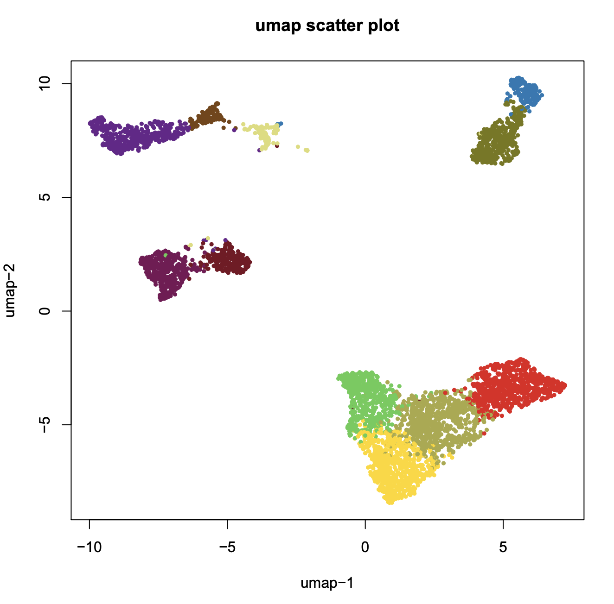
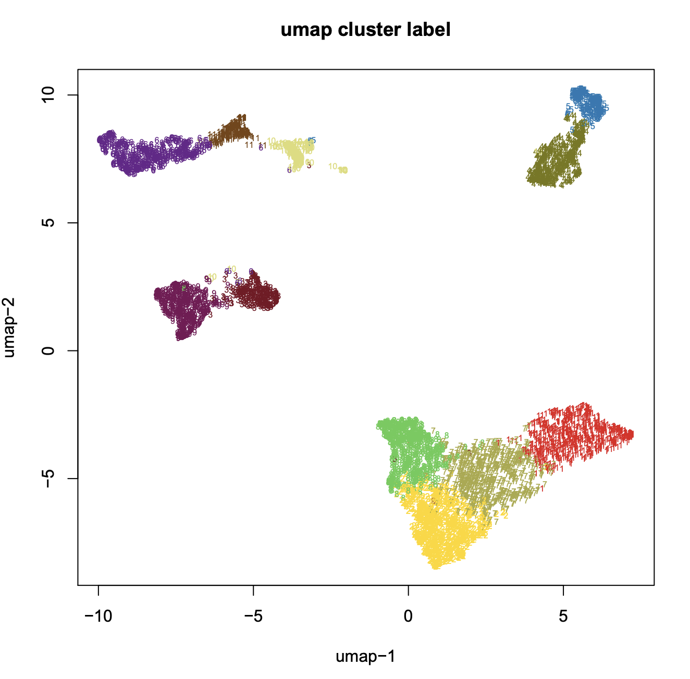

## Re-analysis of scTHS-seq from human adult brain (Lake 2018)

**Step 1. Download scTHS-seq from human adult brain**. 

```
> wget http://renlab.sdsc.edu/r3fang/share/Fang_2019/published_scATAC/Lake_2018/Lake_counts.Rds
> wget http://renlab.sdsc.edu/r3fang/share/Fang_2019/published_scATAC/Lake_2018/Lake_cellData.Rds
> wget http://renlab.sdsc.edu/r3fang/share/Fang_2019/published_scATAC/Lake_2018/Lake_peaks.bed
```

**Step 2. Create a snap object**

```R
> R
> library(snapATAC)

# create a snap object with 500 bin size
> cellPeakMatrix = readRDS("Lake_counts.Rds");
> metaData = readRDS("Lake_cellData.Rds");
> peaks = read.table("Lake_peaks.bed");
> peaks.gr = GRanges(peaks[,1], IRanges(peaks[,2], peaks[,3]));
> 
> x.sp = createSnapFromPmat(
                      mat=cellPeakMatrix, 
                      barcode=rownames(metaData), 
                      peaks=peaks.gr
                      );
```

**Step 3. Remove 'NA' cells**

```R
# remove NA cells
> idx = which(!is.na(metaData[,6]))
> x.sp = x.sp[idx,]
```

**Step 4. Filter peaks of exceedingly high or low coverage**



```R
> x.sp = filterBins(
	x.sp,
	low.threshold=-2,
	high.threshold=2,
	mat="pmat"
	)
```


**Step 5. Filter peaks of exceedingly high or low coverage**

```R
# Calculate Jaccard Index Matrix
> x.sp = calJaccard(
	x.sp,
	mat = "pmat",
	ncell.chunk=5000,
	max.var=5000,
	seed.use=10,
	norm.method="normOVE",
	row.center=TRUE,
	row.scale=TRUE,
	low.threshold=-5,
	high.threshold=5,
	keep.jmat=FALSE,
	do.par=FALSE,
	num.cores=1
	)
```

**Step 6. Perform PCA analysis**

```
> x.sp = runPCA(
	x.sp,
	pc.num=30,
	input.mat="nmat",
	method="svd",
	weight.by.sd = TRUE,
	center=TRUE,
	scale=FALSE,
	seed.use=10
	)
```

**Step 7. Determine the significant principle components**

```
> plotPCA(x.sp, method="elbow");
> plotPCA(x.sp, method="pairwise");
```






**Step 8. Find clusters**

```R
> x.sp = runCluster(
                    x.sp,
                    pca_dims=1:10,
                    k=30,
                    resolution=1.0,
                    method="jaccard_louvain",
                    path_to_louvain="../../../../github/snapR/bin/findCommunityLouvain"
                    )
```

**Step 9. Visulization**

```	
# umap
> x.sp = runViz(
	x.sp, 
	pca_dims=1:10, 
	dims=2, 
	method="umap",
	)

plotViz(x.sp, method="umap", pch=19, cex=0.5);
```




