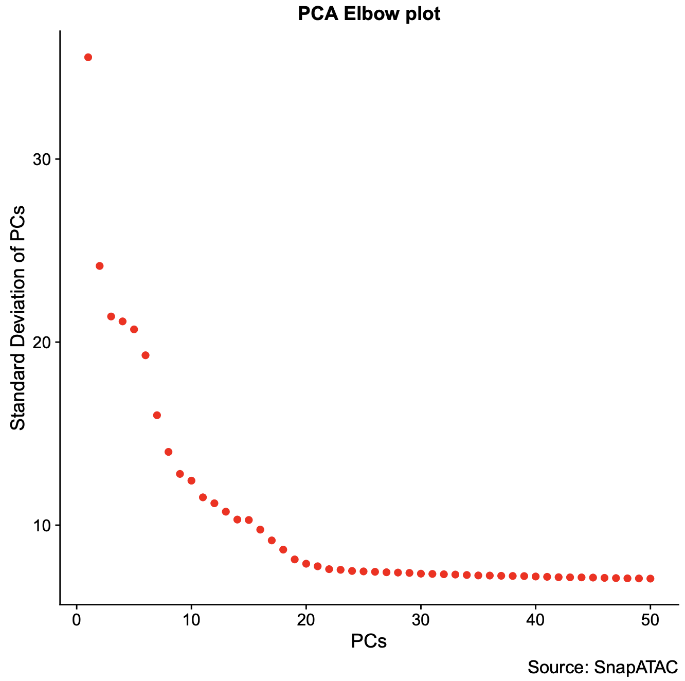
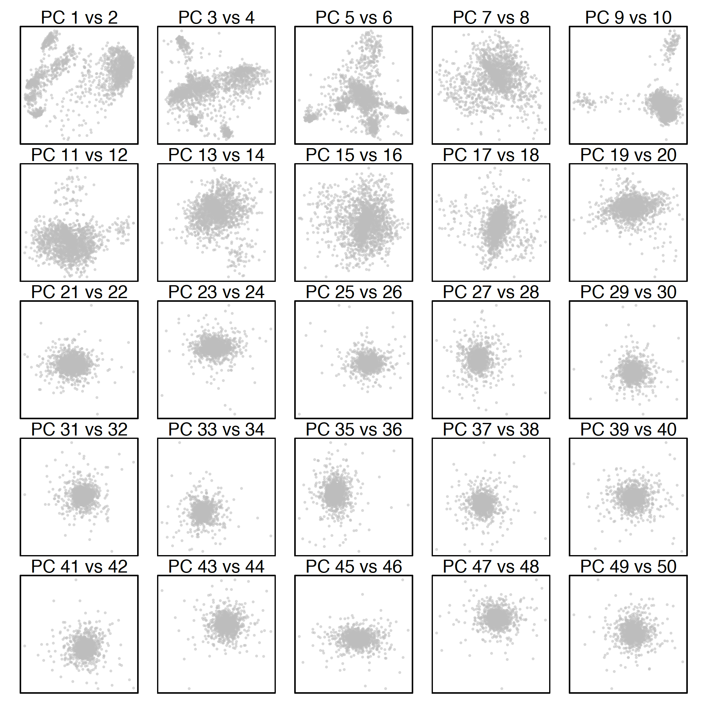
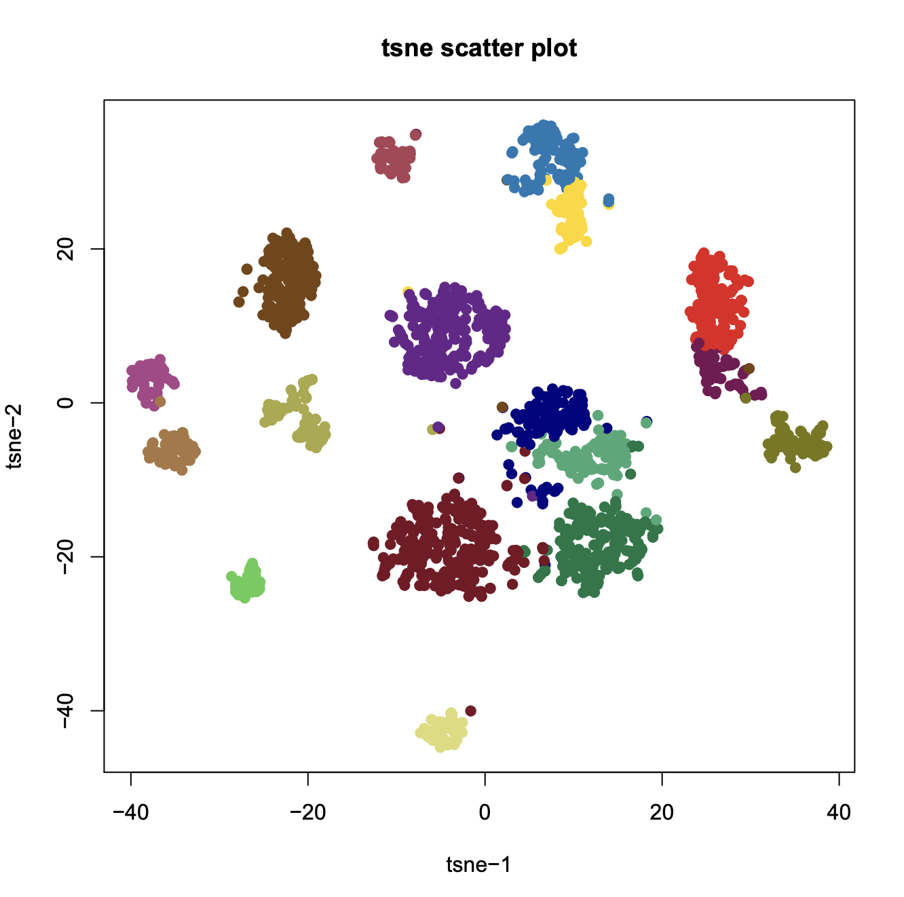
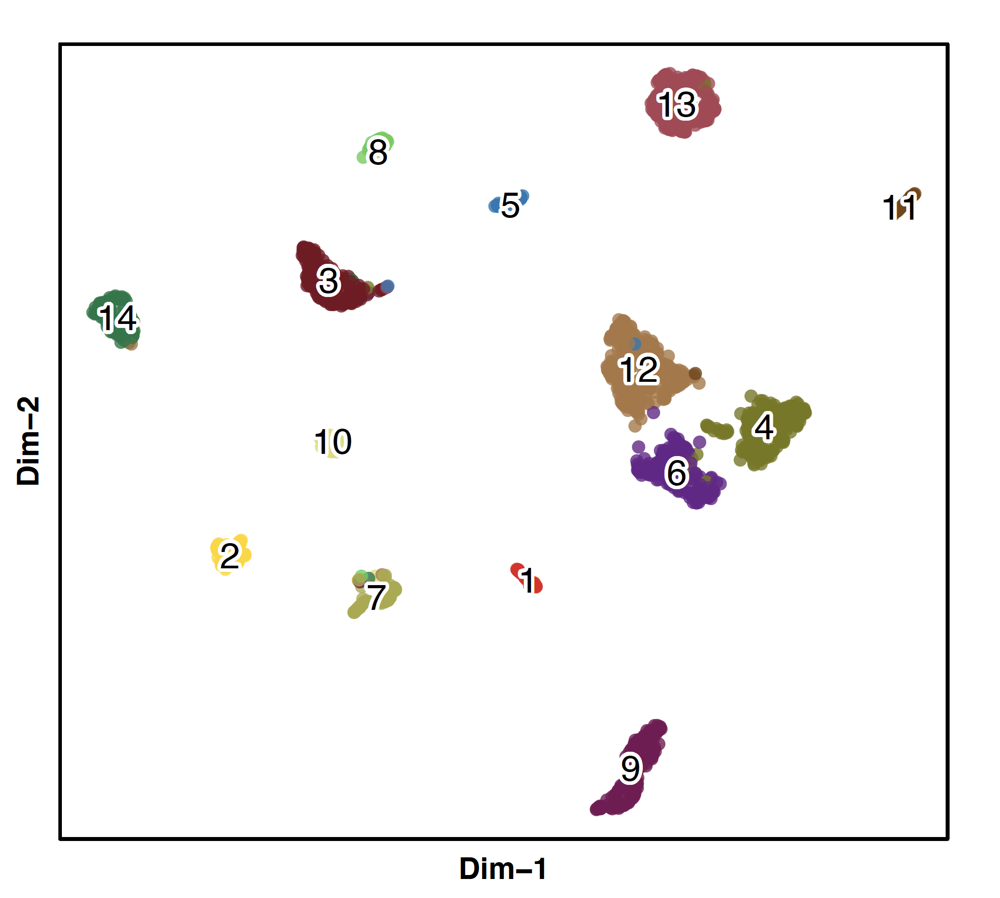
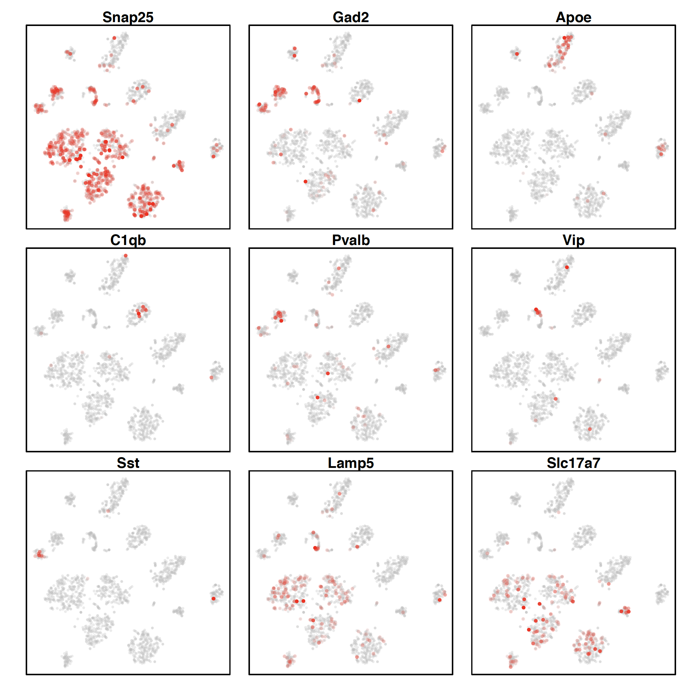

## Mouse Secondary Motor Cortex 2k Cells (Beginner)

**Step 1. MOs 2k dataset**.             
We will be analyzing a subset of Secondary Motor Cortex (MOs) from Fang 2019. These are 2,000 single cells that are randomly sampled from the original >65,000 cells in Fang 2019. We will download the 2,000 cells saved as a `snap` object which has been designed to efficiently work with multiple sparse matrices for single cell ATAC-seq datasets. 

```R
$ R
> system("wget http://renlab.sdsc.edu/r3fang/share/Fang_2019/published_scATAC/MOs_2k/MOs_2k.rda");
> load("MOs_2k.rda");
> x.sp
number of barcodes: 2000
number of bins: 476589
number of peaks: 316257
number of genes: 53278
```

**Step 2. Jaccard Index Matrix (SnapATAC).**.        
Next using the genome-wide cell-by-bin matrix (`bmat`), we calculated the cell-by-cell jaccard similarity matrix by estimating the overlaps between two single cell profiles. 
  
```R
> x.sp = runJaccard(
    obj= x.sp,
    mat="bmat",
    max.var=2000,
    ncell.chunk=2000,
    seed.use=10
    );
``` 

**Step 3. Normalization (SnapATAC).**
Due to the high dropout rate, we find that the jaccard index is highly affected by the differing read depth between cells. To eliminate such confounding factor, we have developed two methods for normalizing jaccard index `normOVE` and `normOVN`. In the below example, we will use `normOVE` to normalize the read depth effect. 

```R
> x.sp = runNormJaccard(
    obj=x.sp,
    ncell.chunk=2000,
    method="normOVE",
    row.center=TRUE,
    row.scale=TRUE,
    low.threshold=-5,
    high.threshold=5,
    num.cores=1,
    seed.use=10
    );
``` 

**Step 4. Linear dimentionality reduction (SnapATAC)**.             
Like other single-cell analysis, scATAC-seq also contains extensive technical noise due to the high drop-out rate and random noise. To overcome this challenge, linear dimentionality reduction method such as PCA or SVD is often applied to combine information across a correlated feature set hereby creating a mega-feature and exclude the variance potential resulting from technical noise. Here, we perform SVD against the normalized matrix. 

```R
> x.sp = runDimReduct(
    obj=x.sp,
    pc.num=50,
    input.mat="jmat",
    method="svd",
    center=TRUE,
    scale=FALSE,
    seed.use=10
    );
```

**Step 5. Determine statistically significant principal components (SnapATAC)**.        
We next use an ad hoc approach for determining significant dimentions by simply looking at a plot of the variance of the principle components and draw the cutoff where there is a clear elbow in the graph (`elbow`). The other ad hoc appraoch is to plot out every two PCs and select number of PCs where there are no obvious seperation of cells. In this example, we choose 20.  

```R
> plotDimReductElbow(
	obj=x.sp, 
	point.size=1.3,
	point.shape=19,
	point.color="red",
	point.alpha=1,
	pdf.file.name=NULL,
	pdf.height=7,
	pdf.width=7,
	labs.title="PCA Elbow plot",
	labs.subtitle=NULL,
	);
> plotDimReductPW(
	obj=x.sp, 
	pca.dims=1:50,
	point.size=0.3,
	point.color="grey",
	point.shape=19,
	point.alpha=0.6,
	down.sample=3000,
	pdf.file.name=NULL, 
	pdf.height=7, 
	pdf.width=7
	);
```

 

**Step 6. KNN Graph Construction (SnapATAC).**          
Using selected significant components, we next construct a K Nearest Neighbor (KNN) Graph. Using euclidean distance, the k-nearest neighbors of each cell are identified accoriding and used to create a KNN graph. KNN graph can be further refined to SNN (Shared Nearest Neighbor) graph by adding edge weight between cells as shared overlap in their local neighborhoods using Jaccard similarity. **This function is inspired and modified from Seurat package.**

```R
> x.sp = runKNN(
    obj=x.sp,
    pca.dims=1:20,
    weight.by.sd=TRUE,
    k=15,
    nn.eps=0.0,
    snn=TRUE,
    snn.prune=1/15,
    save.knn=FALSE,
    filename=NULL
    );
```

**Step 7. Clustering (SnapATAC).**.       
Using KNN graph, we next apply community finding algorithm Louvain to identify the clusters in the resulting graph which represent groups of cells sharing similar ATAC-seq profiles, potentially originating from the same cell type.

```R
> x.sp = runCluster(
	obj=x.sp,
	louvain.lib="R-igraph",
	resolution=1.0,
	path.to.snaptools=NULL,
	seed.use=10
	);
```

**Step 8. Non-linear dimentionality reduction (SnapATAC).**.     
SnapATAC allows using tSNE, UMAP and FIt-sne to visualize and explore these datasets. In the following example, data is visulized by tsne implemented by R package (Rtsne).

```R
> x.sp = runViz(
	obj=x.sp, 
	dims=2,
	pca.dims=1:20, 
	weight.by.sd=TRUE,
	method="Rtsne",
	fast_tsne_path=NULL,
	Y.init=NULL,
	seed.use=10,
	num.cores=5
	);

> x.sp = runViz(
	obj=x.sp, 
	dims=2,
	pca.dims=1:20, 
	weight.by.sd=TRUE,
	method="umap",
	fast_tsne_path=NULL,
	Y.init=NULL,
	seed.use=10,
	num.cores=5
	);
```

**Step 9. Visulization (SnapATAC).**.     
SnapATAC allows using tSNE, UMAP and FIt-sne to visualize and explore these datasets. In the following example, data is visulized by tsne implemented by R package (Rtsne).

```R
> plotViz(
	obj=x.sp, 
	method="tsne", 
	point.size=1, 
	point.shape=19, 
	point.alpha=0.8, 
	point.color="cluster",
	text.add=TRUE,
	text.size=1.4,
	text.color="black",
	text.halo.add=TRUE,
	text.halo.color="white",
	text.halo.width=0.2,
	down.sample=10000,
	pdf.file.name=NULL,
	pdf.width=7, 
	pdf.height=7
	);

> plotViz(
	obj=x.sp, 
	method="umap", 
	point.size=1, 
	point.shape=19, 
	point.alpha=0.8, 
	point.color="cluster",
	text.add=TRUE,
	text.size=1.4,
	text.color="black",
	text.halo.add=TRUE,
	text.halo.color="white",
	text.halo.width=0.2,
	down.sample=10000,
	pdf.file.name=NULL,
	pdf.width=7, 
	pdf.height=7
	);
```

  


**Step 10. Gene-body accessibility based gene annotation (SnapATAC).**.     
We next uses gene-body accessibility level at known marker gene to help annotate identified cell clusters.

```R
> x.sp = scaleCountMatrix(
	obj=x.sp, 
	mat="gmat", 
	cov=SnapATAC::rowSums(x.sp, mat="bmat"), 
	method="RPM"
	);
> marker.genes = c(
	"Snap25", "Gad2", "Apoe", 
	"C1qb", "Pvalb", "Vip", 
	"Sst", "Lamp5", "Slc17a7" 
	);
> plotGene(
	obj=x.sp, 
	gene.names=marker.genes,
	viz.method="tsne",
	point.size=0.5,
	point.color="red",
	point.shape=19,
	background.point=TRUE,
	background.point.color="grey",
	background.point.alpha=0.3,
	background.point.size=0.3,
	background.point.shape=19,
	low.value=0.0,
	high.value=0.95,
	down.sample=5000,
	seed.use=10,
	plot.nrow=3,
	plot.ncol=3,
	pdf.file.name=NULL, 
	pdf.height=7, 
	pdf.width=7
	);
```
 


