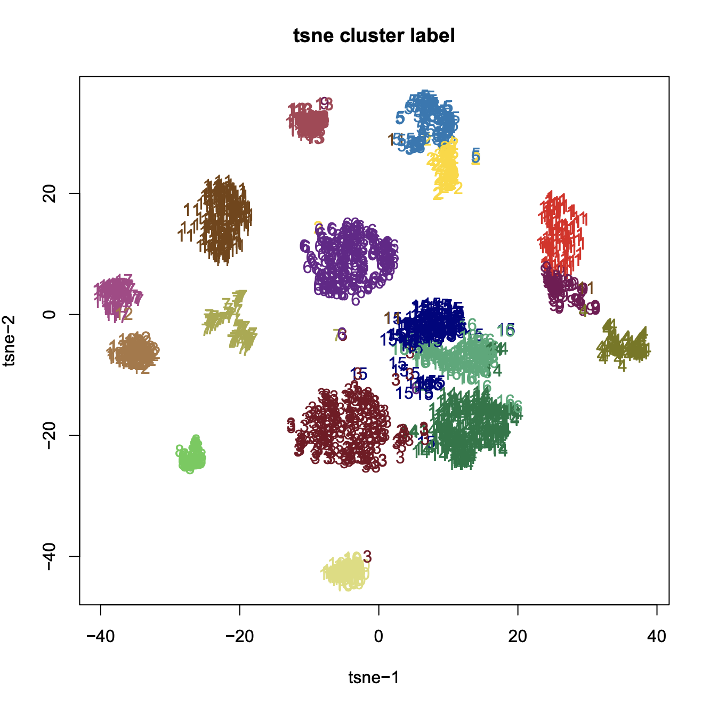
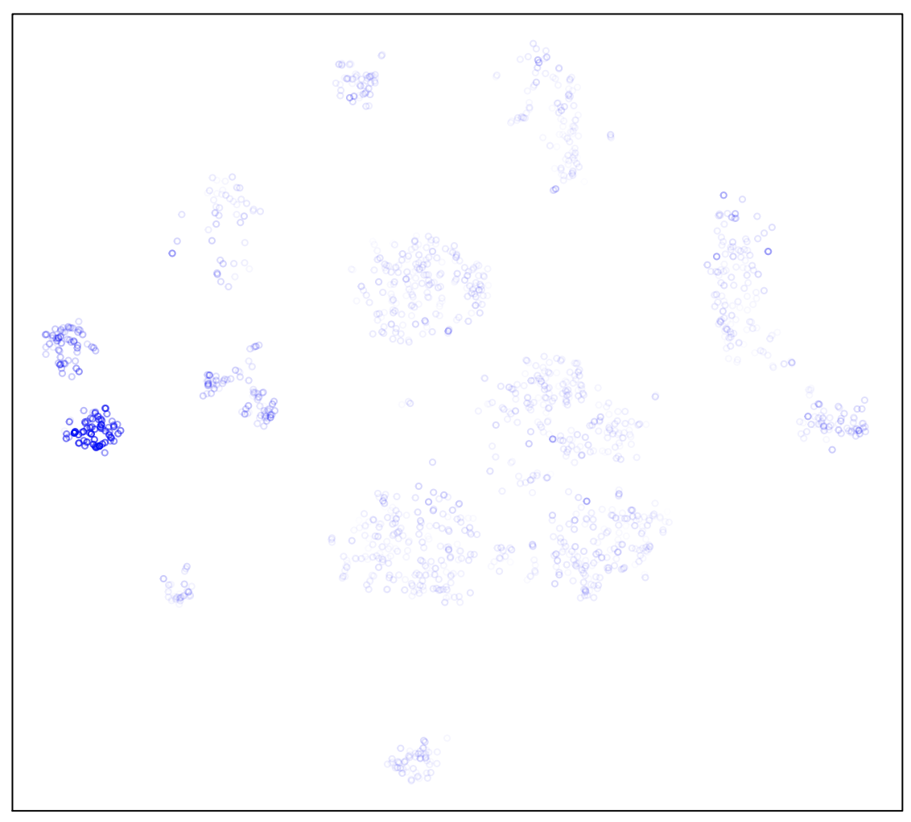
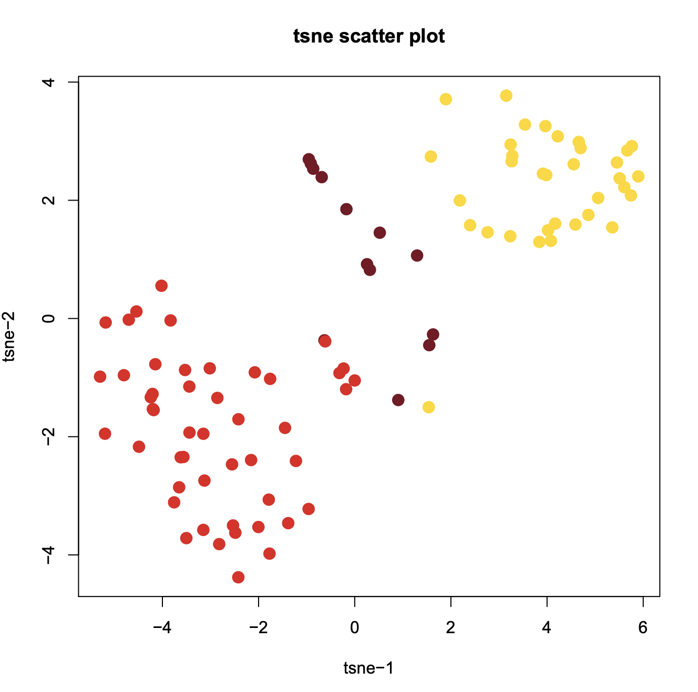
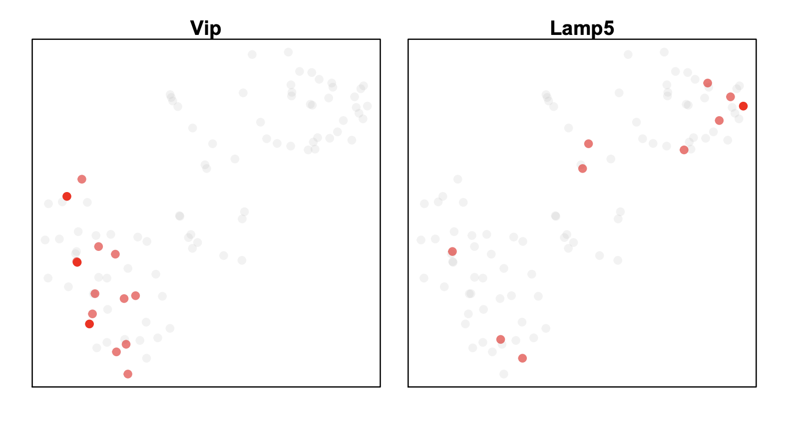

## Analysis of Mouse Secondary Motor Cortex (MOs) 2k Cells

**Step 1. Load MOs demo dataset**.            

```R
$ R
> library(SnapATAC);
> data(mos)
> mos

number of barcodes: 2000
number of bins: 476595
number of peaks: 316257
number of genes: 53278
==========================
meta data            (metData) :  TRUE
cellxbin matrix      (bmat)    :  TRUE
cellxpeak matrix     (pmat)    :  TRUE
cellxgene matrix     (gmat)    :  TRUE
jaccard matrix       (jmat)    :  FALSE
normalization        (nmat)    :  TRUE
PCA:                 (smat)    :  TRUE
cluster:             (cluster) :  TRUE
t-sne:               (tsne)    :  TRUE
umap:                (umap)    :  FALSE

```

**Step 2. Jaccard matrix & normlaization**.            
We next convert the genome-wide cell-by-bin matrix into a cell-by-cell similarity matrix by estimating the jaccard index between two cells in the basis of overlaps. Instead of calculating a full N-by-N jaccard matrix, we calculate a partial jaccard index matrix by randomly choosing K cells (`max.var`). Due to the high dropout rate, the jaccard index is highly biased toward high coverage cells. To remove the read depth effect, we developed a normalization method (`norm.method`).
  
```R
> mos = calJaccard(
	mos,
	mat = "bmat",
	ncell.chunk=2000,
	max.var=5000,
	seed.use=10,
	norm.method="normOVE",
	row.center=TRUE,
	row.scale=TRUE,
	low.threshold=-5,
	high.threshold=5,
	keep.jmat=FALSE,
	do.par=FALSE,
	num.cores=1
	)
``` 

**Step 3. Dimentionality reduction (snapATAC)**.             
Like other single-cell analysis, scATAC-seq contains extensive technical noise due to the high drop-out rate. To overcome this challenge, PCA or SVD is often applied to combine information across a correlated feature set hereby creating a mega-feature and exclude the variance potential resulting from technical noise. Here, we performed PCA against the normalized matrix. We used IRLBA algorithm, a fast and memory-efficient algorithm, to compute a partial PCA. IRLBA is implemented in  `irlba` R package.

```R
> mos = runPCA(
	mos,
	pc.num=50,
	input.mat="nmat",
	method="svd",
	weight.by.sd=FALSE,
	center=TRUE,
	scale=FALSE,
	seed.use=10
	)
```

**Step 4. Determine statistically significant principal components (snapATAC)**.          
We next Determine how many PCs to include for downstream analysis. We use an ad hoc method for determining which PCs to use is to look at a plot of the standard deviations of the principle components and draw your cutoff where there is a clear elbow in the graph. The other ad hoc way to determine PCs is to plot out every two PCs and select until PCs that have no obvious structure. 

```R
> plotPCA(mos, method="elbow");
> plotPCA(mos, method="pairwise");
```
 

**Step 5. Clustering (snapATAC)**.       
 Using the selected significant PCs, we next calculated pairwise Euclidean distance between every two cells, using this distance, we created a k-nearest neighbor graph in which every cell is represented as a node and edges are drawn between cells within `k` nearest neighbors. Edge weight between any two cells are refined by shared overlap in their local neighborhoods using Jaccard similarity. Finally, we applied community finding algorithm Louvain to identify the ‘communities’ in the resulting graph with different `resolution` which represents groups of cells sharing similar ATAC-seq profiles, potentially originating from the same cell type. This step requires `snaptools` to be installed frist and `path_to_snaptools` indicates the folder that contains the `snaptools` excutable file.

```R
> mos = runCluster(
	mos,
	pca_dims=1:20,
	k=15,
	resolution=0.5,
	method="louvain",
	path_to_snaptools="/home/r3fang/anaconda2/bin/snaptools"
	)
```

**Step 6. Visulization (snapATAC)**.          
snapATAC allows using tSNE, UMAP and FIt-sne to visualize and explore these datasets. In the following example, data is visulized by tsne implemented by R package (`Rtsne`).

```R
# tsne
> mos = runViz(
	mos, 
	pca_dims=1:20, 
	dims=2, 
	method="Rtsne"
	)

> plotViz(mos, method="tsne", pch=19, cex=1);
```

 

**Step 7. Gene-body based annotation for expected cell types (snapATAC)**.        
To help annotate identified cell clusters, snapATAC next loads the cell-by-gene matrix which estimates the gene body accessibility level.

```R
> mos = scaleCountMatrix(
	mos, 
	cov=rowSums(mos, mat="bmat"),
	mat="gmat"
	);
> marker.genes = c(
	"Snap25", "Gad2", "Apoe", "C1qb", "Pvalb", 
	"Vip", "Sst", "Lamp5", "Slc17a7", "Mog", 
	"Pdgfra", "Cspg4","Cx3cr1","F3","Aqp4", "Rorb"
	);
> plotGene(
	mos, 
	gene.sel=marker.genes, 
	method="tsne",
	binary=FALSE,
	cex=1,
	pch=19,
	background=TRUE
	);
```


**Step 8. Identify differential accessible regions (DARs)**.    
Now we go back to the R session and continue the SnapATAC. We identify cis-elements that are enriched in Sst subtype.

```R
> barcodes = mos@barcode[which(mos@cluster == 12)];
> idy = findDAR(
	object=mos,
	mat="pmat",
	barcodes.sel=barcodes,
	bcv=0.4,
	pca_dims=1:20,
	fdr=1e-1,
	background_method="knn",
	test_method="exactTest",
	rand.seed=10	
	)
> y = rowSums(mos@pmat[,idy]) / rowSums(mos@pmat);
> y = y/max(y);
> plot(mos@tsne, 
	col=alpha("blue", y), 
	yaxt='n', 
	xaxt="n",
	xlab="", 
	ylab="",
	cex=0.5
	);
```




**Step 9. Infer master regulators**.           
Motif analysis using homer (see how to install [homer](http://homer.ucsd.edu/homer/introduction/install.html)). After installing homer, you can run the below step.

```R
> motifs = runHomer(
	mos[,idy,"pmat"], 
	mat = "pmat",
	path_to_homer = "/projects/ps-renlab/r3fang/public_html/softwares/homer/bin/findMotifsGenome.pl",
	result_dir = "homer/Pvalb",
	genome = 'mm10',
	motif_length = 10,
	scan_size = 300,
	optimize_count = 2,
	background = 'automatic',
	local_background = FALSE,
	only_known = FALSE,
	only_denovo = FALSE,
	fdr_num = 5,
	cores = 10,
	cache = 100,
	overwrite = TRUE,
	keep_minimal = FALSE
	)
> motifs[1:20,1];

 [1] Tcf21(bHLH)/ArterySmoothMuscle-Tcf21-ChIP-Seq(GSE61369)/Homer
 [2] Ap4(bHLH)/AML-Tfap4-ChIP-Seq(GSE45738)/Homer
 [3] Ascl1(bHLH)/NeuralTubes-Ascl1-ChIP-Seq(GSE55840)/Homer
 [4] MyoD(bHLH)/Myotube-MyoD-ChIP-Seq(GSE21614)/Homer
 [5] Tcf12(bHLH)/GM12878-Tcf12-ChIP-Seq(GSE32465)/Homer
 [6] MyoG(bHLH)/C2C12-MyoG-ChIP-Seq(GSE36024)/Homer
 [7] Mef2b(MADS)/HEK293-Mef2b.V5-ChIP-Seq(GSE67450)/Homer
 [8] Myf5(bHLH)/GM-Myf5-ChIP-Seq(GSE24852)/Homer
 [9] E2A(bHLH)/proBcell-E2A-ChIP-Seq(GSE21978)/Homer
[10] Atoh1(bHLH)/Cerebellum-Atoh1-ChIP-Seq(GSE22111)/Homer
[11] Ptf1a(bHLH)/Panc1-Ptf1a-ChIP-Seq(GSE47459)/Homer
[12] TCF4(bHLH)/SHSY5Y-TCF4-ChIP-Seq(GSE96915)/Homer
[13] NeuroG2(bHLH)/Fibroblast-NeuroG2-ChIP-Seq(GSE75910)/Homer
[14] Mef2a(MADS)/HL1-Mef2a.biotin-ChIP-Seq(GSE21529)/Homer
[15] CEBP:AP1(bZIP)/ThioMac-CEBPb-ChIP-Seq(GSE21512)/Homer
[16] MafA(bZIP)/Islet-MafA-ChIP-Seq(GSE30298)/Homer
[17] HEB(bHLH)/mES-Heb-ChIP-Seq(GSE53233)/Homer
[18] Mef2c(MADS)/GM12878-Mef2c-ChIP-Seq(GSE32465)/Homer
[19] Atf3(bZIP)/GBM-ATF3-ChIP-Seq(GSE33912)/Homer
[20] AP-1(bZIP)/ThioMac-PU.1-ChIP-Seq(GSE21512)/Homer

```

**Step 10. Sub-clustering of Vip/Lamp5 subtype**.              
GABAergic neurons are composed of highly diverse neurons. Previous single cell RNA-seq analysis has revealed extensive amount of GABAergic subtypes. Here we perform sub-cluster of Sst to further identify its subtype. This can be applied to other cell types, here we only demonstrate for Sst.

```R
> mos.sst = mos[which(mos@cluster == 7),];
> mos.sst

number of barcodes: 95
number of bins: 476595
number of peaks: 316257
number of genes: 53278
==========================
meta data            (metData) :  TRUE
cellxbin matrix      (bmat)    :  TRUE
cellxpeak matrix     (pmat)    :  TRUE
cellxgene matrix     (gmat)    :  TRUE
jaccard matrix       (jmat)    :  FALSE
normalization        (nmat)    :  TRUE
PCA:                 (smat)    :  TRUE
cluster:             (cluster) :  TRUE
t-sne:               (tsne)    :  TRUE
umap:                (umap)    :  TRUE

> mos.sst = calJaccard(
	mos.sst,
	mat = "bmat",
	ncell.chunk=1000,
	max.var=5000,
	seed.use=10,
	norm.method="normOVE",
	row.center=TRUE,
	row.scale=TRUE,
	low.threshold=-5,
	high.threshold=5,
	keep.jmat=FALSE,
	do.par=TRUE,
	num.cores=5
	)

> mos.sst = runPCA(
	mos.sst,
	pc.num=10,
	input.mat="nmat",
	method="svd",
	weight.by.sd=TRUE,
	center=TRUE,
	scale=FALSE,
	seed.use=10
	)

> plotPCA(mos.sst, method="elbow") 

> mos.sst = runCluster(
	mos.sst,
	pca_dims=1:4,
	k=30,
	resolution=1,
	method="jaccard_louvain",
	path_to_snaptools="/home/r3fang/anaconda2/bin/snaptools"
	)
	
> mos.sst = runViz(
	mos.sst, 
	pca_dims=1:4, 
	dims=2, 
	method="Rtsne"
	)

> plotViz(mos.sst, method="tsne", pch=19, cex=11.5);

> plotGene(
	mos.sst, 
	gene.sel=c("Vip", "Sncg", "Lamp5"), 
	method="tsne",
	binary=FALSE,
	p = 0.1,
	cex=1,
	plot.row=2,
	plot.col=2,
	background=TRUE,
	pch=19
	);
```

  

