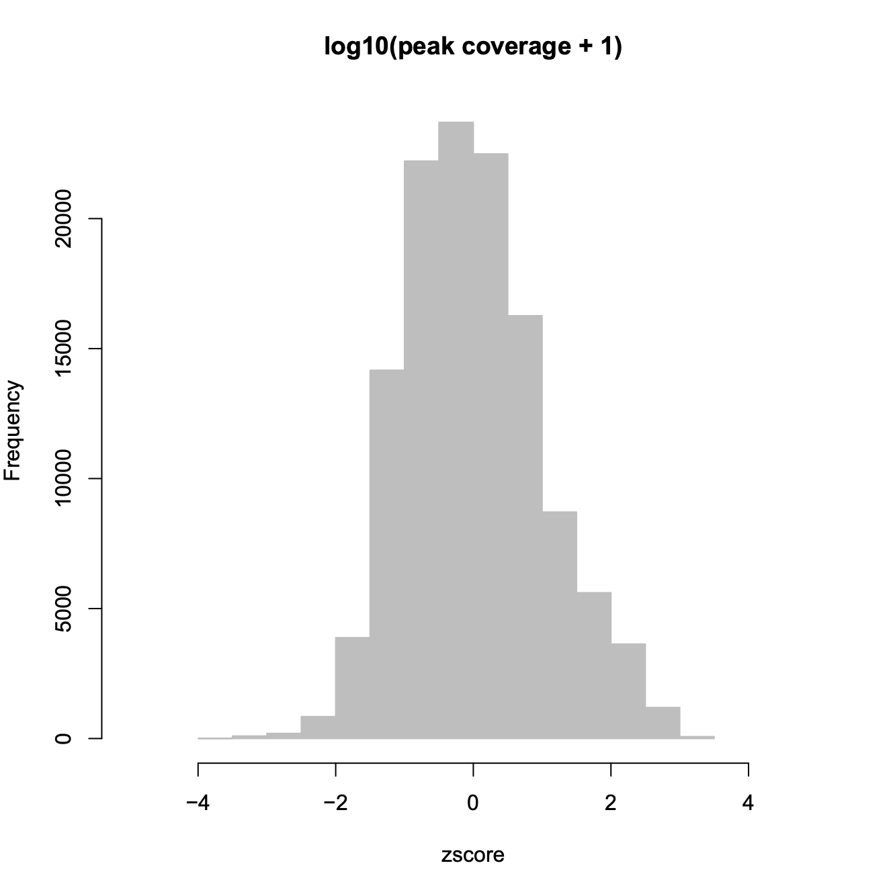
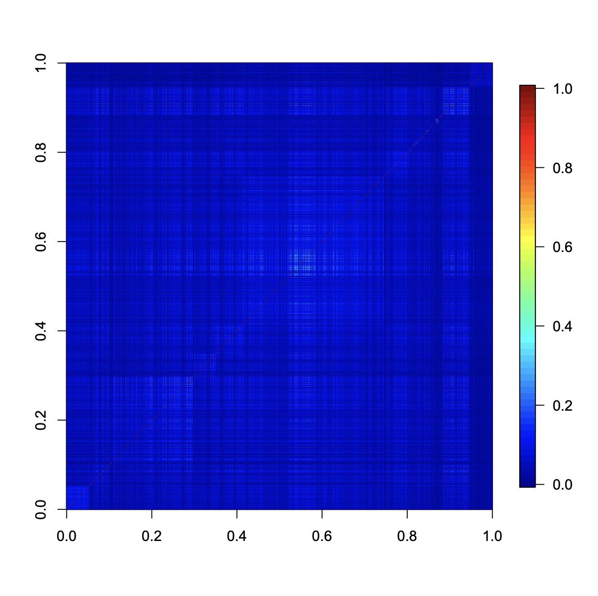
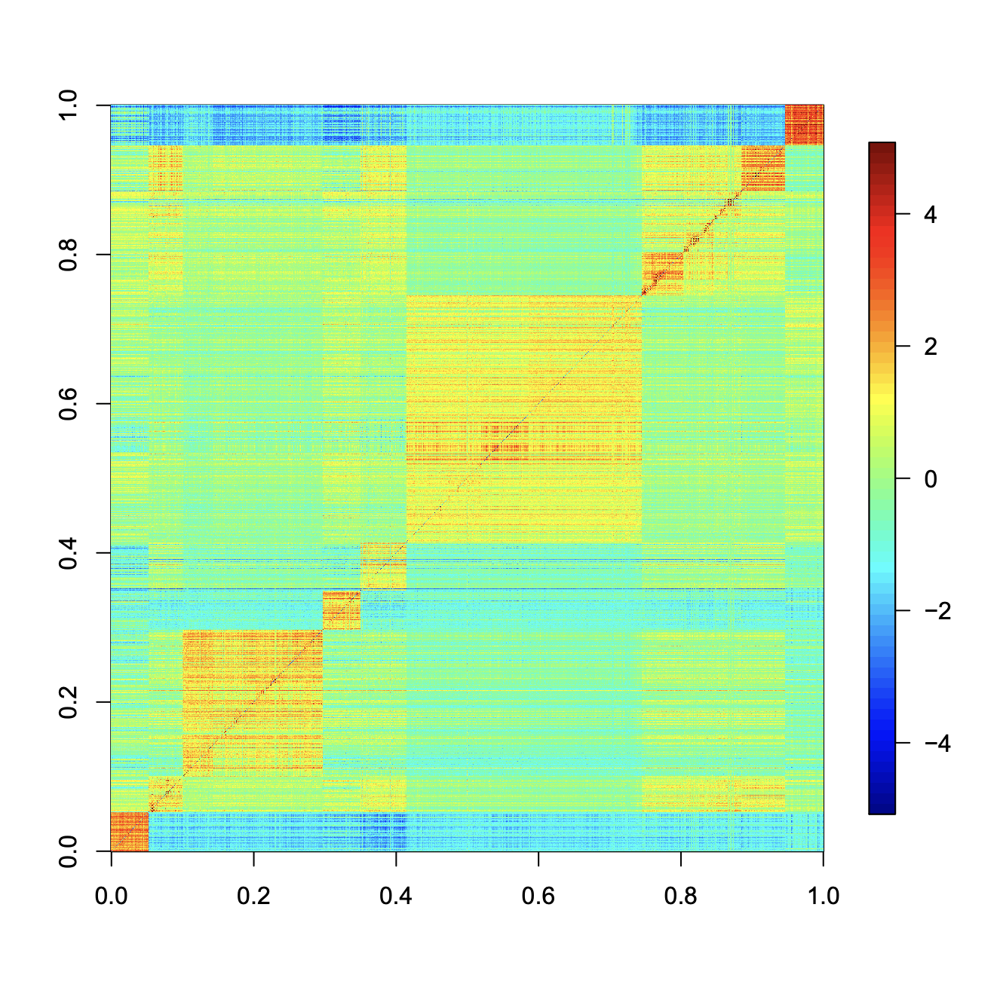
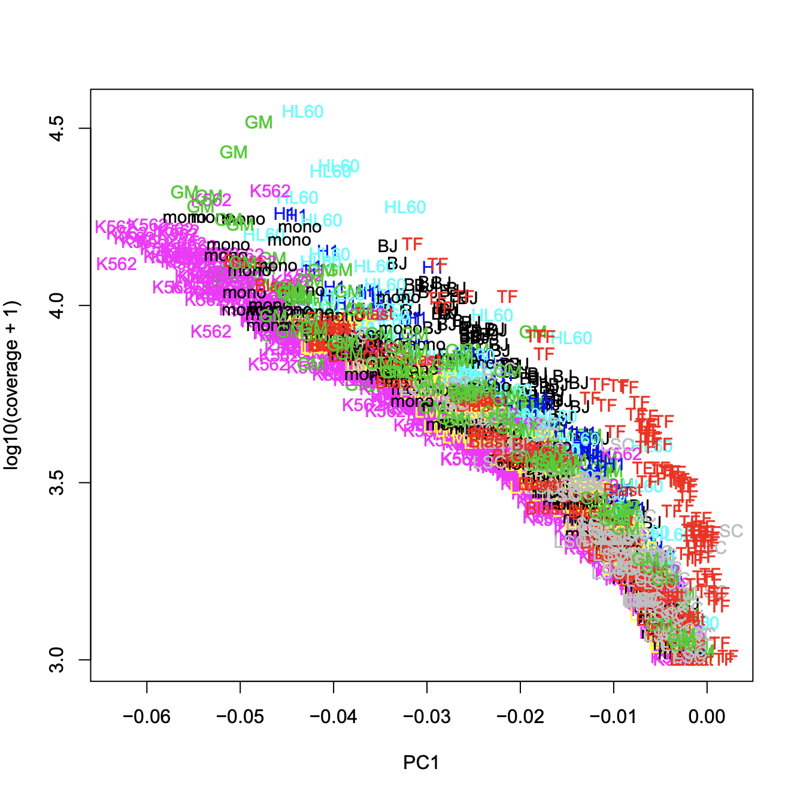
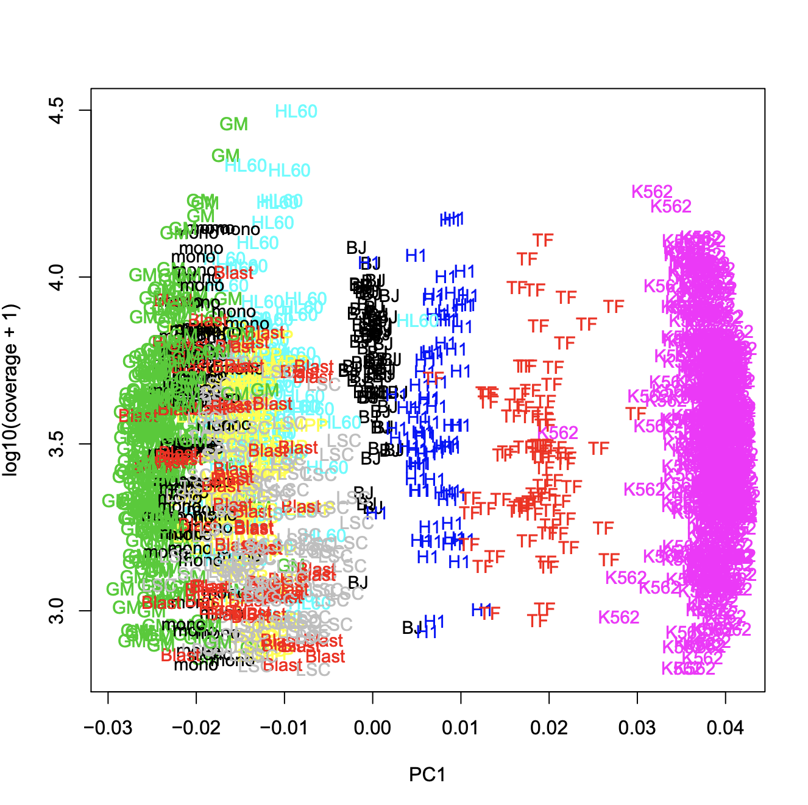
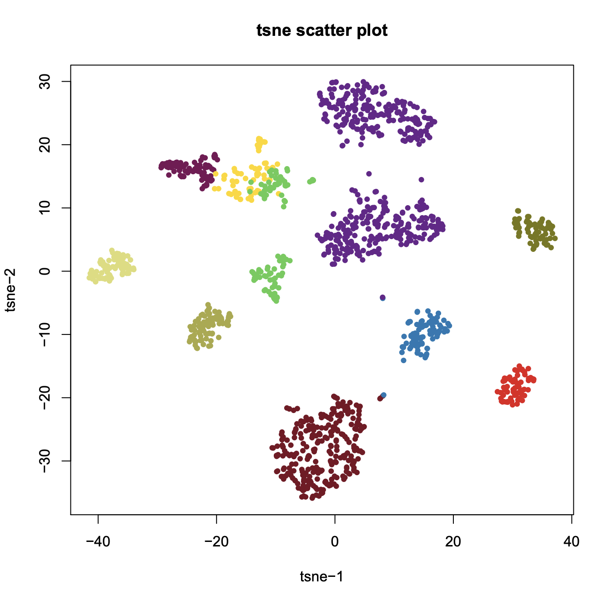
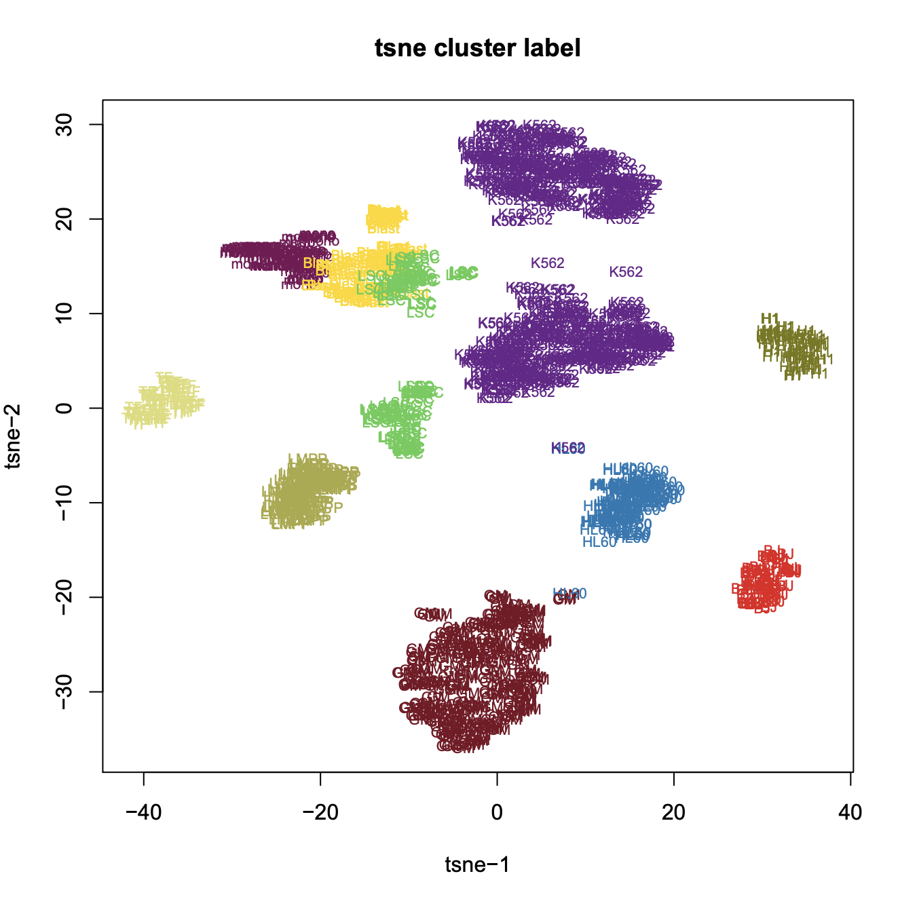

## Re-analysis of human scATAC-seq (Schep 2017)

**Step 1. Download scATAC-seq from human cell lines**. 

```
> wget ftp://ftp.ncbi.nlm.nih.gov/geo/series/GSE99nnn/GSE99172/suppl/GSE99172_scatac_counts.csv.gz
```

**Step 2. Create a snap object**

```R
$ R
> library(SnapATAC)

# create a snap object with 500 bin size
> dat = read.csv(
                 "GSE99172_scatac_counts.csv.gz", 
                 sep=",", 
                 head=TRUE, 
                 skip=1, 
                 stringsAsFactors=FALSE
                 );
> cellPeakMatrix = t(Matrix(as.matrix(dat[,4:ncol(dat)]), "sparseMatrix"));
> barcode = colnames(dat)[4:ncol(dat)];
> peaks.gr = GRanges(
                     dat[,1], 
                     IRanges(dat[,2], dat[,3])
                    );
> x.sp = createSnapFromPmat(
                      mat=cellPeakMatrix, 
                      barcode=barcode, 
                      peaks=peaks.gr
                      );
```

**Step 3. Remove low-coverage cells**

```R
# convert cell-by-peak count matrix to binary matrix
> x.sp = makeBinary(x.sp, mat="pmat");

# filter cells of coverage less than 1,000
> idx = which(rowSums(x.sp, mat="pmat") > 1000);
> x.sp = x.sp[idx,];
> 
# extract cells belonging to 10 cell lines as shown in Schep paper
> cell_types = c("BJ", "Blast", "GM", "H1", "HL60", "K562", "LMPP", "LSC", "mono", "TF");
> clusters = rep(NA, nrow(x.sp));
> for(name_i in cell_types){
        idx = grep(name_i, getBarcode(x.sp))
        clusters[idx] = name_i
     }
> x.sp@cluster = factor(clusters);
> x.sp = x.sp[which(!is.na(x.sp@cluster)),];
> x.sp 

number of barcodes: 1423
number of bins: 0
number of peaks: 123089
number of genes: 0
==========================
meta data            (metData) :  FALSE
cellxbin matrix      (bmat)    :  FALSE
cellxpeak matrix     (pmat)    :  TRUE
cellxgene matrix     (gmat)    :  FALSE
jaccard matrix       (jmat)    :  FALSE
normalization        (nmat)    :  FALSE
PCA:                 (smat)    :  FALSE
cluster:             (cluster) :  TRUE
t-sne:               (tsne)    :  FALSE
umap:                (umap)    :  FALSE
```

**Step 4. Feature selection**

```
> x.sp = filterBins(
    x.sp,
    low.threshold=-2,
    high.threshold=2,
    mat="pmat"
    );
> x.sp

number of barcodes: 1423
number of bins: 0
number of peaks: 117044
number of genes: 0
==========================
meta data            (metData) :  FALSE
cellxbin matrix      (bmat)    :  FALSE
cellxpeak matrix     (pmat)    :  TRUE
cellxgene matrix     (gmat)    :  FALSE
jaccard matrix       (jmat)    :  FALSE
normalization        (nmat)    :  FALSE
PCA:                 (smat)    :  FALSE
cluster:             (cluster) :  TRUE
t-sne:               (tsne)    :  FALSE
umap:                (umap)    :  FALSE
```



**Step 5. Calculate jaccard index matrix and normalize**

```R
> x.sp = calJaccard(
	x.sp,
	mat = "pmat",
	ncell.chunk=5000,
	max.var=5000,
	seed.use=10,
	norm.method="normOVN",
	k=15,
	row.center=TRUE,
	row.scale=TRUE,
	low.threshold=-5,
	high.threshold=5,
	keep.jmat=TRUE,
	do.par=FALSE,
	num.cores=1
	)
```

**Step 6. Perform PCA analysis**

```R
# Calculate Jaccard Index Matrix
> x.sp = runPCA(
	x.sp,
	pc.num=30,
	input.mat="jmat",
	center=TRUE,
	scale=FALSE,
	method="svd",
	weight.by.sd=FALSE,
	seed.use=10
	);
> plot(x.sp@smat[,1], log(rowSums(x.sp, "pmat")+1, 10), col=x.sp@cluster, pch=19, type="n", xlab="PC1", ylab="log10(coverage + 1)");
> text(x.sp@smat[,1], log(rowSums(x.sp, "pmat")+1, 10), col=c(1:20)[x.sp@cluster], label=x.sp@cluster, cex=0.9);

> x.sp = runPCA(
	x.sp,
	pc.num=30,
	input.mat="nmat",
	center=TRUE,
	scale=FALSE,
	method="svd",
	weight.by.sd=FALSE,
	seed.use=10
	);
> library(fields);
> image.plot(x.sp@nmat[order(x.sp@cluster), order(x.sp@cluster)]);
> image.plot(x.sp@jmat[order(x.sp@cluster), order(x.sp@cluster)]);
> plot(x.sp@smat[,1], log(rowSums(x.sp, "pmat")+1, 10), col=x.sp@cluster, pch=19, type="n", xlab="PC1", ylab="log10(coverage + 1)");
> text(x.sp@smat[,1], log(rowSums(x.sp, "pmat")+1, 10), col=c(1:20)[x.sp@cluster], label=x.sp@cluster, cex=0.9);
```
NOTE: coverage vs. PC1 plot is slightly different from Supplementary Fig. S2 which does not perform feature selection using `filterBins `


 
 


**Step 7. Visulization**

```	
> x.sp = runViz(
	x.sp, 
	pca_dims=1:20, 
	dims=2, 
	method="Rtsne",
	init_dims=x.sp@tsne
	);

> plotViz(x.sp, method="tsne", pch=19, cex=0.7);
```
 


