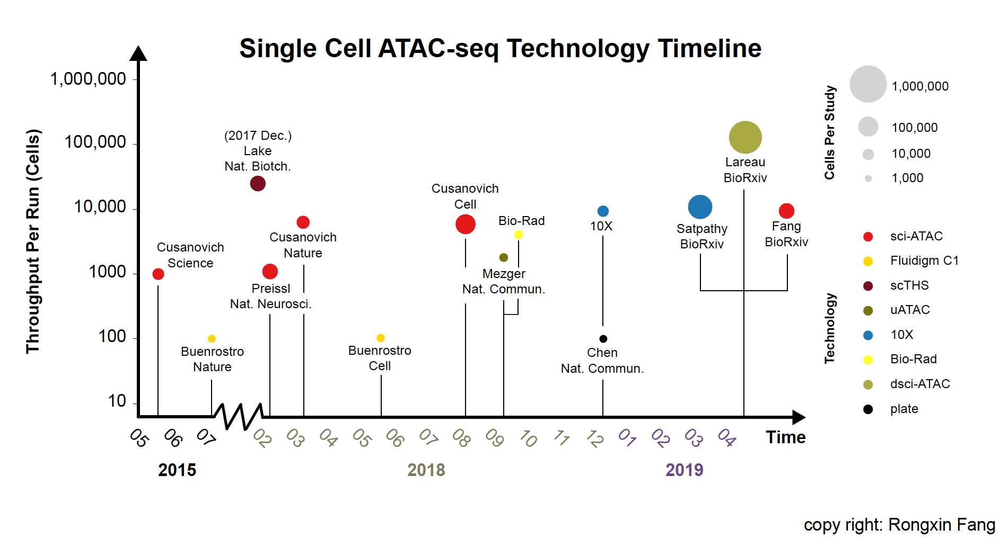

##Single Cell ATAC-seq Technology Timeline

Note: timeline only includes technology development or data production, pure computational methods are not included          

##References (\*contributed equally)
Cusanovich DA, Daza R, Adey A, Pliner HA, Christiansen L, Gunderson KL, Steemers FJ, Trapnell C, Shendure J. **Multiplex single cell profiling of chromatin accessibility by combinatorial cellular indexing**. *Science*. 2015 May 22. [link](https://science.sciencemag.org/content/348/6237/910.long)

Buenrostro JD, Wu B\*, Litzenburger UM\*, Ruff D, Gonzales ML, Snyder MP, Chang HY, Greenleaf WJ. **Single-cell chromatin accessibility reveals principles of regulatory variation**. *Nature*. 2015 Jul 23. [link](https://www.nature.com/articles/nature14590)

Lake BB\*, Chen S\*, Sos BC\*, Fan J\*, Kaeser GE, Yung YC, Duong TE, Gao D, Chun J, Kharchenko PV, Zhang K. **Integrative single-cell analysis of transcriptional and epigenetic states in the human adult brain.** *Nat Biotechnol.* 2018 Jan. [link](https://dx.doi.org/10.1038/nbt.4038)

Preissl S\*, Fang R\*, Huang H, Zhao Y, Raviram R, Gorkin DU, Zhang Y, Sos BC, Afzal V, Dickel DE, Kuan S, Visel A, Pennacchio LA, Zhang K, Ren B. **Single-nucleus analysis of accessible chromatin in developing mouse forebrain reveals cell-type-specific transcriptional regulation**. *Nat Neurosci.* 2018 Mar. [link](http://dx.doi.org/10.1038/s41593-018-0079-3)

Cusanovich DA\*, Reddington JP\*, Garfield DA\*, Daza RM, Aghamirzaie D, Marco-Ferreres R, Pliner HA, Christiansen L, Qiu X, Steemers FJ, Trapnell C, Shendure J, Furlong EEM. **The cis-regulatory dynamics of embryonic development at single-cell resolution**. Nature. 2018 Mar 22. [link](https://www.nature.com/articles/nature25981)

Buenrostro JD, Corces MR, Lareau CA, Wu B, Schep AN, Aryee MJ, Majeti R, Chang HY, Greenleaf WJ. **Integrated Single-Cell Analysis Maps the Continuous Regulatory Landscape of Human Hematopoietic Differentiation**. *Cell*. 2018 May 31. [link](https://www.cell.com/cell/fulltext/S0092-8674(18)30446-X?_returnURL=https%3A%2F%2Flinkinghub.elsevier.com%2Fretrieve%2Fpii%2FS009286741830446X%3Fshowall%3Dtrue#%20)

Cusanovich DA\*, Hill AJ\*, Aghamirzaie D, Daza RM, Pliner HA, Berletch JB, Filippova GN, Huang X, Christiansen L, DeWitt WS, Lee C, Regalado SG, Read DF, Steemers FJ, Disteche CM, Trapnell C, Shendure J. **A Single-Cell Atlas of In Vivo Mammalian Chromatin Accessibility**. *Cell*. 2018 Aug 23.

Mezger A\*, Klemm S\*, Mann I\*, Brower K, Mir A, Bostick M, Farmer A, Fordyce P, Linnarsson S, Greenleaf W. **High-throughput chromatin accessibility profiling at single-cell resolution**. *Nat Commun*. 2018 Sep 7.

Chen X, Miragaia RJ, Natarajan KN, Teichmann SA. **A rapid and robust method for single cell chromatin accessibility profiling**. *Nat Commun*. 2018 Dec 17. [link](https://www.nature.com/articles/s41467-018-07771-0)

Satpathy A\*, Granja JM\*, Yost KE, Qi Y,
Meschi F, McDermott GP, Olsen BN, Mumbach MR,
Pierce SE, Corces MR, Shah P, Bell JC, Jhutty D,
Nemec CM, Wang J, Wang L, Yin Y, Giresi PG, 
Chang AL, Zheng G, Greenleaf WJ, Chang HY. **Massively parallel single-cell chromatin landscapes of human immune cell development and intratumoral T cell exhaustion**. *BioRxiv*. 2019 Apr. 18. [link](https://www.biorxiv.org/content/biorxiv/early/2019/04/18/610550.full.pdf)

Lareau CA\*, Duarte FM\*, Chew JG\*, Kartha VK, Burkett ZD, Kohlway AS, Pokholok D, Aryee MJ, Steemers FJ, Lebofsky R, Buenrostro JD. **Droplet-based combinatorial indexing for massive scale single-cell epigenomics**. *BioRxiv*. 2019 Apr. 18. [link](https://www.biorxiv.org/content/biorxiv/early/2019/04/18/612713.full.pdf)

Fang R, Preissl S, Hou X, Lucero J, Wang X, Motamedi A, Shiau AK, Mukamel EA, Zhang Y, Behrens MM, Ecker J, Ren B. **A Fast and Accurate Clustering of Single Cell Epigenomes Reveals Cis-Regulatory Elements in Rare Cell Types**. *BioRxiv*. 2019 Apr. 22. [link](https://www.biorxiv.org/content/biorxiv/early/2019/04/22/615179.full.pdf)

